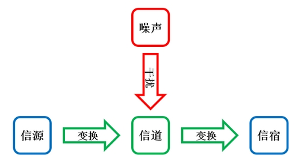
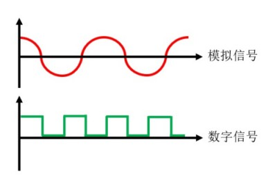

# 通信系统模型
一个通信系统通常包括以下元素：

🔷 信息

信息，也可称为消息，是对客观事物属性和特征的描述。人们在日常生活中获得的知识、新闻等都是信息。

🔷 数据

数据是指数字化的信息，是信息的载体。数据分为模拟数据与数字数据。

🔷 信号

信号是传输数据的工具，可以使用多种媒介，例如电信号、光信号、声信号等。

🔷 信源

信源是指产生并发送信息的一端。

🔷 信道

信道就是信息传播的物理路径，例如电缆、光纤和无线电。

🔷 信宿

信宿是指接收信息的一端。

🔷 噪声

噪声是指信息在传输过程中受到的外界干扰，并不一定是人耳可听的声音。

# 模拟信号与数字信号
信源产生的信号可能是模拟信号，也可能是数字信号，如果信源发出的是模拟数据，而传输方式为模拟信号，即称为模拟通信；如果传输方式为数字信号，则称为数字通信。在数据进入信道传输之前，要先变换成符合该信道特性的信号，以实现高效率的传输。

模拟信号是随时间连续变化的信号，这类信号的某些参数（幅度、相位、频率等）可以表示需要传送的信息，例如音频信号、图像信号等。数字信号只取有限数量的离散值，而且不同状态之间的变换几乎是瞬时的，以某一瞬间的状态表示数据，例如台灯的开启与关闭。

模拟信号的频谱较窄，因此信道利用率较高，但传输过程中衰减较大，并且易受到噪音的干扰，从而变得无法分辨。数字信号由于采用有限个的离散值，抗干扰能力较强，只要信号没有畸变到不可分辨的程度，就可以用一些手段消除噪音的影响。数字信号的缺点是要求的频带更宽，信道利用率较低。

若信源产生的是离散数据，无论使用何种方式传输信号，都统称为“数据通信”。由于集成电路的发展，数字芯片易于大规模集成，降低生产成本，现今被广泛应用。

# 信号特性
信号具有以下特性：

🔶 周期

事物在运动或变化的过程中，某些特征将会重复出现，我们把特征连续两次出现所经过的时间叫作一个周期(Term)，通常用符号"T"表示。

🔶 频率

频率(Frequency)是指事物在单位时间内完成周期性变化的次数，常用符号 $f$ 表示，单位为秒分之一。频率与周期可以相互转化，以1秒周期为例：

$$
f=\frac{1}{T}
$$

人们为了纪念德国物理学家赫兹的贡献，把频率的单位命名为赫兹，简称“赫”，符号为"Hz"。

🔶 波长

波长(Wave Length)，是指波在一个周期内传播的距离。波长 $λ$ 等于波速 $v$ 和周期 $T$ 的乘积，即：

$$
\lambda=v*T
$$

由于周期与频率互为倒数，所以以上公式也可变为：

$$
\lambda=\frac{v}{f}
$$

波在真空中以光速传播，但同一频率的波在不同的介质中将会以不同速度传播，因此波长会根据实际传播介质改变。

# 比特率与波特率
数字信号具有以下特性：

🔷 比特率

比特率(Bit Rate)又称为数据（信息）传输速率。其定义是：通信线路单位时间（每秒）传输的比特数量，即每秒能传输的二进制位数，单位是“比特每秒”（记作"bit/s"或"b/s"，英文缩略语为"bps"。）。

🔷 码元

码元(Code Cell)是携带信息的数字单位，是指在数字信道中传送信号的一个波形符号，也即“时间轴上的一个信号编码单元”。

码元可能是二进制的，也可能是多进制的。

🔷 波特率

波特率(Baud Rate)又称为码元传输速率、信号传输速率或调制速率。其定义是：通信线路单位时间内传输的码元（脉冲）个数；或者表示信号调制过程中，单位时间内调制信号波形的变换次数，通常用"RB"表示，单位是波特（符号为"Bd"或"Baud"，前者为规范。）。通信系统的发送设备和接收设备必须在相同的波特率下工作，否则会出现帧同步错误。

在无调制的情况下，比特率等于波特率。采用调制技术时，比特率不等于波特率。波特率与比特率的关系为：

$$
I=S*\log_2 N
$$

其中 $I$ 为比特率， $S$ 为波特率， $N$ 为每个符号负载的信息量。若波特率为2 Bd，则在二进制时，比特率也为2 bit/s；在四进制时，比特率为4 bit/s。由此可见，一个码元可以由多个比特组成。码元携带的信息量越多，需要表示的状态也越多，工程上的实现就会更加困难，所以单个码元携带的信息量不宜超过8个。

# DTE与DCE
数据终端设备(Data Terminal Equipment, DTE)指终端设备，一般是具有数据处理能力的设备，可以是计算机、服务器、路由器，也可以是只接收数据的打印机。

数据通信设备(Data Circuit-Terminating Equipment, DCE)指通信设备，一般是进行数据传输的设备，可以是调制解调器、多路复用器或交换机等。

通常情况下，当计算机连接至交换机时，计算机是DTE端，交换机是DCE端。

在同步通信系统中，DCE端提供时钟信号，DTE端依赖DCE端所提供的时钟信号工作。
