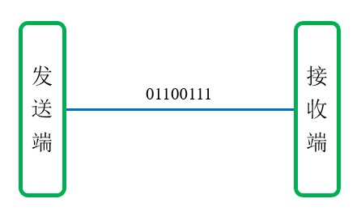

# 单工、半双工与全双工
## 单工
单工(Simplex)通信是指传送的信息始终是一个方向的通信方式，发送端单向发送信息到接收端，例如收音机和电视机。

## 半双工
半双工(Half Duplex)通信中双方既可以发送数据又可以接收数据，但不能同时进行发送和接收，例如对讲机。

## 全双工
全双工(Full Duplex)通信中双方在发送数据的同时也能够接收数据，两者可以同步进行。目前的网卡一般都使用全双工方式工作。

# 串行与并行
## 串行传输
串行传输方式中，控制器将数据拆分成数据流，在串行信道上传输，一次只传输一个二进制位。串行方式实现简单，成本较低，信号串扰较小，可以进行长距离传输；但是速率较低。

## 并行传输
并行传输方式中，控制器将数据按总线宽度分组，一次发送一组数据。并行方式速率较高，但实现更加复杂，并且由于信号线之间的串扰，需要增加校验功能，不适合远距离传输。

虽然同等条件下并行传输速率更高，但由于串扰等问题，收益反而不如串行传输，因此并行传输一般用于主板总线等近距离通信场合，远距离通信仍然以串行方式为主。

# 同步与异步
## 同步通信
为了正确地识别信号，通信双方需要高度协同工作。接收方需要确切地知道信号的含义，所以双方保持时序一致是十分重要的，这个过程称为位同步。

同步通信中二进制位之间的间隔是固定的，接收方必须严格按照协议约定的时序解析信号。同步信号可以插入到数据流中，也可以通过专用的时序信道进行传输。

## 异步通信
异步通信中，双方不需要保持严格一致。发送方一般会在数据流的前后插入控制信息，用来标记这段数据流的开始和结束；接收方只需要解析控制信息就能理解数据流。

并行传输中一般采用同步通信，而串行传输中两种方式都有应用。
