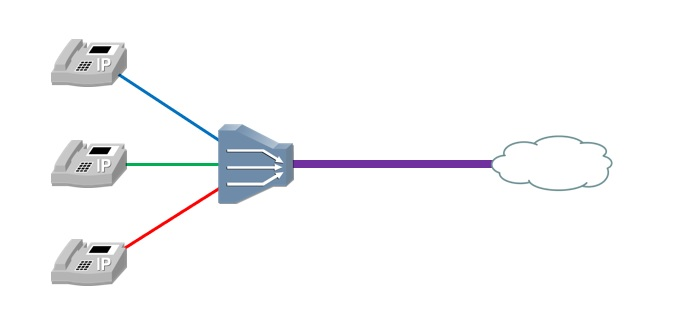

# 简介
信道复用是指在一条物理链路上同时传输多路信号的技术，用来提高信道利用率，降低成本，达到节约资源的目的。

# 频分复用
频分多路复用(Frequency Division Multiplex, FDM)是一种将多路信号调制到不同频率载波上再进行叠加，形成一个复合信号的技术。

有时单路信号所需的带宽低于物理信道的最大带宽，这时就可以使用FDM技术，将物理信道划分为若干个子信道，提高物理信道的利用率。为了保证各子信道中所传输的信号互不干扰，一般还应在子信道之间设立隔离带。

# 波分复用
波分多路复用(Wavelength Division Multiplexing, WDM)本质上也是一种频分复用技术，但在光通信领域，人们习惯按波长而不是按频率来命名。WDM技术是在一根光纤上承载多个波长的系统，将一根光纤转换为多条“虚拟”光纤，每条虚拟光纤独立工作在不同波长上，极大地提高了光纤的传输容量。

# 时分复用
时分复用(Time Division Multiplexing, TDM)就是将提供给整个信道传输信息的时间划分成若干时间片（简称“时隙”），并将这些时隙分配给每一个信号源使用。

采用同步时分复用时，每路信号在自己的时隙内独占信道进行数据传输。其优点是时隙分配固定，便于调节控制，适于数字信息的传输；缺点是当某信号源没有数据传输时，它所对应的信道会出现空闲，而其他繁忙的信道无法占用这个空闲的信道，因此会降低线路的利用率。

采用异步时分复用时，系统能够动态地按需分配时隙，用户不发送数据时则不给其分配时序，以此避免了浪费时序，这种方式也称为统计时分复用。

# 码分复用
码分多路复用(Code Division Multiplexing, CDM)是靠不同的编码来区分各路原始信号的一种复用方式，主要和各种多址技术结合产生了各种接入技术，包括无线和有线接入。

移动通信系统是一个多信道同时工作的系统，具有广播和大面积覆盖的特点。在移动通信环境的电波覆盖区内，建立用户之间的无线信道连接，使用的是多址接入方式，属于多址接入技术。CDMA(Code Division Multiple Access)就是码分复用的一种方式，此外还有频分多址(FDMA)、时分多址(TDMA)和同步码分多址(SCDMA)。
