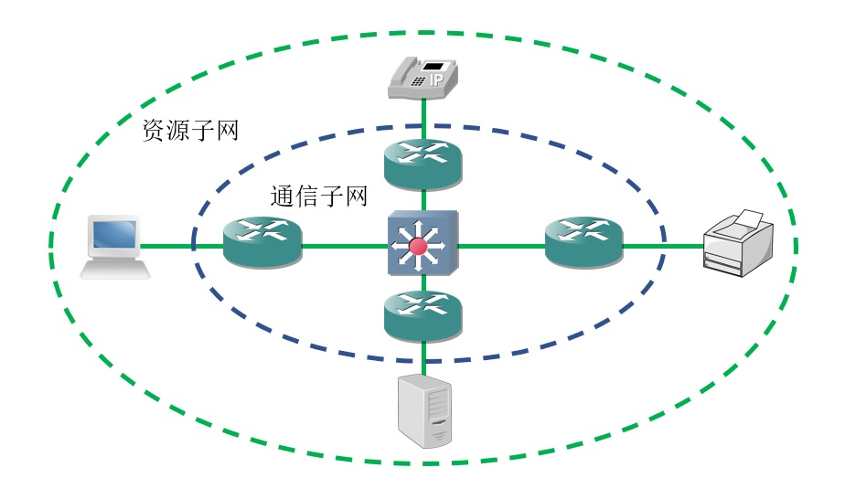

# 网络的定义
计算机网络是指将地理位置不同的多台计算机设备，通过通信线路与中间设备连接起来，在网络操作系统、网络管理软件及网络通信协议的管理和协调下，实现资源共享和信息传递的计算机系统。

计算机网络是计算机技术与通信技术相结合的产物，是信息收集、分发、存储、处理和消费的重要载体。

# 网络的分类
## 覆盖范围
根据网络的覆盖范围，我们可以将其分为以下类型：

🔷 局域网

局域网(Local Area Network, LAN)是指地理范围有限（十几千米以内）、受相同技术组织管理的区域性网络，例如：一个家庭、一个公司、或一个学校；主要任务是实现本地主机之间的互联，具有规模较小、设备相对简单、速率高、误码率较低等特点。

当前正被广泛使用的局域网技术是以太网，除此之外还有令牌总线、令牌环网等技术。

🔷 城域网

城域网(Metropolitan Area Network, MAN)的覆盖范围较局域网更广，它在城市中与水电网类似，作为一种公共设施，实现多个局域网的互联。

🔷 广域网

广域网(Wide Area Network, WAN)的范围较大，通常可达几十至上百千米，遍布一个城市、国家乃至全球。由于传输距离远，它的速率较低、误码率较高，且需要使用比局域网更复杂的控制机制。

🔷 接入网

接入网(Access Network, AN)又称为本地接入网，一般由网络运行商(ISP)提供，它负责将局域网与运营商网络对接，是终端用户与Internet的桥梁。

接入网通常属于城域网的一部分，多个运营商的接入网与公共互联节点组成了城域网。

## 服务对象
根据网络的服务对象，我们可以将其分为以下类型：

🔶 公用网

公用网是指ISP建造的大型公共网络，普通人只要缴纳一定费用即可使用。

🔶 专用网

专用网是指某个部门为自身的特殊业务需求建立的内部网络，这种网络不向本部门以外的用户提供服务，例如：军事、铁路、金融、教育、企业、家庭网络。

# 网络的组成部分
整个计算机网络可以分为两大部分，即资源子网与通信子网。

资源子网主要由服务器、工作站、打印机等设备及相关软件所组成，提供文件、数据等资源或打印、视讯等能力。

通信子网是指网络中实现数据通信的设备及相关软件之集合，通信设备、网络协议、通信控制软件等都属于通信子网，负责信息的传输。

# 网络协议
## 简介
网络协议是为在计算机网络中进行数据交换而建立的规则、标准或约定的集合，只要通信双方遵循相同的协议或标准，即可实现信息交换。

## 协议的三要素
网络协议具有以下三个要素：

🔷 语义

语义即需要发出何种控制信息，完成何种动作以及做出何种响应。

🔷 语法

语法即数据与控制信息的结构或格式。

🔷 时序

时序即事件实现顺序的详细说明。

## 协议栈
在一个通信系统中，人们根据职责划分出多个层次，每一层只负责某个细分领域，各层次将由该领域的专业人员完成开发。

同一个体系中的多个协议集合被称为“协议栈”，对于具体的通信设备，可以根据实际需要只实现协议栈中的一部分，用于完成相关功能。
