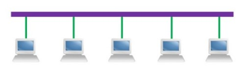
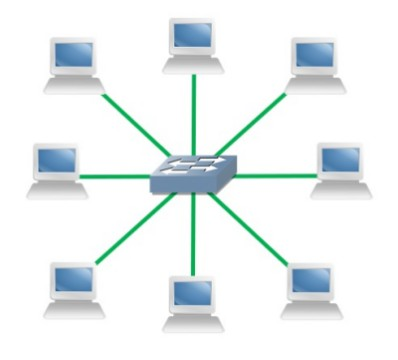
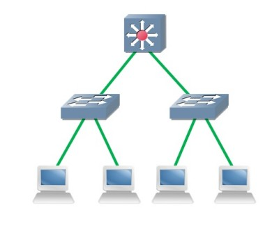
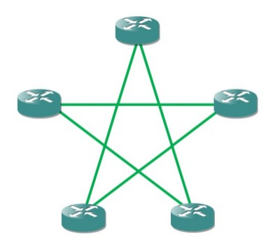

# 简介
通信子网中各节点的互联模式叫做网络的拓扑结构。

拓扑结构通常用于描述网络的工作逻辑，这与物理连接形式可能不是一一对应的，例如：共享式以太网与交换式以太网具有相同的物理连接结构，但工作逻辑分别为总线型拓扑与星型拓扑。

# 总线型拓扑
总线型拓扑结构是早期局域网采用的拓扑结构，采用单根传输线缆作为互联节点，所有工作站都共用该条总线。

总线型拓扑结构的优点是用线量小、布线容易、易于扩展；缺点是总线上任意一处发生故障则整个网络瘫痪，且由于同一时刻仅有一对终端能够通信，发生冲突的概率高，通信速率低，故障诊断困难。

# 环型拓扑
环型拓扑是使用公共电缆组成的一个封闭环路，各节点连接到环上，信息沿着环按某个方向从一个节点传送到另一个节点。在环型拓扑结构中，有一个控制数据发送权的“令牌”，它按一定的方向单向环绕传送，每经过一个节点都要被接收并判断，若是发给该节点的信息则接收，否则就将数据送回环中继续传递。

环型拓扑的优点是电缆用量少，所有站点都能公平访问网络的其他部分，网络性能稳定；缺点是单个节点故障会引起全网故障，并且无关节点也要接收数据并进行判断，在负载很轻时信道利用率较低。

# 星型拓扑
星形拓扑结构是以中央节点为中心，把外围节点连接起来的辐射式结构，中央结点执行集中式通信控制策略，因此中央结点较为复杂，负担也很重。

星型结构中每个节点都需要与中心设备互联，因此需要大量的电缆，这种结构适用于局域网，一般以双绞线作为传输介质。

# 树型拓扑
树型拓扑的形状像一棵倒置的树，顶端是树根，树根以下是分支，每个分支还可带有子分支。树形网是一种分层网，其结构可以对称，具有一定的容错能力，一般一个分支的故障不影响另一分支的工作。

# 网状拓扑
网状拓扑分为全连接和不完全连接两种形式。全连接网状中，每一个节点和网中其他节点均有链路连接。不完全连接网中，两节点之间不一定有直接链路连接，非直连节点之间的通信，依靠其它节点转接。

网状网络的优点是节点间路径多，碰撞和阻塞情况较少，并且局部的故障不会影响网络的其他部分正常工作，可靠性较高。但是这种网络关系复杂，建网成本较高，并且控制机制较为复杂。

广域网中一般根据需要使用不完全连接结构，提高可靠性，重要的部分也会采用全连接结构。
 

