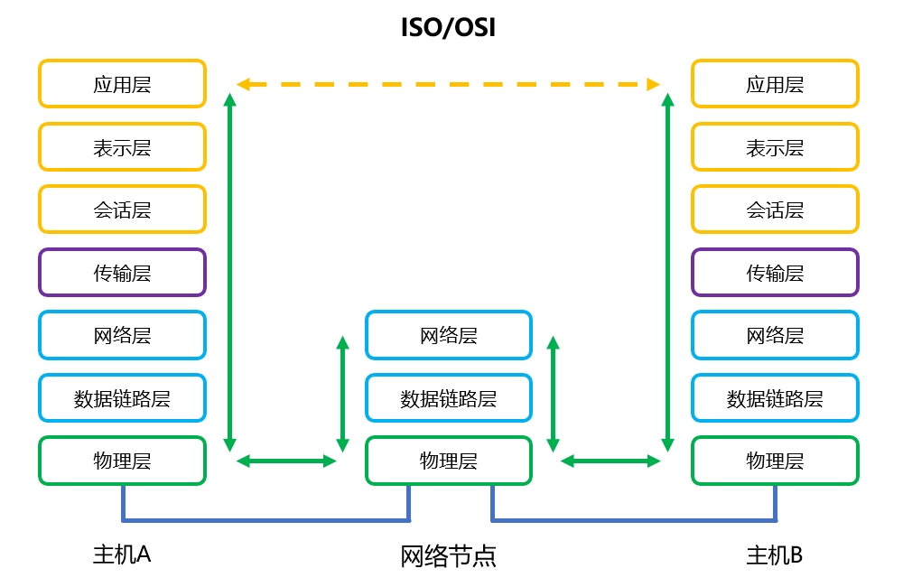
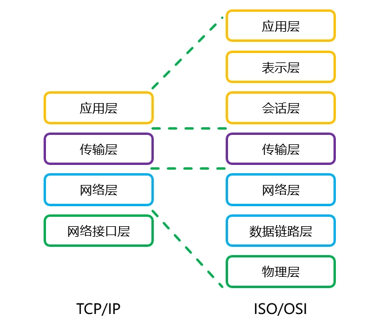
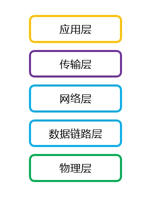

# 开放系统互联参考模型
## 简介
20世纪60年代以来，随着计算机网络的飞速发展，各大厂商为了占据主导地位，纷纷推出了自己的网络架构体系与标准，例如IBM的SNA、Novell的IPX/SPX、Apple的AppleTalk，DEC的DNA等。

多种标准并存使得网络变得非常复杂，并且不同体系之间难以兼容，为了解决兼容性问题，国际标准化组织(ISO)于1984年提出了开放系统互联参考模型(Open System Interconnection/Reference Model, OSI/RM)。

OSI/RM并不是具体的标准与实现方法，只是一个制定标准时的概念性框架，其功能区分明确，便于排除故障，兼容性良好，一种高层协议可在多种低层协议上运行。

## 结构
OSI/RM参考模型的结构如下图所示：

## 功能划分
OSI/RM模型中各层次的功能如下文内容所示：

🔷 物理层(Physics Layer)

物理层定义了传输介质与设备的信号形式、电气特性等，用于透明传输比特流，并建立、维持和释放数据链路实体间的物理连接，使数据链路层无需考虑具体的传输介质。

🔷 数据链路层(Data Link Layer)

数据链路层通过协议与控制机制，在不可靠链路上可靠地传输数据帧(Frame)，该层实现了物理地址寻址、成帧、流量控制和差错校验功能。

🔷 网络层(Network Layer)

网络层也称为通信子网层，其提供了逻辑地址编址、路由选择、拥塞控制和异构网络互联功能，还应提供计费功能。

网络层的协议数据单元称为数据包(Packet)或报文分组。

🔷 传输层(Transport Layer)

传输层用于将报文(Segment)传输给正确的进程，实现端到端的通信，可以提供可靠或不可靠的数据传输服务。

传输层是通信子网与资源子网之间的接口，其主要完成了分片、差错检验、流量控制和拥塞控制等机制。

🔷 会话层(Session Layer)

会话层负责组织与协调远程用户或进程间的通信。

🔷 表示层(Presentation Layer)

表示层主要处理与数据表示相关的问题，用以保证接收端的进程能够解析数据内容，其任务包括数据的编码与解码、加密与解密、压缩与解压等。

🔷 应用层(Application Layer)

应用层提供了用户访问各种网络服务的接口，并且负责协调应用程序之间的工作。

# TCP/IP参考模型
## 简介
OSI/RM模型过于复杂，且标准制定周期过长，通常仅供学术研究使用。由技术人员基于实用角度开发的TCP/IP协议栈更加贴近实际场景，它于20世纪70年代中期获得了广泛的应用。

TCP/IP协议栈是ARPANET及后来的Internet使用的一系列协议，它将全世界各地的网络互联在一起，这个体系结构中的两大主要协议（TCP和IP）出现后，人们将其称为“TCP/IP参考模型(TCP/IP Reference Model)”。

TCP/IP协议栈支持跃层封装，应用程序产生的数据可以根据传输需要灵活封装，不必像OSI/RM那样逐层封装。

## 结构
TCP/IP参考模型的结构如下图所示：

## 功能划分
TCP/IP模型中各层次的功能如下文内容所示：

🔷 网络接口层(Network Access Layer)

该层对应OSI/RM的物理层与数据链路层，用于处理数据帧，其中包含常用的局域网和广域网协议。

🔷 网络层(Internet Layer)

该层对应OSI/RM的网络层，用于处理数据包，其中包含互联网协议(IP)、地址解析协议(ARP)与网际控制报文协议(ICMP)，分别对应逻辑地址编制、逻辑与物理地址相互映射和传输控制功能。

🔷 传输层(Transport Layer)

该层对应OSI/RM的传输层，用于进行端到端的通信，其中包括传输控制协议(Transmission Control Protocol, TCP)和用户数据报协议(User Datagram Protocol, UDP)，分别提供了可靠与不可靠传输功能。

🔷 应用层(Application Layer)

该层对应OSI/RM的会话层、表示层与应用层，向用户提供各种各样的网络应用。

## 典型协议

<table align="center">
    <tr align="right">
        <td align="center" colspan="3">
            <b>TCP/IP协议栈的典型协议</b>
        </td>
    </tr>
    <tr>
        <td align="center">应用层</td>
        <td align="center">HTTP/HTTPS/FTP/SMTP Telnet/SSH</td>
        <td align="center">DHCP/DNS/POP3/TFTP SNMP/NTP</td>
    </tr>
    <tr>
        <td align="center">传输层</td>
        <td align="center">TCP</td>
        <td align="center">UDP</td>
    </tr>
    <tr>
        <td align="center">网络层</td>
        <td align="center" colspan="2">IPv4/IPv6/IPX/AppleTalk/Novell/ARP/RARP</td>
    </tr>
    <tr>
        <td align="center">数据链路层</td>
        <td align="center" colspan="2">Ethernet II/Token Ring/FDDI/HDLC/PPP/Frame Relay/ATM</td>
    </tr>
    <tr>
        <td align="center">物理层</td>
        <td align="center" colspan="2">RJ11/RJ45/RS232/RS485/V.35</td>
    </tr>
</table>

# 五层参考模型
## 简介
OSI/RM与TCP/IP模型都存在一些缺点：

OSI/RM概念划分清晰，但过于复杂，其中会话层较少使用，表示层几乎无用，高级编程语言能够较容易的实现这些功能，实际应用中它们可以直接与应用层集成。

TCP/IP参考模型中的网络接口层区分不够明确，将其划分为物理层与数据链路层是必要且合理的，而TCP/IP参考模型没有做到这点。

为了解决以上的问题，Anderw S.Tanenbaum教授提出了具有五层的混合参考模型，这是一种折中的方案，吸收了OSI/RM与TCP/IP体系的优点，能够更加准确地反映现实网络中的层次结构。

## 结构
五层参考模型的结构如下图所示：

# 技术标准
## 标准化组织
标准化组织负责各种协议的制定与管理，常见的标准化组织如下文所示：

🔷 IETF

Internet工程任务组(IETF)是最重要的标准化组织，其主要负责Internet核心协议的管理。

🔷 IEEE

电气和电子工程师协会(IEEE)主要关注网络层以下的标准。

🔷 ITU

国际电信联盟(ITU)主要关注电话与蜂窝网络相关技术。

🔷 W3C

万维网联盟(W3C)主要关注应用层Web技术相关协议。

## IETF RFC
Internet的每一个标准都以RFC（征求意见）的形式发布，每个RFC都由一个数字来标识，例如RFC 1812。

一个提案在被正式接受并作为RFC发布之前，将作为临时的Internet草案存在，在编辑与审查的过程中接收意见并公布进展。

## IEEE 802委员会
IEEE 802委员会又称为局域网/城域网标准委员会(LAN/MAN Standards Committee, LMSC)，负责制定局域网/城域网的物理层与数据链路层标准。

LMSC下设若干工作组(Working Group)、研究组(Study Group)、技术顾问组(Technical Advisory Group)，每个分支机构负责的内容如下：

🔶 802.1：研究局域网的体系结构、寻址、互联与管理等相关技术。

🔶 802.2：研究逻辑链路控制子层(LLC)相关技术。

🔶 802.3：研究以太网的介质访问控制协议与物理层技术规范。

🔶 802.4：研究令牌总线网(Token-Bus)的介质访问控制协议与物理层技术规范。

🔶 802.5：研究令牌环网(Token-Ring)的介质访问控制协议与物理层技术规范。

🔶 802.6：研究城域网相关技术。

🔶 802.7：研究宽带联网相关技术。

🔶 802.8：研究光纤联网相关技术。

🔶 802.9：研究综合声音数据的局域网(IVD LAN)介质访问控制协议与物理层技术规范。

🔶 802.10：研究认证与加密技术规范。

🔶 802.11：研究无线局域网(WLAN)的介质访问控制协议与物理层技术规范。

🔶 802.12：研究需求优先的介质访问控制协议(100VG AnyLAN)。

🔶 802.13：不存在的标准，西方人认为13是不吉利的数字，没有人愿意使用它。

🔶 802.14：研究采用线缆调制解调器(Cable Modem)的交互式电视介质访问控制协议及网络层技术规范。

🔶 802.15：研究采用蓝牙技术的无线个人网(Wireless Personal Area Networks, WPAN)相关技术规范。

🔶 802.16：宽带无线连接工作组，研究2-66GHz的无线接入系统空中接口。

🔶 802.17：弹性分组环(Resilient Packet Ring, RPR)工作组，制定了弹性分组环网的访问控制协议及相关标准。

🔶 802.18：宽带无线局域网技术咨询组(Radio Regulatory)。

🔶 802.19：多重虚拟局域网共存(Coexistence)技术咨询组。

🔶 802.20：移动宽带无线接入(MBWA)工作组，制定宽带无线接入网的解决方案。

🔶 802.21：研究无线网络之间的切换问题，正在制定MIH标准。

🔶 802.22：无线区域网(Wireless Regional Area Network)。

🔶 802.23：紧急服务工作组(Emergency Service Work Group)。
