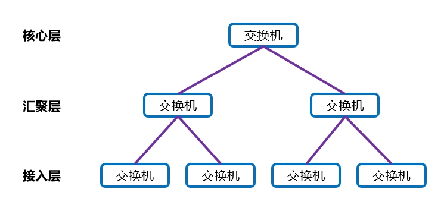

# 层次化网络设计模型
## 简介
层次化网络设计模型是当今企业园区网广泛采用的设计模型，将整个网络划分为若干个层次后，各层专注于某些功能的实现，便于管理。

## 特点
🔷 易于理解

各个层次分工较为明确，便于理解，管理任务可划分到网络结构的不同层次中，从而有助于控制管理费用。

🔷 扩展性好

在大型平面网络中，一处更改可能会影响许多系统。而模块化设计使得层次化网络可以方便的扩展，升级费用和施工复杂度仅限于整个网络的一部分。

🔷 故障隔离

将网络结构模块化有利于隔离故障，使故障不影响其它区域，并且不同层次功能区分明确，便于维护人员确定故障点。

🔷 节约成本

层次化的网络设计，节省了不同部门之间的管理成本，并且每一层中的带宽得以合理利用，减少了设备性能的浪费。

## 典型结构
层次化网络设计模型的典型结构如下文图片所示：

上文图片中出现的各个层次及用途，详见下文内容：

🔶 核心层

核心层是网络的高速交换干路，负责连通整个网络。核心层应该具有可靠性、高效性、冗余性、容错性、适应性、低延时性等特点。

核心层应采用高带宽的交换机，因为它是网络的枢纽，部署双机冗余、热备份技术也是非常必要的，并且可以部署负载均衡技术，改善网络性能，提高设备利用率。

🔶 汇聚层

汇聚层介于终端接入网络与核心网络之间，用于减轻核心层设备的负荷。汇聚层具有实施管理策略、虚拟局域网之间的路由、源地址或目的地址过滤等多种功能。

小型网络可能无需汇聚层，而大型网络中可能需要多级汇聚，我们可以根据需求进行设计。

🔶 接入层

接入层向本地提供终端接入功能，可以选择不支持三层交换技术的纯二层交换机。
