# 双绞线
## 简介
双绞线(Twist-Pair)是综合布线工程中最常用的传输介质，由两根具有绝缘保护层的铜导线组成，“双绞线”的名字也由此而来。两根绝缘的铜导线按一定密度互相绞在一起，一根导线辐射出的电磁波会被另一根导线上的电磁波抵消，有效地降低了信号干扰。

双绞线一般由两根22-26号带绝缘层的铜导线相互缠绕而成，实际使用时，通常由四对双绞线包在一个绝缘套管里组成“双绞线电缆”，我们一般把“双绞线电缆”直接简称为“双绞线”。

五类双绞线电缆的结构可参考下文图片：

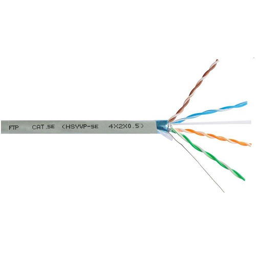

六类双绞线电缆的结构可参考下文图片：

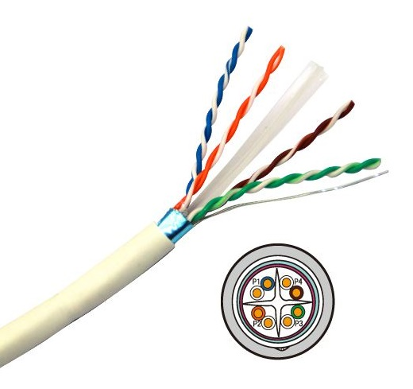

与其他传输介质相比，双绞线在传输距离、信道宽度和数据传输速度等方面均受到一定的限制，但综合成本较为低廉，并且在施工现场制作较为方便，因此使用非常广泛。

## 分类
### EIA/TIA标准
TIA/EIA-568.2-D标准按照线缆的传输能力进行划分，定义了以下几种类型：

| 类型  | 最高频率带宽 | 最高速率 |         应用场景         |
| :---: | :----------: | :------: | :----------------------: |
| CAT1  |    750kHz    |    -     |       模拟电话线缆       |
| CAT2  |     1MHz     |  4Mbps   | 用于语音和早期的令牌网络 |
| CAT3  |    16MHz     |  10Mbps  | 用于早期以太网，现已淘汰 |
| CAT4  |    20MHz     |  16Mbps  |  未投入广泛使用即被淘汰  |
| CAT5  |    100MHz    | 100Mbps  |   早期产品，逐步淘汰。   |
| CAT5e |    155MHz    |  1Gbps   |  千兆局域网，使用广泛。  |
| CAT6  |    250MHz    |  2Gbps   |  千兆局域网，使用广泛。  |
| CAT6A |    500MHz    |  10Gbps  |            -             |
| CAT7  |    600MHz    |  10Gbps  |            -             |

此标准中的最高速率是指极限距离下的参考数值，如果我们仅在短距离使用，低规格的线缆也能达到较高的速率，例如：设备间的CAT5e跳线有时也能够提供10Gbps的互联带宽。

### 屏蔽性
根据线缆是否有屏蔽层，可以分为以下几个种类：

- 一体屏蔽双绞线(FTP)：整根线缆由屏蔽层包覆。
- 独立屏蔽双绞线(STP)：每对线缆由屏蔽层包覆。
- 非屏蔽双绞线(UTP)：无屏蔽层。

屏蔽双绞线要求整套系统均良好接地才能达到预期的效果，在实际施工中，很难实现全部点位良好接地，这反而使屏蔽层本身成为最大的干扰源，性能甚至不如非屏蔽双绞线。所以，除非有特殊需要，我们通常选用非屏蔽双绞线即可。

## 连接器
常见的四对双绞线使用的是8Pin的RJ-45插头。RJ-45连接器由插头（俗称水晶头）和插座组成，插头有8个凹槽和8个触点。RJ是Registered Jack的缩写，在FCC相关规范中RJ系列是用于公用电信网络的接口。

RJ45插头和插座的外观如下图所示：

    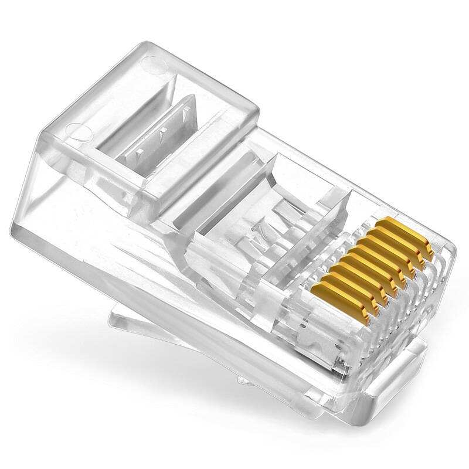
    &nbsp;&nbsp;&nbsp;&nbsp;
    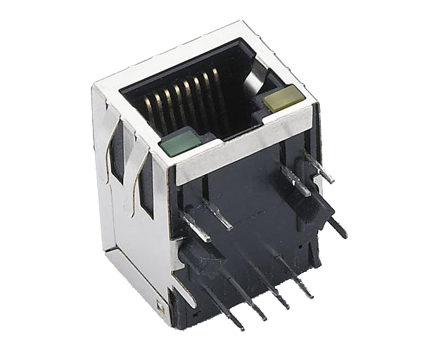

## 线序定义
普通的四对双绞线共包含八根芯线，标准颜色分别为橙白、橙、绿白、绿、蓝白、蓝、棕白、棕。

线序主要有EIA/TIA 568A和EIA/TIA 568B两种标准，其中A表示IBM的标准，B表示AT&T的标准，T568B标准使用更为广泛。

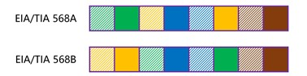

在千兆以下的链路中，1、2号芯线用于发送信号，3、6号芯线用于接收信号。在千兆以上的链路中，四组芯线全部用于收发信号。

根据线缆两端使用标准的区别，双绞线电缆分为以下几种：
- 直通线：两端都使用T568B。
- 交叉线：一端使用T568B，另一端使用T568A。
- 全反线：一端线序为T568B，另一端为T568B倒序排列。
DTE与DCE互联应当使用直通线，DTE之间、DCE之间互联应当使用交叉线；全反线仅用于连接Console接口和RJ45-DB9串口转换器，不能用于数据通信。

## Auto MDI/MDIX特性
端口自动翻转特性，用于自动适应线序，具有此功能的设备可以自适应电缆类型。

# 同轴电缆
## 简介
同轴电缆(Coaxial Cable)是指拥有两个同心导体，且导体和屏蔽层共用同一轴心的电缆。常见的同轴电缆内层是铜线导体，被绝缘材料包裹，绝缘层外部是另一层环形导体及屏蔽层，然后整个电缆由聚氯乙烯或特氟纶材料护套包住。

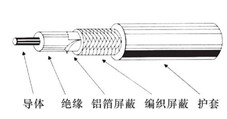

同轴电缆加上放大器以后，可以将信号传输到很远的地方。早期被企业局域网广泛使用，当前部分广电公司用来传输电视信号。随着光纤入户的普及，同轴电缆逐渐淘汰了。

## 分类
### 传输特性
按照传输特性的不同，同轴电缆可分为基带同轴电缆和宽带同轴电缆。

基带同轴电缆的屏蔽层是铜质的网状金属，阻抗为75Ω(如RG-8、RG-58等)；宽带同轴电缆的屏蔽层通常是由铝材冲压制成，阻抗为50Ω(如RG-59等)。

### 直径
按照直径的不同，同轴电缆可分为粗缆和细缆。

粗缆适用于规模较大的局部网络，其传输距离较长，可靠性高。由于安装时无需切断电缆，可根据需要灵活调整计算机的接入位置，但粗缆必须安装外置收发器，安装难度大，总体造价更高。

细缆安装则比较简单，造价较低，但其安装过程中要切断电缆，在两头装上BNC接头，然后使用T型连接器连接，所以接头数量较多时容易产生隐患。

## 连接器
细同轴电缆的常用连接器是BNC接头，全称是Bayonet Nut Connector（刺刀螺母连接器），又称为British Naval Connector（英国海军连接器）。BNC接头被大量用于通信系统中，例如网络设备的E1接口就是用两根BNC接头的同轴电缆来完成连接的，这种接头也经常用来传送音视频信号。

BNC插头和插座的外观如下图所示：

    
    &nbsp;&nbsp;&nbsp;&nbsp;
    

# 光纤
## 简介
光纤是光导纤维的简称，是一种由玻璃或塑料制成的纤维，可作为光传导的介质，其传输原理是光的全反射。

1870年，英国物理学家丁达尔到皇家学会的演讲厅讲光的全反射原理，他做了一个简单的实验：在装满水的木桶上钻个孔，然后用灯从桶口把水照亮。水从小孔里流了出来，水流弯曲，光线也跟着弯曲，光居然被弯弯曲曲的水流俘获了。

由于水等介质的密度比周围的物质（例如空气）大，光从水中射向空气时，当入射角大于某一角度时，折射光线消失，全部光线都反射回水中。表面上看，光好像在水流中弯曲前进。

后来人们制造出一种透明度很高、粗细像蜘蛛丝一样的玻璃丝——玻璃纤维，当光线以合适的角度射入玻璃纤维时，光就沿着玻璃纤维前进。这种纤维能够用来引导光线，所以称为光导纤维。

光纤在使用前必须由保护结构包覆，保护层和绝缘层可防止周围环境对光纤的伤害。包覆后的缆线被称为光缆，大部分语境中的“光纤”实际上就是指光缆。光信号的衰减极小，所以光纤可以用于长距离传输；且光信号在传输过程中不受电磁波的干扰，可靠性、保密性均高于电缆，因此光纤被广泛应用于通信系统中。

光缆的结构如下图所示：

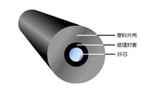

## 分类
### 传输特性
按照传输特性光纤可分为单模光纤和多模光纤。

单模光纤(Single Mode Fiber, SMF)是指在工作波长中，只传输单个波长光信号的光纤。其纤芯很细（约10μm），一般用激光二极管作为光源，速率较高，传输距离较远，同时成本也相对更高。

多模光纤(Multi Mode Fiber, MMF)是指可以同时传输多个波长光信号的光纤。其纤芯直径为50μm，一般用发光二极管作为光源，由于传输模式可达上百个，其带宽主要受模式色散支配。由于MMF较SMF的芯径大且与LED等光源结合容易，在短距离通信领域中MMF仍受到重视。

## 连接器
光纤连接器类型十分丰富，常用的连接器为SC连接器和LC连接器，SC插头的外观可参考下文图片：

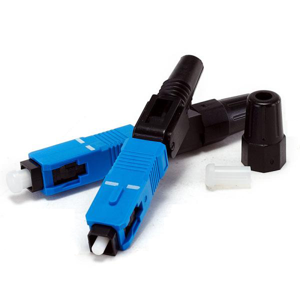

LC插头的外观可参考下文图片：

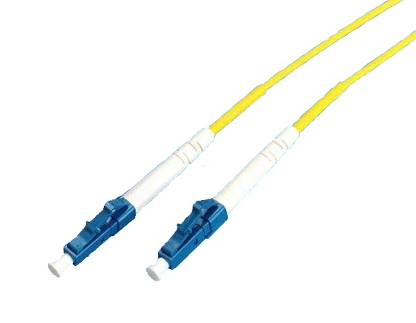

SC连接器外壳采用模塑工艺，用铸模玻璃纤维塑料制成，呈矩型；插头套管由精密陶瓷制成，耦合套筒为金属开缝套管结构，紧固方式采用插拔销闩式，无需旋转。此类连接器价格低廉，插拔操作方便，插入损耗较小，一般用于PON调制解调器和GBIC模块。

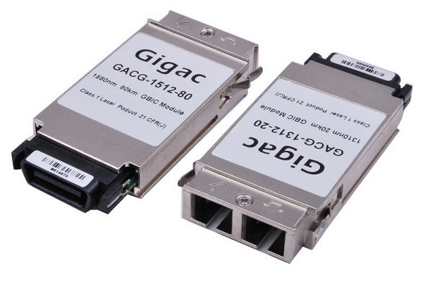

LC连接器是著名贝尔(Bell)研究所开发的光纤连接器类型，采用操作方便的模块化插孔闩锁机理制成。其插针和套筒的尺寸是普通SC插头的一半，为1.25mm，可以提高光纤配线架的密度。LC连接器主要用于连接使用SFP模块的交换机与路由器。

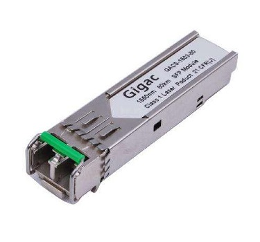

