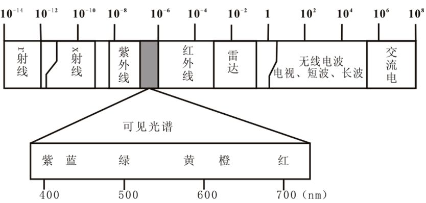

# 简介
非导向传输介质是指在自由空间中，利用电磁波作为介质来进行传递信息。

电磁波的频段很广，根据波长的不同，可以将电磁波分为以下波段：

不同波长的电磁波具有不同的传播特性，因此应用场景也各不相同。

# 微波
微波通信(Microwave Communication)，是使用波长在0.1毫米至1米之间的电磁波进行的通信，该波段电磁波所对应的频率范围是300MHz-3000GHz，在数据通信领域占有重要地位，目前广泛使用的WLAN技术频段即属于微波。

微波波长较短，具有视距传播的特性，而地球表面是个曲面，电磁波远距离传输时，不仅有损耗，还会受到地面曲率的影响。为了延长通信距离，需要设立若干中继站，进行电磁波中继。

# 红外线
红外线波长范围为0.70μm-1mm，其中300μm-1mm区域的波也被称为亚毫米波。红外通信是利用950nm近红外波段的红外线作为传递信息的媒介。

发送端将基带二进制信号调制为一系列的脉冲信号，通过红外发射管发射；接收端将接收到的红外线脉冲转换成电信号，再经过放大、滤波等处理后送给解调电路进行解调，还原为二进制数字信号后输出。

红外线通信具有容量大，保密性强，抗电磁干扰性能好的优点，且设备结构简单、体积小、重量轻、价格低；但其在传输时易受气候影响，只能在直视距离内通信。典型的应用是家电的遥控器。

# 激光
激光通信是利用激光传输信息的通信方式。激光具有亮度高、方向性强、单色性好、相干性强等特征。

激光通信容量较大，保密性强，但在大气中使用激光时，两端设备瞄准困难，通信距离限于视距，且易受气候影响，在恶劣气候条件下甚至会造成通信中断。
