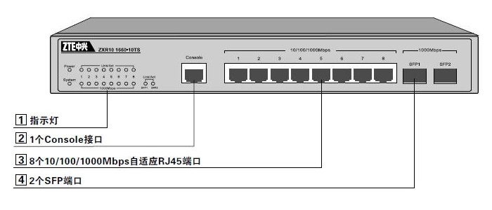
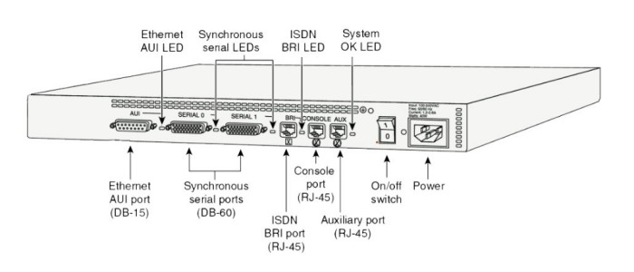
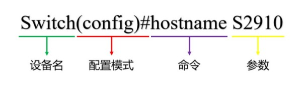

# 尺寸
可装入标准机柜的设备宽度为19英寸(48.26厘米)，高度为若干U，1U=1.73英寸(4.445厘米)。

# 外形
常见的交换机设备外观如下图所示：

<div align="center">



</div>

常见的路由器设备外观如下图所示：

<div align="center">



</div>

以上图例中所展示的接口及其用途见下文：

🔷 Console接口

Console接口是一种专用串行接口，用于对设备进行本地配置。设备上的Console接口大多为RJ-45接口，并标记有Console字样。使用Console线将设备连接到计算机的串口(DB-9)，再配合终端仿真软件，就可以在计算机上配置设备了。现代笔记本电脑一般不带串行接口，此时我们可以使用USB转DB-9模块完成连接。

🔷 AUX接口

AUX端口也称为辅助接口，是一种异步串行端口，主要用于通过调制解调器拨号进行远程配置，也可用于拔号连接，作线路备份的用途。

🔷 RJ-45端口

RJ-45端口是最常见的以太网端口，由于以太网向下兼容，不同速率的接口外观是相同的，使用时需要观察标记确认接口的最大速率。

🔷 GBIC与SFP端口

GBIC是用于光电信号转化的接口器件，可以热插拔使用。而SFP是GBIC的升级版本，体积更小，当前使用更为广泛。

🔷 AUI端口

AUI端口是一种D型15针接口(DB-15)，是用来连接粗同轴电缆的接口，在令牌环网或总线型网络中比较常见。

路由器可以通过粗同轴电缆收发器实现与10Base-5网络的互联，也可以借助AUI转RJ-45模块实现与10Base-T以太网的连接。

# 硬件组成
网络设备是一种专用型计算机，它具有计算机的基本结构，其硬件组成如下文列表所示：

- CPU：使用专用芯片实现高速数据处理。
- RAM：存放运行中的配置。
- NVRAM：非易失性存储器，保存启动配置信息与配置寄存器的参数。
- Flash：存放系统镜像文件和其它文件。
- ROM：自检程序和底层系统。
- Interface：物理接口。
- MotherBoard：系统背板，用于连接其它组件。

# 启动过程
网络设备的启动过程通常有以下步骤：

1. 硬件自检
2. 加载配置寄存器参数
3. 寻找操作系统镜像
4. 加载操作系统镜像
5. 寻找启动配置文件
6. 加载启动配置文件
7. 运行操作系统并配置各项参数

# 思科命令行
## 命令提示符
思科设备的命令提示符形式如下图所示：

<div align="center">



</div>

## 配置模式
思科设备的命令行具有以下模式：

🔷 用户模式

管理员首次接入设备时，将默认处于用户模式，提示符是 `>` ，这种模式下只能查询一些基础信息。

🔷 特权模式

在用户模式下输入 `enable` 命令，进入特权模式，特权模式是其它模式的基础。

🔷 全局配置模式

在特权模式下输入 `config terminal` 命令，进入全局配置模式，该模式可以进行全局参数的配置。

🔷 局部配置模式

在全局配置模式下输入功能命令，进入相应的配置菜单，此处的更改只影响设备局部，例如单个接口。

## 快捷键
思科设备命令行的常用快捷键见下表：

<div align="center">

| 快捷键 |           功能           |
| :----: | :----------------------: |
| Ctrl+A |       光标移至行首       |
| Ctrl+E |       光标移至行尾       |
| Ctrl+C |       中断当前操作       |
| Ctrl+Z |       返回用户模式       |
| Esc+B  |    光标向前移一个单词    |
| Esc+F  |    光标向后移一个单词    |
|  ↑↓  |       查阅历史命令       |
|  Tab   |         自动补全         |
|   ?    | 获取当前上下文的帮助信息 |

</div>

## 基本操作
🔶 查看系统版本信息

```text
Cisco(config)# show version
```

🔶 设置设备名称（系统主机名）

```text
Cisco(config)# hostname <设备名称>
```

🔶 设置特权模式密码

```text
# 设置明文密码
Cisco(config)# enable password <密码>

# 设置密文密码
Cisco(config)# enable secret <密码>
```

当两种密码都设置时，仅密文密码生效！

🔶 开启/关闭IP路由功能

```text
Cisco# [no] ip routing
```

🔶 开启/关闭接口

```text
Cisco(config)# interface ethernet0/1
Cisco(config-if)# [no] shutdown
```

🔶 时间设置

```text
# 查看当前系统时间
Cisco# show clock

# 设置当前时间
Cisco# clock set <时:分:秒> <月份（英文缩写）> <日期> <年份>

# 更改当前时区
Cisco(config)# clock timezone <时区> <偏移量>
```

🔶 配置登录提示信息

```text
Cisco(config)# banner motd "<提示信息>"
```

🔶 返回上一级菜单

```text
Cisco(config)# exit
```

🔶 重启设备

```text
Cisco# reload
```

## 配置文件管理
我们修改的配置只会存储在RAM中作为运行时配置，设备重启后将会重新加载ROM中的启动配置，所以当配置变更确认正确无误后，我们需要执行保存命令，将运行时配置持久化存储至ROM中。

```text
# 查看当前配置
Cisco# show running-config

# 查看启动配置
Cisco# show startup-config

# 将当前配置保存到设备中
Cisco# write

# 修改配置寄存器参数
Cisco(config)# config-register <Hex值>
```

## 域管理
🔷 加入域

```text
Cisco(config)# ip domain-name <域名>
```

🔷 指定域名解析服务器

```text
Cisco# ip name-server <DNS地址>
```

🔷 开启/关闭域名解析功能

```text
Cisco(config)# ip domain lookup
```

该功能在Cisco设备上默认开启，当我们输入系统无法识别的命令时，命令行将会阻塞并尝试进行域名解析，导致无法进行其他操作。如果不需要使用该功能可以将其关闭，此时输错命令后将直接提示“无法识别”，提高操作效率。

## 优化命令
🔶 调整会话超时时间

```text
Cisco(config-line)# exec-timeout <分> <秒>
```

🔶 同步日志信息

```text
Cisco(config-line)# logging synchronous
```

该功能可以防止突然弹出的日志信息截断正在输入的命令。

## 快捷操作
🔷 在其它模式下执行特权模式命令

```text
Cisco(config)# do-exec <特权模式命令>
```

🔷 批量配置端口

```text
Cisco(config)# interface range <端口ID范围>
```

端口ID前半部分是端口的名称，例如"FastEthernet"，后半部分是模块编号/端口编号，例如"0/0"，同模块内的连续端口使用"-"将端口编号连接即可，如："FastEthernet0/0-3"表示“0号快速以太网模块下的0至3号接口”；不同模块、同模块内的非连续端口需要使用","与前面的语句隔开，并写出完整名称，如："FastEthernet0/0-1,FastEthernet0/5"。

## 注释信息
如果我们需要在脚本中对命令进行说明，可以在行首使用"!"标记，设备将忽略该行文本并跳转至下一行继续执行。

```text
Cisco(config)# ! 此处为注释，系统不会执行。
```

# 华为命令行
## 命令提示符
华为设备的命令提示符形式如下图所示：

<div align="center">


</div>

## 配置模式
🔷 用户模式

开机时默认进入用户模式，提示符是 `<Hostname>` ，只能查询一些设备基础信息。

🔷 全局配置模式

在用户模式下输入 `system-view` 命令，进入全局配置模式，该模式可以进行全局参数的配置。

🔷 局部配置模式

在全局配置模式下输入指定命令进入相应的局部配置模式，只影响设备局部参数。

## 快捷键
华为设备命令行的常用快捷键见下表：

<div align="center">

| 快捷键 |           功能           |
| :----: | :----------------------: |
| Ctrl+A |       光标移至行首       |
| Ctrl+E |       光标移至行尾       |
| Ctrl+C |       中断当前操作       |
| Ctrl+Z |       返回用户模式       |
| Esc+B  |    光标向前移一个单词    |
| Esc+F  |    光标向后移一个单词    |
|  ↑↓  |       查阅历史命令       |
|  Tab   |         自动补全         |
|   ?    | 获取当前上下文的帮助信息 |

</div>

## 基本操作
🔶 查看系统版本信息

```text
[Huawei] display version
```

🔶 设置设备名称（系统主机名）

```text
[Huawei] sysname <设备名称>
```

🔶 开启/关闭接口

```text
[Huawei] interface Ethernet0/0/0
[Huawei-Ethernet0/0/0] [undo] shutdown
```

🔶 时间设置

```text
# 查看当前系统时间
<Huawei> display clock

# 设置当前时间
<Huawei> clock datetime <时:分:秒> <年-月-日>

# 更改当前时区
<Huawei> clock timezone <时区名称> {add | minus} <偏移量>
```

🔶 返回上一级菜单

```text
<Huawei> quit
```

🔶 重启设备

```text
<Huawei> reboot
```

## 配置文件管理
我们修改的配置只会存储在RAM中作为运行时配置，设备重启后将会重新加载ROM中的启动配置，所以当配置变更确认正确无误后，我们需要执行保存命令，将运行时配置持久化存储至ROM中。

```text
# 查看当前配置
[Huawei] display current-configuration

# 将当前配置保存到设备中
<Huawei> save
```

## 域管理
🔷 指定域名解析服务器

```text
[Huawei] dns server <DNS地址>
```

🔷 开启/关闭域名解析功能

```text
[Huawei] dns resolve
```

华为设备的域名解析功能通常默认为“关闭”。
