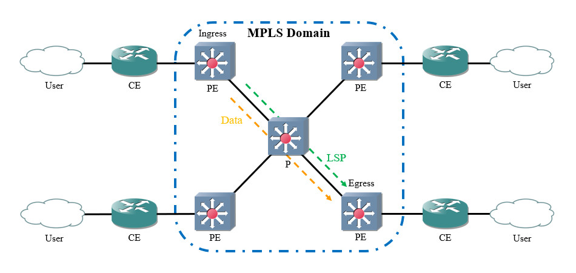
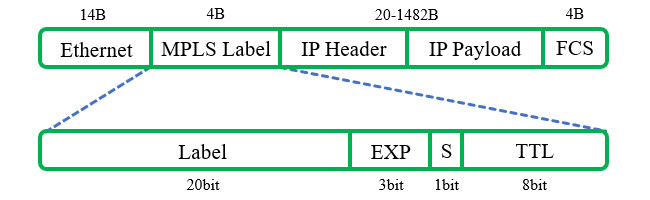

# 简介
多协议标签交换(Multi-Protocol Label Switching, MPLS)是一种利用标签引导数据的高效传输技术，由IETF提出。MPLS技术介于数据链路层与网络层之间，可以支持多种网络层和数据链路层协议。

20世纪90年代，由于受到硬件性能的限制，IP路由效率非常低下，因此推动了MPLS技术的发展。现代设备的硬件性能已经不再是瓶颈，但是IP网络的一些缺点仍然使得MPLS技术被广泛应用。IP网络只能逐跳转发，选路手段较少，MPLS技术可以实现转发与控制平面分离、流量工程等。

MPLS技术的整体架构如下文图片所示：

# 术语
## 标签交换路由器(LSR)
所有启用MPLS功能的节点都是标签交换路由器(Label Switching Router, LSR)。

## 运营商节点(P)
运营商传输网络中的节点被称为运营商节点(Provider, P)，这些节点只具备MPLS转发能力，用于实现数据的快速转发功能。

## 运营商边缘节点(PE)
传输网络边界的节点被称为运营商边缘节点(Provider Edge, PE)，位于传输网络的边缘，与用户接入设备相连。

## 用户边缘节点(CE)
终端用户接入MPLS网络的设备称为用户边缘节点(Customer Edge, CE)，可能是路由器，也可能是交换机或主机，用于给报文增加或拆除标签。

## 入节点(Ingress LSR)
是指给IP报文增加标签头部并生成标签的节点，通常处于MPLS域边界。

## 出节点(Egress LSR)
是指拆除标签信息还原IP报文的节点，通常处于MPLS域边界。

## 转发等价类(FEC)
转发等价类(Forwarding Equivalence Class, FEC)指具有相同特征的报文，这些报文在转发过程中采用相同的方式进行处理。

## 标签交换路径(LSP)
标签交换路径(Label Switching Path, LSP)是报文在MPLS域内转发的路径，LSP在数据转发之前建立完成，且是单向的，可以使用静态或动态方式建立。同一个FEC通常采用相同的LSP，且LSR总是采用相同的标签进行转发。

# 报文结构
MPLS标签是一个定长的标识符，用于唯一标识一个分组所属的FEC，只具有本地意义。一个FEC可能会关联多个入标签，但是一个标签只能关联一个FEC。

单个标签的长度为4字节，位于数据链路层和网络层之间，因此可以兼容多种网络协议组合。MPLS最多可以拥有6层标签，我们可以将端口的MTU设为1524字节，24字节可容纳6层标签，适应性较强。

在“以太网+IP网络”的常见组合中，MPLS标签的位置与结构如下文图片所示：

以太网帧中插入MPLS标签后，上层协议字段值为"0x8847"(单播)或"0x8848"(组播)。

其中各字段的说明详见下文内容：

🔷 `Label`

标签，长度20比特。

用于唯一标识FEC。

🔷 `EXP`

扩展字段，长度3比特。

通常用于QoS，类似于IEEE 802.1p。

🔷 `S`

栈底标识，长度1比特。

若有多层标签，最内层标签的取值为"1"。

🔷 `TTL`

含义与IP报文中的TTL相同，用于防止数据包无限制地在环路中转发。
