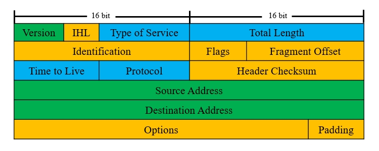

# 概述
通过链路层技术，我们可以使有限地理范围内的设备相互联结，这为区域内的信息共享带来了极大的便利，但是各链路层网络彼此独立，不利于进行跨区域的信息共享。网络层技术可以实现区域之间的网络互联，实现更广泛的信息共享，使人们的沟通更加便捷。

目前Internet基于TCP/IP协议栈，其中互联网协议(Internet Protocol, IP)协议位于网络层，是TCP/IP协议栈的核心协议之一，它提供了全局统一的编址规则，通信双方无需关注对方的链路层类型，即可完成信息交换。

首个被广泛运用的IP协议版本是第四版(IPv4)，它可以运行在多种不同的链路层环境之上，例如以太网、串行链路、卫星链路等，其中最常见的是以太网。

# 报文格式
IP报文通常被称为“数据包”，被封装在链路层帧中进行传输，不同的链路层协议均可携带IP数据包。

IPv4报文的头部包含控制信息，其结构见下图：

<div align="center">



</div>

- 绿色表示该字段在IPv6中被保留。
- 蓝色表示该字段在IPv6中名称或定义有变化。
- 橙色表示该字段在IPv6中被废弃。

🔷 Version

协议版本号，长度4比特。

在IPv4中取值固定为"4"。

🔷 IHL

报文头部长度，长度4比特。

该数值的单位为“4字节”，不携带任何选项(Options)时取值固定为"5"，表示首部长度为20字节；携带选项时最大值为"15"，表示首部长度为60字节。

🔷 Type of Service

服务类型标记，长度1字节。

表示数据包的重要程度，用于实现服务质量(QoS)。

🔷 Total Length

整个数据包的长度，长度2字节。

该数值的单位为“字节”，最大值为"65535"，但IP数据包会受到链路MTU的限制，通常不会达到最大值。

🔷 Identification

分片标识符，长度2字节。

当数据包大于链路MTU时，需要在网络层进行分片操作，该字段用于唯一地标识每个分片。

🔷 Flags

分片标记，长度3比特。

取值"0x40"表示不允许分片；"0x20"表示该分片后续还有其它分片；"0x80"是保留数字，暂不使用。

🔷 Fragment Offset

分片偏移量，长度13比特。

表示该分片在整个原始数据块中的位置。

🔷 Time to Live

生存时间，长度1字节。

通常情况下，数据包每经过一个节点该数值减一，如果数值减到"0"则会被丢弃不再继续转发。这种机制用于防止数据包在网络层环路中无限传输。

🔷 Protocol

上层协议号，长度1字节。

用于标识数据包所承载的上层协议类型，知名的协议号见下表：

<div align="center">

| 协议号 | 协议类型 | 协议号 | 协议类型 |
| :----: | :------: | :----: | :------: |
|   1    |   ICMP   |   2    |   IGMP   |
|   4    |    IP    |   6    |   TCP    |
|   8    |   EGP    |   9    |   IGP    |
|   17   |   UDP    |   50   |   ESP    |
|   51   |    AH    |   89   |   OSPF   |
|  111   |   IPX    |  112   |   VRRP   |
|  115   |   L2TP   |  124   |  IS-IS   |

</div>

🔷 Header Checksum

数据包头部的校验和，长度2字节。

用于校验包头信息是否在传输过程中出现错误。

🔷 Source Address

源地址。

🔷 Destination Address

目的地址。

🔷 Options

可选字段。

一个数据包可以根据需要添加多个可选字段，用于实现一些特殊的功能。

🔷 Padding

填充位，通过补0的方式保证可选字段长度凑满4字节，便于路由软件进行处理。

# 编址方式
## 书写格式
IPv4的地址空间为32位二进制，为了便于书写和阅读，一般采用“点分十进制”表示法：每8位为一组转为十进制，组之间以"."分隔，每个组取值范围为：[0-255]。

<div align="center">


</div>

## 地址分类
IP地址空间被划分为五种类型，每种类型对应不同的用途。

<div align="center">

| 类型  | 前导字段 | 起始地址  |    终止地址     | 用途  |
| :---: | :------: | :-------: | :-------------: | :---: |
|   A   |    0     |  1.0.0.0  | 127.255.255.255 | 单播  |
|   B   |    10    | 128.0.0.0 | 191.255.255.255 | 单播  |
|   C   |   110    | 192.0.0.0 | 223.255.255.255 | 单播  |
|   D   |   1110   | 224.0.0.0 | 239.255.255.255 | 组播  |
|   E   |   1111   | 240.0.0.0 | 255.255.255.255 | 实验  |

</div>

# 单播地址
单播(Unicast)是指发送方和接收方之间进行的点对点通信，IP地址中最常见的就是单播地址，这种地址用于唯一标识网络上的某个接口。

IP地址分类中的A、B、C类地址均为单播地址，但它们所对应的地址空间大小不同。A类地址的首字节表示不同的网络，其余部分表示不同的主机；B类地址前两个字节标识网络，后两字节标识主机；C类地址前三字节都标识网络，只有最后一字节标识主机。

每个地址块的首个地址被称为“网络ID”或“网络号”，表示该网络本身，例如C类地址块"192.168.100.0"表示"192.168.100.0-192.168.100.255"这个网络。

## 子网掩码
Internet发展的初期并没有子网的概念，完全依靠地址的前导字段区分网络类型。一个地址块被分配给组织后，组织内部无法进一步划分出更小的区域，导致了地址资源浪费。

为了解决这一问题，人们提出子网掩码这一概念，可以根据需要将A、B、C三种主类地址块划分为更小的地址块，使得地址分配更灵活。

子网掩码长度与IP地址相同，左侧是若干个连续的1，对应网络ID；剩余位置取0，对应主机ID。网络设备将IP地址与子网掩码按位进行逻辑与运算，得到的结果即为网络ID。

🔴 示例

某设备的IP地址为："192.168.1.101"，子网掩码为："255.255.255.0"，请计算其所在的网络ID。

```text
"192.168.1.101"使用二进制表示为：
11000000 10101000 00000001 01100101

"255.255.255.0"使用二进制表示为：
11111111 11111111 11111111 00000000

将以上两组数字进行按位与运算后，结果为：
11000000 10101000 00000001 00000000
```

该结果使用点分十进制记法写做"192.168.1.0"，即该主机所在的网络ID。

子网掩码还可以使用前缀长度记法简写，将取值为1的位数写在IP地址后，这种格式更加简洁。上述示例中的IP地址与掩码，使用前缀长度记法可表示为："192.168.1.101/24"。

<div align="center">


</div>

我们通常使用C类私有地址块划分子网，常见的子网掩码见下表：

<div align="center">

|    子网掩码     | 前缀长度 | 总地址数 | 可用地址数 |
| :-------------: | :------: | :------: | :--------: |
|  255.255.255.0  |    24    |   256    |    254     |
| 255.255.255.128 |    25    |   128    |    126     |
| 255.255.255.192 |    26    |    64    |     62     |
| 255.255.255.224 |    27    |    32    |     30     |
| 255.255.255.240 |    28    |    16    |     14     |
| 255.255.255.248 |    29    |    8     |     6      |
| 255.255.255.252 |    30    |    4     |     2      |

</div>

早期的路由协议不支持子网掩码（例如RIPv1），因此不能使用子网ID为全0和全1的子网，它们会和主类网络发生混淆。例如："10.0.0.0/24"的网络号会被识别成"10.0.0.0/8"，这与主类网络"10.0.0.0/8"相同，产生了歧义。

为了避免与旧式设备交互时发生异常，Cisco设备默认禁用全0子网，可以通过以下命令解除这一限制：

```text
Cisco(config)#ip subnet-zero
```

## 可变长子网掩码
我们使用子网掩码将主类网络划分为若干大小相同的子网，这在一定程度上提高了地址利用率，但有时各区域的终端数量是不同的，完全平均分配地址也会浪费资源。

可变长子网掩码(Variable Length Subnetwork Mask, VLSM)可以将一个子网地址块再次划分为更小的次级子网，次级子网使用更长的掩码，实现层次化编址。利用VLSM，管理员可以根据区域内实际终端数量分配合适的地址块，最大化提高地址利用率。

<div align="center">


</div>

## 网段信息计算
给定一个IP地址与子网掩码后，我们可以通过计算得出该网段的关键信息。

将IP地址和子网掩码转为二进制格式，按位进行逻辑与(And)运算得到网络ID，然后将网络ID的主机位全部变为1可以得到广播地址，接着我们可以计算得出一些其它信息：

$$
第一个可用网络地址=网络ID+1
\\
最后一个可用网络地址=广播地址-1
\\
单个子网可容纳的主机数=2^{主机位数}-2
\\
无类环境中可用主机数=2^{子网位数}*(2^{主机位数}-2)
\\
有类环境中可用主机数=(2^{子网位数}-2)*(2^{主机位数}-2)
$$

🟣 示例

计算网段"128.36.199.3/20"的各项信息。

```text
网络ID：
    10000000  00100100  1100 0111  00000011
And 11111111  11111111  1111 0000  00000000

         128        36        192         0

广播地址：
    10000000  00100100  1100 1111  11111111
         128        36        207       255

可用地址范围：
128.36.192.1 至 128.36.207.254

单个子网可容纳的主机数：
212 - 2 = 4094

所有子网可容纳的主机数（无类环境）：
(24) * (212 - 2) = 65504

所有子网可容纳的主机数（有类环境）：
(24 - 2) * (212 - 2) = 57316
```

## 特殊地址
部分IP地址具有特殊的用途，我们不能将这些地址配置在普通设备上。

<div align="center">

|    特殊地址    |      用途      |
| :------------: | :------------: |
|    0.0.0.0     |    未知地址    |
|  127.0.0.0/8   |  本地环回地址  |
| 169.254.0.0/16 | 自动专用IP地址 |
| 100.64.0.0/10  | 运营商私有地址 |

</div>

🔶 未知地址

未知地址只能作为源地址，例如：DHCP客户端刚启动时，自身没有地址，就会使用"0.0.0.0"作为源地址发送Discovery报文。

🔶 本地环回地址

本地环回地址用于标识设备自身，只要网络模块运行正常，它将持续可达，我们可以用它测试设备的TCP/IP协议栈是否正常。发往本地环回地址的数据包直接进入OS内核，不必经由网卡处理，因此同一设备上的应用程序之间使用该地址进行本地通信性能更佳。

🔶 自动专用IP地址

自动专用IP地址(Automatic Private IP Address, APIPA)是DHCP的故障转移机制，客户端无法通过DHCP协议获取配置时，将从"169.254.0.0/16"中随机选取一个不冲突的IP地址，确保自身在本地局域网内正常通信。

🔶 运营商私有地址

由于IPv4日益短缺，2012年4月发布的RFC 6598将"100.64.0.0/10"分配为运营商私有地址，运营商可以进行运营商级NAT(Carrier Grade NAT, CGN)，将这种地址作为用户的WAN侧地址，从而实现更多的用户接入。

🔶 私有地址

私有地址是一些被保留的IP地址，只在站点内部使用，不能出现在Internet上，在RFC 1918中有相关描述。私有地址的范围见下文表格：

<div align="center">

| 类型  |       地址范围        |   子网掩码    |
| :---: | :-------------------: | :-----------: |
|   A   |       10.X.X.X        |   255.0.0.0   |
|   B   | 172.16.X.X-172.31.X.X |  255.255.0.0  |
|   C   |      192.168.X.X      | 255.255.255.0 |

</div>

随着Internet的迅速发展，IPv4地址资源日益枯竭，私有地址与NAT技术相结合，使得多个用户可以共享一个公网地址，缓解了地址资源紧缺的问题。

# 广播地址
广播是一种点对多点的通信方式，没有特定的接收目标，广播消息能够传播的范围被称为“广播域”，区域内的所有节点都能收到消息。

广播通信影响范围大且具有强制性，所有节点都要解析广播报文，如果节点对某消息感兴趣则交给上层进一步处理；如果节点不需要该消息则将其丢弃。因此，过度使用广播将造成链路带宽和终端性能的浪费。

## 本地广播
某个节点发送消息给自身所在网段的所有节点时，属于本地广播。这种数据包的目的地址为"255.255.255.255"，三层设备不会将它们转发到其它网段，因此影响范围仅限自身所在网段，也被称为“受限的广播”。

## 定向广播
某个节点发送消息给特定网段的所有节点时，属于定向广播。 这种数据包的目的地址为“目标网段的最后一个地址”，发送方需要知晓目标网段ID与对应的掩码，才能计算出目的地址。

此类数据包需要路由设备协助转发到目标网段，如果途中有设备拒绝转发这种报文（设备不支持或管理员禁止定向广播），则无法使用定向广播机制。

# 组播地址
组播也是一种点对多点的通信方式，与广播方式相比，它不会将数据包分发给所有节点，而是仅传递给部分感兴趣的节点，相对于广播能够节省链路与硬件资源。组播被广泛应用在实时性要求较高的场合，例如：网络电视、在线直播、远程教育、视频会议等。

组播的基本原理：终端首先向交换机声明其感兴趣的组播地址，交换机收到含有该地址的数据包后，复制并分发给所有感兴趣的终端。如果交换机不支持组播能力，收到组播数据包时，通常会当作广播消息处理。

IPv4中的D类地址被分配用于组播服务，每个地址表示一个组播组，主机加入某个组即开始监听发往该组地址的报文。组播地址分为永久组地址和临时组地址，取值范围："224.0.0.0"-"239.255.255.255"。其中"224.0.0.0"-"224.0.0.255"是IANA为知名应用保留的地址，不应用于普通业务；"239.0.0.0"-"239.255.255.255"是私有组播地址，仅允许在站点内部使用；其它组播地址向IANA申请后可在Internet上使用。

知名的组播地址如下文表格所示：

<div align="center">

|  组播地址  |       用途       |
| :--------: | :--------------: |
| 224.0.0.1  | 所有主机和路由器 |
| 224.0.0.2  |     所有主机     |
| 224.0.0.5  |    OSPF路由器    |
| 224.0.0.6  |     OSPF DR      |
| 224.0.0.9  |   RIPv2路由器    |
| 224.0.0.10 |   EIGRP路由器    |

</div>

# 无类别域间路由
## 简介
由于VLSM能够将主类地址块划分为大量的子网，路由器的路由表项数量也随之增多，这增加了路由器的性能负担。为了降低路由表规模，提高转发效率，人们提出了“无类别域间路由”的概念。

无类别域间路由(Classless Inter-Domain Routing, CIDR)的基本思想是取消IP地址分类，将多个地址块合并为一个更大的网络，这种网络被称为“超网”，这一过程被称为“路由汇聚”。如果多个子网拥有相同的路由规则，我们就可以将它们进行聚合，使路由表中仅存在超网路由条目，降低路由器的负担。

## 路由汇聚的计算方法
通过以下步骤，我们可以计算出多个子网经过CIDR汇聚后的超网地址。

1. 将地址由点分十进制转换为二进制，并纵向对齐排列。
2. 从左到右找到整列相同的最后一个二进制位，此位置即为汇聚后的前缀长度。
3. 提取此位置之前的位，并将剩余的位置全部补0，即为汇聚后的网络ID。
4. 将二进制转换为点分十进制表示。

🟠 示例

将"172.2.193.0/24, 172.2.194.0/24, 172.2.196.0/24, 172.2.198.0/24"进行汇聚。

```text
10101100  00000010  11000 001  00000000
10101100  00000010  11000 010  00000000
10101100  00000010  11000 100  00000000
10101100  00000010  11000 110  00000000

10101100  00000010  11000 000  00000000
     172         2        192         0
```

经过汇聚后得到的超网地址块为："172.2.192.0/21"。

# 通配符掩码
通配符掩码(Wildcard Mask)用于筛选符合规则的IP地址，主要在OSPF和ACL配置中使用，例如禁止包含某些IP地址的数据包通过设备。

通配符掩码也是32位二进制，其中0表示IP中对应的二进制位需要严格匹配；1表示IP中对应的二进制位可以为任意值。在大部分情况下，一个网段的子网掩码取反后即为对应的通配符掩码，但不同于子网掩码，通配符掩码中的0和1可以不连续，更为灵活。

🟡 示例

使用通配符掩码筛选出所有的C类地址。

<div align="center">


</div>

# 基本应用
## 场景描述
本实验将通过IPv4技术，实现不同设备之间的网络层互联。

本实验的拓扑如下图所示：

<div align="center">


</div>

主机PC1与PC2（均为VPCS模拟器）分别与路由器R1的两个接口直连，我们为它们配置IPv4地址，以实现网络层的互联。

## 配置步骤
我们首先为路由器的两个接口配置IPv4地址。

```text
# 进入接口配置菜单
R1(config)# int e0/1

# 配置IPv4地址
R1(config-if)# ip address 10.0.0.254 255.0.0.0

# 返回前级菜单
R1(config-if)# exit


R1(config)# int e0/2
R1(config-if)# ip address 192.168.1.254 255.255.255.0
R1(config-if)# exit
```

然后在PC1与PC2上配置IPv4地址与网关。

```text
# ===== PC1 =====
PC1> ip 10.0.0.1/8 10.0.0.254
Checking for duplicate address...
PC1 : 10.0.0.1 255.0.0.0 gateway 10.0.0.254


# ===== PC2 =====
PC2> ip 192.168.1.1/24 192.168.1.254
Checking for duplicate address...
PC1 : 192.168.1.1 255.255.255.0 gateway 192.168.1.254
```

配置完成后，我们可以使用 `show ip interface brief` 命令查看路由器R1的接口状态。

```text
R1# show ip interface brief
Interface                  IP-Address      OK? Method Status                Protocol
Ethernet0/0                unassigned      YES NVRAM  administratively down down    
Ethernet0/1                10.0.0.254      YES manual up                    up      
Ethernet0/2                192.168.1.254   YES manual up                    up      
Ethernet0/3                unassigned      YES NVRAM  administratively down down
```

根据该命令的输出结果，我们可以看到IP地址配置完成，并且端口物理连接与链路层协议就绪，可以正常进行通信。

## 功能测试
我们在PC1上进行Ping测试，目标为PC2。

```text
PC1> ping 192.168.1.1

84 bytes from 192.168.1.1 icmp_seq=1 ttl=63 time=0.796 ms
84 bytes from 192.168.1.1 icmp_seq=2 ttl=63 time=0.484 ms
84 bytes from 192.168.1.1 icmp_seq=3 ttl=63 time=0.410 ms
84 bytes from 192.168.1.1 icmp_seq=4 ttl=63 time=0.415 ms
84 bytes from 192.168.1.1 icmp_seq=5 ttl=63 time=0.430 ms
```

上述结果表明IPv4通信正常，配置无误。

此处PC1判断PC2的地址与自身不在同一网段之后，就向网关（路由器接口）请求帮助，因为两个网段都直连在路由器上，路由器无需进行额外的路由配置也能实现两个网段的相互通信。

# 命令列表
## Cisco设备
### 基本配置
🔷 配置接口的IPv4地址

```text
# 配置IPv4地址
Cisco(config-if)# [no] ip address <IP地址> <子网掩码> {secondary}
```

参数说明：

🔺 `no`

添加"no"选项可以删除指定的地址；不添加"no"选项则表示配置地址。

🔺 `secondary`

添加此参数后将为接口配置次要IP地址，在物理链路上创建第二个逻辑网段。

该功能通常用于广域网接口，一旦管理员操作失误导致主要地址不可达，可以使用次要地址连接远程设备进行抢修。

### 调试工具
🔶 查看接口的IPv4信息

执行 `show ip interface {brief | <接口名称>}` 命令可以查看接口的IPv4相关信息。

参数说明：

🔺 `brief`

添加该选项则显示上述摘要信息，否则显示详细信息。

🔺 `接口名称`

指定接口名称时，仅显示对应接口的信息，否则显示所有接口的信息。

<br />

我们可以添加"brief"选项以查看所有接口的摘要信息：

```text
R1# show ip interface brief
Interface                  IP-Address      OK? Method Status                Protocol
Ethernet0/0                unassigned      YES NVRAM  administratively down down
Ethernet0/1                10.0.0.254      YES manual up                    up
Ethernet0/2                192.168.1.254   YES manual up                    up
Ethernet0/3                unassigned      YES NVRAM  administratively down down
```

此命令输出结果各列的含义见下文：

🔺 Interface

接口ID。

即接口的名称，同一台设备上每个接口都有唯一的名字。

🔺 IP-Address

接口的IPv4地址。

显示"unassigned"时表示没有配置任何地址。

🔺 Method

IP地址的配置方式。

显示"manual"时表示管理员指定的地址；显示"dhcp"时表示通过DHCP服务获取的动态地址；显示"NVRAM"时表示从本机配置文件读取配置；显示"TFTP"时表示从TFTP服务器读取配置；显示"unset"表示无任何配置。

🔺 Status

接口状态。

显示"administratively down"表示接口被管理员关闭，所有功能都不可用。我们可以进入接口配置菜单，使用 `no shutdown` 命令启用接口。

显示"up"表示接口已被管理员启用并且线缆连接正常；显示"down"则表示接口线缆未连接。

🔺 Protocol

链路层协议状态。

此处显示为"up"则表示线缆连接正常，且链路层配置正确；如果接口状态为"up"但协议状态为"down"，则表示链路层配置有误，无法与对端设备正常通信。

<br />

我们也可以通过 `show ip interface <接口名称>` 命令查看特定接口的详细信息：

```text
# 此处已省略部分输出内容...
Router# show ip interface e0/1
Ethernet0/1 is up, line protocol is up
  Internet address is 10.0.0.254/8
  Broadcast address is 255.255.255.255
  Address determined by setup command
  MTU is 1500 bytes
  Directed broadcast forwarding is disabled
  Proxy ARP is enabled
  Local Proxy ARP is disabled
```

此命令可以显示接口状态、IPv4地址与子网掩码、MTU、ARP配置等信息。

## 华为设备
### 基本配置
🔷 配置接口的IPv4地址

```text
# 配置IPv4地址与子网掩码
[Huawei-iName] ip address <IP地址> <子网掩码>

# 配置IPv4地址与前缀长度
[Huawei-iName] ip address <IP地址> <前缀长度>
```

华为设备允许使用前缀长度的方式指定子网，以上两条命令都可以配置IPv4地址。

### 调试工具
🔶 查看接口的IPv4信息

执行 `display ip interface {brief | <接口名称>}` 命令可以查看接口的IPv4相关信息。该命令的用法与Cisco设备类似，此处省略具体描述。

我们可以添加"brief"选项以查看所有接口的摘要信息：

```text
# 此处已省略部分输出内容...
[Huawei] display ip interface brief
Interface                         IP Address/Mask      Physical   Protocol
GigabitEthernet0/0/0              10.0.0.1/8           up         up  
GigabitEthernet0/0/1              192.168.1.254/24     up         up  
GigabitEthernet0/0/2              unassigned           up         down
GigabitEthernet0/0/3              unassigned           up         down
```
