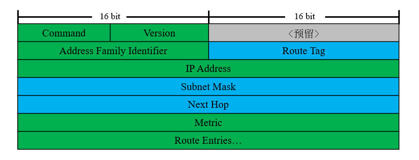

# 概述
路由信息协议(Routing Information Protocol, RIP)是IGP中最早得到广泛应用的路由协议。

RIP协议基于贝尔曼-福特(Bellman-Ford)算法实现，这种算法属于距离矢量算法，它在带宽、性能和管理方面的要求较低；与此同时，RIP协议直接传递路由信息，收敛速度较慢、可靠性较低，因此主要适用于规模较小的网络或实验室。

RIP目前拥有两个版本，它们支持的特性如下表所示：

<div align="center">

|   特性   | RIPv1 |      RIPv2      |
| :------: | :---: | :-------------: |
|   VLSM   |   ×   |        √        |
|   CIDR   |   ×   | 仅支持路由汇总  |
| 更新方式 | 广播  | 组播(224.0.0.9) |
| 自动汇总 | 强制  |      可选       |
| 手工汇总 |   ×   |        √        |
| 路由标记 |   ×   |        √        |
| 报文认证 |   ×   |        √        |

</div>

# 报文结构
RIP协议的报文封装在UDP协议中，使用520端口进行通信。

每条RIP消息包含两个部分，分别为Header和Route Entries。Header部分包含控制信息；Route Entries部分最多携带25个路由条目。

<div align="center">



</div>

- 绿色表示该字段在RIPv1与RIPv2中含义相同。
- 蓝色表示该字段在RIPv2中为新增字段。
- 灰色表示该字段目前暂未使用。

🔷 Command

报文类型，长度2字节。

请求报文取值为"1"，更新报文取值为"2"。

🔷 Version

协议版本，长度2字节。

取值为协议的版本号。

🔷 Address Family Identifier

被路由协议类型标识，长度4字节。

IPv4中取值为"2"；当请求所有路由信息时，该字段取值为"0"。

🔷 Route Tag

路由标记，长度2字节。

用于标记重发布到RIPv2管理域中的路由条目。

🔷 IP Address

路由信息的目的地址。

🔷 Subnet Mask

路由信息的子网掩码。

🔷 Next Hop

更优的下一跳地址。

当路由器发现某条路由的下一跳地址与自身在同一广播域内时，就会使用该字段将更优下一跳告知其它邻居。

🔷 Metric

跳步计数，长度4字节。

到达目的网络的跳步计数，路由器收到路由信息后，会将跳数+1后再发送给其他邻居。

# 报文类型
## 请求(Request)
仅在RIP进程刚启动时发送，用于向本路由器周围运行RIP协议的节点请求路由条目。

## 更新(Update)
用于更新路由信息，一个更新报文最多包含25条路由，超过此数量时则分为多个报文发送，启用认证功能后最大数量变更为24条。

# 计时器
## 更新计时器(Updata Timer)
默认每隔30秒从所有被宣告的接口发送更新报文。

## 失效计时器(Invalidation Timer)
一条新的路由条目建立后，失效计时器初始化为180秒，当这条路由再次被更新时，失效计时器又将被重置为180秒。

若路由条目在180秒内一直没有被更新，那么这条路由的跳数将被标记为16跳，这意味着该路由在本地不可达。

## 抑制计时器(Holddown Timer)
对于本地已有的路由条目，如果再次接收到该条目，并且度量值凭空增大，则路由器不会立即更新路由表，而是将条目标记为不可达并开启抑制计时器，时长默认为180秒。

如果在180秒期间一直收到具有该度量值的路由信息，那么当计时器超时后，才会在路由表中更新该条目；否则，将无视该路由更新。

## 刷新计时器(Flush Timer)
这个计时器设置的时间一般比失效计时器再长60秒。若某路由条目的刷新计时器也超时了，路由器将对外通告该路由不可到达，并且在本地删除该条目。

# 度量值
RIP协议使用跃点数(Hop)作为度量值，本地路由条目默认为"0"，路由器将度量值+1后向外通告，其他节点再+1后向更远的节点通告。RIP的最大有效跳数为15，如果达到16跳则表示网络已经不可达。

因为跳数仅表示到达目的网段需要经过的节点数量，对链路的带宽、时延等因素并无考虑，可能导致数据包被发到跳数较小但带宽窄、时延大的链路上，度量能力较其他协议有所不足。

# 防环机制
## 最大跳数限制
由于距离矢量协议的特性，错误的路由条目将被无条件信任。

RIP协议定义了最大有效度量值16，错误的路由信息传递一定跳数后将失效，接收方不会使用这种路由条目转发数据；当发送方的失效计时器到期后，也会删除这些条目，从而阻断环路。

## 水平分割(Splithorizon)
从一个接口学习到的路由条目，不会再从该接口发送回去，该特性默认为开启状态。

Cisco设备提供了命令控制该特性的开关：

```text
# 开启或关闭水平分割
Cisco(config-if)# {no} ip split-horizon
```

## 毒性逆转(Poison Reverse)
当某个节点发现自己的直连网络失效时，邻居的路由表尚未刷新，该节点将会向邻居发送指向直连网段的更新报文，并且路由度量值为16，通知邻居该网段不可达。

## 路由毒化(Route Posion)
当节点检测到某路由条目失效后，会将其跳数设置为16并向邻居传播。

## 触发更新(Trigger Update)
当节点检测到直连链路状态变化，立即发送更新报文而不必等待更新计时器超时。

# 异步更新
路由收敛完成后，管理域内路由器发送更新报文的时间将趋于一致，这会导致网络间歇性的拥塞，影响用户体验。

RIP使用弹性计时器控制更新报文间隔，该计时器可选取 `[-4.75, 4.75]` 范围内的随机值，使得更新报文间隔不一定都是30秒。

# 默认路由
🔷 方法一

在RIP区域的边界路由器上配置默认路由，然后宣告默认路由进入RIP进程。

```text
# 设置默认路由
Cisco(config)# ip route 0.0.0.0 0.0.0.0 <出站地址 | 出站接口>

# 将默认路由宣告至RIP进程中
Cisco(config-router)# router rip
Cisco(config-router)# network 0.0.0.0
```

🔷 方法二

在RIP区域的边界路由器上配置默认路由，并重分发到RIP进程中。

```text
# 设置默认路由
Cisco(config)# ip route 0.0.0.0 0.0.0.0 <出站地址 | 出站接口>

# 将默认路由重分发至RIP协议
Cisco(config-router)# router rip
Cisco(config-router)# redistribute static metric <度量值>
```

🔷 方法三

在RIP区域的边界路由器上，将其设置为“RIP网络起源”，它会下发默认路由到RIP域中。

```text
Cisco(config-router)# router rip
Cisco(config-router)# default-information originate
```

# 路由汇总
## 自动汇总
当自动汇总功能启用时，RIP路由器可以对本地路由和邻居宣告的路由信息进行汇总。自动汇总功能默认开启，并且在RIPv1中无法关闭。

我们可以使用以下命令控制自动汇总功能的开启与关闭：

```text
# 进入RIP配置菜单
Cisco(config)# router rip

# 开启/关闭自动汇总
Cisco(config-router)# {no} auto-summary
```

自动汇总的优先级高于手动汇总，在不连续子网环境中会造成路由黑洞，因此建议关闭该特性。

## 手动汇总
RIP协议不完全支持CIDR，因此只能汇总到主类网络边界，无法进一步汇总。

```text
# 在接口配置菜单中进行手工汇总
Cisco(config-if)# ip summary-address rip <汇总网络ID> <汇总子网掩码>
```

如果多条明细路由的度量值不同，则将取最小的一条作为汇总路由的度量值。当所有明细路由均不可达时，汇总路由才会消失。

虽然RIP自身不能随意汇总，但可以传递CIDR路由。因此我们可以使用静态路由发布汇总后的条目，然后重分发到RIP进程中。

# 偏移列表
偏移列表(Offset List)可以调用ACL匹配某些路由，增加其度量值，然后再将该路由通告给邻居。

路由信息的发送方向和接收方向均可使用偏移列表，可以通过以下命令进行配置：

```text
# 进入RIP配置菜单
Cisco(config)# router rip

# 配置偏移列表
Cisco(config-router)# offset-list <ACL序号> <in | out> <度量值增量> <接口ID>
```

# 被动接口
被动接口只能发送单播更新报文，不能通过组播或广播方式发送更新报文，因此我们需要手动指定邻居。

```text
# 设置被动接口
Cisco(config-router)# passive-interface <端口ID>

# 手动指定邻居
Cisco(config-router)# neighbor <邻居IP地址>
```

被动接口仍然可以接收组播和广播更新报文。

# 触发更新
启用该特性后，两端设备不再发送周期性的更新报文，仅当检测到路由表发生变化时才会发送更新报文。

该特性仅可用于点到点链路，且链路两端的接口都需要开启。

```text
# 在指定接口上开启触发更新
Cisco(config-if)# ip rip triggered
```

我们通常在广域网链路上启用该特性，可以节约链路带宽。

# 认证机制
## 简介
RIPv2支持对协议报文进行认证，防止非授权的节点加入网络或配置错误。认证方式有明文认证和MD5认证两种。

当配置认证功能后，设备会对报文中的第一条Route Entries进行修改，具体修改如下：

1. Address Family Identity字段改为0xFFFF。
2. Route Tag字段改为Authentication Type字段。
3. IP Address、Subnet Mask、Next Hop和Metric改为口令字段。

## 配置步骤

```text
# 创建钥匙链
Cisco(config)# key chain <钥匙链名称>
Cisco(config-keychain)# key <密钥序号>
Cisco(config-keychain-key)# key-string <密码字符串>


# 选择认证类型
Cisco(config-if)# ip rip authentication mode <text | md5>


# 应用钥匙链
Cisco(config-if)# ip rip authentication key-chain <钥匙链名称>
```

钥匙链名称仅本地有效，但密钥序号需要在设备两端保持一致。

# 更新源检测
路由器收到更新报文时，先检查源地址和传入接口地址是否处于同一子网，若不匹配则丢弃该报文。

此规则默认启用，仅在特殊的实验环境中需要关闭。

```text
# 打开或关闭更新源检测
Cisco(config-router)# {no} validate-update-source
```

# 兼容性调整
为了兼容早期设备，Cisco设备提供了一系列参数可供调整。

```text
# 调整接口发送/接收报文的版本
Cisco(config-if)# ip rip <receive | send> version <1 | 2>

# 使用广播方式发送RIPv2报文
Cisco(config-if)# {no} ip rip v2-broadcast

# 修改多个报文的发送时延
# RIP协议可以修改多个报文的发送间隔，防止性能较差的设备接收缓冲区溢出。
Cisco(config-router)# output-delay <毫秒>
```


<!-- TODO

 创建RIP进程
Cisco(config)#router rip
RIP协议不支持多进程，每台设备只能创建一个RIP进程。
 向RIP中宣告网段
Cisco(config-router)#network [主类网络ID]
 参数调整
 切换RIP协议版本
Cisco(config-router)#version [1|2]


 更改计时器数值
Cisco(config-router)# timers basic <Update> <Invalid> <Holddown> <Flush>

-->