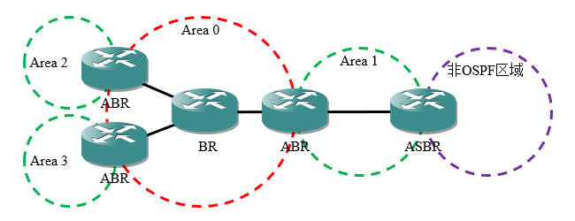

# 概述
开放最短路径优先(Open Shortest Path First, OSPF)协议，是由Internet工程任务组开发的IGP路由协议，也是一个公开的标准。

OSPF路由器通过接收链路状态通告(LSA)构建链路状态数据库(LSDB)，然后依照LSDB使用Dijkstra算法（SPF算法）计算到每个网段的最短路径，并将结果输出到路由表中。

OSPF具有以下特点：

- 完全支持VLSM和CIDR，能够充分利用地址资源，支持规模较大的网络。
- 路由器根据邻居传递的链路状态信息自行计算路由，从算法层面保证了区域内部不会生成环路，可靠性较高。
- 链路状态信息只在区域内传递，区域间直接传递路由信息，合理利用硬件资源，平衡性能消耗与可靠性。
- 以较低的频率发送定期更新，占用带宽资源较少；并且节点发现链路状态变化时立即进行触发更新，收敛速度快。
- 采用"Cost"作为度量值，受链路带宽影响，选路结果较RIP的跳数更优。

# 术语
## OSPF进程
一台路由器可以同时启用多个独立的OSPF协议进程，我们使用进程ID区分不同的进程，取值范围： `[0, 65535]` 。进程ID只具有本地意义，可以与对端设备不同。

## 路由器ID
OSPF域内的每个节点都需要一个唯一的标识符(Router ID)，以此作为身份识别的依据。

该标识符长度为32位，即可以用数字表示，也可以用点分十进制表示。路由器ID只用于标识设备，即使是设备上不存在的IP地址，也可以配置为标识符。

路由器标识符可以手动配置或自动选举，如果没有手动配置，将遵循以下原则：

1. 如果设备有环回接口，则选择最大的环回接口IP地址。
2. 如果设备无环回接口，则选择OSPF进程中最大的接口IP地址。

为了保证网络的稳定性，推荐手动配置路由器ID为设备环回接口的IP地址。

## 邻居关系
两台路由器通过三层链路直连时，互为邻居路由器。

## 邻接关系
两台路由器通过三层链路直连，并通过报文交互达到Full状态，互为邻接路由器。

## 链路状态数据库(LSDB)
链路状态数据库(Link State DataBase, LSDB)存储拓扑信息，是路由计算的依据。

## 链路状态通告(LSA)
链路状态通告(Link State Advertisement, LSA)是链接状态协议向外传递邻居信息的报文，其它路由器接收LSA后存入LSDB中并计算路由信息。

## 骨干路由器(BR)
骨干区域（区域0，也称为传输区域）用于连接其它区域，其中的节点称为骨干路由器(Backbone Router,BR)。

OSPF要求所有其他区域都与骨干区域相连，可以是物理直连，也可以通过虚电路进行连接。

## 区域边界路由器(ABR)
连接骨干区域和其它区域的节点称为区域边界路由器(Area Border Router, ABR)。

## 自治系统边界路由器(ASBR)
连接OSPF域与外部路由选择域的节点称为自治系统边界路由器(AS Boundary Router, ASBR)，这些节点除了OSPF协议可能还运行了其它路由协议。

OSPF的常见区域设计如下图所示：

<div align="center">



</div>

# 报文结构
OSPF报文封装在IP协议中，IP协议号为89，一共有五种不同的类型，但它们都拥有相同的报文头部。

<div align="center">


</div>

🔷 Version

协议版本，长度1字节。

在IPv4中使用的OSPF协议版本号为"2"。

🔷 Type

报文类型，长度1字节。

共有五种报文。

🔷 Packet Length

报文总长度，长度2字节。

包括报文头部，计数单位为字节。

🔷 Router ID

路由器ID，长度4字节。

🔷 Area ID

发送报文的接口所属区域的ID，长度4字节。

🔷 Checksum

报文校验和，长度2字节。

🔷 Auth Type

认证类型，长度2字节。

🔷 Auth Data

认证数据，长度8字节。

# 报文类型
## Hello
Hello报文用于建立与维护邻接关系，发送到组播地址 `224.0.0.5` ，TTL值为"1"。

<div align="center">


</div>

🔷 Network Mask

发送报文接口所在网络的掩码，长度4字节。

🔷 Hello Interval

发送Hello报文的时间间隔，长度2字节。

🔷 Options

选项，长度1字节，每个子项占1比特。

各选项的含义如下表所示：

<div align="center">

| 二进制位 | 标记  |        含义         |
| :------: | :---: | :-----------------: |
|    8     |  DN   |       Down位        |
|    7     |   O   |       O-bit位       |
|    6     |  DC   |    处理按需链路     |
|    5     |   L   |      LLS数据块      |
|    4     |   N   |     处理七类LSA     |
|    3     |  MC   |   转发IP组播报文    |
|    2     |   E   | 允许泛洪区域外部LSA |
|    1     |  MT   |     多拓扑路由      |

</div>

🔷 Router Priority

路由器优先级，长度1字节。

在点对多点的网络环境中，与DR、BDR的选举有关。

🔷 Dead Interval

邻接关系失效时间，长度4字节。

如果此时间内一直未收到邻居的Hello报文，则认为邻居失效。

🔷 Designated Router

指定路由器(DR)的IP地址，如果为 `0.0.0.0` ，表示未选举DR。

🔷 Backup Designated Router

备份指定路由器(BDR)的IP地址，如果为 `0.0.0.0` ，表示未选举DR。

🔷 Active Neighbor

活跃的邻居路由器，长度可变，每个路由器以Router ID标识。

## Database Description(DBD)
路由器建立邻居关系建立后，开始交互LSDB的摘要信息，而不是完整的LSDB信息，减少带宽资源的占用。

<div align="center">


</div>

🔷 Interface MTU

接口的MTU数值，长度2字节。

值为"0"时，表示不检测此参数。

🔷 Options

选项，长度1字节。

每个子项占1位，含义同Hello报文。

🔷 Control

控制信息，长度1字节。

目前仅低三位有效，它们的含义分别为：

<div align="center">

| 二进制位 | 标记  |                  含义                  |
| :------: | :---: | :------------------------------------: |
|    3     |   I   |  Init位，如果是第一个DBD报文则置位。   |
|    2     |   M   |  More位，如果还有更多后续报文则置位。  |
|    1     |  M/S  | 主从标记，Master方发送报文时将其置位。 |

</div>

🔷 DBD Sequence Number

报文序列号，长度4字节。

主从双方利用该字段保证DBD报文传输的可靠性和完整性。

🔷 LSA Headers

LSA头部（摘要信息），长度可变。

## Link-State Request(LSR)
路由器同步LSDB摘要后，已经获悉自身缺少或失效的LSA，此时需要发送LSR报文向对方请求这些LSA的详细信息，一条LSR报文可以包含多个请求。

<div align="center">


</div>

🔷 LS Type

LSA类型，长度4字节。

🔷 Link State ID

链路状态标识，用于唯一表示某条链路，取值根据LSA类型而定。

<div align="center">

| LSA类型 |       取值       |
| :-----: | :--------------: |
| Type 1  | 邻居的Router ID  |
| Type 2  |  DR接口的IP地址  |
| Type 3  |  IP网络/子网号   |
| Type 4  | 邻居的Router ID  |
| Type 5  | 目标网络的网络ID |
| Type 7  |     0.0.0.0      |

</div>

🔷 Advertising Router

通告本LSA的路由器ID。

## Link-State Update(LSU)
LSU报文用来回应其它节点的请求或者将本地最新的LSA泛洪，在MA网络中泛洪时使用组播方式发送，可以包含多条LSA的详细信息。

为了确保可靠传输，接收方需要发送LSAck报文进行确认，若未收到某个邻居的确认信息，相关LSA信息将会以单播方式进行重传。

<div align="center">


</div>

🔷 Number of LSAs
报文中包含的LSA数量。

🔷 LSA
链路状态通告。

## Link-State Acknowledgment(LSAck)
用于确认本节点收到了LSA，可以同时包含多个LSA头部。

<div align="center">


</div>

🔷 LSA Headers

LSA的摘要信息。

# 计时器
## Hello计时器
默认情况下在以太网和点到点链路上为10秒；4倍Hello时间内未收到Hello报文则判定邻居关系失效。

以下命令可以调整指定接口的Hello时间与失效时间：

```text
# 配置Hello报文发送间隔
Cisco(config-if)# ip ospf hello-interval <间隔/秒>

# 修改邻居关系Dead时间
Cisco(config-if)# ip ospf dead-interval <时间/秒>
```

## LSA更新计时器(LSA Updata Timer)
一条LSA每隔30分钟被泛洪到区域内，其序列号增加1。

## LSA老化计时器(LSA Aging Timer)
一条LSA的有效期为60分钟，如果60分钟内没有被更新，则判定条目失效。

# 度量值
OSPF中使用“路径开销(Cost)”作为度量值，路由器收到拓扑信息报文后，读取其中的度量值，再加上接收端口的度量值，两者之和即为到达该网段的路径开销。

接口度量值的计算方法为：

$$
接口度量值=\frac{参考带宽(Mbps)}{接口带宽(Mbps)}
$$

默认的参考带宽为100Mbps，算术结果向下取整（若结果小于0，则取值为1），就是接口的度量值。普通串行接口的默认带宽是1.544Mbps， $Cost=100/1.544≈64$ ；快速以太网接口的默认带宽是100Mbps， $Cost=100/100=1$ ，环回接口默认度量值为1。

随着以太网技术的发展，默认的参考带宽显得过小，无法区分100Mbps以上的接口，我们可以更改OSPF域内所有路由器的参考带宽，使得其适应更高速的网络环境。

```text
# 更改参考带宽
Cisco(config-router)# auto-cost reference-bandwidth <参考带宽(Mbps)>
```

有时为了人工控制选路，我们也可以在LSA传入接口上设置需要增加的度量值。

```text
# 增加接口度量值
Cisco(config-if)# ip ospf cost <度量值增量>
```

# 邻接关系状态机
🔷 Down

刚把接口宣告进OSPF进程，还未收到任何OSPF报文时，该接口即为Down状态。

🔷 Init

接口发送过Hello报文后进入Init状态。

🔷 Attempt

类似于Init状态，仅存在于NBMA网络中。

由于NBMA网络中需要手动指定邻居，如果邻居地址配置错误或Hello报文被邻居阻挡，则会一直卡在Attempt状态。

🔷 Two-Way

处于Init状态的接口收到了包含自己Router ID的Hello包后进入Two-Way状态。

🔷 Exstart

互相发送不携带LSA报头的DBD报文，根据Router-ID选举主从关系。

🔷 Exchange

主路由器发起DBD报文交互，其中包含LSA报头。

🔷 Loading

交互LSR、LSU、LSAck报文并同步LSDB。

🔷 Full

LSDB同步完毕。

# 工作流程
## 建立邻接关系
### 邻居建立过程
🔶 点对点(P2P)网络

无需选举DR/BDR，报文交互完成后直接到达Full状态，PPP、HDLC链路是这种类型。

🔶 广播多路访问(BMA)网络

需要选举DR/BDR，其它路由器只与DR和BDR建立邻接关系，这些路由器之间保持Two-Way状态，以太网链路是这种类型。

<div align="center">


</div>

🔶 非广播多路访问(NBMA)网络

这种网络不支持广播和组播功能，因此需要使用单播方式建立邻居，建立邻接关系的过程同BMA网络，帧中继、ATM经常配置为这种类型。

帧中继和ATM被配置为NBMA网络是根据需要人为定义的，也可以定义为“点到多点”或“点到多点非广播”类型。

### DR/BDR的作用
在多路访问网络中，路由器之间需要交互路由信息，若网络中有 $n$ 台路由器，共需建立 $n(n-1)/2$ 个邻接关系，这使得相同的报文重复传递多次，浪费带宽资源。

OSPF协议定义了指定路由器(Designated Router, DR)，网段内所有路由器与DR建立邻接关系，当某个路由器检测到网络变化时，将会通知DR，再由DR将该消息通告出去，这种机制减少了协议报文的泛洪。

备份指定路由器(Backup Designated Router, BDR)是DR的备份，在选举DR的过程中也会被确定。BDR也和网段内的其它路由器建立邻接关系并交换路由信息，当DR失效后，BDR会立即取而代之，这个过程非常短暂，实现了路由的快速收敛与高可用性。

其它路由器发送给DR/BDR的报文目的地址是： `224.0.0.6` 。

### DR/BDR的选举过程
当路由器进入Two-Way状态时进行选举：

1. 首先比较Hello报文中的优先级字段，优先级最高的路由器将成为DR，次高的成为BDR。
2. 如果优先级相同，则比较Router ID，数值最大的成为DR，略小的成为BDR。

优先级默认为"1"，取值范围为： `[0, 255]` ，如果将优先级设为"0"，则该路由器不参与选举。选举过程将会持续40秒，结束后DR/BDR不可被抢占，邻接关系建立过程到此为止。

### 邻接关系建立的要素
两台设备之间建立OSPF邻接关系需要满足以下要素：

- Router ID必须不同
- Hello和Dead时间相同
- 区域ID和类型相同
- 网络类型设置相同
- 选项字段相同
- 接口MTU值相同
- 认证信息相互匹配

## 同步LSDB
邻接关系建立完成之后，各节点进入Exstart状态，准备交互各自的LSA摘要，将自身的LSDB与其它节点进行差异比对。

首先节点之间需要协商Master和Slave身份，开始时所有节点均假设自己是Master，发送不带LSA摘要的DBD报文，Router ID最大的节点成为Master，其他节点则成为Slave。

当身份选举结束后，路由器就进入到Exchange状态，进行差异对比。首先Slave向Master发送包含自身LSA摘要的DBD报文，其中携带Master的序列号；Master收到后会向Slave发送包含自身LSA摘要的DBD报文，且序列号增加1，不断如此往复，直到双方数据库差异比对完成，最后接收到LSA摘要的一方会发送空的DBD报文进行确认。

<div align="center">


</div>

LSA摘要信息同步完成后，若节点没有需要交换的信息，则直接进入Full状态。若还需要交换信息，则发出更新请求，并进入Loading状态，邻居收到请求后回复完整的LSA，请求节点回送Ack报文进行确认，同步完成后也会进入Full状态。

<div align="center">


</div>

## 路由计算过程
Dijkstar算法，也称为SPF算法、最小生成树算法，其思想是以起始点为中心，向外层层扩展，直到终点为止。Dijkstra算法能得出最短路径的最优解，但由于需要遍历每个节点，节点越多，效率越低。

Dijkstar算法的运作流程为：

1. 保证区域内所有路由器拥有相同的链路状态数据库。
2. 每个路由器以自己为根寻找去往其它节点的路径。
3. 根据不同路径分段计算链路开销值。
4. 将最优路由条目加入到路由表中。

# OSPF网络类型
## 简介
OSPF协议为了适应不同的数据链路层环境，定义了一些逻辑网络类型，不同类型的网络有各自的特点。

<div align="center">

|        类型         | Hello时间 | DR/BDR | 组播  |
| :-----------------: | :-------: | :----: | :---: |
|      Broadcast      |    10s    |   √    |   √   |
|        NBMA         |    30s    |   √    |   ×   |
|   Point-To-Point    |    10s    |   ×    |   √   |
| Point-To-Multipoint |    30s    |   ×    |   √   |
|      Loopback       |     -     |   ×    |   ×   |

</div>

逻辑网络类型与物理介质类型无关，某些物理介质可以被配置为不同的逻辑网络，我们可以根据实际需要进行修改。

## 逻辑网络类型
🔷 Broadcast

以太网接口默认是此类型，需要选举DR/BDR，支持通过组播方式自动发现邻居，默认Hello时间10秒，Dead时间40秒。

🔷 NBMA

帧中继的物理接口、ATM、DSVPN默认是此类型，需要选举DR/BDR，不支持组播，需要手动指定邻居，默认Hello时间30秒，Dead时间120秒。

🔷 Point-To-Point

串行链路、ISDN BRI、帧中继的点到多点子接口默认是此类型，不需要选举DR/BDR，支持通过组播方式自动发现邻居，默认Hello时间10秒，Dead时间40秒。

🔷 Point-To-Multipoint

无物理网络与其对应，不需要选举DR/BDR，可以支持组播，会发送一条本地直连接口的主机路由给邻居，默认Hello时间30秒，Dead时间120秒。

🔷 Loopback

环回接口默认是此类型，并且不能将其它接口指定为此类型。默认将会以32位主机路由形式通告，无视接口设置的掩码。

## 优化方法
在只有两台设备直连的以太网链路上，无需选举DR/BDR，因此我们可以将链路两端接口的逻辑网络类型设为Point-To-Point，以此加快路由收敛速度。


# 链路状态通告
## 简介
链路状态通告(Link-State Advertisement, LSA)消息，用于描述路由选择域内各实体的属性信息，路由器通过LSA来维护LSDB。

## LSA报文头部
所有的LSA拥有相同的报文头部，描述了一些公共信息。

<div align="center">


</div>

🔷 LS Age

LSA生成后经过的时间，以秒为单位。

🔷 Options

选项，长度1字节，每个子项占1位，含义同Hello报文。

🔷 LS Type

LSA类型。

<div align="center">

| 类型  |          名称           |           注释            |
| :---: | :---------------------: | :-----------------------: |
|   1   |       Router LSA        |         路由器LSA         |
|   2   |       Network LSA       |          网络LSA          |
|   3   |   Summary Network LSA   |        汇总网络LSA        |
|   4   |     Summary ASB LSA     |       汇总AS外部LSA       |
|   5   |      External LSA       |         AS外部LSA         |
|   6   |  Group membership LSA   | 组成员LSA(Multicast OSPF) |
|   7   |    NSSA External LSA    |        NSSA外部LSA        |
|   8   | External Attributes LSA |        BGP外部LSA         |
|   9   |       Opaque LSA        |  本地链路不透明LSA(MPLS)  |
|  10   |       Opaque LSA        |  本地区域不透明LSA(MPLS)  |
|  11   |       Opaque LSA        |   AS内部不透明LSA(MPLS)   |

</div>

🔷 Link State ID

链路状态ID，与LS Type共同唯一标识LSA，取值根据LSA类型而定，同LSR报文。

🔷 Advertising Router

通告本LSA的路由器ID。

🔷 LS Sequence Number

LSA的序列号，网络上的节点根据该值判断LSA新旧程度。

🔷 LS Checksum

除了LS Age外其它各个域的校验和。

🔷 Length

LSA的总长度，包括LSA报文头部，以字节为单位。

<br />

我们

 查看LSDB中的LSA

Cisco#show ip ospf database {Type} {self-originate}

Type：筛选该参数指定类型的LSA。
self-originate：筛选节点自身产生的LSA。

## LSA序列号
LSA中的序列号用于区分消息的新旧。OSPF将顺序序列号与循环序列号相结合，形似棒棒糖，其范围从0x80000001到0x7FFFFFFF，这是一个带符号整型值，最高位为1表示负数，为0则表示正数。
第一个LSA的序列号是0x80000001，由于使用补码表示，其对应最大的负数，然后一直累加到0，再从0到0x7FFFFFFF。如果到达最大值，节点会通告一个老化时间标记为60分钟的LSA，邻居收到后会把对应的LSA删除，然后序列号重新从0x80000001开始。

## LSA处理流程
节点收到LSA后根据序列号的大小来判断其新旧，如果本地不存在该LSA，则保存LSA、发送确认报文、泛洪给其它邻居并进行路由计算。若本地存在收到LSA的副本，且该LSA与本地副本拥有相同的序列号，则忽略该LSA；若本地副本具有更大的序列号，则说明LSA发送者持有的LSA较旧，本地节点会返还最新的LSA给发送者。
 
<div align="center">


</div>

## 常见的LSA类型
### Router LSA(Type 1)
路由器LSA用于向区域内的其它节点通告自身链路信息。


 链路状态ID
通告者的Router ID。
 通告者
区域内的所有节点。
 传递范围
只能在其产生的区域内泛洪，无法穿越ABR。
 内容
描述该节点在当前区域的连接信息。
Point-to-Point信息描述自身与邻居的关系，包括邻居路由器ID、自身到达邻居的出站接口地址、链路开销；Stub Network信息描述自身连接的P2P网段或环回接口信息，包括前缀、掩码、度量值和SPF计算优先级；Transit Network信息描述自身连接的MA网段信息，包括DR的IP地址、自身到达DR的出站接口地址和链路开销。
Stub Network包含路由信息，另外两种包含拓扑信息。
 特点
每个点到点接口将会生成两条链路状态信息，一条为Point-to-Point信息，另一条为Stub Network信息。每个多路访问接口将会生成一条Transit Network信息，其中不包含前缀和掩码。

### Network LSA(Type 2)
网络LSA用于宣告MA网段的前缀和掩码等信息，辅助路由器LSA传递拓扑信息。
 链路状态ID
DR的接口地址。
 通告者
MA网段中的DR。
 传递范围
只能在其产生的区域内泛洪，无法穿越ABR。
 内容
描述MA网段的前缀、掩码和其中的所有成员路由器ID。

### Summary Network LSA(Type 3)
汇总网络LSA用于向其它区域的节点传递本区域的路由信息。
 链路状态ID
其它区域路由信息的网络前缀。
 通告者
区域边界路由器(ABR)。
 传递范围
由骨干路由器通告给除始发区域外的其它OSPF区域。
 内容
每条三类LSA仅包含一条路由信息，包括本区域内网段的前缀、掩码、通告者到目的网段的开销和路由计算优先级信息。
 特点
三类LSA在其它区域路由表中标记为"O IA"。其它区域计算到达这些目的网段的路由时采用距离矢量算法，不需要进行SPF计算。
三类LSA在OSPF域内传递时，为了确保可达性，每跨越一个ABR，其ADV Router字段都会自动改写为该ABR的Router ID并继续传递。

### Summary ASB LSA(Type 4)
汇总自治系统外部LSA用于向其它区域通告ASBR的位置，辅助五类LSA传递域外路由信息。 
 链路状态ID
ASBR的路由器ID。
 通告者
与ASBR在同一个区域的ABR。
 传递范围
四类LSA将在整个OSPF域内传递（不包括特殊区域且不需要骨干区域中转）。
 内容
描述ASBR的位置，包含ASBR的路由器ID，是一种拓扑信息。
 特点
同三类LSA，每穿过一个ABR时ADV Router将会改变。

### External LSA(Type 5)
自治系统外部LSA用于将OSPF域外的路由信息重分发进OSPF域内。
 链路状态ID
外部路由信息的网络前缀。
 通告者
自治系统边界路由器(ASBR)。
 传递范围
五类LSA将在整个OSPF域内传递（不包括特殊区域且不需要骨干区域中转）。
 内容
每条五类LSA包含一条域外路由信息，包括前缀、掩码、度量值类型、度量值、转发地址、路由标记和路由计算优先级。转发地址和路由标记默认为0，可用于控制选路。
 特性
五类LSA在路由表中标记为"O E1"或"O E2"，其在OSPF域内传递时，ADV Router字段不会发生改变。
默认度量值类型为E2，此时该路由在域内所有设备上的度量值相同，更改为E1后度量值将会随着传递累加计算。存在相同的路由条目时，E1可信度高于E2。

### NSSA External LSA(Type 7)
NSSA外部LSA使AS外部的路由信息在NSSA区域内传递。
 链路状态ID
外部路由信息的网络前缀。
 通告者
NSSA区域中的ASBR。
 传递范围
七类LSA只在其始发的NSSA区域内传递。
 内容
每条七类LSA包含一条域外路由信息，包括前缀、掩码、度量值类型、度量值、转发地址和路由标记。
 特性
七类LSA在路由表中标记为"O N1"或"O N2"，在NSSA的ABR上配置转换功能后，七类LSA会被翻译成五类LSA传播到其它区域。

# 区域类型
## 简介
OSPF采用了区域的概念，区域内部维护拓扑信息，区域间维护路由信息。每个区域使用一个区域号来标识，取值范围为 `[0, 4294967295]` ，即可以使用点分十进制表示，也可以使用十进制表示。

划分区域的优点：

- 支持区域级路由汇总，减少路由条目数量。
- 减小一类、二类LSA的泛洪范围。
- 将拓扑变化限制在所属区域内，降低对其它节点的影响。

OSPF区域的设计原则：

- 区域"0"为骨干区域，也称为传输区域，其他区域都要与区域"0"直连。
- 一台路由器最多只关联3个区域。
- 一个区域内最多只部署50台路由器。
- 如果部署单区域OSPF，骨干区域可以不使用区域号"0"。

## 末节区域
末节区域(Stub Area)不再连接其它路由选择域，跨区域通信必须经过区域边界路由器，因此其中的节点没有必要了解外部的明细路由，只需要路由到边界路由器即可。

末节区域的ABR将会过滤四类和五类LSA，并向区域内分发一条指向自身的默认路由，其链路开销默认为1，标记为"O*IA"，区域中的报文Option字段E位将置0。

若一个区域满足以下条件，则可以设为末节区域：
 骨干区域不能设置为末节区域
 不能再连接其它路由选择域（不能存在ASBR）
 不能有虚链路穿过该区域

 部署方法
需要在区域内所有路由器上配置区域类型为末节区域。

Cisco(config-router)#area <区域ID> stub

 选路优化
当区域中有多个ABR时，可以更改ABR分发默认路由的度量值，防止产生次优路径。

Cisco(config-router)#area <区域ID> default-cost [度量值]

## 完全末节区域
完全末节区域(Totally Stub Area)可以进一步精简LSA，ABR不仅会过滤四类和五类LSA，还会阻止外部的三类LSA进入。
 部署方法
完全末节区域以末节区域为基础，只需要在ABR上设置，区域内的其它路由器部署为普通末节区域即可。
Cisco(config-router)#area [区域ID] stub no-summary

## 次末节区域
次末节区域(Not-So-Stubby Area)正如其名称——不那么末节的区域，其中不存在四类或五类LSA，但ASBR可以产生七类LSA，以此连接其它路由选择域。
NSSA区域的ABR会将其它区域传入的四类和五类LSA过滤掉，但不会分发默认路由；ASBR把外部路由信息以七类LSA的方式分发到本区域中。
NSSA区域的ABR可以将七类LSA转换成五类LSA发送到其它区域，使其它区域能够访问ASBR连接的外部网络，此时该ABR对于其它区域来说是ASBR，NSSA区域外的节点无法感知NSSA ASBR的存在。
 部署方法
1.在区域内所有路由器上配置区域类型为NSSA。
Cisco(config-router)#area [区域ID] nssa
2.在ABR上向区域内分发默认路由。
Cisco(config-router)#area [区域ID] nssa default-information-originate {no-redistribution}
该默认路由在NSSA区域内被标记为"O*N1"或"O*N2"，当ABR上引入外部路由时，由于NSSA内部其它节点拥有到ABR的默认路由，可以使用no-redistribution参数使ABR不向NSSA内部传递重分发的路由条目。
3.在ABR上配置LSA翻译，并抑制Forward Address隐藏ASBR身份。
Cisco(config-router)#area [区域ID] nssa translate type7 suppress-fa

## 完全次末节区域
完全次末节区域(Totally Not-So-Stubby Area)的ABR会过滤三类/四类和五类LSA，并且会自动分发默认路由。
 部署方法
完全次末节区域以次末节区域为基础，只需要在ABR上设置，区域内的其它路由器部署为普通次末节区域即可。
Cisco(config-router)#area [区域ID] nssa no-summary

## 不规则区域
如果某个区域因为各种原因无法与骨干区域直连，或者主干区域被截断，就会产生不规则区域，我们可以使用以下方法进行处理。

- 在不规则区域的ABR上启用双OSPF进程，并且进行单点双向重分发。
- 在不规则区域的ABR与最近的区域"0"之间创建GRE隧道，并将两个虚拟接口宣告进OSPF进程，然后使用静态路由使隧道源地址与目的地址可达。
- 使用Virtual-Link连接两个区域。

# 虚链路
虚链路(Virtual-Link)可以穿越非骨干常规区域形成一条逻辑链路，将不规则区域与骨干区域相连，从而实现LSA的正常传递。

虚链路默认属于区域"0"，只是一种临时措施，用于解决不合理的OSPF区域设计，不建议长期使用。

<div align="center">


</div>

虚链路一般在同一区域内的两台ABR上进行部署，只能穿越常规区域，不能穿过骨干区域与特殊区域。

建立虚链路后，被穿越区域的ABR将会产生一类LSA，包含类型为Virtual Link的链路状态信息，LS-ID为虚链路对端的路由器ID，LS-Data为本地接口地址，对端收到这些LSA后会将其标记为永不超时。

配置虚链路的命令格式如下：

```text
# 在需要穿越区域两端的ABR上配置虚链路
Cisco(config-router)# area <被穿越的区域ID> virtual-link <对端Router ID>

# 查看虚链路状态
Cisco# show ip ospf virtual-links
```

在前文图片的场景中，各路由器ID为其序号。区域2无法直连到骨干区域，此时我们可以在区域1中连接骨干区域和区域2的两台路由器上建立虚链路，实现区域2与骨干区域的连接。

```text
# 在R2上配置虚链路，对端指定为R3
R2(config)# router ospf 1
R2(config-router)# area 1 virtual-link 0.0.0.3

# 在R3上配置虚链路，对端指定为R2
R3(config)# router ospf 1
R3(config-router)# area 1 virtual-link 0.0.0.2
```

# 默认路由
我们可以使用以下命令向OSPF域内分发默认路由：

```text
Cisco(config-route)# default-information originate {metric <度量值>} {metric-type <1 | 2>} {tag} {always}
```

参数说明：

🔺 `metric`

此参数可以更改初始度量值，默认值为"1"。

🔺 `metric-type`

度量值类型。

🔺 `always`

添加该选项后，无论本地是否存在默认路由，都会向域内分发默认路由。

# 路由汇总
## 简介
OSPF不支持自动汇总，我们可以手动进行域间路由汇总和域外路由汇总。

## 域间路由汇总
域间路由汇总需要在待汇总区域的所有ABR上部署，实现对三类LSA的汇总。

```text
Cisco(config-router)# area <区域ID> range <汇总网络ID> <子网掩码> {cost <度量值>} {not-advertise}
```

参数说明：

🔺 `cost`

调整汇总路由的度量值。

🔺 `not-advertise`

不向外通告该汇总路由，隐藏被汇总的网段。

## 域外路由汇总
域外路由汇总需要在ASBR上部署，实现对五类LSA的汇总。

```text
Cisco(config-router)# summary-address <汇总网络ID> <子网掩码> {not-advertise} {tag}
```

# 被动接口
当我们将一个接口宣告至OSPF进程中后，这个接口默认将会对外通告OSPF报文。

如果这些接口是连接终端设备的业务VLAN或环回接口，我们并不希望下联设备收到OSPF报文，这种接口可以配置为被动接口，使它们不再收发OSPF报文。

以下命令可以将指定的接口设置为被动接口：

```text
# 进入OSPF配置菜单
Cisco(config)# router ospf <进程ID>

# 配置被动接口
Cisco(config-router)# passive-interface <接口ID>
```

# 前缀列表
## 简介
前缀列表(Prefix-List)用于匹配路由条目的前缀、子网掩码，可以对特定的路由条目进行放行或拦截，达到控制选路的目的。

当路由条目较多时，前缀列表较ACL有更优的性能。

## 配置方法
前缀列表的配置命令如下文所示：

```text
Cisco(config)# ip prefix-list <名称> {seq <序号>} <permit | deny> <前缀>/<前缀长度>
```

seq：该参数可以指定当前条目在整个列表中的顺序，不指定时序列号以5递增。
前缀/前缀长度：指定需要匹配的路由前缀与前缀长度，长度限制之外的位可为任意值，默认只匹配前缀相符的路由。
当需要限定匹配的掩码范围时，可以使用ge和le选项。le选项限定范围为：前缀长度到le值；ge选项限定范围为：ge值到32。
 
图 5-43 le和ge参数匹配范围
同时配置ge和le选项时，只匹配落在范围内的路由，ge值需要小于le值，否则为空集，是无效的。

## 配置示例


 放行所有路由条目：
Cisco(config)#ip prefix-list Test permit 0.0.0.0/0 le 32
前缀列表最后隐含“拒绝所有”的规则，需要放行不在表中的路由时可使用该语句。
 放行默认路由：
Cisco(config)#ip prefix-list Test permit 0.0.0.0/0
没有使用ge和le选项时仅匹配符合前缀的条目。
 放行前缀为10.0.0.0/8，掩码在20-26位之间的路由：
Cisco(config)#ip prefix-list Test permit 10.0.0.0/8 ge 20 le 26
ge选项将范围限制为[20,32]；le选项将范围限制为[8,26]，两者交集为[20,26]。


 过滤三类LSA
三类LSA包含路由信息，因此可以使用前缀列表过滤区域间的路由。编写好前缀列表后，应用到相关区域即可，需要指定生效方向。
Cisco(config-router)#area [区域ID] filter-list prefix [前缀列表名称] [in|out]


# LSDB过载保护
该特性用于防止性能较差的路由器收到过多LSA导致CPU过载。

LSDB过载保护功能的配置命令如下文所示：

```text
Cisco(config-router)# max-lsa <最大LSA数量> {预警比例} {warning-only} {ignore-time <时间/分钟>} ignore-count <次数> reset-time <时间/分钟>
```

参数说明：

🔺 `预警比例`

达到最大LSA数量的特定百分比时发出警告，默认为75%。

🔺 `warning-only`

仅发出警告，不重置邻接关系。

🔺 `ignore-time`

持续过载达到该时长后，重置一次邻接关系。

🔺 `ignore-count`

重置邻接关系达到该次数后，不再恢复邻接关系。

🔺 `reset-time`

邻接关系稳定保持一段时间后，重置"ignore-count"计数。

# 认证
## 简介
OSPF支持链路认证、区域认证和虚链路认证。

区域认证本质上是将区域内所有接口进行认证，因此一端配置为链路认证、另一端配置为区域认证是可行的。

## 明文认证
首先我们在接口上配置认证密钥：

```text
Cisco(config-if)# ip ospf authentication-key <密钥>
```

然后在接口上开启明文认证：

```text
Cisco(config-if)# ip ospf authentication
```

或者配置基于区域的认证，此时设备在该区域内的所有接口都会开启认证：

```text
Cisco(config-router)# area <区域ID> authentication
```

## 密文认证
首先在接口上配置密钥ID和密钥内容：

Cisco(config-if)#ip ospf message-digest-key <密钥ID> md5 <密钥>

然后在接口上开启密文认证：

Cisco(config-if)#ip ospf authentication message-digest

或者配置基于区域的密文认证：

Cisco(config-router)#area <区域ID> authentication message-digest

## 虚链路明文认证
首先配置认证密钥：
Cisco(config-router)# area [被穿越的区域ID] virtual-link [对端Router ID] authentication-key [认证密钥]
然后在虚链路上开启明文认证：
Cisco(config-router)# area [被穿越的区域ID] virtual-link [对端Router ID] authentication

## 虚链路密文认证
首先配置密钥ID和密钥内容：
Cisco(config-router)# area [被穿越的区域ID] virtual-link [对端Router ID] authentication message-digest [密钥ID] md5 [认证密钥]
然后在虚链路上开启密文认证：
Cisco(config-router)# area [被穿越的区域ID] virtual-link [对端Router ID] authentication message-digest


<!-- TODO
1.1.1  相关配置
 基础配置
 创建OSPF进程
Cisco(config)#router ospf [进程ID]
 设置路由器ID
Cisco(config-router)#router-id [路由器ID]
 宣告网段
Cisco(config-router)#network [网络ID] [通配符掩码] area [区域ID]
 参数调整
 更改路由器优先级
Cisco(config-if)#ip ospf priority [优先级]
 忽略接口MTU以建立邻接关系
Cisco(config-if)#ip ospf mtu-ignore
 重置OSPF进程
Cisco#clear ip ospf {进程ID} process
 停用OSPF进程（保留配置）
Cisco#(config-router)#shutdown
 查询相关信息
 查看OSPF邻居信息
Cisco#show ip ospf neighbor
 查看启用OSPF的接口信息
Cisco#show ip ospf interface {brief}


-->
