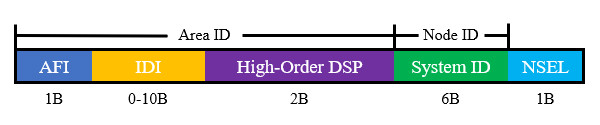

# 概述
中间系统到中间系统(Intermediate System to Intermediate System, IS-IS)协议是一种链路状态型内部网关协议。IS-IS协议原先由ISO制定(ISO 10589)，为OSI体系中的无连接网络服务(CLNS)设计，并不适用于IP网络；后来IETF对它进行扩展，使其适应IP网络，称为集成IS-IS(Integrated IS-IS)，相关标准由RFC 1195等文档进行规范。

IS-IS是电信运营商普遍采用的内部网关协议，因为它能够承载比OSPF协议更多的路由信息。

集成IS-IS协议拥有以下特点：

- 模块化设计，具有较强的扩展性，能够路由IPv4、IPv6、IPX等多种协议的数据包。
- 报文结构简单，链路开销较低，邻居建立速度更快，能适应拓扑频繁变更的网络。
- 设备硬件资源利用率更高，相比OSPF支持更大规模的网络。

# 术语
## 无连接网络服务(CLNS)
ISO/OSI参考模型定义了无连接网络服务(Connectionless Network Service, CLNS)，允许设备在网络层进行无连接通信，类似于IP所提供的尽力而为服务；与CLNS对应的是面向连接网络服务(Connection Oriented Network Protocol, CONS)，可在网络层提供面向连接的服务。

CLNS体系包括CLNP、ES-IS和IS-IS三部分，其中终端系统(End System, ES)即主机，中间系统(Intermediate System, IS)即网络层通信设备。

🔷 CLNP

无连接网络协议(Connectionless Network Protocol, CLNP)是ISO/OSI模型的网络层数据报协议，与TCP/IP模型中的IP协议相似，提供网络层数据报传输服务。

🔷 ES-IS

ES-IS是ISO/OSI模型中的终端系统与中间系统发现协议，功能类似于TCP/IP模型中的ARP、ICMP等协议，主机通过该协议配置前缀与网关信息。

🔷 IS-IS

IS-IS是ISO/OSI模型中的路由协议，网络层设备使用该协议维护路由表。

## OSI路由级别
ISO/OSI模型根据所属范围定义了四种路由级别：

- Level 0：终端到网关的路由信息，由ES-IS协议实现。
- Level 1：区域内部的路由信息，由IS-IS协议实现。
- Level 2：区域之间的路由信息，由IS-IS协议实现。
- Level 3：自治系统之间的路由信息，由BGP协议实现。

## IS-IS区域
IS-IS协议维护Level 1和Level 2路由信息，根据路由器所维护的路由信息级别，分为Level 1路由器、Level 2路由器或Level 1/2路由器。Level 1路由器拥有区域内的拓扑信息； Level 2路由器维护区域间的路由信息；Level 1/2路由器作为区域的出口，是区域内部与外界交互的重要节点，它同时维护L1/L2两个LSDB。

一台路由器一般只属于一个区域，但链路的两端可以在不同区域内，因此IS-IS协议的区域分界点是链路而不是路由器。L1区域包括若干L1路由器与L1/2路由器；L2区域包括若干L2路由器，它们需要在物理上连续。IS-IS协议没有定义骨干区域，所有的L1/2路由器和L2路由器构成骨干网，负责将不同区域之间互联。

<div align="center">


</div>

默认情况下Level 2区域的明细路由不会下发给Level 1区域，只会下发指向Level 1/2路由器的默认路由，但是Level 1区域的明细路由可以传递给Level 2区域。IS-IS协议没有明确的将某个区域定义为骨干区域，由所有Level 2路由器和Level 1/2路由器组成骨干网，负责区域间的通信，骨干网必须是物理连续的。

我们可以使用命令全局更改路由器角色，也可以单独控制某个接口的角色：

```text
# 更改路由器全局角色
Cisco(config-router)# is-type <level-1 | level-1-2 | level-2-only>

# 更改指定接口角色
Cisco(config-if)# isis circuit-type <level-1 | level-1-2 | level-2-only>
```

## 网络服务接入点(NSAP)
网络服务接入点(Network Service Access Point,NSAP)是OSI模型的网络层编址系统，类似于TCP/IP协议栈中的IP地址，IS-IS协议使用NSAP地址作为设备标识，建立链路状态数据库。IP地址用于标识接口，而NSAP地址用于标识整个设备，每个设备最多可拥有256个NSAP地址。NSAP地址的长度可变，为8-20字节。
 
<div align="center">



</div>

🔷 AFI

组织格式标识符(Authority Format ID, AFI)取值范围为 `[0, 99]` ，一般需要向管理机构申请，其中"49"为私有标识符，于RFC 1618中定义。

🔷 IDI

初始域标识符(Initial Domain Identifier, IDI)用于在AFI下划分子域，可以为空，不为空时最多占用10字节。

🔷 High-Order DSP

高位域指定部分，用于描述设备所属的区域。

🔷 System ID

系统ID，在区域内唯一标识ES或IS设备，作用等同于路由器ID，通常设为设备MAC地址或使用路由器ID。

此处以 `10.254.254.1` 为例，将其转换为系统ID：

```text
1.将每一组省略的0补齐：
010.254.254.001

2.以4位数字为一组，重新分组：
0102.5425.4001
```

不同区域的节点可以拥有相同的系统ID，但仍然建议使用全局唯一的系统ID。

🔷 NSEL

NSEL(NSAP Selector)字段用于标识上层协议类型，取值为0时表示设备本身，这类地址称为网络实体名(Network Entity Titile,NET)。IS-IS协议无需上层协议介入，因此总是使用NET地址。为了支持平滑迁移，一个节点可配置多个NET地址。

<br />

AFI和IDI称为初始域部分(Initial Domain Part, IDP)，相当于IP中的网络ID；其它部分称为域内自定义部分(Domain Specific Part, DSP)，High-Order DSP相当于子网ID，系统ID相当于主机ID。

NSAP地址通常使用点分十六进制表示，一个合法的NSAP地址如下：

```text
49.0001.0000.0000.0001.00
```

该地址表示域"49"、区域"0001"中编号为"0001"的节点。

## IS-IS进程
一台路由器可以运行多个独立的IS-IS协议进程，每个进程使用标签进行区分，标签只具有本地意义，可以为空字符串，也可以包含数字和字母。

## 协议数据单元
协议数据单元(Protocol Data Unit, PDU)是IS-IS协议用于交互链路信息的报文，类似于OSPF中的LSA。

# 报文结构
IS-IS报文封装在数据链路层，在以太网环境中，其封装在IEEE 802.3帧中。IS-IS一共有9种不同的报文，它们都拥有相同的报文头部。

<div align="center">


</div>

🔷 Intradomain Routing Protocol Discriminator

域内路由选择协议鉴别符，IS-IS协议取值为0x83。

🔷 Length Indicator

PDU头部的长度，包括通用头部和专用头部，以字节为单位。

🔷 Version/Protocol ID Extension

版本/协议标识扩展，取值为1。

🔷 ID Length

System ID域的长度，取值为0时，表示长度为6字节；取值为255时，表示System ID域长度为0（空）。

🔷 PDU Type

表示报文所封装PDU类型。

<div align="center">

| 类型值 |                PDU类型                |
| :----: | :-----------------------------------: |
|   15   |      Level 1 LAN IS-IS Hello PDU      |
|   16   |      Level 2 LAN IS-IS Hello PDU      |
|   17   |    Point-to-Point IS-IS Hello PDU     |
|   18   |        Level 1 Link State PDU         |
|   20   |        Level 2 Link State PDU         |
|   24   | Level 1 Complete Sequence Numbers PDU |
|   25   | Level 2 Complete Sequence Numbers PDU |
|   26   | Level 1 Partial Sequence Numbers PDU  |
|   27   | Level 2 Partial Sequence Numbers PDU  |

</div>

🔷 Version

版本号，取值为1。

🔷 Maximum Area Address

最大区域数量，表示当前进程允许的最大区域地址数，取值为0表示最多支持3个区域地址数。
IS-IS采用了TLV(Tag-Length-Value)的消息格式来描述常用信息，增强了可扩展性，常用的TLV见下表。

<div align="center">

| 类型  |                 名称                 |     描述     |
| :---: | :----------------------------------: | :----------: |
|   1   |            Area Addresses            |   区域地址   |
|   2   |          IS Neighbors(LSP)           |   邻居列表   |
|   6   |      IS Neighbors(MAC Address)       | 邻居MAC地址  |
|   7   |      IS Neighbors(SNPA Address)      | 邻居SNPA地址 |
|   8   |               Padding                |     填充     |
|   9   |             LSP Entries              |   LSP条目    |
|  10   |      Authentication Information      |   认证信息   |
|  128  | IP Internal Reachability Information | 区域拓扑信息 |
|  129  |         Protocols Supported          |  被路由协议  |
|  130  | IP External Reachability Information | 域间路由信息 |
|  132  |         IP Interface Address         |   接口地址   |
|  137  |               Hostname               |    主机名    |

</div>

# 报文类型
 Hello(IIH)
Hello报文用于建立和维持邻居关系。
在广播网络中，Hello报文分为Level 1 LAN IIH和Level 2 LAN IIH，用于建立不同级别的邻居关系。Level 1发送到组播地址01:80:C2:00:00:14；Level 2发送到组播地址01:80:C2:00:00:15。IS-IS协议与OSPF相类似，在广播网络中需要选举指定路由器（称为DIS），每3秒发送一次IIH报文，非DIS节点每10秒发送一次IIH报文。
 
图 5-49 LAN Hello报文
 Circuit Type(1B)
高位的6bit为保留位，取值为0；低位的2bit表示链路的类型，01表示L1，10表示L2，11表示L1/L2。
 System ID(6B)
发送Hello报文的路由器的System ID。
 Holding Time(2B)
保持时间，如果在此时间内没有收到邻居的Hello报文，则中止邻居关系。
 PDU Length(2B)
PDU的总长度，单位为字节。
 Priority(1B)
选举DIS的优先级，最高位为保留位，取值范围：[0,127]，数值越大，优先级越高。
 LAN ID(7B)
局域网标识符，包括DIS的System ID和伪节点ID。
 TLVs
变长信息包括区域地址、被路由协议、接口地址和填充字段，邻居关系建立后L1 IIH报文还包含邻居的MAC地址。
在点到点网络中，Hello报文只有一种，各节点每10秒以单播方式发送一次Hello报文。此类型网络中不需要选举DIS，无优先级与局域网标识符字段，但拥有Local Circuit ID字段，表示本地链路ID。
默认情况下LAN Hello报文会被填充达到链路本端的MTU值，可以在建立邻居的过程中发现MTU不匹配的问题，点对点Hello报文则不使用该特性。
 开启/关闭多路访问网络的IIH填充功能
Cisco(config-router)#{no} hello padding multi-point
 开启/关闭点到点网络的IIH填充功能
Cisco(config-router)#{no} hello padding point-to-point
 单独控制接口的填充功能
Cisco(config-if)#{no} isis hello padding
 LSP
链路状态报文(Link State PDUs,LSP)用于描述链路状态信息，分为Level 1 LSP和Level 2 LSP，它们具有相同的内容，网络节点会发送与自身角色一致的LSP。
 
图 5-50 LSP报文
 PDU Length(2B)
PDU的总长度，以字节为单位。
 Remaining Lifetime(2B)
LSP的剩余生存时间，以秒为单位。
 LSP ID(8B)
由System ID、伪节点ID和LSP分片序号组成，伪节点ID和分片序号各一字节。
 Sequence Number(4B)
LSP序列号，用于判断消息的新旧。
 Checksum(2B)
LSP校验和。
 Option(1B)
控制字段，包括以下部分：
P(Partition Repair)：长度1bit，仅在L2 LSP中有效，表示节点是否支持自动修复区域分割。
ATT(Attachment)：长度4bit，仅在Level 1/2节点发出的L1 LSP中生效，用来指明始发路由器是否与其它区域相连、相连的区域所使用的度量方式。
其中从左到右每一位的含义为：
第1位：差错度量
第2位：代价度量
第3位：时延度量
第4位：缺省度量
OL(LSDB Overload)：过载标志位，长度1bit。当节点内存不足时，系统会在发出的LSP报文中将其置位。OL被置位的LSP虽然会在网络中泛洪，但其它路由器在进行SPF计算时会忽略这台路由器，因为其信息不再可信。
Cisco(config-router)#set-overload-bit {on-startup [时间/秒]|suppress [interlevel|external]}
on-startup：当设备重启时，在设置的时间内将OL置位。
suppress：使用interlevel参数时抑制泄露进入的路由，使用external参数时抑制从其他路由协议重分发进入的路由。
IS Type：生成LSP的路由器类型，长度2bit。01表示Level 1，11表示Level 2。
 TLVs
变长信息包括区域地址、被路由协议、接口地址、邻居可达性和网络可达性信息，最后两部分即为拓扑信息，其中包含了度量值。
 CSNP(Complete Sequence Number PDU)
完全序列号PDU类似OSPF中的DBD，用于向其它路由器通告本地数据库的摘要信息。
 
图 5-51 CSNP报文
 PDU Length(2B)
PDU的总长度，以字节为单位。
 Source ID(7B)
发送报文节点的System ID+00。
 Start LSP ID(8B)
报文中第一个LSP的ID值。
 End LSP ID(8B)
报文中最后一个LSP的ID值。
 LSP Entries
描述LSP的摘要信息，包括序列号、剩余生存期、校验和信息。
 PSNP(Partical Sequence Number PDU)
部分序列号PDU格式同CSNP，但只含有部分LSP的摘要信息，既可以向邻居请求LSP详细信息，也可以作为确认报文使用。
CSNP和PSNP都分为L1和L2报文，但格式和实现的功能是相同的。


# 计时器
## Hello计时器
默认设置时每10秒发送一次IIH报文，3倍Hello时间内未收到Hello报文则判定邻居关系失效。
 配置Hello报文发送间隔
Cisco(config-if)#isis hello-interval [间隔/秒] {level-1|level-2}
 修改邻居关系失效计时器
Cisco(config-if)#isis hello-multiplier [Hello时间的倍数] {level-1|level-2}
 CSNP计时器
在广播网络中DIS节点会定期发送CSNP报文同步所有节点的LSDB，默认间隔10秒。
 修改DIS的CSNP计时器
Cisco(config-if)#isis csnp-interval [间隔/秒] {level-1|level-2}
 LSP重传计时器
在点到点的链路中，本端发送的LSP需要对方显式确认，默认在5秒内未收到确认报文，本端将会重传LSP，多个LSP之间间隔100毫秒。
 修改LSP重传计时器
Cisco(config-if)#isis timer lsp-retransmit [时间/秒]
 配置重传时连续LSP的发送间隔
Cisco(config-if)#isis retransmit-throttle-interval [时间/毫秒]
 LSP失效计时器
LSP生存时间最大值为20分钟，默认从1200秒开始倒数，当某条LSP一直没有被刷新时，将会被删除。
 修改刷新计时器
Cisco(config-router)#lsp-refresh-interval [时间/秒]
 配置最大生存时间
Cisco(config-router)#max-lsp-lifetime [最大生存时间/秒]
 LSP发送间隔
配置指定接口连续发送LSP的最小间隔时间，默认值为33毫秒。
 配置连续LSP的发送间隔。
Cisco(config-if)#isis lsp-interval [时间/毫秒]

# 度量值
IS-IS协议设计了四种度量类型，但一般设备只支持默认度量，默认度量值为每一跳数值增加10，可以根据需要修改。
 更改接口度量值
Cisco(config-if)#isis metric [度量值] {level-1|level-2}
IS-IS协议有窄度量值(Narrow Metric)和宽度量值(Wide Metric)之分，默认使用窄度量值(6bit)，取值范围为[1,63]，更改为宽度量值(10bit)后，取值范围变为[1，16777214]。
 更改度量值风格
Cisco(config-router)#metric-style [narrow|wide|transition] {level-1|level-2|level-1-2}
transition：同时采用两种度量值进行LSP通告，用于两种度量值的平滑迁移。先将所有节点改为翻译模式，各节点将会分别以两种方式计算路由，一段时间后再改为另一种度量值即可。


1.4.7  邻居关系状态机
 Down
刚把接口宣告进IS-IS进程，没有收到任何报文。
 Initial
初始化状态，收到邻居发出的Hello报文，但其邻居列表不包含本节点，此时本节点会发出Hello报文进行回应，邻居列表包含对端节点的系统ID。
 Up
邻居关系已建立状态，当收到的Hello报文邻居列表含有自身的系统ID时，将成功与对端建立邻居关系。
1.4.8  邻居关系建立过程
 默认的物理网络中邻居建立过程
 广播网络
在广播网络中，IS-IS之间使用三次握手机制建立邻居，R1首先发出包含自身系统ID的Hello报文，邻居列表为空；R2收到R1的Hello报文之后状态转为Initial，将R1添加到自身的邻居列表中，并发送邻居为R1的Hello报文给R1；R1收到后即认为自身与R2邻居关系建立，并发送邻居为R2的Hello报文给R2，R2接收后也认为自身与R1邻居关系建立。至此，双方邻居关系均为Up状态。
 
图 5-52 LAN中的IS-IS邻居关系建立过程
默认情况下路由器具有Level 1与Level 2双重身份，两个级别会分别建立邻居关系，相互之间无影响。
邻居关系建立后，双方等待两个Hello报文的间隔（一个来回），再进行DIS的选举。
 点到点网络
在点到点网络中，默认使用三次握手机制，也可以使用两次握手机制，即收到对端节点的Hello报文即宣布与其建立邻居关系，我们可以使用命令更改握手方式：
Cisco(config-if)#{no} isis three-way-handshake
两次握手机制存在缺陷，并不推荐使用。当两个节点通过两条及以上链路互联时，一旦某条链路单向Up，另一条链路的通断正好相反，节点之间还是能建立起邻居关系，但在执行SPF计算时会使用本端状态为UP的链路，导致“单通”问题。
 DIS的作用
指定中间系统(Designated IS)的作用类似于OSPF中的DR，用于减少广播网络中的LSP泛洪，但其行为与OSPF有很大的不同，并且是基于接口进行选举的。
中间节点优先级取值范围为[0,127]，数值越大优先级越高，数值为0也可以参与选举，默认值为64。当多个节点有相同的优先级时，选择其中MAC地址最大的。
 修改接口的优先级
Cisco(config-if)#isis priority [优先级]
DIS的选举不会结束，可以被抢占，并且没有备份机制，而且非DIS节点之间也会建立邻居关系。Level 1和Level 2可以拥有不同的DIS，相互之间并无关联。
DIS节点的Hello报文发送间隔变为三分之十秒（约为3.33秒），以便其它节点能迅速发现其失效并选举新的DIS。
 邻居关系建立的要素
两台设备之间建立IS-IS邻居关系需要满足以下要素：
 具有匹配的路由器/接口角色
 系统ID必须不同
 区域ID必须相同（仅对于Level 1邻居关系）
 网络类型设置相同
 接口MTU值相同
 认证信息相互匹配
此外，度量值风格设置不匹配时可以建立邻居关系，但无法计算路由信息。
 邻居事件日志显示
默认情况下Cisco设备不显示IS-IS邻居事件日志，可以手动开启：
 开启IS-IS邻居事件日志显示
Cisco(config-router)#log-adjacency-changes {all}
all：显示非IIH报文引起的事件，如接口关闭导致邻居状态Down。
1.4.9  IS-IS网络类型
IS-IS只有两种网络类型，并且不能随意更改，因此不适合复杂的网络环境。
 Broadcast
以太网链路默认是此类型，需要选举DIS。
 Point-to-Point
PPP、HDLC链路默认是此类型，不需要选举DIS，并且不能更改。
 优化方法
可以将物理直连的以太网链路改成点到点模式，更改后无需选举DIS。
Cisco(config-if)#isis network point-to-point
1.4.10  LSDB同步过程
 广播网络
在广播网络上，DIS节点每隔10秒通告一次自身的数据库摘要CSNP报文，其它节点将自身数据库与DIS对比，若有缺少的部分则发送PSNP报文进行请求，DIS节点将其缺少的LSP发送给这些节点使其LSDB同步。
区分LSP新旧的因素依次为：序列号、剩余生存时间、校验和，三者都是越大越新。
当新节点加入到广播网络并与DIS建立邻居关系后，需要进行LSDB同步：
1.新加入的节点R2发送自身接口的LSP给指定中间系统R1。
2.R1将收到的LSP存入自身LSDB，并等待CSNP计时器超时，随即发送CSNP报文。
3.R2收到R1的CSNP报文后与自身LSDB对比，将缺失的信息摘要放入PSNP报文发送给R1，向其请求这些信息。
4.R1将R2缺失的LSP发送给R2，完成LSDB同步。
该过程如下图所示，此时PSNP报文相当于OSPF协议的LSR报文。
 
图 5-53 广播网络中LSDB同步过程
 点到点网络
在点到点网络上，双方邻居关系建立后互发关于自身数据库的CSNP报文。若本端发现差异，则发送PSNP报文向对端索取缺失的LSP，对端发送LSP的同时启用重传计时器，本端收到LSP后发送PSNP报文作为回执，若对端重传计时器超时后本端仍未回复PSNP，则再次向本端发送LSP并等待PSNP回应。
 
图 5-54 点到点网络中LSDB同步过程
1.4.11  相关配置
 基础配置
 启用IS-IS进程
Cisco(config)#router isis [进程标识]
 设置设备标识
Cisco(config-router)#net [NSAP地址]
 将接口宣告进IS-IS进程
Cisco(config-if)#ip router isis
 参数调整
 清除IS-IS邻居
Cisco#clear isis *
 查询相关信息
 查看IS-IS邻居关系
Cisco#show isis neighbors
 查看IS-IS拓扑信息
Cisco#show isis topology
 查看IS-IS转发信息库
Cisco#show isis rib
1.4.12  分发默认路由
IS-IS协议中区域边界路由器默认已经向Level 1区域内分发了默认路由，使用以下命令可以向IS-IS的Level 2区域内分发默认路由。
Cisco(config-router)#default-information originate
1.4.13  路由汇总
IS-IS支持在任意位置进行路由汇总，不支持自动汇总。
Cisco(config-router)#summary-address [汇总网络ID] [子网掩码] {level-1|level-2|level-1-2}
IS-IS默认只汇总Level 2的路由，若要汇总Level 1的路由，需要用参数声明。
1.4.14  路由泄露
默认情况下L1区域不知道外部的明细路由，仅有区域边界路由器分发的默认路由。若区域内存在多个边界路由器，就可能产生次优路径。为了便于控制选路，RFC 2966定义了路由泄露机制，允许将L2区域的路由信息引入到L1区域中。
 部署方法
首先编写扩展ACL或Route Map匹配需要分发的路由条目，然后使用重分发命令将Level 2区域的路由分发到Level 1区域中。
Cisco(config-router)#redistribute isis ip level-2 into level-1 distribute-list {[扩展ACL编号]|route-map [策略名称]}
被引入到Level 1区域的路由条目将会标记为"i ia"。
 防环机制
当存在多个L1/2路由器时，从L2区域被分发进L1区域的路由，分发标记位将置为1，状态为"Down"，这些路由永远不会被L1/2路由器通告到L2区域中。
 路由上传控制
我们不仅可以将L2区域中的路由泄露到L1区域中，也可以控制L1区域的路由，使部分路由不上传到L2区域中，只需要使用扩展ACL或Route Map拒绝相应条目，然后在重分发命令中调用即可。
Cisco(config-router)#redistribute isis ip level-1 into level-2 distribute-list {[扩展ACL编号]|route-map [策略名称]}
1.4.15  认证
IS-IS协议支持邻居认证、LSP认证。
 邻居认证
 设置认证模式
Cisco(config-if)#isis authentication mode [text|md5] {level-1|level-2}
 指定认证钥匙链
Cisco(config-if)#isis authentication key-chain [钥匙链名称] {level-1|level-2}
 LSP认证
 设置认证模式
Cisco(config-router)#authentication mode {text|md5} {level-1|level-2}
 指定认证钥匙链
Cisco(config-router)#authentication key-chain [钥匙链名称] {level-1|level-2}
 不间断服务
不间断服务用于防止部署认证过程中仅在一侧启用认证时邻接关系中断。
 LSP认证的不间断服务
Cisco(config-router)#authentication send-only
 邻居认证的不间断服务
Cisco(config-if)#isis authentication send-only


