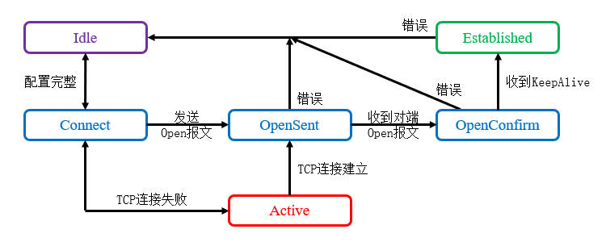

# 概述
边界网关协议(Border Gateway Protocol, BGP)是Internet所采用的自治系统(AS)间路由协议，能够承载大量的路由条目，并且提供了丰富的选路策略。

BGP是一种可靠的增强型距离矢量协议，基于TCP的179端口，采用单播增量更新的方式更新路由。与IGP协议不同，只要站点之间TCP可达，就可以建立BGP对等体关系，不一定要物理直连。

BGP协议在自治系统的角度传递路由信息，它的可靠性机制并不依赖于算法，而是协议自身定义的各种规则。

BGP协议适用于以下场景：

- 透传路由信息，其它AS之间可以穿过本AS相互通信，多用于运营商内部。
- 多运营商接入，且需要进行精确的选路控制。
- 本自治系统需要获取公网的明细路由。

以下场景则没有必要使用BGP协议：

- 单运营商源接入，此时使用默认路由即可。
- 多运营商接入，但仅实现冗余备份或负载均衡，此时没必要使用BGP协议。

BGP协议的当前版本是BGP 4，于1995年在RFC4271中定义，支持VLSM和CIDR，适用于现代的无类别网络环境。

# 术语
## 自治系统
自治系统(Autonomous Systems, AS)是指一组使用相同管理规则建立的网络。每个自治系统都有一个编号(AS Number, ASN)，用于唯一标识该自治系统。

早期ASN地址空间为16位，取值范围： `[0, 65535]` 。其中 `[0, 64511]` 为公有AS号，需要向IANA购买， `[64512, 65535]` 为私有AS号。后期ASN地址空间扩展到32位，取值范围： `[1, 4294967295]` 。

## BGP进程
BGP进程使用ASN进行标识，一台设备同时只能运行一个BGP进程。

## BGP发言人
发送BGP消息的路由器叫做BGP发言人(Speaker)。

## BGP对等体
相互交换BGP消息的路由器叫做BGP对等体(Peer)。

## IBGP
IBGP是指同一个AS内部的BGP邻接关系，路由信息管理距离较高，不如IGP可信。

## EBGP
EBGP是指不同AS之间的BGP邻接关系，通常运行EBGP的两个节点需要直连。

BGP的基本架构如下图所示：

<div align="center">


</div>

## 路由器ID
每个BGP路由器拥有全局唯一的ID，Open报文中含有发送方的路由器ID，可以自动选举，规则同OSPF的路由器ID，一般应当手动配置。

如果BGP会话已经建立，此时更改路由器ID只影响新建立的BGP会话。

## 属性
BGP给每条路由赋予很多不同的属性(Attribute)，使用这些属性来描述路由的优劣。

BGP协议也有Metric这一参数，但它只是影响选路的因素之一。

# 报文结构
BGP协议通过TCP协议的179端口建立会话并交互报文。BGP共有5种不同的报文，最长为4096字节，最短为19字节（只包含报文头），它们拥有相同的报文头部。

<div align="center">


</div>

🔷 Marker

用于校验BGP对等体的同步信息完整性，也用于报文认证，长度共16字节，不使用时所有比特均为1。

🔷 Length

BGP消息总长度（包括报文头部），以字节为单位。

🔷 Type

BGP消息类型，共有5个值，前四种消息是RFC 4271定义的，最后一种消息则是RFC 2918定义的。

<div align="center">

| 数值  |   报文类型   |
| :---: | :----------: |
|   1   |     Open     |
|   2   |    Update    |
|   3   | Notification |
|   4   |  KeepAlive   |
|   5   |   Refresh    |

</div>

# 报文类型
## Open
Open报文用于建立邻接关系，BGP只能单播发送此报文，所以必须手动指定邻居。

Open报文的详细字段如下文所示：

🔷 Version

协议版本号，长度1字节。

当前常用的BGP版本号为"4"。

🔷 My AS

报文发送方的ASN，长度2字节。

若使用4字节的ASN，该字段取值恒为23456，真实的ASN包含在可选参数中。

🔷 Hold Time

发送方的Hold Time值，长度2字节。

用于协商BGP对等体之间发送Keepalive或Update等报文的时间间隔。收到对等体的Open报文后，路由器将本地设置的Hold Time与其作比较，以较小的值为基准。

 BGP Identifier
报文发送方的Router ID，共4字节。
 Opt Parm Len
可选参数的长度，共1字节，该数值的单位为字节。
 Optional Paramters
可选参数列表，每个可选参数都是TLV单元，在RFC 3392中有描述。其中常用的是类型2，描述了设备支持的协议簇与特性。
 KeepAlive
KeepAlive用于保持对等体之间的TCP会话，只有BGP报文头部，报文总长度恒为19字节，默认发送周期为60秒。
 Update
Update报文用于向BGP对等体通告路由信息变化。BGP采用增量更新机制，更新报文中包含两个部分：新增与撤销的路由信息，新增的路由信息包含在Path Attribute字段中，包括路由条目的前缀与详细属性；撤销的路由信息包含在Withdrawn Routes字段中。
 Notification
Notification报文用于发送警告消息，内容在RFC 4271中定义，出现此报文时双方会重置邻接关系。
 Error Code
错误代码，共1字节，未知错误用零表示。
 Error subcode
细节代码，共1字节，未知错误用零表示。
 Data
错误详细信息。
 Refresh
当路由策略发生变更时，节点用Refresh报文通知对等体，立即更新它们的路由表。此报文是后期的补充标准，不支持路由刷新能力的节点将不予理会。

# 计时器
## 邻接关系计时器
BGP的Open报文中有Hold Time字段，默认值为180秒，节点将此数值与自身配置相比较，选择其中较小的一个作为Hold-Down计时器。
Keepalive计时器默认为Hold-Down计时器的1/3，每隔60秒向对等体发送一个Keepalive报文，当连续有三个Keepalive报文丢失时，Hold-Down计时器满，邻接关系重置。
如果需要修改所有邻接关系计时器，可以在BGP进程中全局修改：
Cisco(config-router)#timers bgp [Keepalive Time] [Hold-Down Time]
也可以对特定的邻居进行修改：
Cisco(config-router)#neighbor [邻居IP地址] timers [Keepalive Time] [Hold-Down Time]

## 路由通告计时器
路由通告计时器用于控制路由更新发送的间隔，每个周期内路由变更信息会先累积起来，计时器满时一并发送。在EBGP对等体之间，该计时器默认为60秒；在IBGP对等体之间，该计时器为0秒，即有变化时立即发送。
我们可以更改对于指定邻居的通告间隔：
Cisco(config-router)#neighbor [邻居IP地址] advertisement-interval [间隔/秒]


# 邻接关系状态机
🔷 Idle

路由器尝试与目标地址建立连接，如果目标地址不可达，将会持续处于Idle状态。

当我们使用环回接口建立EBGP邻居时，如果忘记配置静态路由、更新源地址、TTL值，将会导致IP不可达，邻接关系停留在Idle状态。

🔷 Connect

尝试建立TCP连接并启用重连计时器，若TCP连接成功，发送Open报文后进入Open-Sent状态；若重连计时器超时后仍未建立连接，进入Active状态。

🔷 Active

邻居可达但无法建立TCP连接时，处于Active状态，此时会持续尝试建立TCP会话。

🔷 Open-Sent

TCP连接建立成功并发送Open报文之后，进入此状态。

🔷 Open-Confirm

本端收到对等体对Open的确认报文后，进入此状态，直到收到对方的Keepalive报文后转为Established状态。

🔷 Established

BGP邻居关系已建立，此时对等体可以发送Update报文进行路由更新。

# 工作流程
## 建立邻接关系
BGP邻居关系建立过程较为简单，当两端建立TCP会话后，互相发送Open报文，双方将收到的Open报文与本地设置的参数对比，协商支持的特性与计时器数值。

<div align="center">



</div>

BGP是运行在Internet上的路由协议，不能使用组播或广播方式自动发现邻居，需要使用命令人工配置，本地AS号与远程AS号一致时为IBGP邻居，否则为EBGP邻居。

```text
Cisco(config-router)#neighbor [邻居IP地址] remote-as [远程AS号]
```

使用 `show ip bgp summary` 命令可以查看邻接关系的摘要与详细信息：
 
```text
R1#show ip bgp summary
BGP router identifier 1.1.1.1, local AS number 100
BGP table version is 5, main routing table version 5
4 network entries using 576 bytes of memory
6 path entries using 504 bytes of memory
5/4 BGP path/bestpath attribute entries using 800 bytes of memory
1 BGP AS-PATH entries using 24 bytes of memory
0 BGP route-map cache entries using 0 bytes of memory
0 BGP filter-list cache entries using 0 bytes of memory
BGP using 1904 total bytes of memory
BGP activity 4/0 prefixes, 6/0 paths, scan interval 60 secs

Neighbor        V           AS MsgRcvd MsgSent   TblVer  InQ OutQ Up/Down  State/PfxRcd
10.0.1.2        4          100      52      52        5    0    0 00:42:40        3
101.0.0.2       4          200      51      51        5    0    0 00:42:44        2
```


```text
R1#show ip bgp neighbors 101.0.0.2
BGP neighbor is 101.0.0.2,  remote AS 200, external link
  BGP version 4, remote router ID 4.4.4.4
  BGP state = Established, up for 01:06:56
  Last read 00:00:19, last write 00:00:10, hold time is 180, keepalive interval is 60 seconds
  Neighbor sessions:
    1 active, is not multisession capable (disabled)
  Neighbor capabilities:
    Route refresh: advertised and received(new)
    Four-octets ASN Capability: advertised and received
    Address family IPv4 Unicast: advertised and received
    Enhanced Refresh Capability: advertised and received

此处省略部分输出 ...
```

在邻居详细信息中，Neighbor Capabilities即为双方协商后启用的特性。


### 重置邻接关系
BGP可以临时关闭和某个对等体的连接，而不必删除相关配置，此功能常用于调试。

```text
Cisco(config-router)#neighbor [邻居IP地址] shutdown
```

使用Clear命令可以重置BGP邻接关系：

```text
Cisco#clear ip bgp [邻居IP地址|*] {soft}
```

此处填写"*"时表示重置所有的邻接关系，填写具体地址时只重置该邻接关系。

如果添加"soft"参数，则发送Refresh报文通知对方刷新路由表，不重置邻接关系。

### 使用环回接口建立邻接关系
除了通过直连接口建立邻接关系外，我们通常使用环回接口，只要还有物理链路可以到达对端环回接口，邻居关系就不会失效，拥有多条物理路径时可以提高可靠性。

路由器默认将出站接口地址作为数据包的源地址，使用环回接口时，要将BGP报文的源地址改为环回接口地址，否则对方接收后会将这些数据包丢弃。

```text
Cisco(config-router)#neighbor [邻居IP地址] update-source [本地端口ID]
```

默认情况下，本地发送给EBGP对等体的Open报文TTL值为1，使用环回接口时需要增加一跳，否则这些数据包会因为TTL耗尽无法到达对端。

```text
Cisco(config-router)#neighbor [邻居IP地址] ebgp-multihop [TTL]
```

## 路由传递规则
BGP维护邻居表、BGP表、路由表，邻居发送的路由信息先存入BGP表中，然后根据各种规则选择最优条目加入路由表。

### 通告路由信息
我们可以使用Network命令向其它节点宣告路由信息：

```text
Cisco(config-router)#network [网络ID] mask [子网掩码]
```

在IGP协议中，Network命令使IP地址属于该网段的接口参与协议进程，自动学习路由信息。BGP的Network命令含义并不相同，它的作用是将指定的路由信息通告给邻居，所以此处必须填写精确的路由前缀和掩码，不能模糊匹配。

BGP总是通告本地最优的路由信息给邻居，此处填写的配置，仅当路由表中存在对应条目时才会生效。如果不需要精确到条目逐条宣告，还可以使用重分发功能。

在其它设备上使用以下命令可以查看BGP表内容：

```text
R1# show ip bgp
BGP table version is 5, local router ID is 1.1.1.1
Status codes: s suppressed, d damped, h history, * valid, > best, i - internal, 
              r RIB-failure, S Stale, m multipath, b backup-path, f RT-Filter, 
              x best-external, a additional-path, c RIB-compressed, 
              t secondary path, 
Origin codes: i - IGP, e - EGP, ? - incomplete
RPKI validation codes: V valid, I invalid, N Not found

     Network          Next Hop            Metric LocPrf Weight Path
 *>   1.1.1.1/32       0.0.0.0                  0         32768 i
 *>i  2.2.2.2/32       10.0.1.2                 0    100      0 i
 * i  4.4.4.4/32       102.0.0.2                0    100      0 200 i
 *>                    101.0.0.2                0             0 200 i
 *>   5.5.5.5/32       101.0.0.2                              0 200 i
 * i                   102.0.0.2                0    100      0 200 i
```

BGP Table Version表示BGP表的版本，BGP采用增量更新，每次发生变化版本号+1。
表格第一列表示路由条目的状态，"*"表示该条目有效，">"表示该条目当前为最优，，"r"表示该条目不是最优，"i"表示该条目由IBGP邻居传递而来。
### 传递路由信息
BGP邻居之间传递路由信息时遵循以下规则：

- 从EBGP邻居获得的路由信息，可以发布给其它EBGP和IBGP邻居。
- 从IBGP邻居获得的路由信息，只发布给EBGP邻居，不再发布给其它IBGP邻居。
- BGP将整个AS当作逻辑路由器，因此路由信息传递给IBGP邻居时，属性不会改变，只有到达AS边缘时，边界路由器会修改属性后通告给EBGP邻居。
- 为了防止AS内部产生环路，IBGP邻居之间遵循水平分割原则，路由信息只能传播一跳，接收方不能再传递给其它IBGP邻居。

IBGP的传递规则产生了一些问题，需要进行特殊的配置才能正常工作。

1.下一跳属性问题

如图所示，R1通告路由信息给R2，下一跳指向R1，R2收到这些信息后再通告给R3，由于它们之间是IBGP邻居，下一跳仍然指向R1，R3没有到达R1的路由，所以这些条目无法加入路由表。


R2与其它节点建立IBGP邻接关系时，我们可以添加一项参数，使R2传给对等体的路由下一跳指向它本身。

```text
Cisco(config-router)#neighbor [邻居IP地址] next-hop-self
```

2.水平分割问题

由于水平分割特性，R2通告给R3的路由信息不会再通告给R4。为了使AS内部路由信息完整，可以以IGP为基础，建立BGP的全互联(Full Mesh)邻接关系，在R2和R4之间也建立IBGP邻居。

在拥有n个节点的全互联拓扑中，需要建立n*(n-1)/2对邻接关系，配置过于繁琐，节点数量过多时可以选择路由反射器、BGP联邦和MPLS等技术替代全互联拓扑。

# BGP属性
BGP使用“属性”的概念控制选路，每条路由可以拥有多个不同的属性。

## 属性分类
 公认必遵属性(Well-known Mandatory)
这种属性所有厂商的设备都能识别，并且通告的路由信息中必须携带。
 公认自决属性(Well-known Discretionary)
这种属性所有厂商的设备都能识别，但不要求通告的路由信息中心必须携带。
 可选过渡属性(Optional Transitive)
这种属性不是所有厂商的设备都能识别，通告给其它节点时保持不变。
 可选非过渡属性(Optional Non-Transitive)
这种属性不是所有厂商的设备都能识别，通告给其它节点时可能被移除。
## 公认必遵属性
最常见的三个公认必遵属性分别是Original、Next Hop和AS Path。
 Original
描述路由信息的起源。直连、静态、IGP和汇总路由标记为IGP，EGP路由标记为EGP，从其它协议分发进入的路由标记为Incomplete。
BGP进行选路时，起源属性优先程度从高到低为：IGP、EGP、Incomplete。
 Next Hop
描述该路由信息指向的下一跳地址。路由信息初次生成、在EBGP邻居之间传递时，下一跳指向发送者，在IBGP邻居之间传递时默认不做变更。
 AS Path
描述该路由经过的AS，防止AS之间产生环路。当AS边界路由器传递给EBGP邻居时，会将自身所在的AS编号添加到该字段。如果设备收到某条路由，AS Path含有自身所在AS编号，则忽略该路由，不会转发给其它邻居。
AS Path有四种类型，常规路由携带有序列表AS Sequence，聚合路由经过设置后携带无序列表AS Set；若AS内存在BGP联邦，路由将会携带AS Confed Sequence或AS Confed Set，用于记录联邦内部的路径信息。
## 公认自决属性
 Local Preference
描述路由信息在本地AS内的优先级，数值较大者优先级较高，默认值为100。该属性只在AS内部有效，不会传递给其它AS。
当AS存在多个出口时，我们通常在ASBR上配置本地优先级，通告给AS内部节点，控制出站流量的路径。
 Atomic Aggregate
原子聚合标记，用于通知其它节点路由信息经过聚合，部分属性可能已缺失。
## 可选过渡属性
 Aggregator
描述聚合路由从何处产生，包括通告者的路由器ID和ASN。
 Community
描述拥有公共属性的一组路由，类似于IGP的Tag，能够在AS之间传递，可以用Route-Map添加和过滤，用于选路控制。
## 可选非过渡属性
 Weight/Prefer Value
Weight是Cisco设备的私有属性，用于控制路由信息在节点本地的优先级，数值越大越优先，默认值为0，在宣告节点取值为32768，该属性不会传递给其它节点。
我们可以对特定邻居的所有路由信息设置Weight属性，也可以使用Route-Map精确控制部分路由信息的Weight属性。

```text
Cisco(config-router)#neighbor [邻居IP地址] weight [权重值]
```

Prefer Value是华为设备的私有属性，默认值为0，含义与Weight相同。

 MED
MED(Multi-Exit Discriminators)属性继承自IGP的度量值，非IGP路由取值为0。自动生成的MED属性只传递给IBGP邻居；通过Route-Map手动修改后，该属性可传递给给所有BGP邻居，到达相邻AS后不会再传递给其它AS。
当AS存在多个入口时，我们通常在ASBR上配置MED，通告给EBGP邻居，控制入站流量的路径。
 Originator ID
描述初始宣告路由信息的节点，详见路由反射器。
 Cluster List
描述路由信息经过的集群，详见路由反射器。

# 选路原则
当节点通过BGP获得去往同一目的地的多条路由时，将会按照以下顺序依次对比，选择最优的路由加入路由表。
1.选择Weight/Prefer Value较高的路由。
2.选择Local Preference较高的路由。
3.本地起源的路由优于从邻居学习到的路由。
4.选择AS Path较短的路由。
5.选择Original属性更可靠的路由。
6.选择MED值较小的路由。
7.EBGP邻居通告的路由优于IBGP邻居通告的路由。
8.选择距本节点更近（IGP Metric较小）的邻居通告的路由。
9.根据负载均衡设置决定择优加表或者负载均衡。
10.选择EBGP邻居建立更久的节点发送的路由，降低路由震荡的影响。
11.选择路由器ID更小的邻居通告的路由。
12.选择Cluster List较短的路由。
13.选择IP地址更小的邻居通告的路由。

🔷 在华为设备上第11和12条规则顺序相反，官方未说明第10条是否生效。


1.2.5  路由聚合
 自动聚合
BGP协议的自动聚合功能可以将路由聚合到主类网络边界，然后只通告聚合路由给邻居，抑制明细路由。此功能只对重分发进入的路由生效，不影响精确宣告的路由。
自动聚合产生的路由下一跳指向执行聚合的节点，属性不再继承自明细路由。该功能可控性不高，容易引发故障，所以默认关闭，可以在协议进程中使用命令开启：
Cisco(config-router)#auto-summary
 手动聚合
BGP协议可以手动进行路由聚合，并且会在本地生成指向Null 0接口的防环路由。
Cisco(config-router)#aggregate-address [聚合网络ID] [子网掩码] {可选参数}
此功能默认不会抑制明细路由，所以一般配合"summary-only"参数使用。
聚合路由被标记为原子聚合(Atomic-Aggregate)，通知其它节点聚合后可能丢失了部分属性，并且携带有聚合者(Aggregator)属性，描述发生聚合的节点与所在AS。
聚合路由默认不携带AS Path属性，可能会导致路由环路，我们可以使用"as-set"参数向聚合路由中添加AS Set属性，它与普通的AS Path含义相同，但它是无序的。
1.2.6  抑制列表
路由聚合后设备默认不抑制明细路由，如果需要将部分明细路由屏蔽，不发送给邻居，需要使用抑制列表(Suppress Map)。抑制列表会将匹配到的明细路由抑制，放行其它的明细路由。
 使用方法
1.使用ACL或前缀列表匹配路由条目。
2.使用Route Map匹配ACL或前缀列表。
3.使用抑制列表调用Route Map抑制明细路由。
Cisco(config-router)#aggregate-address [聚合网络ID] [子网掩码] suppress-map [Route Map名称]
1.2.7  路由反射器
BGP的路由信息不能通过IBGP邻居隔跳传递，当BGP设备超过3台后，全互联拓扑配置繁琐、浪费硬件资源，还会给排障带来困难。
为了解决全互联拓扑的缺点，RFC 2796提出了路由反射器(Route Reflector,RR)技术，与OSPF中的DR/BDR类似，普通节点只要和反射器节点建立邻接关系，就可以接收到其它节点的路由信息，普通节点之间不必再建立邻接关系。

图 5-62 路由反射器架构
 路由反射器工作原理
路由反射器会将收到的路由转发给其它节点，打破水平分割的规则，使路由信息在AS内部正常传递。在RR上指明的组成员称为RR客户端(RR Client,RRC)，其它节点称为非客户端(Non-RRC)。
 RR收到EBGP邻居发送的路由，会传递给所有BGP邻居，包括RRC和Non-RRC。
 RR收到RRC发送的IBGP路由，会传递给所有BGP邻居，包括RRC和Non-RRC。
 RR收到Non-RRC发送的IBGP路由，会传递给所有EBGP邻居和RRC，不会发送给Non-RRC。
总而言之，非RRC节点的路由信息不会传递给其它非RRC节点，其它角色均可互传。
 部署方法
RR对于RRC而言是透明的，RR与其它节点建立IBGP邻接关系后，在RR上指明哪些邻居是RRC即可，RRC上不需要进行特殊的配置，还可以移除多余的邻居配置。
Cisco(config-router)#neighbor [邻居IP地址] route-reflector-client
 环路避免机制
路由反射器打破了水平分割的规则，可能会导致环路。RR向被反射的路由信息中添加了两种新属性，以此避免环路的产生。
 Originator ID
RRC首发的路由到达RR后，该属性为空，说明是初次反射，RR将发送者的路由器ID写入Originator ID属性后通告；若RR收到路由后发现该属性已存在，则不做修改。
其它设备收到路由信息时，先比较Originator ID和自身的Router ID，如果两者相同，说明出现了环路，就会忽略此路由。
 
图 5-63 Originator ID属性防环场景
本场景中RRC1发送路由给RR，RR将RRC1的路由器ID填入Originator ID字段后反射给RRC2，RRC2通过IBGP邻接关系又传递给RRC1，RRC1发现Originator ID是自己，忽略该路由以阻断环路。
 Cluster List
路由反射器和它的客户端组成一个集群(Cluster)，使用在AS内唯一的Cluster ID标识。Cluster ID默认为RR的路由器ID，如果集群内存在备份RR，需要通过命令修改其Cluster ID，使它与主控RR保持一致：
Cisco(config-router)#bgp cluster-id [集群ID]
当AS内存在多个RR时，为防止集群间产生环路，需要用Cluster List属性记录路由经过的集群。Cluster List与AS Path类似，路由信息每经过一个集群，RR就会将自身的Cluster ID追加到该字段再传递给RRC。如果RR收到某条路由后发现Cluster List含有自身的Cluster ID，说明产生了环路，就会忽略此路由。
 
图 5- 64 Cluster List属性防环场景
本场景中R2是R1的RRC，R3是R2的RRC，R1是R3的RRC，三者都具有RR身份。R1收到EBGP邻居的路由后，把自身RID添加到Cluster List，然后发送给R2；R2添加自身RID后传递给R3，R3添加自身RID后再传递给R1，R1发现该路由Cluster List中含有自身的RID，忽略该路由以阻断环路。
 多集群与层次化设计
AS内部可以划分出多个反射器集群，提高可管理性。不同集群的RR之间可以使用全互联拓扑连接，集群内部还可以划分出子集群，将父集群的客户机作为子集群的RR使用。
1.2.8  BGP联邦
BGP联邦(Confederation)也是一种减少IBGP节点间的邻接关系的技术，在RFC 3065中定义。该技术将原先的AS划分为多个私有AS，私有AS之间通过EBGP互联，它们的成员仍然需要实现IBGP全互联拓扑。私有AS只在原先的对公AS内部有效，其它AS的路由器仍然将对公AS视为整体，不会增加它们的性能负担。
 
图 5- 65 BGP联邦架构
使用BGP联邦需要更改原先的架构设计，配置较繁琐，因此不如路由反射器流行。
 部署方法
若部署BGP联邦，创建进程时，AS号需指定为私有ASN，不再是对公ASN：
Cisco(config)#router bgp [私有AS号]
然后需要在所有联邦设备上声明对公ASN：
Cisco(config)#bgp confederation identifier [对公AS号]
私有AS之间的设备需要建立EBGP邻接关系，它们可能还要与其它AS的设备建立EBGP邻居，为了区分这两种邻接关系，需指明哪些AS是联邦成员AS：
Cisco(config)#bgp confederation peers [相邻的私有AS号]
1.2.9  对等体组
如果BGP邻居关系非常多，并且大部分配置相同，我们可以使用对等体组简化配置。对等体组预先保存了远程ASN、更新源地址、EBGP跳数等参数，指明邻居时直接调用对等体组即可，不必再单独配置参数。
除了简化配置外，设备对同一对等体组的邻居只需生成一次更新报文，节约了性能。
 部署方法
1.首先创建对等体组。
Cisco(config-router)#neighbor [对等体组名称] peer-group
2.设置对等体组参数。
Cisco(config-router)#neighbor [对等体组名称] remote-as [远程AS号]
Cisco(config-router)#neighbor [对等体组名称] next-hop-self
3.调用对等体组。
Cisco(config-router)#neighbor [邻居IP地址] peer-group [对等体组名称]


# 认证
BGP协议可以使用TCP的MD5认证功能，并且支持认证的不间断服务。

我们需要在链路两端的路由器上配置相同的密钥：

```text
Cisco(config-router)# neighbor <邻居IP地址> password <认证密钥>
```
