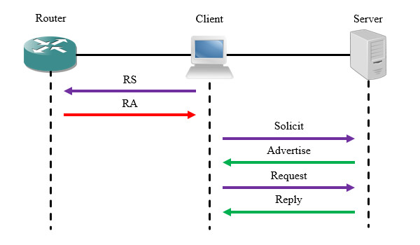
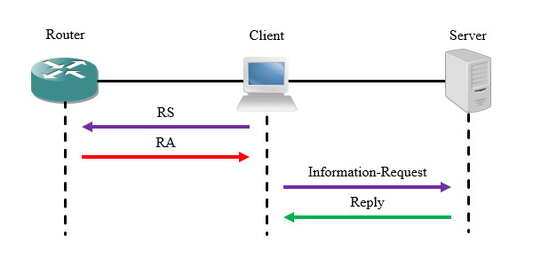

# 概述
IPv6终端能够通过SLAAC方式自主配置接口地址，但这种方法可管理性较差，且无法获取DNS、NTP等服务器配置。

IPv6动态主机配置协议(Dynamic Host Configuration Protocol for IPv6, DHCPv6)是为主机分配IPv6地址、前缀和其他配置参数的协议，便于管理员对终端进行地址管理，并且能够推送额外的服务器配置信息。

# 术语
## DHCP唯一标识符
每个服务器或客户端都有一个DHCP唯一标识符(DHCP Unique Identifier, DUID)，服务器使用DUID来识别不同的客户端，客户端则使用DUID来识别不同的服务器。

## 身份联盟
身份联盟(Identity Association, IA)是一系列相关的IPv6地址集合，每个IA包括IAID和配置信息。客户端会将使用DHCP服务的接口关联到IA，从服务器获取配置信息。

# 报文结构
DHCPv6报文封装在UDP内，服务器监听547端口，客户端监听546端口。DHCPv6报文使用两个组播地址，FF02::1:2表示链路上所有DHCPv6服务器和中继代理，用于网段内部通信；FF05::1:3表示站点内所有DHCPv6服务器，用于中继代理和服务器之间通信。

🔷 Type

报文类型，长度1字节。

🔷 TransAction ID

事务ID，长度3字节。

用于标识一次报文交互。客户端发送报文时生成随机值，服务器的响应报文应设置与客户端相同的事务ID。若服务器主动发送报文，则该字段设为"0"。

🔷 Options

选项，采用TLV格式，长度可变。

用于描述配置信息，内容视报文类型而定。

# 报文类型
## Solicit
客户端向DHCP服务器发出地址请求，发往FF02::1:2。

## Advertise
服务器通告客户端其可以提供的配置信息。

## Request
客户端发送确认报文给服务器，告知其采用的地址信息与关联的服务器。

## Confirm
当链路状态发生变化时，客户端发送询问报文给服务器，检查自己当前的IPv6地址是否仍然可用。

## Renew
IPv6地址的推荐使用时间到达50%时，客户端发送该报文请求刷新配置。

## Rebind
IPv6地址的推荐使用时间到达80%时，客户端发送该报文请求刷新配置。

## Reply
服务器使用不带配置信息的Reply报文以回复Solicit、Request、Confirm、Renew、Rebind、Release、Decline报文；使用携带配置信息的Reply报文回复Information-Request报文。

## Release
当客户端不再使用某个被分配的地址时，将使用Release报文告知服务器，可以清除绑定信息。

## Decline
客户端若发现服务器推送的地址已被占用，则用此报文告知服务器。

## Information-Request
若路由器的RA报文中O位置位，则客户端使用SLAAC方式配置地址，然后用此报文向服务器请求DNS、NTP等额外的配置。

## Reconfigure
当服务器上的配置发生变更时，服务器用此报文通知客户端需要刷新配置。

## Relay-Forward
中继代理将客户端报文封装在其中转发给服务器。

## Relay-Reply
服务器发送报文给经过中继的客户端时，将消息封装在此报文中。

# 工作流程
## 简介
DHCPv6支持有状态自动配置与无状态自动配置两种方式，客户端将根据路由器通告的RA报文标志位选择配置方式。

RA报文的Flag字段中包含一系列配置项，其中M(Managed Address Configuration)位表示“地址可管理”，默认值为"0"，置为"0"时，客户端通过SLAAC方式自行配置地址；置为"1"时，客户端通过DHCP方式配置地址。O(Other Configuration)位表示“是否请求其它配置”，默认值为"0"，置为"0"时，客户端不会向DHCP服务器请求额外的配置信息；置为"1"时，客户端会向DHCP服务器请求额外的配置信息，但DHCP服务器不会记录此客户端。

M位和O位有以下组合：

🔷 M与O均不置位

客户端使用SLAAC方式或手动方式配置地址，需要手动配置额外信息（DNS服务器等），这是无任何配置时的默认情况。

🔷 M与O位均置位

DHCP有状态自动配置，客户端从服务器请求地址与额外信息。

🔷 M不置位，O置位

DHCP无状态自动配置，客户端使用SLAAC方式或手动方式配置地址，从服务器请求额外信息。

🔷 M置位，O不置位

从服务器请求地址，但不请求额外信息，一般不使用此配置。

## 有状态自动配置
客户端首先发送RS报文查询DHCP配置，路由器回复RA报文后，客户端检查Flag位，发现M位与O位均被置位；接着发送Solicit报文给所有DHCP服务器，服务器回复Advertise报文告知其可以使用的配置。存在多个服务器时，将选择优先级最高的服务器。

客户端确认采用服务器推送的配置后，发送Request报文告知所有DHCP服务器；服务器正式建立地址映射关系并回复Reply报文。

## 无状态自动配置
客户端首先发送RS报文查询DHCP配置，路由器回复RA报文后，客户端检查Flag位，发现仅O位置位，则使用SLAAC方式自行配置地址，接着发送Information-Request报文请求额外的服务器信息，服务器使用Reply报文回复其请求的信息。

# 快速交互
DHCPv6支持快速提交(Rapid Commit)功能，若服务器和客户端都开启此功能，只需要一轮报文交互即可完成地址配置。

客户端请求进行快速交互时，其Solicit报文中会携带相关信息，服务器若开启该功能，则将配置信息放入Reply报文直接发给客户端。

<!-- TODO
    • 创建地址池并配置相应信息
Cisco(config)#ipv6 dhcp pool [地址池名称]
Cisco(config-dhcpv6)#address prefix [前缀]/[前缀长度] lifetime [失效时间] [推荐时间]
Cisco(config-dhcpv6)#dns-server [DNS服务器地址]
IPv6中默认网关需要通过RA报文配置。
    • 在作为网关的接口上配置M位和O位
Cisco(config-if)#ipv6 nd managed-config-flag
Cisco(config-if)#ipv6 nd other-config-flag
    • 将地址池与接口关联
Cisco(config-if)#ipv6 dhcp server [地址池名称] {rapid-commit} {preference [优先级]}
rapid-commit：开启快速交互功能。
preference：设置服务器优先级。
                • 参数调整
    • 配置域名
Cisco(config-dhcpv6)#domain-name [域名]
    • 配置中继代理
Cisco(config-if)#ipv6 dhcp relay destination [DHCP服务器地址]
Cisco设备需要将地址池绑定到三层接口后才会监听547端口。
    • 清除DHCP绑定关系
Cisco#clear ipv6 dhcp binding *
                • 查询相关信息
    • 查看地址池配置
Cisco#show ipv6 dhcp pool
    • 查看接口关联的DHCP配置
Cisco#show ipv6 dhcp interface [接口ID]
    • 查看客户端与地址映射关系
Cisco#show ipv6 dhcp binding

-->
