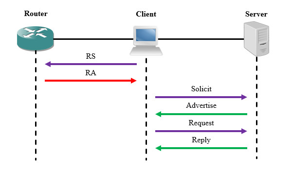
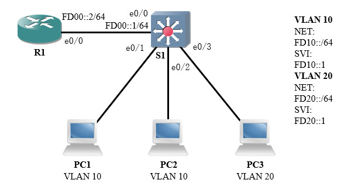

# 简介
IPv6终端能够通过SLAAC方式自主配置接口地址，但这种方法可管理性较差，且无法获取DNS、NTP等服务器配置。

IPv6动态主机配置协议(Dynamic Host Configuration Protocol for IPv6, DHCPv6)是为主机分配IPv6地址、前缀和其他配置参数的协议，便于管理员对终端进行地址管理，并且能够推送额外的服务器配置信息。

# 术语
## DHCP唯一标识符
每个服务器或客户端都有一个DHCP唯一标识符(DHCP Unique Identifier, DUID)，服务器使用DUID来识别不同的客户端，客户端则使用DUID来识别不同的服务器。

## 身份联盟
身份联盟(Identity Association, IA)是一系列相关的IPv6地址集合，每个IA包括IAID和配置信息。客户端会将使用DHCP服务的接口关联到IA，从服务器获取配置信息。

# 报文格式
DHCPv6报文封装在UDP内，服务器监听547端口，客户端监听546端口。

DHCPv6报文使用了两个组播地址，"FF02::1:2"表示链和路上所有DHCPv6服务器中继代理，用于网段内部通信；"FF05::1:3"表示站点内所有DHCPv6服务器，用于中继代理和服务器之间通信。

DHCPv6报文的格式如下文图片所示：

<div align="center">


</div>

其中各字段的说明详见下文内容：

🔷 Type

报文类型，长度1字节。

🔷 TransAction ID

事务ID，长度3字节。

用于标识一次报文交互，客户端发送报文时生成随机数，服务器的响应报文应设置与客户端相同的事务ID。若服务器主动发送报文，则该字段设为"0"。

🔷 Options

选项，采用TLV格式，长度可变。

用于描述配置信息，内容视报文类型而定。

# 报文类型
## Solicit
客户端向DHCP服务器发出地址请求，发往"FF02::1:2"。

## Advertise
服务器通告客户端其可以提供的配置信息。

## Request
客户端发送确认报文给服务器，告知其采用的地址信息与关联的服务器。

## Confirm
当链路状态发生变化时，客户端发送询问报文给服务器，检查自己当前的IPv6地址是否仍然可用。

## Renew
IPv6地址的推荐使用时间到达50%时，客户端发送该报文请求刷新配置。

## Rebind
IPv6地址的推荐使用时间到达80%时，客户端发送该报文请求刷新配置。

## Reply
服务器使用不带配置信息的Reply报文以回复Solicit、Request、Confirm、Renew、Rebind、Release、Decline报文；使用携带配置信息的Reply报文回复Information-Request报文。

## Release
当客户端不再使用某个被分配的地址时，将使用Release报文告知服务器，可以清除绑定信息。

## Decline
客户端若发现服务器推送的地址已被占用，则用此报文告知服务器。

## Information-Request
若路由器的RA报文中O位置位，则客户端使用SLAAC方式配置地址，然后用此报文向服务器请求DNS、NTP等额外的配置。

## Reconfigure
当服务器上的配置发生变更时，服务器用此报文通知客户端需要刷新配置。

## Relay-Forward
中继代理将客户端报文封装在其中转发给服务器。

## Relay-Reply
服务器发送报文给经过中继的客户端时，将消息封装在此报文中。

# 工作流程
## RA报文标志位
DHCPv6无法独立工作，需要与ICMPv6相互配合。

DHCPv6支持有状态自动配置与无状态自动配置两种方式，客户端将根据路由器通告的RA报文标志位选择配置方式。

RA报文的Flag字段中包含一系列配置项，其中M(Managed Address Configuration)位表示“地址可管理”，默认值为"0"，置为"0"时，客户端通过SLAAC方式自行配置地址；置为"1"时，客户端通过DHCP方式配置地址。O(Other Configuration)位表示“是否请求其它配置”，默认值为"0"，置为"0"时，客户端不会向DHCP服务器请求额外的配置信息；置为"1"时，客户端会向DHCP服务器请求额外的配置信息，但DHCP服务器不会记录此客户端。

M位和O位有以下组合：

🔷 M与O均不置位

客户端只能使用SLAAC方式或手动方式配置地址，需要手动配置额外信息（DNS服务器等），这是无任何配置时的默认情况。

🔷 M与O位均置位

DHCP有状态自动配置，客户端从DHCP服务器请求地址与额外信息。

🔷 M不置位，O置位

DHCP无状态自动配置，客户端使用SLAAC方式或手动方式配置地址，从DHCP服务器请求额外信息。

🔷 M置位，O不置位

从服务器请求地址，但不请求额外信息，我们通常不会使用这种配置。

## 有状态自动配置
客户端首先发送RS报文查询DHCP配置，路由器回复RA报文后，客户端检查Flag位，发现M位与O位均被置位；接着发送Solicit报文给所有DHCP服务器，服务器回复Advertise报文告知其可以使用的配置。存在多个服务器时，将选择优先级最高的服务器。

客户端确认采用服务器推送的配置后，发送Request报文告知所有DHCP服务器；服务器正式建立地址映射关系并回复Reply报文。

<div align="center">



</div>

## 无状态自动配置
客户端首先发送RS报文查询DHCP配置，路由器回复RA报文后，客户端检查Flag位，发现仅O位置位，则使用SLAAC方式自行配置地址，接着发送Information-Request报文请求额外的服务器信息，服务器使用Reply报文回复其请求的信息。

<div align="center">


</div>

# 基本应用
## 场景描述
本实验将通过DHCPv6协议，实现终端设备IPv6地址的自动配置。

本实验的拓扑如下图所示：

<div align="center">



</div>

主机PC1与PC2在VLAN 10中，PC3在VLAN 20中；我们在三层交换机S1上配置针对VLAN 10的DHCP服务，为PC1和PC2分发IPv6地址与网关等信息。

由于VPCS对DHCPv6支持不佳，此处的3台PC均使用路由器代替。

## 配置步骤
我们首先在S1上全局启用DHCP服务：

```text
S1(config)# service dhcp
```

接着创建一个地址池，网段为 `FD10::/64` ；主要和次要DNS分别指向 `2400:3200::1` 和 `2001:4860:4860::8888` 。

```text
# 创建名为"Pool_VLAN10"的地址池，并进入配置菜单。
S1(config)# ipv6 dhcp pool Pool_VLAN10

# 配置地址池对应的网段信息
S1(config-dhcpv6)# address prefix FD10::/64

# 配置DNS服务器地址
S1(config-dhcpv6)# dns-server 2400:3200::1
S1(config-dhcpv6)# dns-server 2001:4860:4860::8888

# 退出地址池配置菜单
S1(config-dhcpv6)# exit
```

然后我们需要在VLAN 10的SVI接口上配置RA标志位，并将地址池应用到当前接口。

```text
# 进入SVI端口配置菜单
S1(config)# interface vlan 10

# 将RA消息中的M位置位
S1(config-if)# ipv6 nd managed-config-flag

# 将RA消息中的O位置位
S1(config-if)# ipv6 nd other-config-flag

# 将地址池应用到当前接口
S1(config-if)# ipv6 dhcp server Pool_VLAN10

# 退出端口配置菜单
S1(config-if)# exit
```

DHCPv6与DHCPv4的配置方法有所差异，设备不会自动根据客户端所在网段匹配地址池，而是需要我们手动在接口上指明地址池。

我们将PC1和PC2的接口都配置为通过DHCP获取地址，此处以PC1为例：

```text
# 进入端口配置菜单
PC1(config)# interface e0/0

# 启用IPv6
PC1(config-if)# ipv6 enable

# 将端口地址获取方式设置为DHCP
PC1(config-if)# ipv6 address dhcp

# 查看端口地址信息
PC1# show ipv6 interface brief 
Ethernet0/0            [up/up]
    FE80::A8BB:CCFF:FE00:3000
    FD10::68CE:AB17:566E:8BF9
```

通过控制台输出的消息，我们可以知晓IPv6地址已经申请成功。

## 功能验证
我们在PC1上进行Ping测试，目标为PC2申请的IP地址：

```text
PC1# ping FD10::E406:3F17:E1FC:5256 source e0/0
Sending 5, 100-byte ICMP Echos to FD10::E406:3F17:E1FC:5256, timeout is 2 seconds:
Packet sent with a source address of FD10::68CE:AB17:566E:8BF9
!!!!!
Success rate is 100 percent (5/5), round-trip min/avg/max = 2/3/6 ms
```

此时PC1与PC2能够双向通信，说明DHCP服务工作正常。

我们可以在S1上使用 `show ipv6 dhcp binding` 命令查看已经分发的地址信息：

```text
S1# show ipv6 dhcp binding 
Client: FE80::A8BB:CCFF:FE00:3000 
  DUID: 00030001AABBCC003000
  IA NA: IA ID 0x00030001, T1 43200, T2 69120
    Address: FD10::68CE:AB17:566E:8BF9
            preferred lifetime 86400, valid lifetime 172800
            expires at Mar 31 2024 01:55 PM (168028 seconds)
Client: FE80::A8BB:CCFF:FE00:4000 
  DUID: 00030001AABBCC004000
  IA NA: IA ID 0x00030001, T1 43200, T2 69120
    Address: FD10::E406:3F17:E1FC:5256
            preferred lifetime 86400, valid lifetime 172800
            expires at Mar 31 2024 01:56 PM (168083 seconds)
```

# 快速交互
## 简介
DHCPv6支持快速提交(Rapid Commit)功能，若服务器和客户端都开启此功能，只需要一轮报文交互即可完成地址配置。

客户端请求进行快速交互时，其Solicit报文中会携带相关信息，服务器若开启该功能，则将配置信息放入Reply报文直接发给客户端。

快速交互的报文交互流程如下文图片所示：

<div align="center">


</div>

## 配置示例
在前文示例中，我们为PC2的端口启用快速交互特性。

```text
# 进入端口配置菜单
PC2(config)# interface e0/0

# 启用快速交互功能
PC2(config-if)# ipv6 address dhcp rapid-commit
```

# DHCP中继代理
## 简介
DHCPv6与DHCPv4类似，我们可以将服务器部署在本地网络外部，然后使本地网络的三层接口通过中继方式转发DHCPv6报文。

## 配置示例
DHCP中继代理功能应配置在客户端与服务器之间的第一个三层接口上，若客户端连接交换机，应在客户端VLAN的SVI上配置；若客户端连接路由器，应在路由器直连客户端的端口上配置。

在前文示例中，目前VLAN 20还未配置DHCP服务器，我们将其配置在路由器R1上，使用交换机的SVI进行中继，实现跨网段的DHCP服务。

```text
# 进入接口配置菜单
S1(config)# int vlan 20

# 指定中继目标地址
S1(config-if)# ipv6 dhcp relay destination FD00::2

# 退出接口配置菜单
S1(config-if)# exit
```

# 命令列表
## Cisco设备
### 基本配置
以下命令用于配置基本功能。

🔷 开启或关闭DHCP服务

```text
Cisco(config)# [no] service dhcp
```

🔷 创建地址池并进行配置

```text
# 进入地址池配置菜单
Cisco(config)# ipv6 dhcp pool <地址池名称>

# 设置网络信息
Cisco(config-dhcpv6)# address prefix <网络前缀>/<前缀长度>

# 设置DNS
# 该命令重复输入时，可以添加多个IPv6的DNS地址。
Cisco(config-dhcpv6)# dns-server <DNS服务器地址>

# 设置域名
Cisco(config-dhcpv6)# domain-name <域名>
```

### 调试工具
以下命令可以显示设备的状态信息，以便我们排除故障。

🔶 查看地址池配置

```text
Cisco# show ipv6 dhcp pool
```

🔶 查看客户端与地址的绑定关系

```text
Cisco# show ipv6 dhcp binding
```

🔶 查看接口关联的DHCP配置

```text
Cisco# show ipv6 dhcp interface <接口ID>
```

🔶 清除DHCP绑定关系

```text
Cisco# clear ipv6 dhcp binding *
```

### 客户端配置
网络设备的三层接口可以作为DHCP客户端，从服务器获取地址。

```text
# 进入端口配置菜单
Cisco(config)# interface <端口ID>

# 将IP地址设为通过DHCP获取
Cisco(config-if)# ipv6 address dhcp [rapid-commit]
```
