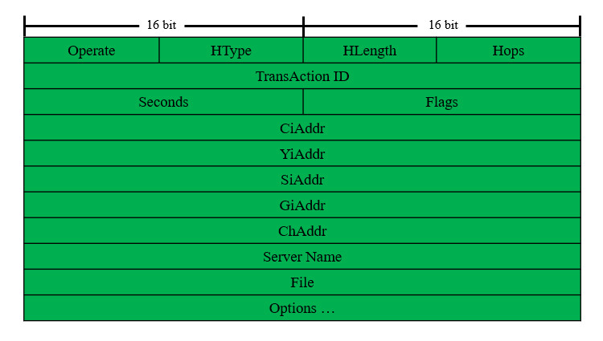
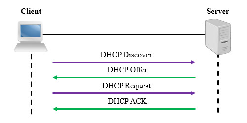
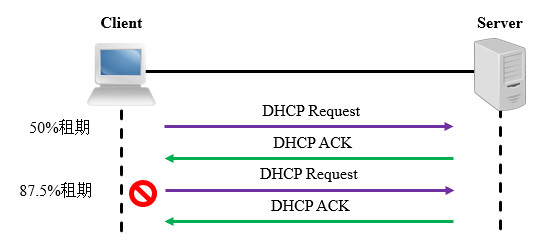
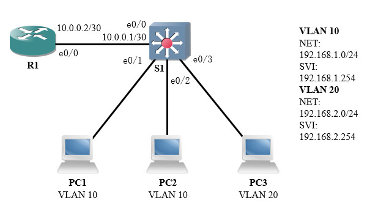
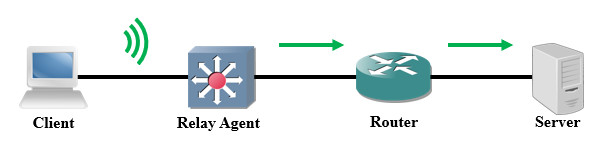

# 简介
动态主机配置协议(Dynamic Host Configuration Protocol, DHCP)被广泛应用于各种局域网、广域网环境，其主要作用是集中管理与分配IP地址，使得网络中的主机能够自动获取IP地址、默认网关、DNS地址等信息，无需管理员手动进行配置。DHCP提升了网络的可管理性，并且能够防止IP地址冲突。

DHCP的前身是BOOTP，BOOTP也能够分配IP地址、子网掩码、默认网关、DNS地址、网络启动服务器等信息；但BOOTP是静态的，管理员需要预先记录客户端的MAC地址并配置对应的IP地址，使用较为繁琐，目前BOOTP已经被DHCP所取代了。

DHCP协议采用客户端/服务器模型，并且能够兼容BOOTP协议，相关标准在RFC 2131等文档中定义与演进。

# 术语
## DHCP服务器
为接入的终端提供IP地址分配服务的设备即被称为DHCP服务器。

## DHCP客户端
当我们将终端设备网卡的地址配置方式设为DHCP时，该设备就成为了一个客户端。

除了终端设备之外，我们有时也会将网络设备的端口作为DHCP客户端，使其从DHCP服务器获取相关信息。

## 客户端标识符
DHCP服务器可以使用标识符来唯一标识每个客户端，有时也会使用硬件地址标识客户端。

标识符的格式为：“硬件类型+物理地址”，表示方法为：“2字节点分”记法。当我们使用以太网作为链路层协议时，硬件类型固定为"01"，假如网卡MAC地址为"00:50:79:66:68:03"，则对应的标识符为"0100.5079.6668.03"。

## 作用域
作用域通常是一个IP网段，DHCP服务器根据作用域为相应网络内的设备提供服务，不同的作用域具有各自的配置组合（IP网段、网关、DNS服务器等）。

## 排除地址
作用域内的某些地址有特殊用途，这些地址不能被分配给终端设备。

## 地址池
除了排除地址之外，作用域内所有可供分配地址的集合被称为地址池。

## 租约时间
客户端通过动态分配方式获得的地址有最长使用时间限制，租约期过半时客户端将会尝试向服务器续订地址。

对于较小型、客户端连接断开频繁的环境，可以设置较短的时间，以便及时回收地址资源；对于较大型、客户端相对固定的环境，可以设置较长的时间，减少DHCP报文交互对带宽资源的占用。

# 报文格式
DHCP报文封装在UDP协议中，服务器使用67端口，客户端使用68端口。

DHCP报文的格式如下文图片所示：

<div align="center">



</div>

其中各字段的说明详见下文内容：

🔷 Operate

操作类型，长度1字节。

客户端请求时值为"1"，服务器应答时值为"2"。

🔷 HType

硬件类型，长度1字节。

以太网环境下该值固定为"1"。

🔷 HLength

硬件地址长度，长度1字节。

以太网环境下使用MAC地址，该值固定为"6"。

🔷 Hops

跳步计数，长度1字节。

服务器与客户端在同一网段内时取值为"0"；需要中继时，每经过一个节点则数值增加1。

🔷 TransAction ID

事务ID，长度4字节。

由客户端随机产生，用来标识一个会话，服务器发送回应报文时会复制该数值。

🔷 Seconds

客户端重新申请地址经过的时间，长度2字节。

🔷 Flags

标志位，长度2字节。

最高位为"1"时表示服务器使用广播方式发送响应报文，否则为单播方式；其余位均为保留位。

🔷 CiAddr

需要续租的IP地址。

客户端请求续期租约时，原先获得的地址将会填入此处。

🔷 YiAddr

服务器会将分配给客户端的地址填入此处，DHCP Offer和ACK消息中将会携带。

🔷 SiAddr

网络启动服务器的IP地址。

若客户端需要使用网络启动，此处填写网络启动服务器的地址。

🔷 GiAddr

中继代理的IP地址。

若需要跨网段进行DHCP中继，中继代理会将自己的地址填入此处。

🔷 ChAddr

客户端硬件地址，长度16字节。

客户端的硬件地址，以太网中此处填写MAC地址，不满16字节的部分以"0"填充。

🔷 Server Name

服务器名称，长度8字节。

🔷 File

网络启动程序路径，长度16字节。

若客户端需要使用网络启动，此处填写启动程序的路径。

🔷 Options

可选项，是一个不定长字段。

每个报文可以携带多个选项，用于向终端设备提供更多的配置信息，如子网掩码、默认网关、DNS服务器地址等。

每个选项采用TLV格式，首字节为序号，次字节为该项的数据长度，最后为有效内容。

常用的DHCP选项可参考下文表格：

<div align="center">

| 代码  |              用途              |
| :---: | :----------------------------: |
|   1   |            子网掩码            |
|   3   |            网关地址            |
|   6   |         DNS服务器地址          |
|  12   |           主机名信息           |
|  15   |            域名信息            |
|  51   |            租约时间            |
|  53   |          DHCP消息类型          |
|  54   |         DHCP服务器地址         |
|  55   | 客户端需向服务器请求的信息列表 |
|  58   |  续约时间1，一般为租期的50%。  |
|  59   | 续约时间2，一般为租期的87.5%。 |
|  60   |          设备厂商信息          |
|  61   |          客户端标识符          |
|  82   |          中继代理信息          |
|  138  |         CAPWAP接入地址         |
|  255  |        选项区域结束标志        |

</div>

# 报文类型
## Discover
客户端接入网络时广播该消息，等待服务器响应。

## Offer
服务器通告给客户端其可以提供的配置信息。

## Request
客户端接受服务器推送的配置或需要续租地址时发送给服务器。

## Decline
客户端若发现服务器推送的地址已被占用，则用此报文告知服务器。

## ACK
服务器确认客户端接受了配置的消息，正式建立地址与客户端的映射关系。

## NAK
服务器用于告知客户端其请求的地址不正确或租期已超时。

## Inform
当客户端已有IP地址时，用该报文向服务器请求其它参数。

## Release
客户端释放已被分配的地址前，用该报文通知服务器。

# 工作流程
## 首次租用地址
客户端网卡启动后，首先向网段内广播Discover消息，以请求地址信息；服务器收到Discover消息后，从地址池中选择一个可用地址，将其装入Offer消息并广播到作用域所在的网段中。

客户端收到Offer消息后将广播Request消息，告知服务器确认使用Offer消息中所分配的地址。服务器收到Request消息后，将会广播ACK消息，同时正式建立IP地址与客户端的映射关系。

服务器回复的消息是否为广播由Flag位决定，各厂商的默认设置不同，视具体情况而定。

<div align="center">



</div>

当网络中存在多个DHCP服务器时，客户端将会选择其最先收到Offer消息的发送者。

## 续租地址
续约时间I到期时，客户端将会发送Request消息以请求续约，收到ACK消息后即可继续使用当前地址。

如果客户端未收到首次续租的ACK消息，将会在续约时间II到期时再次尝试续约；最终租约时间到期后，客户端将会放弃当前地址，重新开始申请过程。

<div align="center">



</div>

# 基本应用
## 场景描述
本实验将通过DHCP协议，实现终端设备IP地址的自动配置。

本实验的拓扑如下图所示：

<div align="center">



</div>

主机PC1与PC2在VLAN 10中，PC3在VLAN 20中；我们在三层交换机S1上配置针对VLAN 10的DHCP服务，为PC1和PC2分发IP地址与网关等信息。

## 配置步骤
我们首先在S1上全局启用DHCP服务：

```text
S1(config)# service dhcp
```

接着创建一个地址池，网段为 `192.168.1.0/24` ；网关指向VLAN 10的SVI；主要和次要DNS分别指向 `223.5.5.5` 和 `180.76.76.76` 。

```text
# 创建名为"Pool_VLAN10"的地址池，并进入配置菜单。
S1(config)# ip dhcp pool Pool_VLAN10

# 配置地址池对应的网段信息
S1(dhcp-config)# network 192.168.1.0 255.255.255.0

# 配置默认网关地址
S1(dhcp-config)# default-router 192.168.1.254

# 配置DNS服务器地址
S1(dhcp-config)# dns-server 223.5.5.5 180.76.76.76

# 退出地址池配置菜单
S1(dhcp-config)# exit
```

此时S1就成为VLAN 10中的DHCP服务器了，每当收到对应网段客户端发来的地址请求，服务器就会在相应的地址池中选择可用地址，并回复给客户端。

我们将PC1和PC2的接口都配置为通过DHCP获取地址，此处以PC1为例：

```text
# 将接口地址获取方式设置为DHCP
PC1> ip dhcp
DORA IP 192.168.1.1/24 GW 192.168.1.254

# 查看接口地址信息
PC1> show ip
NAME        : PC1[1]
IP/MASK     : 192.168.1.1/24
GATEWAY     : 192.168.1.254
DNS         : 223.5.5.5  180.76.76.76
DHCP SERVER : 192.168.1.254
DHCP LEASE  : 86370, 86400/43200/75600
MAC         : 00:50:79:66:68:02
MTU         : 1500
```

通过控制台输出的消息，我们可以知晓IP地址已经申请成功，并且服务器下发了网关与DNS地址等配置。

## 功能验证
我们在PC1上进行Ping测试，目标为PC2申请的IP地址：

```text
PC1> ping 192.168.1.2
84 bytes from 192.168.1.2 icmp_seq=1 ttl=64 time=0.316 ms
84 bytes from 192.168.1.2 icmp_seq=2 ttl=64 time=0.442 ms
84 bytes from 192.168.1.2 icmp_seq=3 ttl=64 time=0.455 ms
84 bytes from 192.168.1.2 icmp_seq=4 ttl=64 time=0.489 ms
```

此时PC1与PC2能够双向通信，说明DHCP服务工作正常。

我们可以在S1上使用 `show ip dhcp binding` 命令查看已经分发的地址信息：

```text
S1# show ip dhcp binding
Bindings from all pools not associated with VRF:
IP address       Client-ID               Lease expiration        Type       State      Interface
192.168.1.1      0100.5079.6668.02       May 30 2023 02:56 PM    Automatic  Active     Vlan10
192.168.1.2      0100.5079.6668.03       May 30 2023 03:26 PM    Automatic  Active     Vlan10
```

# DHCP静态绑定
## 简介
有时我们需要给一些客户端设置固定的地址，但又不想在客户端上写入静态配置，例如：Windows笔记本电脑只能针对网卡配置固定地址，我们在私有WiFi网络中配置了固定IP地址，当我们切换至公共WiFi网络时，需要删除静态地址并改为DHCP模式，操作非常繁琐。

针对这种场景，我们可以在私有网络的服务器上预先建立客户端与IP地址的映射关系，客户端可以保持使用DHCP方式获取地址；每当客户端接入本网络时，服务器总是会分配预设的IP地址，实现固定IP配置。

## 配置示例
此处对前文示例进行修改，我们在S1上添加一些配置，为PC2设置固定的DHCP地址。

对于Cisco设备，每条静态绑定关系都需要创建一个专用的地址池，并关联标识符/MAC与IP地址。

```text
# 为该静态映射关系创建单独的地址池
S1(config)# ip dhcp pool Pool_Static_PC2

# 设置需要分配给客户端的IP地址
S1(dhcp-config)# host 192.168.1.222 255.255.255.0

# 绑定客户端标识符
S1(dhcp-config)# client-identifier 0100.5079.6668.03

# 退出地址池配置菜单
S1(dhcp-config)# exit
```

我们也可以在地址池配置菜单中使用 `hardware-address <客户端标识符>` 命令绑定MAC地址，但Cisco设备优先识别客户端标识符，绑定MAC地址通常是无效的。

此时我们重新开启PC2的网卡，尝试重新请求地址。

```text
# 将接口地址获取方式设置为DHCP
PC2> ip dhcp
DORA IP 192.168.1.222/24 GW 192.168.1.254
```

上述输出信息表明PC2已经获取到了我们预先配置的IP地址。

# DHCP中继代理
## 简介
DHCP依赖广播机制运作，当DHCP客户端与服务器在同一物理网段时，可以正常工作；若不在同一网段，广播包无法传递给服务器，此时需要配置DHCP中继代理(Relay Agent)。

DHCP中继代理会将客户端的广播包改成单播包，这样客户端的消息就可以在IP网络中路由，直到抵达服务器。需要注意的是，各节点必须拥有到达服务器的路由信息，才能顺利转发数据包。

<div align="center">



</div>

中继节点收到客户端的报文后，会在其中插入Option 82选项，一般包含代理电路ID(Circuit ID)和代理远程ID(Remote ID)，分别标识了客户端信息与中继节点信息，这样服务器就能识别它们的身份了。当中继代理收到服务器的回复报文后，会先移除Option 82选项再将报文发送给客户端。

## 配置示例
DHCP中继代理功能应配置在客户端与服务器之间的第一个三层接口上，若客户端连接交换机，应在客户端VLAN的SVI上配置；若客户端连接路由器，应在路由器直连客户端的端口上配置。

在前文示例中，目前VLAN 20还未配置DHCP服务器，我们将其配置在路由器R1上，使用交换机的SVI进行中继，实现跨网段的DHCP服务。

```text
# 进入接口配置菜单
S1(config)# int vlan 20

# 设置中继目标地址
S1(config-if)# ip helper-address 10.0.0.2

# 退出接口配置菜单
S1(config-if)# exit
```

该命令不仅可以中继DHCP，也可以中继其它依赖于广播机制的协议。同一个端口上可以配置多条该命令，设备会为每个地址都生成一个相应的单播包。

# DHCP Snooping
## 简介
DHCP协议不具备认证机制，因此安全性较差，可能遭到以下攻击：

🔷 假冒的DHCP服务器

攻击者在自己的设备上建立DHCP服务器，并将自身配置为网关，客户端从假冒的DHCP服务器上获取配置后，将数据发送给假的网关，攻击者就可以截获机密信息。

🔷 拒绝服务攻击

攻击者模拟出许多不同的终端，向服务器发送大量的DHCP Discover报文，使DHCP服务器地址资源耗尽。

<br />

我们可以开启DHCP Snooping功能来防止上述攻击，开启该功能的设备会读取客户端与服务器的DHCP报文，记录IP地址、MAC地址、VLAN ID、端口ID和租约时间等信息，一旦检测到不符合记录的报文，则丢弃并发出警告。

除了检查报文与自身数据库是否匹配，DHCP Snooping还将VLAN内的端口分为非信任(Untrust)端口和信任(Trust)端口，默认所有端口均不被信任，只能转发Discovery和Request报文；信任端口则可以转发Offer和ACK报文。

## 配置方法
建议在接入交换机上部署DHCP Snooping，此处我们在S1上为VLAN 10启用该功能。

```text
# 全局开启DHCP Snooping功能
Cisco(config)# ip dhcp snooping

# 配置要开启DHCP Snooping功能的VLAN。
Cisco(config)# ip dhcp snooping vlan 10
```

当我们的服务器在本机，或者使用DHCP中继时，无需手动配置信任端口。若DHCP服务器连接在物理接口上，我们还需要将相应的端口设为信任端口。

```text
# 进入端口配置菜单
Cisco(config)# interface e0/1

# 配置该端口为信任端口
Cisco(config-if)# ip dhcp snooping trust

# 配置该端口每分钟最多接收Discoery报文的数量（可选）
Cisco(config-if)# ip dhcp snooping limit rate 512

# 退出端口配置菜单
Cisco(config-if)# exit
```

# 命令列表
## Cisco设备
### 基本配置
以下命令用于配置基本功能。

🔷 开启或关闭DHCP服务

```text
Cisco(config)# [no] service dhcp
```

🔷 创建地址池并进行配置

```text
# 进入地址池配置菜单
Cisco(config)# ip dhcp pool <地址池名称>

# 设置网络信息
Cisco(dhcp-config)# network <网络ID> <子网掩码>

# 设置默认网关
Cisco(dhcp-config)# default-router <默认网关地址>

# 设置DNS
Cisco(dhcp-config)# dns-server <主要DNS服务器地址> [次要DNS服务器地址]

# 设置租约时间
Cisco(dhcp-config)# lease <天数> <小时> <分钟>

# 设置域名
Cisco(dhcp-config)# domain-name <域名>

# 设置选项
Cisco(dhcp-config)# option <选项代码> <数据类型> <数据值>
```

### 参数调整
以下命令用于调整可选参数。

🔶 添加排除地址

```text
Cisco(config)# ip dhcp excluded-address <起始地址> [结束地址]
```

仅需排除单个地址时将其填入起始地址即可，结束地址不用填写。

### 静态绑定
在Cisco设备中，我们需要为每个静态绑定关系创建专用的地址池。

```text
# 进入地址池配置菜单
Cisco(config)# ip dhcp pool <静态地址池名称>

# 设置地址
Cisco(dhcp-config)# host <网络ID>/<前缀长度>

# 绑定客户端标识符
Cisco(dhcp-config)# client-identifier <客户端标识符>

# 退出地址池配置菜单
Cisco(dhcp-config)# exit
```

### DHCP Snooping
以下命令用于配置DHCP Snooping。

🔷 基本配置

若要使用DHCP Snooping，我们首先需要在设备上将其全局启用，再对指定VLAN启用该功能。

```text
# 全局开启DHCP Snooping
Cisco(config)# ip dhcp snooping

# 为指定VLAN开启DHCP Snooping
Cisco(config)# ip dhcp snooping vlan <VLAN ID>
```

🔷 配置信任端口

若DHCP服务器在交换机上，则SVI接口默认为信任端口，无需手动配置；若DHCP服务器在路由器上，我们需要手动配置信任端口。

```text
# 进入端口配置菜单
Cisco(config)# interface <端口ID>

# 将该端口设为信任端口
Cisco(config-if)# ip dhcp snooping trust
```

🔷 配置Discoery报文限制

我们可以为端口配置Discoery报文限制，防止短时间内收到过多报文。

```text
# 进入端口配置菜单
Cisco(config)# interface <端口ID>

# 配置Discoery报文限制
Cisco(config-if)# ip dhcp snooping limit rate <数量/个>
```

### 调试工具
以下命令可以显示设备的状态信息，以便我们排除故障。

🔶 查看地址池配置

```text
Cisco# show ip dhcp pool
```

🔶 查看客户端与地址的绑定关系

```text
Cisco# show ip dhcp binding
```

🔶 查看DHCP报文统计信息

```text
Cisco# show ip dhcp server statistics
```

🔶 清除DHCP绑定关系

```text
Cisco# clear ip dhcp binding *
```

### 客户端配置
网络设备的三层接口可以作为DHCP客户端，从服务器获取地址。

```text
# 进入端口配置菜单
Cisco(config)# interface <端口ID>

# 将IP地址设为通过DHCP获取
Cisco(config-if)# ip address dhcp
```
