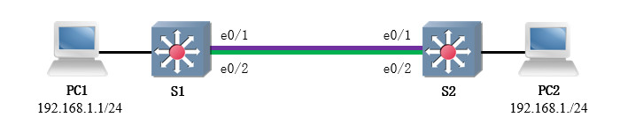

# 简介
链路聚合(Link Aggregation)技术可以将多条物理链路组合成为一条逻辑链路，当其中一条物理链路失效时，其它链路仍能正常工作，避免单条线缆故障引起的通信中断。

链路聚合技术提升了通信的可靠性；与此同时，多条链路能够执行负载均衡策略，充分利用了链路的带宽。

# 术语
## 聚合组
链路聚合基于组的概念实现，我们将物理端口加入组中后，逻辑端口就被创建了，该接口使用数字标识，且链路两端的标识需要保持一致。

每种设备单个聚合组最多支持的物理链路数量是不同的，我们可以查询设备手册了解详情；当组内成员数量为单数时，会导致流量分配不均衡。

同一聚合组中的物理端口需要满足以下限制条件：

- 具有相同的速率与双工设置。
- 具有相同的端口模式。
- 不可启用端口镜像功能。

## PAgP
端口聚合协议(Port Aggregation Protocol, PAgP)是Cisco的私有协议，适用范围较窄，我们通常不会使用该协议。

PAgP组中的物理端口可以被设置为On、Auto、Desirable三种模式，它们的含义如下文列表所示：

- `On` : 端口强制开启PAgP且不需要协商。
- `Auto` : 端口只侦听PAgP请求，不会主动向对端发送请求报文。
- `Desirable` : 端口将主动向对端发送建立EtherChannel的请求报文。

## LACP
链路聚合控制协议(Link Aggregation Control Protocol, LACP)即"IEEE 802.3ad"标准，该标准在2008年被并入"IEEE 802.1ax"标准。

LACP组中的物理端口可以被设置为Active和Passive两种模式。在Active模式下，设备会主动向组播地址 `01-80-C2-00-00-02` 发送LACP消息帧；在Passive模式下，设备只会被动侦听LACP消息。

# 实现原理
## 简介
设备会针对数据帧中的IP与MAC地址等信息进行散列计算，并将得出的结果映射到聚合组中的某条物理链路上。散列函数是映射结果的决定性因素，能够得到相同散列结果的数据帧，被称为一个会话或一条数据流。

当设备上只有一条数据流时，总会使用相同的物理链路进行转发，此时我们感受不到带宽增加。

## 负载均衡模式
此处以Cisco设备为例，其支持的负载均衡模式如下文列表所示：

- 源MAC：按照源MAC地址将报文分散到物理链路上。
- 目的MAC：按照目的MAC地址将报文分散到物理链路上。
- 源与目的MAC：同时将源MAC与目的MAC地址进行散列计算，然后分散到物理链路上。
- 源IP：按照源IP地址将报文分散到物理链路上（仅L3链路）。
- 目的IP：按照目的IP地址将报文分散到物理链路上（仅L3链路）。
- 源与目的IP：同时将源IP与目的IP地址进行散列计算，然后分散到物理链路上（仅L3链路）。

# 基本应用
## 场景描述
本实验将通过链路聚合技术，使用LACP协议实现设备间互联链路的高可用性。

本实验的拓扑如下文图片所示：

<div align="center">



</div>

计算机PC1与PC2（均为VPCS模拟器）分别与交换机S1、S2的两个端口直连；交换机之间有两条线缆互联。

## 配置步骤
以S1为例，我们首先需要将两个物理端口加入聚合端口内。

```text
# 进入物理端口配置菜单
S1(config)# interface range e0/1-2

# 指定协议为LACP
S1(config-if-range)# channel-protocol lacp

# 将这些端口加入编号为"1"的组，且设置本端为主动端。
S1(config-if-range)# channel-group 1 mode active

# 返回前级菜单
S1(config-if-range)# exit
```

此时物理接口已经被加入聚合端口组，接下来我们需要在聚合端口组内配置虚拟端口的各项参数。

```text
# 进入聚合端口配置菜单
S1(config)# interface port-channel 1

# 将端口设为Trunk模式
S1(config-if)# switchport mode trunk

# 返回前级菜单
S1(config-if)# exit
```

S2的配置与S1是类似的，但我们需要将它的物理端口都设为被动端。

```text
S2(config)# interface range e0/1-2
S2(config-if-range)# channel-group 1 mode passive
S2(config-if-range)# exit
```

## 功能测试
我们在PC1上进行Ping测试，目标为PC2；与此同时，我们还需要关闭一组对应的物理端口（例如：S1的"e0/1"和S2的"e0/1"），以模拟线缆发生故障的情况。

```text
PC1> ping 192.168.1.2 -t

84 bytes from 192.168.1.2 icmp_seq=1 ttl=64 time=7.455 ms
84 bytes from 192.168.1.2 icmp_seq=2 ttl=64 time=3.000 ms
84 bytes from 192.168.1.2 icmp_seq=3 ttl=64 time=4.152 ms
192.168.1.2 icmp_seq=4 timeout
84 bytes from 192.168.1.2 icmp_seq=5 ttl=64 time=3.143 ms
84 bytes from 192.168.1.2 icmp_seq=6 ttl=64 time=2.640 ms
```

根据上述输出内容可知：

当PC1发送第4组ICMP报文时，S1与S2之间的一组互联链路被关闭，导致通信短暂中断；由于另一组互联链路仍然有效，后续的ICMP报文交互恢复正常。

# 三层聚合链路
我们不仅可以在链路层配置链路聚合，也可以在网络层配置链路聚合。

在前文示例中，我们已经将S1与S2的两个物理端口分配给二层聚合组，在转换端口模式前需要将它们从旧的聚合组中移除。

```text
# 进入物理端口配置菜单
S1(config)# interface range e0/1-2

# 将物理端口从聚合组中移除
S1(config-if-range)# no interface port-channel 1

# 将物理端口切换为三层模式
S1(config-if-range)# no switchport

# 将物理端口重新加入聚合组
S1(config-if-range)# interface port-channel 1

# 返回前级菜单
S1(config-if-range)# exit
```

此时两个物理端口已被设为三层模式，并重新成组，接着我们可以将聚合端口也切换为三层模式，并配置网络层相关的属性。

```text
# 进入聚合端口配置菜单
S1(config)# interface port-channel 1

# 将聚合端口设为三层模式
S1(config-if)# no switchport

# 配置IP地址
S1(config-if)# ip address 10.0.0.1 255.255.255.252

# 返回前级菜单
S1(config-if)# exit
```

# 命令列表
## Cisco设备
### 基本配置
以下命令用于配置基本功能。

🔷 创建聚合组

我们需要在物理接口配置菜单中进行配置，将其添加到某个聚合组中。

```text
Cisco(config)# interface e0/0
Cisco(config-if)# channel-group <聚合组ID> mode < active | passive | on | desirable | auto >
Cisco(config-if)# exit
```

🔷 配置聚合接口

当某个聚合组被添加第一个物理端口后，它的虚拟接口就会被自动创建；我们可以进入虚拟接口的配置菜单添加其他配置项。

```text
Cisco(config)# interface port-channel <聚合组ID>
```

### 参数调整
以下命令用于调整可选参数。

🔶 配置链路聚合协议

我们可以在物理接口的配置菜单中选择链路聚合协议。

```text
Cisco(config)# interface e0/0
Cisco(config-if)# channel-protocol < pagp | lacp >
Cisco(config-if)# exit
```

🔶 配置负载均衡模式

我们可以通过 `port-channel load-balance <模式>` 命令调整所有聚合链路的负载均衡模式。


```text
# 修改链路聚合的负载均衡模式
Cisco(config)# port-channel load-balance <模式>
```

该命令对于当前设备上的所有聚合链路全局生效，聚合链路两端的设备可以配置不同的模式。

### 调试工具
以下命令可以显示设备的状态信息，以便我们排除故障。

🔶 查看所有聚合端口的状态

执行 `show etherchannel summary` 命令可以查看当前设备上所有聚合端口的概述信息。

```text
Cisco# show etherchannel summary 
Flags:  D - down        P - bundled in port-channel
        I - stand-alone s - suspended
        H - Hot-standby (LACP only)
        R - Layer3      S - Layer2
        U - in use      N - not in use, no aggregation
        f - failed to allocate aggregator

        M - not in use, minimum links not met
        m - not in use, port not aggregated due to minimum links not met
        u - unsuitable for bundling
        w - waiting to be aggregated
        d - default port

        A - formed by Auto LAG

Number of channel-groups in use: 1
Number of aggregators:           1

Group  Port-channel  Protocol    Ports
------+-------------+-----------+-----------------------------------------
1      Po1(SU)         LACP      Et0/1(P)    Et0/2(P)
```

🔶 查看指定聚合端口的状态

执行 `show interfaces port-channel <端口ID>` 命令可以查看指定聚合端口的详细信息。

```text
Cisco# show interfaces port-channel 1
Port-channel1 is up, line protocol is up (connected) 
  Hardware is EtherChannel, address is aabb.cc00.1020 (bia aabb.cc00.1020)
  MTU 1500 bytes, BW 20000 Kbit/sec, DLY 100 usec, 
     reliability 255/255, txload 1/255, rxload 1/255
  Encapsulation ARPA, loopback not set

# 此处省略部分输出内容...
```
