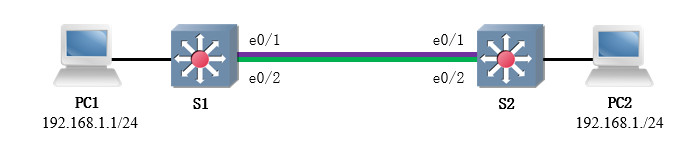

# 简介
链路聚合(Link Aggregation)技术，可以将多条物理链路组合为一条逻辑链路，当一条物理链路失效时，其它链路仍能正常工作，避免单条线缆故障引起的通信中断，提高了可用性。与此同时，多条链路能够执行负载均衡策略，也提高了带宽。

# 术语
## 聚合组
链路聚合基于组来实现，将端口加入组中后，逻辑端口就被创建了，该接口使用数字标识，且链路两端的标识需要一致。

## PAgP
端口聚合协议(Port Aggregation Protocol,PAgP)是Cisco私有协议。
PAgP端口可以设置为On、Auto、Desirable模式。在On模式下，端口强制开启PAgP而不需要协商；在Desirable模式下，端口将主动向对端发送建立EtherChannel的请求；在Auto模式下，端口只侦听PAgP请求，不会主动发送请求。

## LACP
链路聚合控制协议(Link Aggregation Control Protocol,LACP)是IEEE 802.3ad标准，该标准在2008年被转入IEEE 802.1ax。
LACP端口可以配置为Active或Passive模式。在Active模式下，端口会主动向链路上发送LACP消息帧；在Passive模式下，将侦听LACP消息，只有收到Active端发送的消息时才会进行回应。

# 实现原理
交换机会针对数据帧中的地址信息进行散列计算，并将得出的结果映射到某条物理链路上，散列函数是映射结果的决定性因素。能够得到相同散列结果的帧，称为一个会话或者一条数据流。只有一股数据流时，总使用相同的物理链路，此时感受不到带宽增加。
一个聚合组内最多可以拥有8条物理链路，当组内成员为单数时，会导致流量分配不均衡。

            8.1.5   成组条件
    • 端口使用相同的速率和双工设置。
    • 端口使用相同的模式(Access或Trunk)。
    • 端口为Access模式时，要属于同一个VLAN。
    • 端口为Trunk模式时，两端参数要一致。
    • 每个VLAN的STP开销设置必须相同。
    • 禁止启用端口镜像。


# 基本应用
## 场景描述
本实验将通过链路聚合技术，使用LACP协议实现设备间互联链路的高可用性。

本实验的拓扑如下文图片所示：

<div align="center">



</div>

计算机PC1与PC2（均为VPCS模拟器）分别与交换机S1、S2的两个端口直连；交换机之间有两条线缆互联。

## 配置步骤
以S1为例，我们首先需要将两个物理端口加入聚合端口内。

```text
# 进入物理端口配置菜单
S1(config)# interface range e0/1-2

# 指定协议为LACP
S1(config-if)# channel-protocol lacp

# 将这些端口加入编号为"1"的组，且设置本端为主动端。
S1(config-if)# channel-group 1 mode active

# 返回前级菜单
S1(config-if)# exit
```

此时物理接口已经被加入聚合端口组，接下来我们需要在聚合端口组内配置虚拟端口的各项参数。

```text
# 进入聚合端口配置菜单
S1(config)# interface port-channel 1

# 将端口设为Trunk模式
S1(config-if)# switchport mode trunk

# 返回前级菜单
S1(config-if)# exit
```

S2的配置与S1是类似的，但我们需要将它的物理端口都设为被动端。

```text
# 进入物理端口配置菜单
S2(config)# interface range e0/1-2
S2(config-if)# channel-group 1 mode passive
S2(config-if)# exit
```

## 功能测试
我们在PC1上进行Ping测试，目标为PC2；与此同时，我们还需要关闭一组对应的物理端口（例如：S1的"e0/1"和S2的"e0/1"），以模拟线缆发生故障的情况。


# 三层聚合链路
我们不仅可以配置二层聚合链路，还可以配置三层聚合链路。
创建三层聚合链路时，要先将物理接口设为三层模式，然后再加入聚合组，IP地址应该配置在聚合端口上，而不是物理接口。

# 负载均衡模式
# 模式
    • 源MAC
按照源MAC地址将报文分散到物理链路上。
    • 目的MAC
按照目的MAC地址将报文分散到物理链路上。
    • 源-目的MAC
同时将源MAC与目的MAC地址进行散列计算，然后分散到物理链路上。
    • 源IP
按照源IP地址将报文分散到物理链路上（仅L3链路）。
    • 目的IP
按照目的IP地址将报文分散到物理链路上（仅L3链路）。
    • 源+目的IP地址
同时将源IP与目的IP地址进行散列计算，然后分散到物理链路上（仅L3链路）。

# 相关命令
    • 配置负载均衡模式
Cisco(config)#port-channel load-balance [模式]
注意：聚合链路两端可以使用不同的负载均衡模式，且设置对于本交换机全局生效。


# 命令列表
## Cisco设备
### 基本配置
🔷 创建聚合接口


# 配置方法
                • 基础配置
    • 将端口加入聚合组
Cisco(config-if)#channel-group [聚合组ID] mode [active|passive|on|desirable|auto]
    • 配置聚合端口
Cisco(config)#interface port-channel [聚合组ID]
                • 参数调整
    • 配置链路聚合协议（物理接口）
Cisco(config-if)#channel-protocol [pagp|lacp]
                • 查询相关信息
    • 查看聚合端口概览
Cisco#show etherchannel summary
    • 查看指定聚合端口的属性
Cisco#show interface port-channel [聚合组ID]


### 调试工具
🔶 查看所有聚合接口状态

执行 `show etherchannel summary` 命令可以查看当前设备上所有聚合接口的概述信息。

```text
S1#show etherchannel summary 
Flags:  D - down        P - bundled in port-channel
        I - stand-alone s - suspended
        H - Hot-standby (LACP only)
        R - Layer3      S - Layer2
        U - in use      N - not in use, no aggregation
        f - failed to allocate aggregator

        M - not in use, minimum links not met
        m - not in use, port not aggregated due to minimum links not met
        u - unsuitable for bundling
        w - waiting to be aggregated
        d - default port

        A - formed by Auto LAG


Number of channel-groups in use: 1
Number of aggregators:           1

Group  Port-channel  Protocol    Ports
------+-------------+-----------+-----------------------------------------------
1      Po1(SU)         LACP      Et0/1(P)    Et0/2(P)
```

参数说明：


🔶 查看所有聚合接口状态

```text
S1#show interfaces port-channel 1
Port-channel1 is up, line protocol is up (connected) 
  Hardware is EtherChannel, address is aabb.cc00.1020 (bia aabb.cc00.1020)
  MTU 1500 bytes, BW 20000 Kbit/sec, DLY 100 usec, 
     reliability 255/255, txload 1/255, rxload 1/255
  Encapsulation ARPA, loopback not set
  Keepalive set (10 sec)
  Full-duplex, Auto-speed, media type is RJ45
  input flow-control is off, output flow-control is unsupported 
  Members in this channel: Et0/1 Et0/2 
  ARP type: ARPA, ARP Timeout 04:00:00
  Last input 00:31:35, output never, output hang never
  Last clearing of "show interface" counters never
  Input queue: 0/2000/0/0 (size/max/drops/flushes); Total output drops: 0
  Queueing strategy: fifo
  Output queue: 0/40 (size/max)
  5 minute input rate 0 bits/sec, 0 packets/sec
  5 minute output rate 0 bits/sec, 0 packets/sec
     95 packets input, 8642 bytes, 0 no buffer
     Received 14 broadcasts (0 multicasts)
     0 runts, 0 giants, 0 throttles 
     0 input errors, 0 CRC, 0 frame, 0 overrun, 0 ignored
     0 input packets with dribble condition detected
     2376 packets output, 177482 bytes, 0 underruns
     0 output errors, 0 collisions, 0 interface resets
     0 unknown protocol drops
     0 babbles, 0 late collision, 0 deferred
     0 lost carrier, 0 no carrier
     0 output buffer failures, 0 output buffers swapped out
```