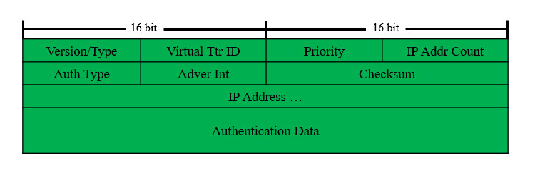
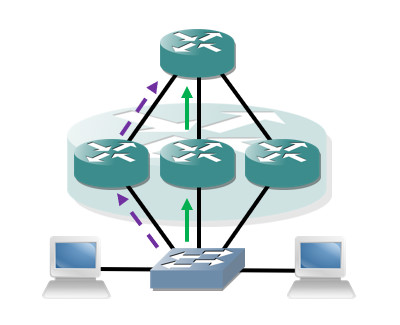
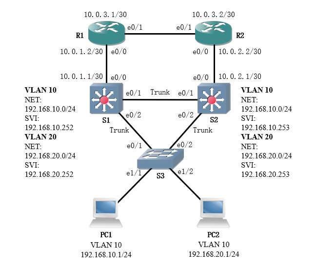

# 简介
虚拟路由器冗余协议(Virtual Router Redundancy Protocol, VRRP)是一种网关冗余协议，能够保证终端设备默认网关的可靠性。

物理路由器之间通过VRRP报文交互，组成一台虚拟路由器，它有独立的IP和MAC地址；终端设备需要将虚拟路由器的IP地址作为默认网关；当某个物理路由器发生故障时，流量转发将切换至其它路由器，终端设备不会感知到这一过程。通过这种机制，VRRP实现了默认网关的热备份，保证了通信的连续和可靠，提升了网络的服务质量。

VRRP协议的相关标准由RFC 3768等文档进行规范；VRRP 2为IPv4服务，VRRP 3为IPv6服务。

# 术语
## VRRP路由器
运行VRRP协议的路由器被称为VRRP路由器，它们是物理实体。

## 虚拟路由器
虚拟路由器是指多个VRRP路由器组成的逻辑路由器，其拥有虚拟IP与虚拟MAC地址，用于充当终端设备的默认网关。

## VRRP组
一台物理路由器可以同时成为多个虚拟路由器的成员，并且充当不同的角色。

为了区分各个虚拟路由器，每个虚拟路由器都通过VRRP组号进行唯一标识，组号的取值范围为： `[1, 255]` 。组号属性将会在VRRP报文中传递并影响协商，因此属于同组的物理路由器必须被配置相同的组号。

## 主控路由器
主控(Master)路由器是VRRP组中实际转发数据包的设备，同时负责响应客户端的ARP请求，一个组中只能有一台主控路由器。

## 备份路由器
备份(Backup)路由器是VRRP组中处于监听状态的路由器，一旦主控路由器出现故障，备份路由器立即接替其工作；一个组中可以有多个备份路由器。

## 设备优先级
设备优先级用于选举主控路由器，取值范围为：`[0, 255]` ，数值越大则优先级越高，默认值为"100"。如果物理接口IP与虚拟IP相同，则该路由器的优先级为255。若多台路由器优先级相同，则比较它们的接口IP，其中数值最大的胜出。

# 报文格式
VRRP报文通过IP协议承载，协议号为112，目的地址为 `224.0.0.18` ，TTL值为255。

VRRP报文的格式如下文图片所示：

其中各字段的说明详见下文内容：

🔷 `Version`/`Type`

协议版本号与报文类型，长度1字节。

其中高四位表示协议版本号，低四位表示报文类型。

🔷 `Virtual Ttr ID`

虚拟路由器ID，长度1字节。

该ID即VRRP组号。

🔷 `Priority`

优先级，长度1字节，取值范围为： `[0, 255]` 。

🔷 `IP Addr Count`

报文中所携带的虚拟IP地址数量，长度1字节。

🔷 `Auth Type`

认证类型，长度1字节。

未使用认证功能时取值为"0"。

🔷 `Adver Int`

VRRP通告时间间隔，长度1字节。

🔷 `Checksum`

VRRP报文校验和，长度2字节。

🔷 `IP Address ...`

虚拟IP地址，长度4字节。

若我们配置了次要地址，则单条报文中将会携带两条地址信息。

🔷 `Authentication Data`

认证数据，长度8字节。

# 报文类型
VRRP协议的报文类型详见下文内容：

🔷 Announcement

目前VRRP仅有通告报文一种报文，VRRP进程初始化时用于主控路由器的选举。

当选举结束后主控路由器会定期发送该报文，表明其处于活跃状态；备份路由器通过持续监听该报文来知晓主控路由器的状态。

# 计时器
VRRP协议包含以下计时器：

🔷 通告计时器

主控路由器按照通告计时器的间隔发送VRRP通告报文，默认间隔为1秒。

🔷 主控失效计时器

备份路由器认为主控路由器失效的间隔，默认间隔为VRRP通告计时器的3倍。

# VRRP状态机
VRRP路由器包含以下状态：

🔷 初始状态(Initialize)

设备刚启动VRRP进程时的状态，通过报文交互后将会进入其他状态。

当设备处于活动状态或备份状态时，若VRRP相关的物理端口状态变为Down，设备也会进入初始状态。

🔷 活动状态(Master)

路由器通过报文交互后开始转发数据包。

🔷 备份状态(Backup)

路由器通过报文交互后处于监听状态但不转发数据包。

<!-- TODO

# 工作流程
首先各路由器相互收发VRRP宣告报文，并比较优先级；其中优先级最高的路由器将成为主控路由器。若有设备优先级相同，则比较各自接口的IP地址，数值较大的优先。

虚拟路由器都拥有一个MAC地址，格式为 `0000.5e00.01XX` ，其中的"XX"代表VRRP组号。

主控路由器发送无故ARP通告终端设备，并开始转发数据包；备份路由器则会持续监听主控路由器发出的通告报文，超过三倍的通告时间未收到宣告报文，则认为主控路由器失效，需重新选举新的主控路由器。

新选举出的主控路由器也会发送无故ARP刷新终端设备的ARP缓存，并接替数据转发工作，终端用户几乎感知不到实际转发设备发生了切换。

# 基本应用

# 抢占模式
抢占模式保证高优先级的路由器一接入网络就会成为主控路由器，如果抢占模式被关闭，具有高优先级的路由器不会主动成为主控路由器，只有当前主控路由器失效时，它们才会成为新的主控路由器。
VRRP协议的抢占模式默认开启，我们还可以设置抢占延时，以便其它控制层面协议准备就绪后再成为主控路由器，默认抢占延时为0秒（立即抢占）。
    • 开启/关闭抢占模式
Cisco(config-if)#{no} vrrp [组ID] preempt
    • 配置抢占延时
Cisco(config-if)#vrrp [组ID] preempt delay minimum [时间/秒]

# 上行链路追踪
主控路由器的上行链路失效后，备份路由器还能通过其它路径收到宣告报文，不会发生切换，此时数据转发将产生次优路径。
配置上行链路追踪后，设备将会定期检测上行链路的状态，一旦检测到故障就会降低自身优先级，配合抢占模式可实现数据转发路径自动切换，避免次优路径。
• 使用方法
思科设备需要先创建追踪对象，再把对象关联到VRRP组中。

• 配置高级追踪（示例：追踪链路协议状态）
1.配置追踪对象
Cisco(config)#track [追踪对象ID] interface [端口ID] line-protocol
2.将追踪对象关联到VRRP组中
Cisco(config-if)#vrrp [组ID] track [追踪对象ID] decrement [优先级减少量]
锐捷设备可以直接设置需要追踪的端口：
Ruijie(config-if)#vrrp [组ID] track [端口ID] [优先级减少量]

-->

<!-- TODO
# 配置命令
                • 基础配置
    • 将接口加入VRRP组
Cisco(config-if)#vrrp [组ID] ip [虚拟IP地址] {secondary}
secondary：表明该地址是虚拟路由器的次要IP地址。
    • 给VRRP组添加描述
Cisco(config-if)#vrrp [组ID] description [描述]
    • 设置设备优先级
Cisco(config-if)#vrrp [组ID] priority [优先级]
                • 参数调整
    • 设置VRRP通告计时器
Cisco(config-if)#vrrp [组ID] timers advertise [发送间隔]
    • 开启失效时间自动学习
Cisco(config-if)#vrrp [组ID] times learn
启用该特性后备份路由器会学习主控路由器的通告间隔，并自动调整失效计时器。
    • 配置VRRP认证
Cisco(config-if)#vrrp [组ID] authentication text [认证字符串]
                • 查询相关信息
    • 查看VRRP概要信息
Cisco#show vrrp brief
    • 查看VRRP接口配置信息
Cisco#show vrrp interface

-->