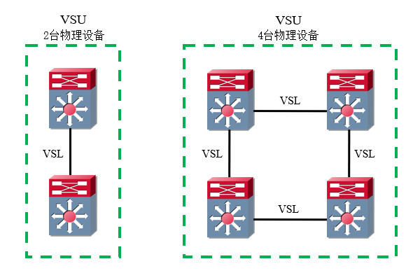

# 简介
虚拟交换单元(Virtual Switch Unit, VSU)是锐捷网络推出的私有交换机虚拟化技术，它能够将多台设备虚拟成一台逻辑设备。VSU技术实现了跨设备的管理板卡冗余，管理员在主控设备上进行的配置，将会实时同步到其它设备上；当主控设备发生故障时，其它设备能够接力提供控制能力。

VSU的技术架构如下文图片所示：

VSU技术可以增加端口密度、替代MSTP+VRRP的冗余方案、简化网络拓扑与管理，提高链路切换性能与带宽利用率。

# 术语
## 域ID
域ID是虚拟交换机的标识符，用来区分不同的VSU，取值范围为： `[1, 255]` ，默认值为"100"，同一个VSU内的成员必须有相同的域ID。

## 设备ID
设备ID是物理设备的编号，取值范围为： `[1, 8]` ，默认值为"1"。

在VSU模式中，设备端口号前将会增加设备ID，例如2号设备上的"GigabitEthernet 1/1"端口，名称将会变更为"GigabitEthernet 2/1/1"。

## 虚拟交换链路
虚拟交换链路(Virtual Switch Link, VSL)是物理设备之间的一组线缆，作为虚拟交换机的内部总线，用于传输控制信息与跨设备的流量。VSL的成员端口速率至少需要为万兆，且每条VSL至少应当包括两个成员端口，因为单条物理链路的可靠性较低。

当VSU只有两个成员时，我们可以使用单条VSL互联；当VSU具有两个以上的成员时，我们可以使用多条VSL首尾相接构成环形拓扑，以提高可靠性。

## 优先级
设备的优先级用于角色选举，取值范围为： `[1, 255]` ，默认值为"100"，数值越大则优先级越高。

更改优先级会影响VSU主控设备的稳定性，因此我们在拓扑稳定的VSU中更改优先级不会立即生效，需要重启设备后才会生效。

<!-- TODO

## 成员角色
VSU中的成员分为Active、Standby、Candidate角色，Active设备负责控制整个VSU，Standby设备监听Active设备状态，Candidate设备监听Standby设备状态。
Active设备的选举规则如下：
    • 当前主设备优先。
    • 优先级较大的优先。
    • MAC地址较小的优先。
Standby设备的选举规则如下：
    • 最靠近主设备的优先。
    • 优先级较大的优先。
    • MAC地址较小的优先。
选举完成后，Active设备向整个VSU拓扑发送Convergence报文，通知拓扑中所有设备一起进行收敛，然后VSU进入管理与维护阶段。通过Console接口访问设备时，只能使用Active设备上的接口，其它设备不能输入指令。

            8.2.3   拓扑维护
VSU中的成员通过VSL和其它成员之间交互VSU Hello报文收集拓扑关系。VSU Hello报文携带本机的成员编号、设备优先级、MAC信息、VSU端口连接关系等内容。每个成员会在状态为UP的VSL端口上洪泛Hello报文，其他成员收到该报文后，会从其它VSL端口转发出去。
当拓扑信息收集完毕后，进行角色选举，完毕后进入稳定状态。VSL链路故障将会导致VSU拓扑分裂，当VSL链路被修复后，又会进行拓扑合并操作。

            8.2.5   双主机检测
当某成员设备的所有VSL链路均断开时，原拓扑将会分裂成两个虚拟交换机，两个设备拥有相同的配置，可能造成交换环路、IP地址冲突等问题。
我们可以部署双主机检测机制，一旦检测到两个Active设备，优先级较低的设备将会进入恢复(Recovery)模式，关闭普通业务端口，防止网络中断。
当到达某设备的VSL链路全部失效后，设备间通过双主机检测链路互发测试报文，若收到对端的报文，则说明对端设备依然处于Active状态。
                • 配置示例
BFD协议或链路聚合协议都可以进行双主机检测，BFD协议适用于任何场景，但需要占用物理端口；如果连接VSU的设备上拥有跨VSU成员的链路聚合，此时可利用聚合链路进行双主机检测，不需要占用额外的端口。
此处以BFD协议为例，将两个设备的GigabitEthernet 0/1端口用于BFD检测。

图 11-5 基于BFD的双主机检测
1.BFD检测不能使用二层端口，需将端口设为三层模式。
VSU(config)#interface range Gi1/0/1,Gi2/0/1
VSU(config-if)#no switchport
VSU(config-if)#exit
2.开启双主机检测，指定方式为BFD并添加端口。
VSU(config)#switch virtual domain 1
VSU(config-vs-domain)#dual-active detection bfd
VSU(config-vs-domain)#dual-active bfd interface Gi1/0/1
VSU(config-vs-domain)#dual-active bfd interface Gi2/0/1
3.设置例外端口，这些端口在恢复模式时不会关闭，可用于远程控制设备。
VSU(config-vs-domain)#dual-active exclude interface Te1/0/1
VSU(config-vs-domain)#dual-active exclude interface Te2/0/1
VSU(config-vs-domain)#exit

-->

<!-- TODO
配置方法
基础配置
    • 配置VSU域ID
Ruijie(config)#switch virtual domain [域ID]
    • 配置VSU设备ID与优先级
Ruijie(config-vs-domain)#switch [设备ID] priority [设备优先级]
    • 配置VSL并添加成员端口
Ruijie(config)#vsl-port [VSL组ID]
Ruijie(config-vsl-ap-1)#port-member interface [成员端口ID]
    • 切换单机或VSU模式
Ruijie#switch convert mode [virtual|standalone]
                • 查询相关信息
    • 查看各设备版本信息
Ruijie#show version
    • 查看各设备角色
Ruijie#show switch virtual role
    • 查看VSL链路状态
Ruijie#show switch virtual link
    • 查看VSU配置信息
Ruijie#show switch virtual config
-->
