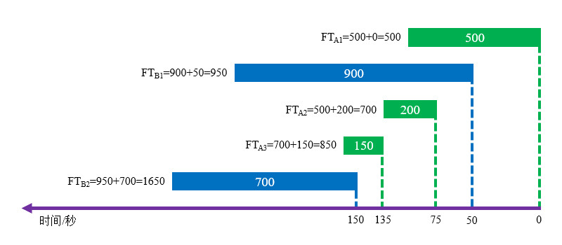

# 简介
对于“以太网+IP协议”的常见组合，我们通常使用差分服务模型实现QoS，实施步骤如下：

1. 通过各种工具区分不同类型的流量。
2. 给不同类型流量打上相应的标记。
3. 在设备接口上配置合适的调度策略。

通常来说步骤一与步骤二是同时进行的，一旦能够区分某一类流量，我们就可以立刻为其打上标记。

# 区分流量
## 简介
在网络体系中，每个层次的基础协议都有专门的字段，用于体现业务的重要程度，例如：以太网帧中的CoS字段(IEEE 802.1p)、IPv4数据包中的ToS字段、IPv6数据包中的Traffic Class字段和MPLS帧中的EXP字段。

需要注意的是，各种标识字段只是推荐的分类方式，具体的优先程度与转发行为由调度策略决定。对于未配置QoS策略的设备，通常会无视优先级字段，按照“尽力而为”的方式进行转发。

## IP优先级
在早期的RFC 1122标准中，使用IPv4数据包中ToS字段的高三位描述业务的优先级，其余位固定为"0"。

<div align="center">

| 优先级 | 二进制 |         名称         |          用途          |
| :----: | :----: | :------------------: | :--------------------: |
|   7    |  111   |   Network Control    |      控制层面协议      |
|   6    |  110   | Internetwork Control |      控制层面协议      |
|   5    |  101   |        Critic        |      语音业务流量      |
|   4    |  100   |    FlashOverride     |      视频业务流量      |
|   3    |  011   |        Flash         |      重要业务流量      |
|   2    |  010   |      Immediate       |      普通业务流量      |
|   1    |  001   |       Priority       |      普通业务流量      |
|   0    |  000   |       Routine        | 默认值，尽力而为服务。 |

</div>

## DSCP
区分服务码点(Differentiated Services Code Point, DSCP)由RFC 2474定义，使用ToS字段的高六位，其余位固定为"0"。

DSCP定义了三类流量，比IP优先级分类粒度更细，详情可参考下文内容：

🔷 CS

类选择器码点(ClassSelector Codepoints, CS)用于兼容IP优先级，它们的ToS字段除了高3位均为"0"，"CS0"至"CS7"分别对应IP优先级的"0-7"。取值为"0"时提供尽力而为的服务，取值非"0"时按照优先级进行服务。

🔷 AF

RFC 2597中定义了保证转发(Assured Forwarding, AF)类别，它对"CS1"到"CS4"进行细分，使用ToS高三位之后的两位表示丢弃优先级，值越大越容易被丢弃。

AF的表示方法为 `AF<CS标记><AF标记>` ，例如： `AF11` 、 `AF33` 等。其中CS标记的取值范围为 `[1, 4]` 的整数，AF标记的取值范围为 `[1, 3]` 的整数，使用以下公式可以将AF值转换为DSCP值：

$$
DSCP=(CS*8)+(AF*2)
$$

当设备的接口队列发生拥塞时，将会优先丢弃AF值较高的数据包，此时仅比较缓冲区中所有数据包的丢弃优先级，不会比较CS位。

🔷 EF

RFC 2598中定义了无阻碍转发(Expedited Forwarding, EF)类别，DSCP取值固定为"46(101110)"。

EF类适用于需要低丢包率、低延迟、低抖动以及保证带宽的业务，如语音业务。

🔷 BE

默认类型，没有标记（ToS值全部为"0"）的数据包属于此类型。

## IEEE 802.1p
IEEE 802.1p是IEEE 802.1q的扩充协议，使以太网交换机能够提供优先级服务和动态组播过滤服务。

IEEE 802.1q帧中的CoS字段用于标记其优先级，普通的802.1q帧CoS字段为0，当CoS字段不为0时，即被称为802.1p帧。CoS字段由3个比特位组成，取值范围为 `[0, 7]` ，一共可表示8个优先级，数值越大优先级越高，802.1p帧跨网段传递时CoS字段会自动映射到IPv4的ToS字段中。

# 分类与标记流量
我们可以使用模块化QoS命令行(Modular QoS Command-Line, MQC)对流量进行分类与标记，通常需要在距离流量产生节点最近的入方向接口实施操作。

我们首先需要使用ACL匹配流量，然后使用Class Map嵌套ACL。

```text
# 创建Class Map并进入配置菜单
Cisco(config)# class-map [ match-any | match-all ] <Class Map名称>

# 添加ACL
Cisco(config-cmap)# match access-group name <ACL名称>
```

"match-any"和"match-all"参数指定了该Class Map拥有多条Match语句时的策略，"match-any"表示任意一条子句命中就算匹配成功，"match-all"表示所有子句都命中才算匹配成功。如果我们不填写该参数，则默认携带"match-all"参数。

然后再使用Policy Map嵌套Class Map，并设置优先级。

```text
# 创建Policy Map并进入配置菜单
Cisco(config)# policy-map <Policy Map名称>

# 添加Class Map
Cisco(config-pmap)# class <Class Map名称>

# 设置IP优先级数值
Cisco(config-pmap-c)# set ip [ precedence | dscp ] <数值>
```

此时一个流量分类与标记策略就被创建成功了，最后我们需要将其应用到设备接口上。

```text
# 进入端口配置菜单
Cisco(config)# interface <端口ID>

# 应用QOS策略
Cisco(config-if)# service-policy [ input | output ] <Policy Map名称>
```

配置完成后，我们可以通过以下命令查看已存在的QOS策略。

```text
# 查看已存在的QOS策略
Cisco# show policy-map [interface <端口ID>]
```

有时我们需要匹配特殊的流量，也可以直接使用Class Map中的Match语句，而不必配置ACL。

# 调度策略
## 简介
当设备端口出现拥塞时，将会丢弃新进入缓冲区的报文；如果我们配置合理的调度策略，便可以防止重要的业务报文被丢弃。

端口缓冲区分为硬件队列与软件队列，仅当硬件队列被塞满时，才会使用软件队列进行调度，此时QoS策略将会生效。

## FIFO
### 简介
先进先出(First in First Out, FIFO)队列是硬件队列的调度策略，在Cisco设备上，带宽大于2.048Mbps的端口，其软件队列的默认调度策略也是FIFO。

### 分类方法
只有一个队列，无需分类。

### 调度策略
先进先出，按报文到达的顺序发送。

### 拥塞控制
尾部丢弃，缓冲区满时丢弃最新进入的报文。

### 特点
TCP会话可以感知到丢包，源端会降低发送速率；UDP流量是无连接的，源端不会降低发送速率。这种特性会导致UDP流量将端口带宽占满，使得TCP会话很难维持。

### 部署方法
在Cisco设备上，取消端口上的其他调度策略配置，即可将调度策略还原为FIFO。

```text
# 进入端口配置菜单
Cisco(config)# interface <端口ID>

# 将端口的调度策略设为FIFO
Cisco(config-if)# no fair-queue
```

FIFO软件队列的输出缓存默认只能容纳40个数据包，我们可以通过以下命令进行调整：

```text
Cisco(config-if)# hold-queue <数据包数量> [ in | out ]
```

## PQ
### 简介
优先级队列(Priority Queuing, PQ)是一种简单的调度机制，它将报文进行简单分类，然后优先发送优先级较高的报文。

### 分类方法
拥有高、中、普通、低优先级四个子队列，没有标记的流量默认进入普通队列。

### 调度策略
先发送较高优先级队列中的报文，当全部发送完毕后再发送较低优先级队列中的报文。

若有新的报文进入较高优先级队列时，立即将其发送，再重新向较低优先级队列检索。

### 拥塞控制
尾部丢弃，每个子队列的缓冲区满时丢弃最新进入的报文。

### 特点
队列中持续有较高优先级的报文时，会使较低优先级的报文始终得不到发送机会。

## CQ
### 简介
自定义队列(Customized Queue, CQ)是一种使用轮询机制的调度策略。

### 分类方法
拥有0-16号共17个子队列，子队列0优先级最高，设备产生的控制协议报文将会进入该队列，其它队列中的流量可以手动分配，未指明的流量默认进入子队列1。

### 调度策略
优先发送队列0中的报文，然后采用轮询的方式发送其它队列中的报文；若队列为空，则跳过该队列继续轮询。

默认1-16号队列均为轮询方式，我们也可以指定轮询起始队列，配置后编号小于起始队列的队列都会具有与队列0相同的优先级。

### 拥塞控制
尾部丢弃，每个子队列的缓冲区满时丢弃最新进入的报文。

### 特点
CQ中的每个子队列可以设置单次发送的报文字节数，若本次发送的报文长度未达到阈值，但加上后一个报文又超过了阈值，则会将后一个报文也发送出去再执行轮询。

这种方式在某些情况下会导致带宽分配不均匀，引起较大的时延和抖动。

## WFQ
### 简介
加权公平队列(Weighted Fair Queue, WFQ)是一种给不同业务分配不同带宽的策略。在Cisco设备上，带宽小于2.048Mbps的端口，其软件队列默认使用WFQ策略。

### 分类方法
在IP网络中，设备基于六元组（源/目的IP地址、源/目的端口、上层协议、优先级字段）确定相同的数据流，并随机放入一个空闲的队列，该过程无法人工干预。

### 调度策略
WFQ的调度策略与完成时间(Finish Time, FT)和队列权重(Weight)有关。

完成时间是指报文传输完毕所需的时间，计算公式为：

$$
FT=报文到达时间+报文长度
$$

若某个数据流的第一个报文在参考时间0时刻到达(Time=0)，其FT值等于报文大小，后续报文FT值等于第一个报文的FT值与自身大小之和。

以下文图片为例，有两股流量共五个报文分组抵达设备，流量A的分组1在0时刻抵达，其FT值为500+0=500；分组2在75时刻抵达，其FT值为A1的FT值与自身长度之和：500+200=700；依次类推，A3、B1、B2的FT值分别为：850、950、1650。

<div align="center">



</div>

设备将根据完成时间对报文进行排序，优先转发具有最小完成时间的报文，这样可以预留资源处理完成时间更大的其它报文。在上文图片中，FT值排序后的结果为： `A1 < A2 < A3 < B1 < B2` ，设备将会按此顺序转发报文。

队列权重是指报文的优先级，在Cisco设备中队列权重受到IP优先级的影响，计算公式如下：

$$
Weight=\frac{32384}{IP优先级+1}
$$

从上述公式可知，IP优先级越大，转发优先级越高。

### 拥塞控制
WFQ由HQO(Hold-Queue Out)和CDT(Congestive Discard Threshold)参数控制报文的丢弃。除此之外，当数据流的数量超过预设队列数量时，新到达的数据流都将被丢弃。

HQO描述了所有队列中报文总数的上限，达到该限制后，若新到达的报文属于最长队列，则会被丢弃；若新到达的报文不属于最长队列，则丢弃最长队列尾部的一个报文，并将新报文加入目标队列。

CDT描述了预丢弃阈值，当所有队列中报文总数达到CDT值时，需要计算新到达报文的FT值。若该报文FT值大于已缓存报文的最大FT值，则将其丢弃；若该报文FT值小于已缓存报文的最大FT值，则加入目标队列。FT值最大的报文往往也是最长队列的最后一个报文。

### 特点
由于WFQ过于公平，当数据流过多时，带宽分配十分平均，会导致时延敏感型应用带宽不足，造成较大的时延与抖动。

## CB-WFQ
### 简介
基于类的加权公平队列(Class Based Weighted Fair Queue, CB-WFQ)类似于WFQ，其基于自定义分类规则控制各种流量的转发权重，可控性更强，并且可以动态分配带宽。

### 分类方法
最多拥有64个子队列，根据预定义的规则分配报文，每队列默认容量为64个报文。

### 调度策略
根据用户定义的Policy Map执行调度。

### 拥塞控制
尾部丢弃，每个子队列的缓冲区满时丢弃最新到达的报文。

该队列可与WRED技术联动，联动后根据WRED丢弃不重要的报文。

### 特点
CB-WFQ策略基于自定义分类进行WFQ调度，可以保证各种业务的最小带宽，但有时并不会最先调度时延敏感型业务报文，不能完全保证时延和抖动。

## CB-LLQ
### 简介
基于类的低延时队列(Class Based Low Latency Queue, CB-LLQ)是CB-WFQ的优化机制，它拥有一个绝对优先队列用于处理重要业务，其中的报文将被优先转发，只有该队列为空时才会使用WFQ机制调度其它类型的报文。

### 分类方法
最多拥有64个子队列和一个绝对优先队列。

### 调度策略
使用CB-WFQ策略调度普通队列里的报文，一旦有报文进入绝对优先队列，就先发送这些报文，再处理普通报文。

绝对优先队列也有容量限制，如果一直有报文进入队列，超出阈值后设备会丢弃后续报文，防止其将端口带宽占满。

### 拥塞控制
尾部丢弃，每个子队列的缓冲区满时丢弃最新到达的报文。

该队列可与WRED技术联动，联动后根据WRED丢弃不重要的报文。

### 特点
CB-LLQ策略既保证了重要业务的带宽，又保证了时延敏感型应用的时延与抖动，但绝对优先队列中的流量不能过大，一般会分配给语音业务使用。
