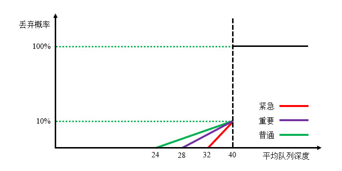
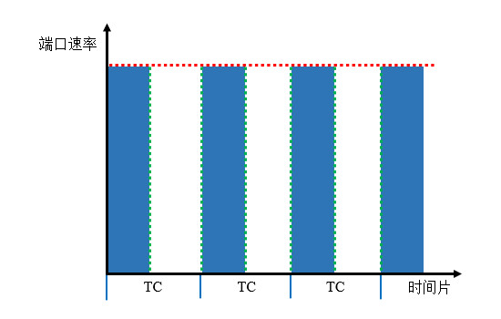
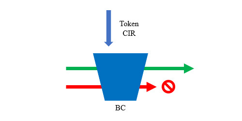
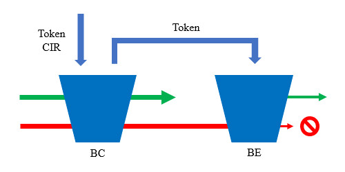
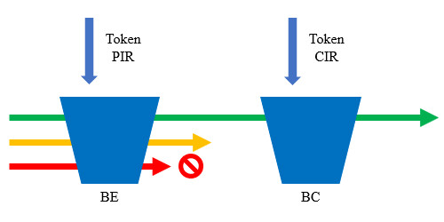
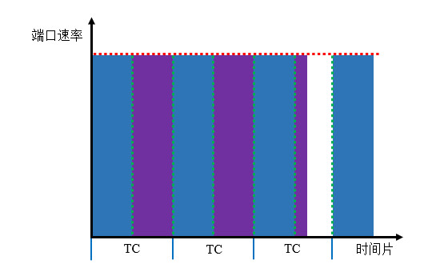

# 拥塞避免
## 简介
拥塞避免是指在将要发生拥塞之前采取的措施，目的是减少拥塞发生的可能性。

## 机制
常用的拥塞避免机制如下文内容所示：

🔷 TCP同步

当存在多个TCP连接时，若某个连接的传输速率超过物理带宽，会话源端会将窗口减半，再尝试逐渐增大窗口。由于其它TCP连接也会受到这股流量的影响，最后多股流量增减趋于同步，这种现象降低了带宽利用率。

🔷 RED

随机早期检测(Random Early Detection, RED)机制可以减少TCP同步的概率。RED机制设置了最小丢弃门限与最大丢弃门限，当带宽占用达到最小丢弃门限时，开始随机丢弃部分报文，主动牺牲部分TCP会话的速率，防止出现TCP同步现象。

🔷 CB-WRED

RED并不考虑报文的优先级，可能会降低重要TCP会话的速率，因此人们提出了加权随机早期检测(Weighted Random Early Detection, WRED)机制，它可以为不同优先级的报文分别设置最小丢弃门限和最大丢弃门限。

<div align="center">



</div>

基于类型的WRED可以对自定义的类实现WRED，权重区分可以基于IP优先级或DSCP，我们更推荐使用DSCP进行区分，因为其中的AF类专门描述了丢弃优先级，逻辑更加清晰。

## 部署方法
我们首先需要编写Class Map匹配流量，此处省略具体操作，详见相关章节： [🧭 分类与标记流量](./02_差分服务.md/#分类与标记流量) 。

接着需要编写Policy Map匹配Class Map并根据需要启用WRED。

```text
# 创建Policy Map并进入配置菜单
Cisco(config)# policy-map <Policy Map名称>

# 添加Class Map
Cisco(config-pmap)# class <Class Map名称>

# 为该类启用WRED
Cisco(config-pmap-c)# random-detect < dscp-based | precedence-based >
```

如果有必要，我们还可以手动调整某一类的WRED参数。

```text
Cisco(config-pmap-c)# random-detect dscp <DSCP值> <最小丢弃阈值> <最大丢弃阈值> [丢弃概率(倒数)]
```

# 流量监管与整型
## 简介
为了合理地分配带宽资源，防止某类业务占用过多资源，我们可以部署监管(Policing)或整型(Shaping)策略。

监管策略会将超出速率限制的报文直接丢弃，将使流量曲线变得陡峭，但实现较为简单。整型策略会将超出速率限制的报文先缓存起来，等待链路空闲时再发送，可以使流量曲线较为平滑，但实现较为复杂，且会增大转发时延，不适用于时延敏感型应用。

## 术语
### 承诺信息速率
承诺信息速率(Committed Information Rate, CIR)也可以称为认购速率，是指用户与ISP通过协议约定的服务速率，ISP应当为用户保障此速率。

通常ISP在连接用户的设备端口上实施流量监管，将用户流量限制在认购速率内；用户则可以在连接ISP的端口上部署流量整形，将前往Internet的流量整形至符合CIR的速率，减少丢包与重传，提升传输效率。

### 承诺突发
承诺突发(Burst Committed, BC)是一个缓存池，是指低于CIR时最多能容纳的报文。

### 承诺时间
承诺时间(Time Committed, TC)是BC缓存池满时，发送所有报文的所需时长，与BC、CIR的关系为：

$$
TC=\frac{BC}{CIR}
$$

默认情况下设备收到报文，将以端口的物理速率尽力发送；当我们部署限速策略后，设备将以TC为间隔，每个周期内只发送大小为BC的报文，宏观层面的现象即速率被限制在CIR以内。限速的本质就是调整TC，达到一种时分复用的效果。

<div align="center">



</div>

### 超限突发
超限突发(Burst Excess, BE)也是一个缓存池，如果流量速率超出CIR，可以缓存一部分报文，若速率未及时降低导致缓存池被填满，设备将不得不丢弃后续报文。

## 令牌桶算法
### 简介
令牌桶(Token Bucket)算法是用于速率限制的常用算法，每隔一段时间向桶（缓存池）中发放一定数量的令牌，得到令牌的报文可以被发送，未得到令牌的报文不能发送。

### 单速单桶双色
此时只有一个容量为BC的桶，设备按照CIR的速率向桶中发放令牌（每隔TC时间发放BC数量的令牌），能够获取到令牌的报文被标记为绿色，可以转发，未获取到令牌的报文被标记为红色，将被丢弃。
 
<div align="center">



</div>

### 单速双桶双色
此时有BC和BE两个桶，设备按照CIR的速率向BC桶中发放令牌，当一定时间内报文不多时，令牌有剩余，就发放到BE桶中；当报文突然增多，将BC桶中的令牌用完时，可以使用BE桶中的令牌；当两桶令牌都用完时，未获取令牌的报文将被丢弃。
能够获取到令牌的报文，都被标记为绿色，未获取令牌的报文，都被标记为红色。
 
<div align="center">



</div>

### 单速双桶三色
此时转发行为同单速双桶双色，但增加了一种新的标记，只从BC桶获取令牌的报文被标记为绿色，从BC和BE桶获取令牌的报文被标记为黄色，未获取令牌的报文，标记为红色。

### 双速双桶三色
此时引入了峰值信息速率(Peak Information Rate,PIR)参数，用于描述允许流量突发的最高速率，取值介于物理端口速率与CIR之间。

设备按照PIR的速率向BE桶中发放令牌，按照CIR的速率向BC桶中发放令牌，两桶分别独立进行计算。当报文所需令牌少于BC桶存量时，将被标记为绿色并转发，两桶中都会减去该报文所需令牌；当报文所需令牌大于BC存量但小于BE存量时，将被标记为黄色并转发，只在BE桶减去该报文所需令牌；当报文所需令牌大于BE存量时，将被标记为红色并丢弃。
 
<div align="center">



</div>

以上策略中转发绿色、黄色报文，丢弃红色报文是默认行为，我们可以更改对于每一类的处理方法，也可以为不同颜色的报文做标记。

## 流量监管
双色令牌桶算法中，将绿色报文称为Conform，红色报文称为Exceed；三色令牌桶算法中，将绿色报文称为Conform，黄色报文称为Exceed，红色报文称为Violate。流量监管可以对不同颜色的报文做出不同的动作，可以部署在入站方向或出站方向。

我们可以直接在端口上部署流量监管策略，此时策略对所有从当前端口出站的流量生效。

```text
# 进入端口配置菜单
Cisco(config)# interface <端口ID>

# 配置流量监管策略
Cisco(config-if)# rate-limit < input | output > [匹配条件] <访问速率/bps> <BC容量> <BE容量> 
conform-action <操作> exceed-action <操作>
```

参数说明：

🔺 `匹配条件`

我们可以指定ACL或DSCP值，此时策略只对符合条件的流量生效。

指定ACL时，需要替换为 `access-group <ACL编号>` ；指定DSCP值时，需要替换为 `dscp <DSCP值>` 。

🔺 `操作`

指定对合法或超限流量的动作。

"transmit"表示转发，"drop"表示丢弃，"continue"表示继续匹配其它限速规则；除此之外我们还可以给匹配到的流量设置新的QoS标记。

<br />

我们也可以将流量监管策略部署在Policy Map中，精确控制多种业务的流量。

```text
# 创建Policy Map并进入配置菜单
Cisco(config)# policy-map <Policy Map名称>

# 添加Class Map
Cisco(config-pmap)# class <Class Map名称>

# 为该类配置流量监管策略
Cisco(config-pmap-c)# police cir <CIR> pir <PIR> conform-action <操作> exceed-action <操作> violate-action <操作>
```

## 流量整型
### 简介
流量整型比流量监管多一个队列，用于缓存取不到令牌的部分报文，并且队列类型可以调整，当端口空闲时就会从队列中发送部分报文，减少丢包的概率。

<div align="center">



</div>

流量整型只能部署在出站方向，因为对入站流量整型并没有意义。

### 通用流量整型
通用流量整型(Generic Traffic Shaping, GTS)是一种基于接口的整型策略。

我们可以通过以下命令在接口上配置流量整型：

```text
Cisco(config-if)# traffic-shape rate <CIR> [BC] [BE] [缓冲区大小(报文数量)]
```

我们也可以将流量整型策略部署在Policy Map中，精确控制多种业务的流量。

```text
# 创建Policy Map并进入配置菜单
Cisco(config)# policy-map <Policy Map名称>

# 添加Class Map
Cisco(config-pmap)# class <Class Map名称>

# 为该类配置流量整型策略
Cisco(config-pmap-c)# shape < average | peak > <CIR或PIR> [BC] [BE]
```

# 链路效率
当链路带宽太低时，为了提高传输效率，我们可以对TCP和RTP报文的头部进行压缩。

以下命令可以在接口上开启报头压缩功能：

```text
# 压缩TCP头部
Cisco(config-if)# ip tcp header-compression

# 压缩RTP头部
Cisco(config-if)# ip rtp header-compression
```

压缩和解压报头需要消耗更长的时间，因此并不适用于时延敏感型应用。随着端口速率的提升，现代网络已经几乎不再使用报头压缩技术。
