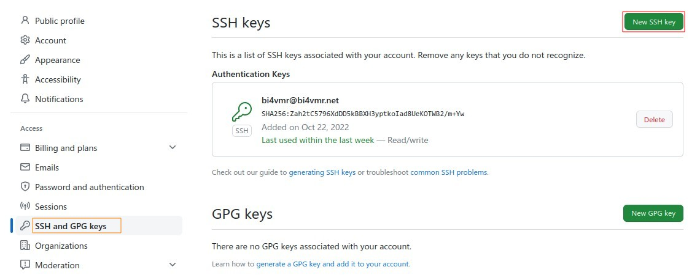
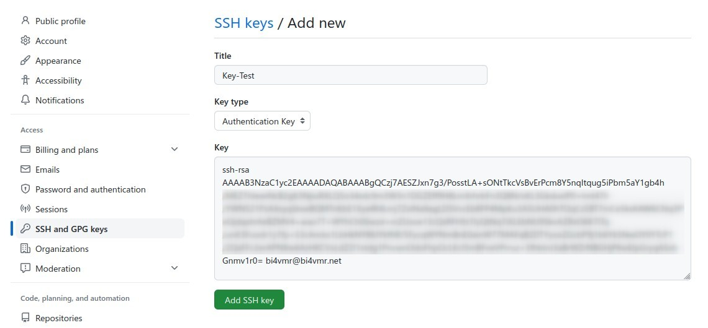
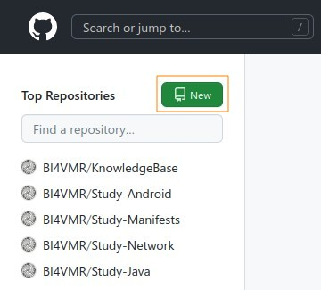
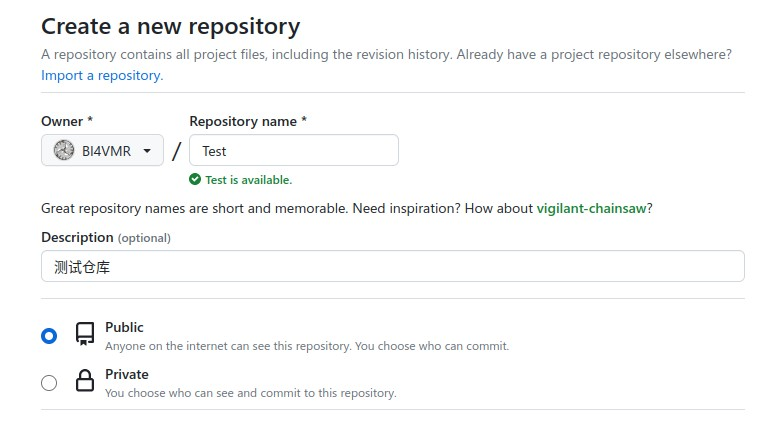

# 简介
到目前为止，我们已经能够在单机上进行版本控制了。为了实现多人协作开发，我们需要配置并使用远程仓库。

远程仓库通常在服务器上，我们可以将本地创建的提交推送至服务器，也可以从服务器拉取其他人创建的提交，以同步最新代码。

# 配置身份认证
当我们向服务器推送提交时，服务器需要认证客户端身份，并进行鉴权，只有两个步骤都通过时，我们才能成功推送提交。

对于使用HTTP协议的远程仓库，提交时只需输入用户名与密码（或授权码）即可，此处省略相关描述。

对于使用SSH协议的远程仓库，服务器会在预先配置的公钥列表中进行查找，如果找到与客户端公钥一致的记录，则可以确定用户的身份，否则认证失败拒绝提交。

此处以GitHub为例，演示公钥认证的配置过程。

首先查看当前用户的SSH公钥，该文件通常位于 `<用户主目录>/.ssh/id_rsa.pub` 。

```text
[root@Fedora ~]# cat ~/.ssh/id_rsa.pub
ssh-rsa AAAAB3NzaC1yc2EAAAADAQABAAABgQCzj7AESZJxn7g3/PosstLA+sONtTkcVsBvErPcm8Y5nqItqug5iPbm5aY1gb4h/MEZThIewiNcB2gK3NjiuRXLQ5o34sdc9m3W3n1DGZEff9H8LmXrhrbFn3Q8N/oKL3GkduxlP0+Imt47h/YWNS21PzAXsyqStxwBQMTnKbE1XyefR4Lmj7ZxINa9agLDSVvcEb8FP4MpKu3A5U0A0hTOqCs5BT7mCe5ksKAW6CNq3PeOjdqxhrfwBZMV4+aiao7T+WYhCh0Swzd+mZUxoe13cQsRFh9z7lyQtNq7iXLEbNU9SkvAZRxO6K7ITq/unK3Fuodr1y7fp+S3cAmbs1LbHkNY86JYkfhR/5FycqWYNmBnE0ainW77MAFqB2DTYyoxZGcbP9j1b6Yk5NwOY0YTcP1/2QaFFc2erAPNXw6AzHKCVxLdZ2I1xtdg1PncwnOdoFhpOcLKcI5mBFveVPrruz+3fhbInJ3aBrWZrNBGHjP6wEIpGryqASxbGnmv1r0= bi4vmr@bi4vmr.net
```

公钥中的邮箱地址仅作为身份认证标识，与提交记录中显示的邮箱地址无关。

接着进入GitHub的用户设置页面，选择"SSH and GPG keys" -> "New SSH key"进入新增公钥界面。

<div align="center">



</div>

然后将先前看到的 `id_rsa.pub` 文件内容填入"Key"栏，并点击"Add SSH Key"按钮进行保存。

<div align="center">



</div>

页面跳转回公钥列表即表示配置成功，此时持有该公钥的客户端就可以向服务器推送提交了。对于所有者为用户自身的仓库，认证完成后即可提交，无需额外的鉴权配置。

# 向服务器上传仓库
如果我们在本地计算机已有Git版本库（至少包含一个提交），希望将其推送到远程仓库中，需要进行以下操作。

首先我们需要登录到服务器的Web管理界面，创建一个空的仓库。此处以GitHub为例，用户登录后，点击左侧仓库列表的"New"按钮，进入新建仓库页面。

<div align="center">



</div>

在该页面可以填写仓库的基本信息，"Owner"表示仓库所有者、"Repository name"表示仓库的名称、"Description"用于简单描述项目的相关信息。

<div align="center">



</div>

此处我们不需要勾选“初始化仓库”等功能，保持仓库为空即可，填好基本信息后，点击页面底部的"Create repository"按钮即可。

然后我们在本地仓库中进行配置，将本地的提交推送至服务器。

```text
# 添加远程仓库配置
[root@Fedora Study-Git]# git remote add origin git@github.com:BI4VMR/Test.git

# 将本地分支"master"与远程同名分支关联，并推送提交。
[root@Fedora Study-Git]# git push -u origin master
枚举对象中: 3, 完成.
对象计数中: 100% (3/3), 完成.
写入对象中: 100% (3/3), 207 字节 | 207.00 KiB/s, 完成.
总共 3（差异 0），复用 0（差异 0），包复用 0
To github.com:BI4VMR/Test.git
 * [new branch]      master -> master
分支 'master' 设置为跟踪 'origin/master'。
```

命令 `git remote add <仓库名称> <URL>` 用于新增远程仓库配置，仓库名称用于标识不同的远程仓库，此处我们只有一个远程仓库，因此按照惯例将其命名为"origin"。

命令 `git push -u <仓库名称> <分支名称>` 用于将本地分支推送至远程仓库的同名分支，此为首次同步，我们添加了"-u"选项，作用是将本地分支与远程分支进行关联，后续再次推送时，我们可以直接执行 `git push` 命令，不必再携带"-u"选项。

此时刷新一次网页，我们就可以看到本地仓库的主分支提交已经推送至远程仓库。

# 从服务器下载仓库
如果我们在一台全新的电脑上，希望以远程仓库中的现有内容为基础，继续开发新功能，可以使用 `git clone` 命令。

```test
# 克隆远程仓库至本地
[root@Fedora ~]# git clone git@github.com:BI4VMR/Test.git
正克隆到 'Test'...
remote: Enumerating objects: 6, done.
remote: Counting objects: 100% (6/6), done.
remote: Compressing objects: 100% (3/3), done.
remote: Total 6 (delta 0), reused 6 (delta 0), pack-reused 0
接收对象中: 100% (6/6), 完成.

# 查看本地仓库内容
[root@Fedora ~]# cd Test
[root@Fedora Test]# git log
commit c1b9c6504a9b0e50b693d1e62c871a496723b92f (HEAD -> master, origin/master, origin/HEAD)
Author: BI4VMR <bi4vmr@outlook.com>
Date:   Sat May 6 23:46:29 2023 +0800

    首次提交
```

此时本地生成了一份远程仓库的副本，并且主分支已经与远程仓库建立关联，我们可以进行新功能的开发了。

命令 `git clone <URL>` 默认生成以远程仓库名称为名的目录，如果我们希望自定义目录名称，可以使用 `git clone <URL> <目录名称>` 命令，但目标目录必须为空。

# 管理远程仓库
## 查看远程仓库
我们可以在仓库中执行 `git remote -v` 命令查看与本地仓库关联的远程仓库信息。

```text
[root@Fedora Study-Git]# git remote -v
origin  git@github.com:BI4VMR/Test.git (fetch)
origin  git@github.com:BI4VMR/Test.git (push)
```

命令输出中有两条记录，"push"表示推送地址，"fetch"表示拉取地址，通常这两个地址是相同的，对于某些系统，可能需要配置不同的推送地址，以便进行代码审阅等操作。

## 新增远程仓库
如果我们需要新增一个远程仓库，可以使用 `git remote add <仓库名称> <URL>` 命令。

```text
# 添加远程仓库配置
[root@Fedora Study-Git]# git remote add gitee git@gitee.com:bi4vmr/Study-Git.git

# 查看远程仓库配置
[root@Fedora Study-Git]# git remote -v
gitee  git@gitee.com:bi4vmr/Study-Git.git  (fetch)
gitee  git@gitee.com:bi4vmr/Study-Git.git (push)
origin  git@github.com:BI4VMR/Test.git (fetch)
origin  git@github.com:BI4VMR/Test.git (push)
```

## 删除远程仓库
如果我们不再使用某个远程仓库，可以使用 `git remote rm <仓库名称>` 命令。

```text
# 移除远程仓库"gitee"
[root@Fedora Study-Git]# git remote rm gitee

# 查看远程仓库配置
[root@Fedora Study-Git]# git remote -v
origin  git@github.com:BI4VMR/Test.git (fetch)
origin  git@github.com:BI4VMR/Test.git (push)
```

## 修改远程仓库名称
如果我们需要修改远程仓库的名称，可以使用 `git remote rename <原仓库名称> <新仓库名称>` 命令。

```text
# 修改远程仓库"origin"的名称为"github"
[root@Fedora Study-Git]# git remote rename origin github

# 查看远程仓库配置
[root@Fedora Study-Git]# git remote -v
github  git@github.com:BI4VMR/Test.git (fetch)
github  git@github.com:BI4VMR/Test.git (push)
```

## 修改远程仓库地址
如果我们需要修改远程仓库的地址，可以使用 `git remote set-url <仓库名称> <新URL>` 命令。

```text
# 修改远程仓库的地址
[root@Fedora Study-Git]# git remote set-url github git@github.com:USER1/Test.git

# 查看远程仓库配置
[root@Fedora Study-Git]# git remote -v
github  git@github.com:USER1/Test.git (fetch)
github  git@github.com:USER1/Test.git (push)
```

该命令默认同时修改"fetch"与"push"地址，如果我们仅需要修改"push"地址，或者添加多个"push"地址，可以使用以下命令。

```text
# 修改远程仓库的推送地址
[root@Fedora Study-Git]# git remote set-url github --push git@github.com:BI4VMR/Test.git

# 查看远程仓库配置
[root@Fedora Study-Git]# git remote -v
github  git@github.com:USER1/Test.git (fetch)
github  git@github.com:BI4VMR/Test.git (push)


# 添加一个推送地址
[root@Fedora Study-Git]# git remote set-url github --add --push git@github.com:USER2/Test.git

# 查看远程仓库配置
[root@Fedora Study-Git]# git remote -v
github  git@github.com:USER1/Test.git (fetch)
github  git@github.com:BI4VMR/Test.git (push)
github  git@github.com:USER2/Test.git (push)
```
