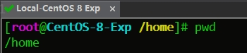

# 简介
操作系统的内核负责控制各种硬件协同运作，但用户无法直接操纵内核。Shell是命令行解释器，它是用户与内核交互的桥梁，用户通过Shell向内核发送指令，内核就会执行相应的操作。

Linux中的Shell有若干不同的实现，其中较为常用的几种如下文列表所示：

- Bourne Shell : `sh`
- Bourne Again Shell : `bash`
- C Shell : `csh`
- Korn Shell : `ksh`
- Z Shell : `zsh`

# Shell管理
Shell与常见的应用软件并没有什么不同，它们也有可执行文件作为入口。我们可以查看 `/etc/shells` 配置文件的内容，查询当前系统中已安装的所有Shell及其可执行文件位置。

🔴 示例一：查看当前系统的所有Shell信息。

在本示例中，我们通过查看 `/etc/shells` 文件内容与 `chsh` 命令查询本机已安装的Shell程序。

```text
# 查看"/etc/shells"文件的内容
[root@Fedora ~]# cat /etc/shells
/bin/sh
/bin/bash
/bin/zsh

# 使用"chsh -l"命令列出所有Shell
[root@Fedora ~]# chsh -l
/bin/sh
/bin/bash
/bin/zsh
```

系统将为每个用户指定一款默认Shell，当我们在终端中输入用户名称与登录口令后，就会进入用户的默认Shell程序；如果我们不习惯使用当前的Shell，也可以选择其他Shell作为默认值。

🟠 示例二：修改用户的默认Shell程序。

在本示例中，我们修改用户的默认Shell程序。

系统通过读取 `/etc/passwd` 文件决定用户登录时的Shell程序，因此我们可以直接编辑用户信息最后一列的内容来修改默认Shell。除此之外，我们也可以使用 `chsh -s <Shell程序路径> [用户名称]` 命令来修改默认Shell。

```text
# 编辑"/etc/passwd"文件，修改用户的默认Shell程序。
[root@Fedora ~]# vim /etc/passwd
root:x:0:0:Super User:/root:/bin/bash
bi4vmr:x:1000:1000:BI4VMR:/home/bi4vmr:/bin/zsh

# 使用"chsh"命令修改默认Shell程序（省略用户名称，表示修改当前用户。）
[root@Fedora ~]# chsh -s /bin/zsh

# 使用"chsh"命令修改默认Shell程序
[root@Fedora ~]# chsh -s /bin/bash bi4vmr
```

默认Shell被修改之后，仅对新创建的会话生效，因此我们可以重新登录一次并验证修改。

```text
# "root"用户的提示符已经变为Zsh样式，说明修改成功。
root@Fedora ~ %

# 通过环境变量验证修改
root@Fedora ~ % echo $SHELL
/bin/zsh
```


# Bash
## 简介
Bourne Shell是Unix最初使用的Shell，在脚本编程方面十分优秀，但在用户交互方面不如其他几种Shell。大部分发行版默认使用Bourne Again Shell，它是Bourne Shell的扩展，简称"bash"，提供了命令补全、命令历史记录等实用的功能，提升了用户交互体验。

Bash是大多数发行版的默认Shell，其他Shell的基本用法与Bash十分相似，因此我们必须首先掌握Bash的使用方法。

## 基本应用
当我们从控制台登录后，屏幕上将会显示“命令提示符”，展示重要的状态信息，此时我们便可以键入命令了。

Redhat系列发行版的命令提示符如下文图片所示：

<div align="center">


</div>

用户身份为管理员时权限符号为 `#` ，否则显示为 `$` 。

当我们输入命令后，按下 `Enter` 键即可执行命令。部分命令可以根据实际应用场景添加选项， `-<选项>` 是简化选项，使用单个字符表示，通常是较为常用的功能。若选项携带参数，必须单独书写，如： `tail -n 2` ；多个不携带参数的选项可连续书写，例如： `tar -zxvf` 。 `--<选项>` 是完整选项，使用单词表示，通常是不常用的功能。

Bash允许用户在键入部分字符后，按 `Tab` 键自动补全命令，但默认情况下仅能补全命令本身，无法补全命令的二级菜单与参数等。我们可以安装软件包"bash-completion"，它提供了常用命令的二级菜单与参数补全能力，能够使Bash变得更加易用。

Shell命令分为两种：一种是Shell内置命令，没有独立的可执行文件；另一种是外置命令，具有独立的可执行文件，我们可以执行 `type <命令名称>` 命令查看一个命令是否为内置命令。

🟡 示例三：区分Shell内置命令与外置命令。

在本示例中，我们通过 `type` 命令判断指定命令是否为Shell的内置命令。

```text
# "cd"为内置命令
[root@Fedora ~]# type cd
cd is a shell builtin

# "top"为外置命令
[root@Fedora ~]# type top
top is /usr/bin/top
```

如果一个命令是外置命令，我们可以使用 `whereis` 命令查看它的可执行文件与文档等组件位置，该命令的常用选项可参考下文内容：

🔷 `-b`

仅查找可执行文件位置。

🔷 `-m`

仅查找帮助文件位置。

🔷 `-s`

仅查找源代码位置。

<br />

🟢 示例四：查找外置命令的相关文件位置。

在本示例中，我们查找 `top` 命令的可执行文件与文档位置。

```text
[root@Fedora ~]# whereis top
top: /usr/bin/top /usr/share/man/man1/top.1.gz
```

## 快捷键
Bash定义了一些快捷键，可以帮助我们提高操作效率，常用的快捷键详见下文表格：

<div align="center">

|   快捷键   |          用途          |
| :--------: | :--------------------: |
| `Ctrl + C` |    强制终止当前命令    |
| `Ctrl + Z` | 将当前命令转为后台执行 |
| `Ctrl + L` |          清屏          |
| `Ctrl + A` |      光标移至行首      |
| `Ctrl + E` |      光标移至行尾      |
| `Ctrl + U` |  从光标位置删除至行首  |
| `Ctrl + K` |  从光标位置删除至行尾  |
|    `↑`     |   调用前一条历史命令   |
|    `↓`     |   调用后一条历史命令   |
| `Ctrl + R` |      搜索历史命令      |
|  `Ctrl + D`  |          注销          |

</div>

## 帮助信息
### 简明信息
大部分命令都有丰富的选项与特殊语法，如果我们忘记了某些命令的用法，可以在命令后添加 `-h` 或 `--help` 选项，查看其简要说明。

🔵 示例五：查看 `cat` 命令的简明帮助信息。

在本示例中，我们查看 `cat` 命令的简明帮助信息。

```text
[root@Fedora ~]# cat --help
用法：cat [选项]... [文件]...
连接一个或多个 <文件> 并输出到标准输出。

如果没有指定 <文件>，或者 <文件> 为 "-"，则从标准输入读取。

  -A, --show-all           等价于 -vET
  -b, --number-nonblank    对非空输出行编号，使 -n 失效
  -e                       等价于 -vE
  -E, --show-ends          在每行行末显示 "$"
  -n, --number             对输出的所有行编号
  -s, --squeeze-blank      不重复输出空行
  -t                       等价于 -vT
  -T, --show-tabs          将 TAB 显示为 ^I
  -u                       （被忽略）
  -v, --show-nonprinting   使用 ^ 和 M- 表示法，LFD 和 TAB 字符除外
      --help        显示此帮助信息并退出
      --version     显示版本信息并退出
```

对于Shell的内置命令，我们可以通过 `help <命令>` 命令查看其帮助信息。

🟣 示例六：查看 `source` 命令的帮助信息。

在本示例中，我们查看 `source` 命令的帮助信息。

```text
[root@Fedora ~]# help source
source: source filename [arguments]
    Execute commands from a file in the current shell.
    
    Read and execute commands from FILENAME in the current shell.  The
    entries in $PATH are used to find the directory containing FILENAME.
    If any ARGUMENTS are supplied, they become the positional parameters
    when FILENAME is executed.
```

### 详细信息
除了简明帮助信息，各大软件包通常还附有详细的文档以供我们查阅。系统将帮助文档分为9个级别，分别对应不同类型的文档，每个级别的信息如下文列表所示：

<div align="center">

| 级别  |           含义           |
| :---: | :----------------------: |
|   1   |       普通帮助文档       |
|   2   | 可被内核调用的函数的文档 |
|   3   |  普通函数和库的帮助文档  |
|   4   | 特殊文件（主要在/dev中） |
|   5   |     配置文件帮助文档     |
|   6   |      游戏的帮助文档      |
|   7   |           杂项           |
|   8   | 管理员可用的命令帮助文档 |
|   9   | 与内核相关文件的帮助文档 |

</div>

`man` 命令可以查看软件包的文档，语法为： `man [级别] [选项] [目标命令]` ，该命令的常用选项可参考下文内容：

🔷 `-a <关键词>`

在所有文档中搜索关键词，此时无需指定目标命令。

🔷 `-f <关键词>`

查看文档摘要信息（精确匹配），此时无需指定目标命令。

🔷 `-k <关键词>`

查看文档摘要信息（模糊匹配），此时无需指定目标命令。

<br />

系统中还提供了 `whatis` 和 `apropos` 两个命令，分别用于精确和模糊搜索帮助文档， `whatis` 等价于 `man -f` ， `apropos` 等价于 `man -k` 。除此之外， `info` 命令可以查看比 `man` 命令更详细的文档信息。

## 历史记录
### 简介
Shell通常会记录用户输入的命令，以供后续查阅或再次调用。

Bash的历史记录保存在用户主目录中的 `.bash_history` 文件中，我们可以使用 `history` 命令查看历史记录，该命令的常用选项可参考下文内容：

🔷 `-c`

清空当前会话缓存的历史命令（内存缓存）。

🔷 `-w`

将内存缓存中的历史命令写入磁盘。

<br />

🟤 示例七：查看历史命令。

在本示例中，我们查看当前会话的历史命令记录。

```text
[root@Fedora ~]# history 
    1  touch abc
    2  mkdir dir1
    3  echo -e "ABC"
    4  history
```

我们可以在Bash中使用特定的操作再次调用历史记录：

- 使用 `↑` 和 `↓` 方向键可以逐条查阅历史记录。
- 输入 `!<N>` 可以再次执行第N条命令。
- 输入 `!!` 可以再次执行前一条命令。
- 输入 `!<字符串>` 可再次执行最后一条以指定字符串开头的命令。
- 使用 `CTRL + R` 组合键可以进入搜索模式，输入字符以搜索历史命令；按下 `ENTER` 键可以立刻执行搜索结果命令，按下 `END` 键则可以将搜索结果内容调入编辑区。

假如我们想要再次执行上述示例中编号为"3"的命令，可以输入 `!3` 并按下 `ENTER` 键：

```text
[root@Fedora ~]# !3
echo -e "ABC"
ABC
```

### 配置文件


默认最大数量为1000条，可以通过修改 `HISTSIZE` 环境变量进行变更。
ignoredups 去除连续重复的命令，要消除整个命令历史中的重复命令，把 HISTCONTROL设置成 erasedups


## 命令别名
### 简介
Shell支持为命令语句设置别名，用户输入的别名将被翻译成对应的语句，为复杂的语句设置别名，能够显著提高操作效率。

### 查看特定别名
执行 `which <别名>` 可以查看该别名对应的真实命令，部分发行版会将常用的命令与选项组合设置为别名，方便用户使用，例如Fedora系统的 `ll` 。

🔴 示例一

查看 `ll` 对应的真实命令。

```text
[root@Fedora ~]# which ll
alias ll='ls -lh'
        /usr/bin/ls
```

### 查看所有别名
`alias` 命令用于创建别名，不加参数直接执行时，将会显示当前用户的所有别名。

🟠 示例二

查看当前用户的所有别名。

```text
[root@Fedora ~]# alias
alias cp='cp -i'
alias egrep='egrep --color=auto'
alias fgrep='fgrep --color=auto'
alias grep='grep --color=auto'
alias ll='ls -lh'
```

### 创建别名
执行 `alias <别名>="<命令语句>"` 可以创建新的别名，这种别名只能临时生效，用户注销后将被清除。若要设置永久别名，需修改配置文件，按照前文所述语法书写别名规则。

写入 `/etc/profile` 的规则将影响所有用户，写入用户Shell配置文件的规则只对其自身生效，Bash的用户配置文件为 `~/.bashrc` 。

### 删除别名
`unalias` 命令可以删除指定命令的所有别名，该命令只能临时生效，若希望永久生效，需要修改对应的配置文件。


## 命令提示符
### 简介
命令提示符展示了当前用户、主机名、用户权限等信息，便于操作者了解自身所处的环境，各大发行版的默认命令提示符存在差异，我们也可以按需定制提示符样式。

### 提示符格式
环境变量 `PS1` 用于控制提示符的样式，我们可以修改变量值实现个性化的提示符。使用 `export PS1=<字符串>` 命令能够为环境变量赋予新的值，这种修改方式仅对当前会话有效；将该语句写入 `/etc/bash.bashrc` 文件时全局生效（可能会被用户的私有配置覆盖）；写入用户主目录中的 `.bashrc` 配置文件时，仅对指定用户的Bash生效。

执行以下命令可以查看默认的提示符格式：

```text
[root@Fedora ~]# echo $PS1
[\u@\h \W]\$
```

其中各占位符的含义可参考下文表格：

<div align="center">

| 占位符 |         含义         |
| :----: | :------------------: |
|  `\u`  |        用户名        |
|  `\h`  |        主机名        |
|  `\H`  |      完整主机名      |
|  `\w`  | 当前目录（绝对路径） |
|  `\W`  |       当前目录       |
|  `\d`  |         日期         |
|  `\t`  | 时间（24H HH:MM:SS） |
|  `\T`  | 时间（12H HH:MM:SS） |
|  `\A`  |  时间（24H HH:MM）   |
|  `\$`  |       用户权限       |
|  `\#`  |       命令序号       |
|  `\v`  |      解释器版本      |

</div>

下文示例展示了自定义命令提示符样式的方法。

🔴 示例一：将Fedora系统的命令提示符路径修改为绝对路径。

Fedora系统的命令提示符默认仅显示最后一级目录，在本示例中，我们将其改为绝对路径。

```text
# 编辑当前用户Home目录下的".bashrc"文件
[root@Fedora ~]# nano ~/.bashrc
# 在文件末尾添加以下内容
export PS1='[\u@\h \w]\$ '

# 保存文件后重新登录
[root@Fedora ~]# logout
# 进入某个层次较深的目录，并观察提示符变化。
[root@Fedora ~]# cd /var/lib/systemd/
[root@Fedora /var/lib/systemd]#
```

### 提示符颜色
Shell支持输出符合ANSI标准的特殊文字，对于提示符同样可用，我们可以更改文本的颜色，突出显示重要的信息。

ANSI是ASCII标准的扩展，控制码均以"Esc"作为起始符号，"Esc"的八进制码为"33"，因此ANSI控制码标准格式为 `"\033[<N>m"` ，在Shell中记作 `"\[\e[<N>m\]"` ，其中"N"表示属性，同时设置多个属性时需使用分号(";")隔开，相关属性详见下文表格：

<div align="center">

| 标记  |     符号     |     含义     |
| :---: | :----------: | :----------: |
|   0   | `\[\e[0m\]`  | 清除所有属性 |
|   1   | `\[\e[1m\]`  |     高亮     |
|   2   | `\[\e[2m\]`  |   取消高亮   |
|   4   | `\[\e[4m\]`  |    下划线    |
|   5   | `\[\e[5m\]`  |     闪烁     |
|   7   | `\[\e[7m\]`  |     反色     |
|   8   | `\[\e[8m\]`  |     消隐     |
| 30-37 | `\[\e[32m\]` |   文本颜色   |
| 40-47 | `\[\e[46m\]` |   背景颜色   |

</div>

ANSI支持8种颜色，书写在"3"或"4"的后一位，使用数字0-7表示，详见下文表格：

<div align="center">

| 数值  | 颜色  |
| :---: | :---: |
|   0   | 黑色  |
|   1   | 红色  |
|   2   | 绿色  |
|   3   | 黄色  |
|   4   | 蓝色  |
|   5   | 洋红  |
|   6   | 青色  |
|   7   | 白色  |

</div>

若需要设置文本颜色为红色，只需在文本前添加 `"\[\e[31m\]"` 即可，若还需要高亮显示此文本，则控制符记作 `"\[\e[31;1m\]"` 。当我们设置ANSI控制符后，Shell将会一直沿用此格式，因此不再需要特殊文本时，须插入控制符 `"\[\e[0m\]"` 清除格式。

🟠 示例二：修改命令提示符的颜色。

在本示例中，我们将命令提示符设为下图所示的格式（此处的远程管理工具默认颜色即为绿色，因此绿色文本无需着色）。

<div align="center">



</div>

第一步，我们编辑 `~/.bashrc` 文件，添加下文代码块中的配置。

```text
[root@Fedora ~]# nano ~/.bashrc
# 在文件末尾添加以下内容
export PS1='[\[\e[35;1m\]\u\[\e[0m\]@\[\e[36;1;1m\]\h\[\e[0m\] \[\e[33;1m\]\w\[\e[0m\]]\$ '
```

第二步，我们退出当前Shell并重新登录系统，此时命令提示符应当已经具有着色效果了，与前文图片一致。

### 修复命令提示符
若用户登录后，提示符显示为 `-bash-4.2$` ，可能是用户将其主目录中 `.bashrc` 等文件误删，此时我们可以从 `/etc/skel/` 目录中复制相应的文件至该用户的主目录，恢复默认的提示符。

```text
# 进入"/etc/skel"目录
-bash-4.2$ cd /etc/skel
-bash-4.2$ ls -a
.  ..  .bash_logout  .bash_profile  .bashrc

# 复制丢失的Bash配置文件
-bash-4.2$ cp .bash_profile ~
-bash-4.2$ cp .bash_logout ~
-bash-4.2$ cp .bashrc ~

# 进入当前用户的主目录
-bash-4.2$ cd ~
-bash-4.2$ ll -a
total 12
drwx------  2 user1 user1  62 Oct 31 15:50 .
drwxr-xr-x. 3 root  root   19 Oct 31 15:45 ..
-rw-r--r--  1 user1 user1  18 Oct 31 15:50 .bash_logout
-rw-r--r--  1 user1 user1 193 Oct 31 15:50 .bash_profile
-rw-r--r--  1 user1 user1 231 Oct 31 15:50 .bashrc

# 注销
-bash-4.2$ logout

# 重新登录，查看命令提示符是否恢复。
[user1@Fedora ~]$
```


## 级联命令
我们可以使用一行命令，在Shell中执行多个语句，相关语法详见下文表格：

<div align="center">

| 执行符 |          格式          |             说明             |
| :----: | :--------------------: | :--------------------------: |
|  `;`   |   `<命令1>; <命令2>`   |      顺序执行，无联系。      |
|  `&&`  |  `<命令1> && <命令2>`  | 命令1执行成功后命令2才能执行 |
| `\|\|` | `<命令1> \|\| <命令2>` | 命令1执行失败后命令2才能执行 |

</div>


# Zsh


`~/.zshrc`

```text
# 历史记录文件
#
# 在Zsh中，我们必须明确设置该属性，否则Shell不会记录任何历史命令。
HISTFILE="$HOME/.zsh_history"

# 最大历史记录数量
HISTSIZE=5000
SAVEHIST=5000

# 在多个会话之间共享历史记录
setopt SHARE_HISTORY

# 即时更新历史记录
#
# 默认情况下，每个会话都有独立的历史记录内存缓冲区，仅当会话正常退出时才会将内容写入文件。
# 如果会话非正常退出，历史记录将会丢失。添加该选项后，我们每执行一条命令，都会立刻将记录写入文件，防止记录丢失。
setopt INC_APPEND_HISTORY

# 如果当前命令与最新的一条历史记录重复，则不记录当前命令。
setopt HIST_IGNORE_DUPS

# 如果当前命令与任意的一条历史命令重复，则删除历史记录，并将当前命令写入历史记录末尾。
setopt HIST_IGNORE_ALL_DUPS

```

## 命令提示符

PROMPT变量用于定义命令提示符格式。

官方说明

https://zsh.sourceforge.io/Doc/Release/Prompt-Expansion.html


    %n：用于显示登录用户的用户名。

    %m：显示系统的主机名。

    %1~：%1 部分显示当前工作目录的名称，只有在主目录中时才会显示波形符。

%j

    当前由 shell 管理的作业数量。
%L

    $SLVL 变量的当前值。

%t 
12 小时格式的当前时间。
 1:33下午

%T

    24 小时格式的当前时间。
%r

    以 12 小时格式显示当前时间（含秒）。
%D

    以“yyyy-mm-dd”格式显示日期。


-- 颜色 --

Start 	End 	Effect
%B 	%b 	Bold
%U 	%u 	Underline
%S 	%s 	Highlight
%F{color} 	%f 	Foreground color
%K{color} 	%k 	Background color


%{$reset_color%} 可能无效


https://www.ditig.com/publications/256-colors-cheat-sheet


%n - username
%m - short name of the current host
%M - name of curent host
%# - a % or a #, depending on whether the shell is running as root or not
%~ - relative path
%/ or %d - absolute path
%c or %C - Trailing component of the current working directory.
%t - time 12hr am/pm format
%T - time 24hr format
%w - day and date (day-dd)
%D - Date (default: yy-mm-dd)
%D{%f} - day of the month
%l or %y - The line (tty) the user is logged in on, without /dev/ prefix.
颜色

%F{237} 256 color number
%F{red} 8 color name (black, red, green, yellow, blue, magenta, cyan, white)
$FG[237] (notice the $ sign instead of %) 256 color number
$fg[red] (notice the $ and lower case fg) 8 color name (black, red, green, yellow, blue, magenta, cyan, white)
%{$fg_bold[blue]%} bold variants
%F is Foreground color, $f for resetting foreground color
%K is bacKground color, %k for resetting background-color
$reset_color is a Zsh variable that resets the color of the output
You can use Unicode for symbols
%E Clear to end of the line.
%U (%u) to Start (stop) underline mode.
高级

%{...%} 来表示提示符替换序列。这些序列允许在提示符中插入颜色、样式和其他特殊文本，以实现个性化的终端显示。例如 %{$fg[red]%} 表示将后面的文本显示为红色。
%(condition.true-text.false-text) 来进行条件判断，并在满足条件时显示 true-text，不满足条件时显示 false-text。
%? 来获取上一个命令的退出状态码，并根据退出状态码进行条件判断。例如 %{$fg_bold[red]%}%(?..[%?]) 可以在上一个命令返回非零状态码时显示状态码，否则不显示。
%F{code} 和 %f 来设置异步命令的前景色。可以使用它们来在命令执行期间改变命令输出的颜色。
$underline 表示下划线文本
$blink 表示闪烁文本
%# 可以显示当前 Zsh 会话中已执行的命令数。
%B%> 可以显示一个右提示符，通常用于辅助显示长命令或多行命令输入。
%B%{...%} 来添加颜色和样式到自动补全提示符。
%h 显示当前历史命令
%! 可以显示最近执行的历史命令。
%d 表示目录堆栈的深度，这对于有多个目录切换的情况下很有用。
%{%} 表示宽度适应，当终端窗口变窄时，可以隐藏长路径等。
\\ 表示插入逃逸字符，从而显示特殊字符，例如 $、% 等，这个逃逸字符我试了但没有效果
$(date) 表示插入当前日期。
$variable_name 表示变量。例如 $PROMPT 表示一个保存主提示符的变量。
\n 表示换行
\t 表示制表符（Tab）


添加时间到右角

虽然部分标题“在右侧角落添加时间”并不能体现正确的正义性，因为您可以添加您可以添加或已添加到右侧的所有内容，例如用户名、主机名等，但添加时间比这些更有意义元素。

要将时间或任何其他元素添加到右上角，请首先打开 zshrc 文件：

nano ~/.zshrc

在这里，您必须添加一个变量 RPROMPT 并定义要添加的元素。

例如，在这里，我添加了 12 小时格式的时间，因此我的行将如下所示：

RPROMPT="%t"

最终结果如下所示：

看起来很无聊？让我们将文本加粗并着色：

RPROMPT="%F{241}%t%b%f"

