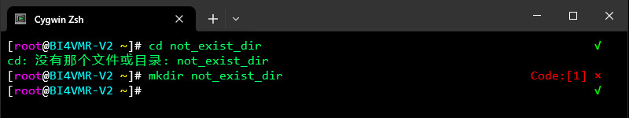

# 简介
操作系统的内核负责控制各种硬件协同运作，但用户无法直接操纵内核。Shell是命令行解释器，它是用户与内核交互的桥梁，用户通过Shell向内核发送指令，内核就会执行相应的操作。

Linux中的Shell有若干不同的实现，其中较为常用的几种如下文列表所示：

- Bourne Shell : `sh`
- Bourne Again Shell : `bash`
- C Shell : `csh`
- Korn Shell : `ksh`
- Z Shell : `zsh`


# Shell管理
Shell与常见的应用软件并没有什么不同，它们也有可执行文件作为入口。我们可以查看 `/etc/shells` 配置文件的内容，查询当前系统中已安装的所有Shell及其可执行文件位置。

🔴 示例一：查看当前系统的所有Shell信息。

在本示例中，我们通过查看 `/etc/shells` 文件内容与 `chsh` 命令查询本机已安装的Shell程序。

```text
# 查看"/etc/shells"文件的内容
[root@Fedora ~]# cat /etc/shells
/bin/sh
/bin/bash
/bin/zsh

# 使用"chsh -l"命令列出所有Shell
[root@Fedora ~]# chsh -l
/bin/sh
/bin/bash
/bin/zsh
```

系统将为每个用户指定一款默认Shell，当我们在终端中输入用户名称与登录口令后，就会进入用户的默认Shell程序；如果我们不习惯使用当前的Shell，也可以选择其他Shell作为默认Shell。

🟠 示例二：修改用户的默认Shell程序。

在本示例中，我们修改用户的默认Shell程序。

系统通过读取 `/etc/passwd` 文件决定用户登录时的Shell程序，因此我们可以直接编辑用户信息最后一列的内容来修改默认Shell。除此之外，我们也可以使用 `chsh -s <Shell程序路径> [用户名称]` 命令来修改默认Shell。

```text
# 编辑"/etc/passwd"文件，修改用户的默认Shell程序。
[root@Fedora ~]# vim /etc/passwd
root:x:0:0:Super User:/root:/bin/bash
bi4vmr:x:1000:1000:BI4VMR:/home/bi4vmr:/bin/zsh

# 使用"chsh"命令修改默认Shell程序（省略用户名称，表示修改当前用户。）
[root@Fedora ~]# chsh -s /bin/zsh

# 使用"chsh"命令修改默认Shell程序
[root@Fedora ~]# chsh -s /bin/bash bi4vmr
```

默认Shell被修改之后，仅对新创建的会话生效，因此我们可以重新登录一次并验证修改。

```text
# "root"用户的提示符已经变为Zsh样式，说明修改成功。
root@Fedora ~ %

# 通过环境变量验证修改
root@Fedora ~ % echo $SHELL
/bin/zsh
```


# Bash
## 简介
Bourne Shell是Unix最初使用的Shell，在脚本编程方面十分优秀，但在用户交互方面不如其他几种Shell。大部分发行版默认使用Bourne Again Shell，它是Bourne Shell的扩展，简称"bash"，提供了命令补全、命令历史记录等实用的功能，提升了用户交互体验。

Bash是大多数发行版的默认Shell，其他Shell的基本用法与Bash十分相似，因此我们必须掌握Bash的使用方法。

## 基本应用
当我们从控制台登录后，屏幕上将会显示“命令提示符”，展示重要的环境信息，此时我们便可以键入命令了。

Redhat系列发行版的命令提示符如下文图片所示：

<div align="center">


</div>

当我们输入命令后，按下 `Enter` 键即可执行命令。部分命令可以根据实际应用场景添加选项， `-<选项>` 是简化选项，使用单个字符表示，通常是较为常用的功能。若选项携带参数，必须单独书写，如： `tail -n 2` ；多个不携带参数的选项可连续书写，例如： `tar -zxvf` 。 `--<选项>` 是完整选项，使用单词表示，通常是不常用的功能。

Bash允许用户在键入部分字符后，按下 `Tab` 键自动补全命令，但默认情况下仅能补全命令本身，无法补全命令的二级菜单与参数等。我们可以安装软件包"bash-completion"，它提供了常用命令的二级菜单与参数补全能力，能够使Bash变得更加易用。

## 快捷键
Bash定义了一些快捷键，可以帮助我们提高操作效率，常用的快捷键详见下文表格：

<div align="center">

|   快捷键   |          用途          |
| :--------: | :--------------------: |
| `Ctrl + C` |    强制终止当前命令    |
| `Ctrl + Z` | 将当前命令转为后台执行 |
| `Ctrl + L` |          清屏          |
| `Ctrl + A` |      光标移至行首      |
| `Ctrl + E` |      光标移至行尾      |
| `Ctrl + U` |  从光标位置删除至行首  |
| `Ctrl + K` |  从光标位置删除至行尾  |
|    `↑`     |   调用前一条历史命令   |
|    `↓`     |   调用后一条历史命令   |
| `Ctrl + R` |      搜索历史命令      |
| `Ctrl + D` |          注销          |

</div>

## 历史记录
### 简介
Shell通常会记录用户输入的命令，以便后续查阅或再次调用。

Bash的历史记录保存在用户主目录下的 `.bash_history` 文件中，我们可以使用 `history` 命令查看历史记录，该命令的常用选项可参考下文内容：

🔷 `-c`

清空当前会话缓存的历史命令（内存缓存）。

🔷 `-w`

将内存缓存中的历史命令写入磁盘。

<br />

🟡 示例三：查看历史命令。

在本示例中，我们查看当前会话的历史命令记录。

```text
[root@Fedora ~]# history 
    1  touch abc
    2  mkdir dir1
    3  echo -e "ABC"
    4  history
```

我们可以在Bash中使用特定的语法再次调用历史记录：

- 使用 `↑` 和 `↓` 方向键可以逐条查阅历史记录。
- 输入 `!<N>` 可以再次执行第"N"条命令。
- 输入 `!!` 可以再次执行前一条命令。
- 输入 `!<字符串>` 可以再次执行最后一条以指定字符串开头的命令。
- 使用 `CTRL + R` 组合键可以进入搜索模式，输入字符以搜索历史命令；按下 `ENTER` 键可以立刻执行搜索结果命令，按下 `END` 键则可以将搜索结果内容调入编辑区。

假如我们想要再次执行上述示例中序号为"3"的命令，可以输入 `!3` 并按下 `ENTER` 键：

```text
[root@Fedora ~]# !3
echo -e "ABC"
ABC
```

### 配置文件
我们可以通过设置环境变量实现修改最大历史记录数量、开启去重等功能，详见下文示例配置及注释：

".bashrc":

```text
# 每个会话缓存的最大历史记录数量
#
# 默认数量为1000
HISTSIZE=1000

# 历史文件记录的最大历史记录数量
HISTFILESIZE=5000

# 历史记录控制
#
# 目前有以下有效值：
# ignoredups - 忽略重复命令。
# ignorespace - 忽略空格开头的命令。
# ignoreboth - 忽略重复命令与空格开头的命令。
# erasedups - 删除历史记录中的重复内容。
#
# 该选项可以同时设置多个值，此时以冒号(":")分隔。
#
HISTCONTROL=ignoreboth:erasedups
```

## 命令管理
### 内置命令与外置命令
Shell命令分为两种：一种是内置命令，没有独立的可执行文件；另一种是外置命令，具有独立的可执行文件，我们可以执行 `type <命令名称>` 命令区分一个命令是否为内置命令。

🟢 示例四：区分Shell内置命令与外置命令。

在本示例中，我们判断一些命令是否为Shell的内置命令。

```text
# "cd"为内置命令
[root@Fedora ~]# type cd
cd is a shell builtin

# "top"为外置命令
[root@Fedora ~]# type top
top is /usr/bin/top
```

如果一个命令是外置命令，我们可以使用 `whereis` 命令查看它的可执行文件与文档等组件位置，该命令的常用选项可参考下文内容：

🔷 `-b`

仅查找可执行文件位置。

🔷 `-m`

仅查找帮助文件位置。

🔷 `-s`

仅查找源代码位置。

<br />

🔵 示例五：查找外置命令的相关文件位置。

在本示例中，我们查找 `top` 命令的可执行文件与文档位置。

```text
[root@Fedora ~]# whereis top
top: /usr/bin/top /usr/share/man/man1/top.1.gz
```

### 搜索顺序
我们在Shell中键入命令并按下回车后，系统将按照以下步骤，寻找命令的可执行文件并运行程序：

🔷 判断是否为绝对路径

若为 `/bin/cat` 此类绝对路径，直接执行对应的程序；若没有指定路径，则进入后续流程。

🔷 判断是否存在别名

如果命令是一个别名，则将其转换为真实命令后再执行；如果命令不是一个别名，则进入后续流程。

🔷 判断是否为内置命令

若为Shell的内置命令，直接执行对应的操作；若不是内置命令，则在环境变量 `PATH` 中查找可执行文件。

若查找到命令对应的可执行文件，则执行对应的程序；若未找到，则提示用户"command not found"。

<br />

当多个同名命令发生冲突时，我们可以根据以上规则，逐步查找问题的根源。

## 命令中的引号
### 简介
Shell命令中的引号包括双引号( `"` )、单引号( `'` )和反引号( `` ` `` )，它们的作用各不相同，详情可参考下文内容：

### 反引号
反引号是一种命令占位符，我们可以在其中填写命令语句，当含有反引号的命令语句被调用时，反引号中的语句将被首先执行，然后输出结果被插入到原始语句的对应位置，Shell再执行原始语句。

🟣 示例六：反引号的作用。

在本示例中，我们利用反引号，在命令语句中插入另一段命令的结果。

```text
[root@Fedora ~]# echo Current date is `date +%F`.
Current date is 2023-12-06.
```

在上述示例中，反引号之间的 `date +%F` 命令首先被执行，其结果被插入到原始语句中，再被 `echo` 命令输出。

### 双引号
双引号是一种分界符，当参数包含空格等特殊符号时，我们可以用双引号将其包围，避免产生歧义。

🟤 示例七：双引号的作用。

在本示例中，我们创建一个名称中带有空格的文件 `Test File.txt` 。

```text
# 错误示范
# 未使用双引号的情况
[root@Fedora ~]# touch Test File.txt
# 查看创建结果
[root@Fedora ~]# ll
-rw-r--r--  1 root root   0 12月 8日 23:10 File.txt
-rw-r--r--  1 root root   0 12月 8日 23:10 Test

# 正确示范
# 使用双引号的情况
[root@Fedora ~]# touch "Test File.txt"
# 查看创建结果
[root@Fedora ~]# ll
-rw-r--r--  1 root root   0 12月 8日 23:10 'Test File.txt'
```

在上述示例中，未使用双引号时 `touch` 命令将输入内容理解为两个参数，创建出 `Test` 与 `File.txt` 两个文件；而使用双引号时输入内容被视为一个整体，正确地生成了 `Test File.txt` 文件。

如果实际情况需要，我们也可以在双引号中嵌套使用反引号。

🔴 示例八：在双引号中嵌套使用反引号。

在本示例中，我们在双引号中嵌套使用反引号。

```text
# 使用命令占位符
[root@Fedora ~]# echo "Current date is `date +%F`."
Current date is 2023-12-06.

# 读取变量
[root@Fedora ~]# echo "Current shell program is $SHELL."
Current shell program is /bin/bash.
```

### 单引号
单引号的作用与双引号类似，用于分隔包含空格等特殊符号的名称，但它不支持命令占位符与变量替换，所有的字符都将被原样输出。

🟠 示例九：单引号的作用。

在本示例中，我们使用单引号输出文本，忽略具有特殊含义的部分。

```text
# 使用命令占位符
[root@Fedora ~]# echo 'Current date is `date +%F`.'
Current date is `date +%F`.

# 读取变量
[root@Fedora ~]# echo 'Current shell program is $SHELL.'
Current shell program is $SHELL.
```

在上述示例中，所有的字符都被原样输出，命令占位符与变量替换未生效。

## 级联命令
我们可以在Shell中使用一行语句执行多条命令，并实现简单的逻辑判断，相关语法详见下文表格：

<div align="center">

| 执行符 |          格式          |             说明             |
| :----: | :--------------------: | :--------------------------: |
|  `;`   |   `<命令1>; <命令2>`   |      顺序执行，无联系。      |
|  `&&`  |  `<命令1> && <命令2>`  | 命令1执行成功后命令2才能执行 |
| `\|\|` | `<命令1> \|\| <命令2>` | 命令1执行失败后命令2才能执行 |

</div>

🟡 示例十：级联命令的基本应用。

在本示例中，我们使用两种不同的级联命令语法，进行相同的操作，并比较它们的区别。

```text
# 顺序执行两个命令
[root@Fedora ~]# rm dir_test; mkdir dir_test
rmdir: 删除 'dir_test' 失败: 没有那个文件或目录

# 前序命令执行成功则执行后续命令
[root@Fedora ~]# rm dir_test && mkdir dir_test
rmdir: 删除 'dir_test' 失败: 没有那个文件或目录
```

在上述示例中，文件夹 `dir_test` 并不存在，由于第一种写法不存在逻辑关系，当 `rm dir_test` 出现错误后， `mkdir dir_test` 语句仍将被执行；第二种写法存在逻辑关系， `rm dir_test` 出现错误后， `mkdir dir_test` 语句不会被执行。

## 别名管理
### 简介
Shell通常都支持为命令语句设置别名，当用户输入别名时，Shell会将其翻译为对应的命令语句并执行。

部分发行版会将常用的命令与选项组合设置为别名，方便用户使用，例如Redhat系列系统中的 `ll` 别名。我们也可以为其他复杂的语句组合设置别名，提高操作效率。

### 查看所有别名
在Bash中， `alias` 命令用于管理别名，如果我们不加任何参数直接执行该命令，可以查看当前Bash会话的所有别名。

🟢 示例十一：查看所有别名。

在本示例中，我们查看当前Bash会话的所有别名。

```text
[root@Fedora ~]# alias
alias cp='cp -i'
alias egrep='egrep --color=auto'
alias fgrep='fgrep --color=auto'
alias grep='grep --color=auto'
alias ll='ls -lh'
```

### 查看特定别名
如果我们只想查看单个别名对应的真实命令，可以执行 `which <别名>` 命令。

🔵 示例十二：查看特定别名。

在本示例中，我们查看 `ll` 别名所对应的真实命令。

```text
[root@Fedora ~]# which ll
alias ll='ls -lh'
        /usr/bin/ls
```

### 创建别名
执行 `alias <别名>="<命令语句>"` 命令可以创建新的别名，但是这种别名只能临时生效，用户注销后将被清除。

若要设置永久别名，我们需要修改配置文件，将 `alias` 语句写入其中。写入 `/etc/profile` 的语句将影响所有用户，写入 `~/.bashrc` 配置文件的语句只对当前用户生效。

### 删除别名
`unalias` 命令可以删除指定命令的所有别名，该命令只能临时生效，若希望永久生效，需要删除配置文件中的语句。

## 帮助信息
### 简明信息
大部分命令都有丰富的选项与特殊语法，如果我们忘记了某些命令的用法，可以在命令后添加 `-h` 或 `--help` 选项，查看其简要说明。

🟣 示例十三：查看 `cat` 命令的简明帮助信息。

在本示例中，我们查看 `cat` 命令的简明帮助信息。

```text
[root@Fedora ~]# cat --help
用法：cat [选项]... [文件]...
连接一个或多个 <文件> 并输出到标准输出。

如果没有指定 <文件>，或者 <文件> 为 "-"，则从标准输入读取。

  -A, --show-all           等价于 -vET
  -b, --number-nonblank    对非空输出行编号，使 -n 失效
  -e                       等价于 -vE
  -E, --show-ends          在每行行末显示 "$"
  -n, --number             对输出的所有行编号
  -s, --squeeze-blank      不重复输出空行
  -t                       等价于 -vT
  -T, --show-tabs          将 TAB 显示为 ^I
  -u                       （被忽略）
  -v, --show-nonprinting   使用 ^ 和 M- 表示法，LFD 和 TAB 字符除外
      --help        显示此帮助信息并退出
      --version     显示版本信息并退出
```

对于Shell的内置命令，我们可以通过 `help <命令>` 命令查看其帮助信息。

🟤 示例十四：查看 `source` 命令的帮助信息。

在本示例中，我们查看 `source` 命令的帮助信息。

```text
[root@Fedora ~]# help source
source: source filename [arguments]
    Execute commands from a file in the current shell.
    
    Read and execute commands from FILENAME in the current shell.  The
    entries in $PATH are used to find the directory containing FILENAME.
    If any ARGUMENTS are supplied, they become the positional parameters
    when FILENAME is executed.
```

### 详细信息
除了简明帮助信息，各大软件包通常还附有详细的文档以供我们查阅。系统将帮助文档分为9个级别，分别对应不同类型的文档，每个级别的信息如下文列表所示：

<div align="center">

| 级别  |           含义           |
| :---: | :----------------------: |
|   1   |       普通帮助文档       |
|   2   | 可被内核调用的函数的文档 |
|   3   |  普通函数和库的帮助文档  |
|   4   | 特殊文件（主要在/dev中） |
|   5   |     配置文件帮助文档     |
|   6   |      游戏的帮助文档      |
|   7   |           杂项           |
|   8   | 管理员可用的命令帮助文档 |
|   9   | 与内核相关文件的帮助文档 |

</div>

`man` 命令可以查看软件包的文档，语法为： `man [级别] [选项] [目标命令]` ，该命令的常用选项可参考下文内容：

🔷 `-a <关键词>`

在所有文档中搜索关键词，此时无需指定目标命令。

🔷 `-f <关键词>`

查看文档摘要信息（精确匹配），此时无需指定目标命令。

🔷 `-k <关键词>`

查看文档摘要信息（模糊匹配），此时无需指定目标命令。

<br />

系统中还提供了 `whatis` 和 `apropos` 两个命令，分别用于精确和模糊搜索帮助文档， `whatis` 等价于 `man -f` ， `apropos` 等价于 `man -k` 。除此之外， `info` 命令可以查看比 `man` 命令更详细的文档信息。

## 配置文件
Shell拥有众多的配置文件，它们的作用域与加载顺序都会影响最终配置结果，当Shell配置与预期不符时，我们可以根据这些规则排查原因。

作用域决定了配置文件何时被启用，用户级配置只对当前用户生效；而系统级配置将全局生效。

加载顺序决定了最终生效的配置，如果多个文件中拥有同名变量，则较晚加载的文件优先级更高，它会覆盖较早加载的文件所设定的参数。

以Bash为例，当用户通过控制台登录时，以下配置文件将会生效：

🔶 `/etc/environment`

系统级环境变量配置文件。

该文件将于系统启动时加载，即使不从Shell登录也会生效。

🔶 `/etc/profile`

Shell的全局配置文件。

应用于所有用户的所有登录式Shell。

🔶 `~/.profile`

Shell的用户配置文件。

应用于当前用户的所有登录式Shell。

🔶 `/etc/bashrc`

Bash的全局配置文件。

应用于所有用户的Bash Shell。

在部分发行版中该文件的名称为"bash.bashrc"或"bash_bashrc"。

🔶 `~/.bash_profile`

Bash的用户配置文件。

应用于当前用户的登录式Bash Shell，其中默认没有配置具体内容，而是执行 `~/.bashrc` 文件，因此我们通常将用户级配置存放在后者之中。

🔶 `~/.bashrc`

Bash的用户配置文件。

最常用的用户配置文件，登录式与非登录式Shell都会加载该配置。

<br />

名称中包含"bash"的文件与Shell类型有关，如果用户的Shell为其他类型，则对应的配置文件也会发生改变。

名称中包含"profile"的文件只会在登录式Shell中生效，而非登录式Shell则不会生效。

当一个非登录式Shell启动时，配置文件的加载顺序为：

```text
~/.bashrc -> /etc/bashrc
```

当一个登录式Shell启动时，配置文件的加载顺序为：

```text
/etc/profile -> ~/.bash_profile -> ~/.profile -> ~/.bashrc -> /etc/bashrc
```

## 命令提示符
### 简介
命令提示符展示了当前用户、主机名、用户权限等信息，便于操作者了解自身所处的环境，各大发行版的默认命令提示符存在差异，我们也可以按需定制提示符样式。

### 格式
环境变量 `PS1` 用于控制Bash提示符的样式，我们可以修改变量值实现个性化的提示符。使用 `export PS1=<字符串>` 命令能够为环境变量赋予新的值，这种修改方式仅对当前会话有效；将该语句写入 `/etc/bash.bashrc` 文件时全局生效（可能会被用户的私有配置覆盖）；写入用户主目录中的 `.bashrc` 配置文件时，仅对指定用户的Bash生效。

执行以下命令可以查看默认的提示符格式：

```text
[root@Fedora ~]# echo $PS1
[\u@\h \W]\$
```

其中各占位符的含义可参考下文表格：

<div align="center">

| 占位符 |    含义    |                 详情                  |
| :----: | :--------: | :-----------------------------------: |
|  `\u`  |   用户名   |                   -                   |
|  `\h`  |   主机名   |                   -                   |
|  `\H`  | 完整主机名 |                   -                   |
|  `\w`  |  当前目录  |            完整的绝对路径             |
|  `\W`  |  当前目录  |            仅最后一级目录             |
|  `\d`  |    日期    |                   -                   |
|  `\t`  |    时间    |             24H HH:MM:SS              |
|  `\T`  |    时间    |             12H HH:MM:SS              |
|  `\A`  |    时间    |               24H HH:MM               |
|  `\$`  |  用户权限  | 管理员显示为 `#` ，普通用户显示为 `$` |
|  `\#`  |  命令序号  |                   -                   |
|  `\v`  | 解释器版本 |                   -                   |

</div>

下文示例展示了自定义命令提示符样式的方法。

🔴 示例十五：将Fedora系统的命令提示符路径修改为绝对路径。

在本示例中，我们将Fedora系统命令提示符中的目录修改为绝对路径。

```text
# 编辑当前用户Home目录下的".bashrc"文件
[root@Fedora ~]# nano ~/.bashrc
# 在文件末尾添加以下内容
export PS1='[\u@\h \w]\$ '

# 保存文件后重新登录
[root@Fedora ~]# logout
# 进入某个层次较深的目录，并观察提示符变化。
[root@Fedora ~]# cd /var/lib/systemd/
[root@Fedora /var/lib/systemd]#
```

### 颜色
Shell支持输出符合ANSI标准的特殊文字，对于提示符同样适用，我们可以更改文本的颜色，突出显示重要的信息。

ANSI是ASCII标准的扩展，控制码均以"Esc"作为起始符号，"Esc"的八进制码为"33"，因此ANSI控制码标准格式为 `"\033[<N>m"` ，在Shell中记作 `"\[\e[<N>m\]"` ，其中"N"表示属性，同时设置多个属性时需使用分号(";")隔开，相关属性详见下文表格：

<div align="center">

| 标记  |     符号     |     含义     |
| :---: | :----------: | :----------: |
|   0   | `\[\e[0m\]`  | 清除所有属性 |
|   1   | `\[\e[1m\]`  |     高亮     |
|   2   | `\[\e[2m\]`  |   取消高亮   |
|   4   | `\[\e[4m\]`  |    下划线    |
|   5   | `\[\e[5m\]`  |     闪烁     |
|   7   | `\[\e[7m\]`  |     反色     |
|   8   | `\[\e[8m\]`  |     消隐     |
| 30-37 | `\[\e[32m\]` |   文本颜色   |
| 40-47 | `\[\e[46m\]` |   背景颜色   |

</div>

ANSI支持8种颜色，书写在"3"或"4"的后一位，使用数字0-7表示，详见下文表格：

<div align="center">

| 数值  | 颜色  |
| :---: | :---: |
|   0   | 黑色  |
|   1   | 红色  |
|   2   | 绿色  |
|   3   | 黄色  |
|   4   | 蓝色  |
|   5   | 洋红  |
|   6   | 青色  |
|   7   | 白色  |

</div>

若需要设置文本颜色为红色，只需在文本前添加 `"\[\e[31m\]"` 即可，若还需要高亮显示此文本，则控制符记作 `"\[\e[31;1m\]"` 。当我们设置ANSI控制符后，Shell将会一直沿用此格式，因此不再需要特殊文本时，须插入控制符 `"\[\e[0m\]"` 清除格式。

🟠 示例十六：修改命令提示符的颜色。

在本示例中，我们将命令提示符设为下图所示的格式（此处的远程管理工具默认颜色即为绿色，因此无需将文本着色为绿色）。

<div align="center">


</div>

第一步，我们编辑 `~/.bashrc` 文件，添加下文代码块中的配置。

```text
[root@Fedora ~]# nano ~/.bashrc
# 在文件末尾添加以下内容
export PS1='[\[\e[35;1m\]\u\[\e[0m\]@\[\e[36;1;1m\]\h\[\e[0m\] \[\e[33;1m\]\w\[\e[0m\]]\$ '
```

第二步，我们退出当前Shell并重新登录系统，此时命令提示符应当已经具有着色效果了，与前文图片一致。


# Zsh
## 简介
Z Shell(Zsh)是一种Shell程序，由Paul Falstad在1990年开发，它完全兼容Bash的基本语法，并扩展了大量的其他功能，例如：自动补全系统与插件系统。

Zsh的易用性相对于Bash更高，自从MacOS Catalina开始，Apple将其作为MacOS的默认Shell程序。对于Linux系统，我们可以自行安装Zsh并将其设为默认Shell程序。

## 历史记录
### 简介
Zsh的历史记录功能默认没有开启，我们需要在当前用户的 `.zshrc` 配置文件中指明历史记录文件的路径，Zsh才会开始记录历史命令。

".zshrc":

```text
# 历史记录文件
#
# 在Zsh中，我们必须明确设置该属性，否则Shell不会记录任何历史命令。
HISTFILE="$HOME/.zsh_history"
```

### 配置文件
我们可以通过设置环境变量实现修改最大历史记录数量、开启去重等功能，详见下文示例配置及注释：

".bashrc":

```text
# 每个会话缓存的最大历史记录数量
HISTSIZE=5000

# 历史文件记录的最大历史记录数量
SAVEHIST=5000

# 在多个会话之间共享历史记录
setopt SHARE_HISTORY

# 即时更新历史记录
#
# 默认情况下，每个会话都有独立的历史记录内存缓冲区，仅当会话正常退出时才会将内容写入文件。
# 如果会话非正常退出，历史记录将会丢失。添加该选项后，我们每执行一条命令，都会立刻将记录写入文件，防止记录丢失。
setopt INC_APPEND_HISTORY

# 如果当前命令与最新的一条历史记录重复，则不记录当前命令。
setopt HIST_IGNORE_DUPS

# 如果当前命令与任意的一条历史命令重复，则删除历史记录，并将当前命令写入历史记录末尾。
setopt HIST_IGNORE_ALL_DUPS
```

## 命令提示符
### 格式
环境变量 `PROMPT` 用于控制Zsh提示符的样式，我们可以查阅 [🔗 Zsh官方文档 - 提示符格式说明](https://zsh.sourceforge.io/Doc/Release/Prompt-Expansion.html) 网页了解占位符详情，常见的占位符及其含义可参考下文表格：

<div align="center">

|     占位符     |        含义        |                    详情                     |
| :------------: | :----------------: | :-----------------------------------------: |
|      `%n`      |       用户名       |                      -                      |
|      `%m`      |       主机名       |                      -                      |
|      `%M`      |     完整主机名     |                      -                      |
|      `%l`      |     终端设备名     | 若设备以 `/dev/tty` 开头，该部分将被省略。  |
|      `%y`      |     终端设备名     |                      -                      |
|      `%~`      |      工作目录      |  若路径为当前用户的主目录，则显示为 `~` 。  |
|      `%/`      |      工作目录      |                      -                      |
|      `%D`      |        日期        |     `yy/mm/dd` 格式（例如：24/12/25）。     |
|      `%W`      |        日期        |     `mm/dd/yy` 格式（例如：12/25/24）。     |
|      `%w`      |        日期        |       `day dd` 格式（例如：周日 8）。       |
|      `%t`      |        时间        |    12时 `HH:MM` 格式（例如：1:33下午）。    |
|      `%T`      |        时间        |     24时 `HH:MM` 格式（例如：13:33）。      |
|      `%*`      |        时间        |  24时 `HH:MM:SS` 格式（例如：13:33:30）。   |
| `%D{<占位符>}` |     自定义时间     | 将占位符传递给C语言的 `strftime` 函数处理。 |
|      `%#`      |      用户权限      |  管理员显示为 `#` ，普通用户显示为 `%` 。   |
|      `%j`      |      作业数量      |                      -                      |
|      `%?`      | 前一个命令的返回码 |                      -                      |
|      `%h`      |    历史命令序号    |                      -                      |
| `$<变量名称>`  |    引用一个变量    |    `$(<命令>)` 可以获取命令的标准输出。     |

</div>

对于占位符中的 `%` 、 `$` 等符号，Zsh会尝试解析它们，如果我们需要显示此类符号本身，可以在它们之前添加一个 `\` 进行转义，例如： `\%` 将显示为 `%` 、 `\$` 将显示为 `$` 。

对于工作目录占位符，我们可以设置最多允许显示的层级，默认的 `%~` 和 `%/` 表示不限制层级，即显示完整的绝对路径，如果我们将其修改为  `%1~` 和 `%1/` ，则只允许显示最后一级；其他数值的效果以此类推。

我们可以使用 `print -P "<提示符格式>"` 命令预览提示符的样式，而不必直接修改 `PROMPT` 变量。

🟡 示例十七：修改命令提示符的颜色。

在本示例中，我们修改当前用户的配置文件，将提示符设为前文“示例十六”的样式。

```text
# 编辑当前用户的配置文件
[root@Fedora ~]# nano ~/.zshrc
# 在文件末尾添加以下内容
export PROMPT="%F{#FFFFFF}[%F{#FF00FF}%n%F{#FFFFFF}@%F{#00FFFF}%m %F{#FFFF00}%1~%F{#FFFFFF}]%#%f "
```

保存文件后，我们可以执行 `source ~/.zshrc` 命令或者重新登录，并查看修改后的提示符样式：

<div align="center">


</div>

除了行首的主要提示符，Zsh还支持在行尾添加次要提示符，我们可以配置该提示符显示时间、命令执行结果等辅助信息。次要提示符通过 `RPROMPT` 变量定义，未设置此变量则不显示任何内容，若我们希望启用此功能，可以使用主要提示符的语法进行配置。

🟢 示例十八：在终端右侧添加辅助提示符。

在本示例中，我们为用户配置文件添加 `RPROMPT` 变量，在终端右侧添加辅助提示符，显示小时与分钟时间，并着色为白色。

```text
# 编辑当前用户的配置文件
[root@Fedora ~]# nano ~/.zshrc
# 在文件末尾添加以下内容
export RPROMPT="%F{#FFFFFF}%T%f"
```

保存文件后，我们可以执行 `source ~/.zshrc` 命令或者重新登录，并查看修改后的提示符样式：

<div align="center">


</div>

### 颜色
我们可以使用一些占位符为文本设置颜色、粗体等特殊效果，此类占位符如下文表格所示：

<div align="center">

|     开始符号     | 结束符号 |  含义  |
| :--------------: | :------: | :----: |
|       `%B`       |   `%b`   |  粗体  |
|       `%S`       |   `%s`   |  高亮  |
|       `%U`       |   `%u`   | 下划线 |
| `%F{<颜色代码>}` |   `%f`   | 前景色 |
| `%K{<颜色代码>}` |   `%k`   | 背景色 |

</div>

文本特效类占位符是成对出现的，开始符号之后的文本都将具有对应的效果，直到结束符号为止，例如： `%U%n%u@%m` 表示为用户名称 `%n` 添加下划线，而剩余的 `@%m` 部分则不添加任何特效。

Zsh支持ANSI标准的8种颜色以及XTerm标准的256种颜色，我们可以通过下文代码块中的任意一种方式为文本着色：

```text
# 为用户名称设置颜色（标准ANSI颜色名称）
%F{red}%n%f

# 为用户名称设置颜色（XTerm 256色值）
%F{15}%n%f

# 为用户名称设置颜色（RGB色值）
%F{#FF00FF}%n%f
```

ANSI颜色与对应的标准名称可参考下文表格：

<div align="center">

| 数值  | 颜色  | 标准名称  |
| :---: | :---: | :-------: |
|   0   | 黑色  |  `black`  |
|   1   | 红色  |   `red`   |
|   2   | 绿色  |  `green`  |
|   3   | 黄色  | `yellow`  |
|   4   | 蓝色  |  `blue`   |
|   5   | 洋红  | `magenta` |
|   6   | 青色  |  `cyan`   |
|   7   | 白色  |  `white`  |

</div>

XTerm颜色与对应的色值可参考以下网页：

- [🔗 XTerm颜色对照表 - Wikimedia](https://upload.wikimedia.org/wikipedia/commons/1/15/Xterm_256color_chart.svg)
- [🔗 XTerm颜色对照表 - ditig](https://www.ditig.com/publications/256-colors-cheat-sheet)
- [🔗 XTerm颜色对照表 - Tweaking4All](https://www.tweaking4all.com/software/macosx-software/xterm-color-cheat-sheet/)

### 条件判断
我们可以在提示符中使用简单的逻辑判断语句，语法为： `%([N]<判断符号>.<条件成立时显示的内容>.<条件不成立时显示的内容>)` ，相关细节详见下文列表：

- 判断符号之前的 `N` 是一个整数，可与条件进行配合，如果省略该部分，则默认值为"0"。
- 三个部分之间的分隔符通常为点( `.` )，也可以是其他字符，只要不与片段本身冲突即可。
- 两个显示内容部分可以使用前文所涉及的占位符，或者嵌套其他条件判断语句。

常见的判断符号如下文表格所示：

<div align="center">

| 判断符号 |                      说明                       |
| :------: | :---------------------------------------------: |
|    !     |             当前用户是否为管理员。              |
|    ?     |       前一个命令的状态码是否为数字 `N` 。       |
|    C     | 当前工作目录的绝对路径距离根目录至少有 `N` 层。 |
|    c     | 当前工作目录的相对路径距离根目录至少有 `N` 层。 |

</div>

🔵 示例十九：显示前一条命令的执行结果。

在本示例中，我们为用户配置文件添加 `RPROMPT` 变量，当前一条命令的返回值为"0"时显示 `√` ，当前一条命令的返回值不是"0"时显示 `×` 以及返回值。

```text
# 编辑当前用户的配置文件
[root@Fedora ~]# nano ~/.zshrc
# 在文件末尾添加以下内容中的任意一条

# 基本样式
export RPROMPT="%(?.√.Code:[%?] ×)"

# 着色样式
export RPROMPT="%(?.%F{#00FF00}√%f.%F{#FF0000}Code:[%?] ×%f)"
```

此处的判断条件为“前一条命令是否执行成功”，即 `0?` ，根据前文所述的规则，数字"0"可以省略，因此我们只需要书写 `?` 即可。

保存文件后，我们可以执行 `source ~/.zshrc` 命令或者重新登录，并查看修改后的提示符样式：

<div align="center">



</div>


# 疑难解答
## 索引

<div align="center">

|       序号        |                            摘要                            |
| :---------------: | :--------------------------------------------------------: |
| [案例一](#案例一) | Bash的命令提示符变为 `-bash-4.2$` ，且无法使用自定义别名。 |

</div>

## 案例一
### 问题描述
用户登录后，提示符显示为 `-bash-4.2$` ，也无法使用自定义别名、环境变量。

### 问题分析
在用户目录中执行 `ls -alh` 命令后，我们发现没有 `.profile` 、 `.bashrc` 等文件，可能是用户先前误删了Bash的配置文件。

### 解决方案
我们可以从 `/etc/skel/` 目录中复制相应的文件至该用户的主目录，恢复默认的提示符。

```text
# 进入"/etc/skel"目录
-bash-4.2$ cd /etc/skel
-bash-4.2$ ls -a
.  ..  .bash_logout  .bash_profile  .bashrc

# 复制丢失的Bash配置文件
-bash-4.2$ cp .bash_profile ~
-bash-4.2$ cp .bash_logout ~
-bash-4.2$ cp .bashrc ~

# 进入当前用户的主目录
-bash-4.2$ cd ~
-bash-4.2$ ll -a
total 12
drwx------  2 user1 user1  62 Oct 31 15:50 .
drwxr-xr-x. 3 root  root   19 Oct 31 15:45 ..
-rw-r--r--  1 user1 user1  18 Oct 31 15:50 .bash_logout
-rw-r--r--  1 user1 user1 193 Oct 31 15:50 .bash_profile
-rw-r--r--  1 user1 user1 231 Oct 31 15:50 .bashrc

# 注销
-bash-4.2$ logout

# 重新登录，查看命令提示符是否恢复。
[user1@Fedora ~]$
```
