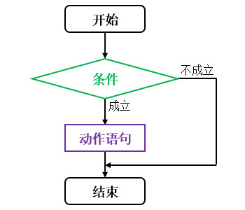
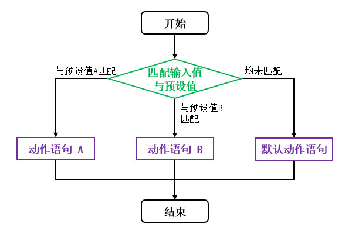

# 分支结构
## "if"语句
`if` 语句用于“仅当满足条件时才执行动作”的情况，该语句的结构如下文代码块所示：

```text
if <条件>
then
    <动作语句>
fi

[其他语句]
```

`<条件>` 可以是一个布尔型变量，也可以是结果为布尔值的表达式。当表达式的值为"true"时，程序将会首先执行"STATEMENT"所指代的语句，然后再执行后续语句"OTHER"；当表达式的值为"false"时，则跳过"STATEMENT"所指代的语句，直接执行后续语句"OTHER"。


Shell没有像C语言的大括号{}来明确作用域，因此选用作用域首个单词的反向拼写作为结束符号


如果条件成立时需要执行的语句只有一条，我们可以省略大括号单行书写；但若需要执行的语句有多条，则不可省略大括号。当代码的逻辑较为复杂时，我们不建议省略大括号，因为后续将单行语句修改为多行时，我们可能忘记添加大括号从而导致逻辑错误。

"if"语句的执行流程可参考下文流程图：

<div align="center">



</div>

下文示例展示了"if"语句的使用方法。

🔴 示例一："if"语句的基本应用。

在本示例中，我们给定两个整数，当 `a` 的值比 `b` 的值大时，在控制台上输出结果。

"TestBranch.java":

```java
int a = 2;
int b = 1;

// "if"的基本结构（简化写法）
if (a > b) System.out.println("a is bigger than b.");

// "if"的基本结构（完整写法）
if (a > b) {
    System.out.println("a is bigger than b.");
}
```

此时运行示例程序，并查看控制台输出信息：

```text
a is bigger than b.
a is bigger than b.
```


## "if-else"语句

```text
if <条件>
then
    <动作语句 A>
else
    <动作语句 B>
fi

[其他语句]
```


## 多重"if-else"语句

```text
if <条件>
then
    <动作语句 A>
elif
then
    <动作语句 B>
else
    <动作语句 C>
fi

[其他语句]
```


## "case"语句
当我们需要将输入值与多个预设值相匹配时，可以使用 `case` 语句，它比多重 `if - else` 语句更加简洁。`case` 语句的语法如下文代码块所示：

```text
case <输入值> in
    <预设值 A>)
        <动作语句 A>
        ;;
    <预设值 B>)
        <动作语句 B>
        ;;
    *)
        <默认动作语句>
        ;;
esac

[其他语句]
```

下文列表对 `case` 语句的使用方法与限制条件进行了详细地说明：

- `<预设值>` 可以是常量，但不能是变量或含有变量的表达式。
- `<预设值>` 与 `<动作语句>` 之间以右括号 `)` 作为分隔符， `<动作语句>` 以两个分号 `;;` 作为结束符，这是固定格式，并非语法错误。
- 系统将按照声明顺序依次尝试匹配每个 `<预设值>` ，一旦匹配成功，则执行对应的 `<动作语句>` ，然后终止匹配，不再尝试匹配剩余的 `<预设值>` 。
- `*)` 块是默认值，将在所有 `<预设值>` 均未匹配成功时被执行。`case` 语句中的默认值块必须被放置在其他预设值之后，其中的结束符 `;;` 可以省略。如果我们不需要任何默认行为，也可以省略整个 `*)` 块。

`case` 语句的执行流程可参考下文流程图：

<div align="center">



</div>

下文示例展示了 `case` 语句的基本使用方法。

🟢 示例四：根据数字序号显示对应的季度名称。

在本示例中，我们给定一个表示季度的整数，范围为： `[1, 4]` ，并通过 `case` 语句将其转换为对应的季度名称。

"test_case.sh":

```shell
x=2

case $x in
    1)
        echo "Q1"
        ;;
    2)
        echo "Q2"
        ;;
    3)
        echo "Q3"
        ;;
    4)
        echo "Q4"
        ;;
    *)
        echo "输入值不合法！"
esac
```

此时运行示例程序，并查看控制台输出信息：

```text
Q2
```

## 分支结构的嵌套


# 循环结构
## 简介
为了完成某些任务，我们需要重复执行一系列动作，直到满足条件为止，此时可以使用循环结构组织代码。

9.3 while循环语句

在循环的开头判断条件是否满足，如果条件为True，则一直循环。

    while适合循环次数未知的情况。

语法格式：

while [ condition ];do
    command1
    command2
    ...
done

具体实例：计算两个数字之间的和（程序很简单，是本人Test所以加了一些说明）

echo "-------This program calculates the sum of all the numbers between two numbers-------"

echo "please inpput first number (need Must be less than the second number): "
read a

echo "Please input second number (Must be greater than the first number): "
read b

sum=0

while ((a <= b));do
    ((sum+=a))
    ((a++))
done
echo "the plus is : $sum"

9.4 until循环语句

在循环的顶部判断条件，如果condition为False，就进入循环，和while语句相反。

语法格式：

until condition;do # 如果condition为True，直接结束循环
    command1
    command2
    ...
done

实例：计算1～50的乘积

#程序使用C语言风格，如果使用shellcheck是会直接报错
set i=1
sum=0
until ((i>50));do
    ((sum+=i))
    ((i++))
done
echo "The puls is : $sum"


9.2 for循环

语法格式：

# [list] 是一个列表，类似list1 list2 list3 ... listN
for arg in [list];do #如果do和for在同一行，则注意中间加个分号
    command1
    command2
    ...
done

具体实例：

# 方式 1 
for i in {1..4};do # 类似python中使用in的方式判断
    echo "This is No $i"
done

# 方式 2
for((i=1;i<=5;i++));do # 类似C语言风格来实现
    echo "This is No $i"
done


9.5 break和continue语句

直接影响循环行为的命令：break 和 continue。

    和C语言的方式一致，不做过多说明。

    break 直接跳出循环

    continue 只跳过本次循环，忽略本次循环剩余代码，直接进入下一次循环。


9.7 select结构语句

select结构语句和case结构语句类似，是建立menu的一种工具。

    select是从ksh中引入。

语法格式：

select arg in [list];do
    command_1
    command_2
    ......
    break # 一定要使用break，否则会直接一直提示你选择内容，无法退出（只能通过ctrl+c方式进行）
done

提示用户输入选择的内容(比如放在变量列表中). 注意: select命令使用PS3提示符, 默认为 (#?), 可修改。

具体实例：

#已进行shellcheck检查
PS3="Please choose the OS you are using : "  #直接将提示字符串赋值给PS3变量，即可替代符号 #?

select os_type in "ubuntu1604" "Ubuntu1804" "Centos8" "OpenEuler";do
    echo "The OS you are using : $os_type"
    break
done
exit 0