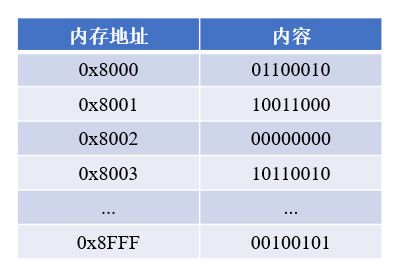

# 简介
在大多数计算机架构中，内存以字节(Byte)为最小编址单位，每个基本存储单元都有唯一的地址，通常使用16进制表示。

<div align="center">



</div>

<!-- TODO

对于程序中的普通变量，变量的值可能会占据一个或多个内存单元，我们以这个变量首字节的地址作为变量内存地址，也称为指针。

普通变量直接存储了数值，而与之对应的指针变量则可以存储内存地址。以声明普通变量的语句为基础，在变量标识符前增加一个"*"，此变量即成为指针变量。

```text
// 指针变量的声明语法
<数据类型> * <标识符>;

// 示例：整型指针变量
int * pInt;
```

例如语句"int *p;"声明了名为p的指针变量，可以存储int型变量的地址。


 


# 取地址与解引用运算
为了获取变量的内存地址，可以在变量名前添加一个"&"符号，这种操作称为取地址运算；为了获取指针变量对应内存单元的内容，可以在变量名前添加一个"*"，这种操作称为解引用运算，"&"和"*"互为逆运算。
以下程序展示了取地址与解引用两种运算：
#include <stdio.h>

int main() {
	int i = 100;                             //定义普通变量i
	int *p;                                  //定义指针变量p
	p = &i;                                  //将变量i的地址赋值给p（p指向i）
	printf("i的地址：%p", &i);             //输出变量i的地址
	printf("\n");
	printf("p指向的地址：%p", p);          //输出指针p指向的地址
	printf("\n");
	printf("p指向地址的内容：%d", *p);     //输出指针p所指向内存区域的内容
	return 0;
}

控制台输出：

i的地址：0xffffcc14
p指向的地址：0xffffcc14
p指向地址的内容：100


"&i"运算得到变量i的内存地址"0xffffcc14"，将i的地址赋值给指针变量p后，p保存的地址也为"0xffffcc14"，对应内存区域的内容为"100"。

图 3-2 指针变量的赋值操作
当p指向i之后，"*p"和i就等价了，相当于i的别名，此时更改两者中任意一方的内容效果是相同的。在上述示例末尾追加以下内容：
i = 4096;                                   //将i的值更改为4096
printf("p指向地址的内容：%d", *p);
printf("\n");
*p = 8192;                                  //将*p的值更改为8192
printf("i的值：%d", i);
控制台输出：
p指向地址的内容：4096
i的值：8192

⚠ 一般情况下，不应当以数值形式给指针变量赋值，而要通过取地址运算获取地址。若直接人工指定一个地址，对应内存空间可能已被占用，会导致不可预料的后果。

1.1.3  指针在函数中的应用
C语言中的变量，将其传递给函数后，系统会建立新的临时变量，并将原始变量值复制到新变量中。若不使用返回值，则无法改变原始变量，这限制了函数的功能。

以下程序中，swap1()使用普通方式交换变量，swap2()使用指针方式交换变量：
#include <stdio.h>

void swap1(int a, int b) {
	int temp = a;
	a = b;
	b = temp;
	printf("函数1内部：a = %d,b = %d\n", a, b);
}

void swap2(int *p, int *q) {
	int temp = *p;
	*p = *q;
	*q = temp;
	printf("函数2内部：*p = %d,*q = %d\n", *p, *q);
}

int main() {
	int x = 1;
	int y = 2;
	swap1(x, y);
	printf("主函数：x = %d,y = %d\n", x, y);
	swap2(&x, &y);
	printf("主函数：x = %d,y = %d\n", x, y);
	return 0;
}
控制台输出：
函数1内部：a = 2,b = 1
主函数：x = 1,y = 2
函数2内部：*p = 2,*q = 1
主函数：x = 2,y = 1
函数swap1()的形参是两个int型变量，当传入参数时，系统根据形参创建a和b两个局部变量，a和b的值交换完成后，空间被回收了，原始变量x与y并未改变。
函数swap2()的形参是两个指针变量，当我们通过取地址运算，将x和y的地址传入时，系统将p和q分别指向x和y，然后通过解引用运算将指针对应的值进行交换，等价于交换了x和y的值。
若传入函数的参数值不希望被修改，可以在参数声明前添加"const"修饰符。
函数中也可以将指针变量作为返回值，此类函数声明时在名称前增加"*"即可。
 
1.2  指针与数组
1.2.1  一维数组
数组是一组存放同类型变量的连续内存空间，当我们将指针指向一个数组时，指针变量就会与数组首元素的地址建立关联，此时不仅可以通过下标访问元素，还能操作指针来访问元素。
以下程序中通过指针遍历数组中的元素：
#include <stdio.h>

void fun(int *pArr, int length) {
	for (int i = 0; i < 5; i++) {
		printf("%d\t", i);
		printf("%d\t", pArr[i]);
		printf("%d\n", *(pArr + i));
	}
}

int main() {
	int array[5] = {10, 20, 30, 40, 50};
	printf("array的地址：%p\n",&array);
	printf("array首元素地址：%p\n",&array[0]);
	fun(array, 5);
}
控制台输出：
array的地址：0xffffcc00
array首元素地址：0xffffcc00
0	10	10
1	20	20
2	30	30
3	40	40
4	50	50
此程序中每次循环均通过下标方式和指针方式访问对应元素，函数的形参中声明了指针变量pArr。当数组array被传进fun()函数时，变量pArr与数组关联，此时可以使用"pArr[i]"形式像普通数组一样访问数组array，也可以使用"*(pArr + i)"形式进行访问。指针变量pArr声明为int类型，对其进行加减操作时，系统自动计算内存地址的偏移量，配合解引用运算即可访问对应位置的元素。
 
图 3-3 通过指针访问数组
使用指针传递数组时，不需要逐个复制数组中的元素，并且可以完成修改原数组内容的操作，所以效率比普通的复制传值更高，且功能更加丰富。
1.2.2  动态数组
C语言中的普通数组空间分配在栈内存中，具有很多缺点：
1.数组长度必须在声明时就确定，并且C99以前的标准不能使用变量。对于数量不确定的数据，只能估计所需的最大空间并做出预留，浪费了大量内存。
2.数组的长度声明后就确定了，无法再修改，非常不灵活。
3.数组资源无法手动释放，函数中的数组需要等待整个函数运行结束，才会被释放。
4.函数中的数组无法在外部使用，函数运行结束就会被销毁。
我们可以使用动态方式在堆内存中存储数据，然后将指针变量指向这块内存，这个变量就可以作为动态数组使用，避免上述的缺点。
 创建动态数组
通过malloc()函数可以为程序分配动态内存区域。该函数包含在头文件"malloc.h"中，名称取自Memory Allocate的缩写。它只接受一个整型参数，即需要分配的空间大小，单位为字节；返回值为内存空间的首个单元地址。
当我们不知道某数据类型的长度时，可以使用sizeof()函数获取，参数为要查询的数据类型，返回值为该类型的长度，单位为字节。
以下程序中，使用malloc()创建了一个长度为5的int型动态数组：
#include <stdio.h>
#include <malloc.h>

int main() {
	int len = 5;
	int *pArr = (int *) malloc(len * sizeof(int));

	//赋值
	for (int i = 0; i < len; ++i) {
		pArr[i] = i + 1;
	}

	//读取
	for (int j = 0; j < 5; ++j) {
		printf("%d\t", pArr[j]);
	}
}
控制台输出：
1	2	3	4	5
此程序首先通过"sizeof(int)"获取了int类型长度为4字节，空间中需要存储的元素数量len为5，所以malloc()函数总共开辟了20字节的内存空间。对于int型指针变量pArr，只能接受同类型的内存地址，因此还需要将malloc()函数返回的内存地址强制转换为"int *"类型才能完成赋值。
当pArr指向malloc()函数开辟的内存空间后，就可以使用下标的方式进行操作了。
除了malloc()函数，还有calloc()函数，此函数接收两个参数，分别指定了需要容纳的元素数量、每个元素的长度，不需要手动计算空间的总长度。
 释放动态数组
malloc()函数创建的内存区域可以随时手动释放，使用系统提供的free()函数即可完成该操作。需要注意的是，若有多个指针变量指向同一块内存空间，通过其中一个指针释放即可，释放后内存空间已经不再属于当前程序，不能再通过其它指针释放。
#include <stdio.h>
#include <malloc.h>

int main() {
	int *pArr = (int *) malloc(20);
	int *q = pArr;
	printf("pArr指向的地址：%p\n", pArr);
	printf("q指向的地址：%p", q);
	free(pArr);
	//free(q);  错误的操作
}
控制台输出：
pArr指向的地址：0x800038920
q指向的地址：0x800038920
 调整动态数组长度
动态数组的长度可以进行伸缩，比普通数组更灵活。我们可以使用realloc()函数调整数组长度，该函数接受两个参数，第一个是数组，第二个是伸缩后的长度，返回值为扩充后内存区域的首字节地址。
若当前数组大于目标长度，系统会将多余的内存区域释放；若当前数组小于目标长度，系统先尝试在数组尾部向后扩展，如果尾部空间不足，则尝试开辟新的空间，并将原先的数据复制到新空间，返回新的地址。若整个内存都不能容纳新的数组，则返回空指针，原先的数组不做改变。
以下程序为数组缩放的示例，初始长度为5，先缩小至3，再扩大至8。
#include <stdio.h>
#include <malloc.h>

int main() {
	int len = 5;
	int *pArr = (int *) malloc(len * sizeof(int));
	for (int i = 0; i < len; ++i) {
		pArr[i] = i + 1;
		printf("%d\t", pArr[i]);
	}
	printf("\n");
	//缩小至3个元素
	pArr = (int *) realloc(pArr, 3);
	for (int i = 0; i < 3; ++i) {
		printf("%d\t", pArr[i]);
	}
	printf("\n");
	//扩大至8个元素
	pArr = (int *) realloc(pArr, 8);
	for (int i = 0; i < 8; ++i) {
		printf("%d\t", pArr[i]);
	}
}
控制台输出：
1	2	3	4	5
1	2	3
1	2	3	4	5	0	83	0
1.2.3  多级指针
指针变量可以存储一个内存地址，其自身也具有一个地址，所以我们可以创建指向另一个指针变量的指针。
#include <stdio.h>

int main() {
	int i = 100;
	int *p = &i;
	int **q = &p;
	printf("i的地址：%p\n", &i);
	printf("p指向的地址：%p\n", p);
	printf("p的地址：%p\n", &p);
	printf("q指向的地址：%p\n", q);
	printf("q的地址：%p\n", &q);
	printf("q所指向内存的值：%d", **q);
}
控制台输出：
i的地址：0xffffcc1c
p指向的地址：0xffffcc1c
p的地址：0xffffcc10
q指向的地址：0xffffcc10
q的地址：0xffffcc08
q所指向内存的值：100
此程序中指针p指向了变量i，通过取地址运算又将p自身的地址赋值给指针变量q。
 
图 3-4 多级指针
如果要求函数中的变量在函数执行结束后仍然可以访问，就可以使用多级指针实现：
#include <stdio.h>
#include <malloc.h>

void fun(int **q) {
	*q = (int *) malloc(sizeof(int));      //相当于p=(int *) malloc(...)
	**q = 100;                               //相当于*p=100
}

int main() {
	int *p;
	fun(&p);                                  //发送指针变量p自身的地址
	printf("p所指向内存的值：%d", *p);
}
控制台输出：
p所指向内存的值：100
此程序将指针变量p的地址发送到fun()函数中，形参q的类型是指针的指针，将指针p嵌套在其中，"*q"解除第一层嵌套，相当于访问p本身，"**q"解除所有封装，相当于访问p指向的内存地址，函数运行结束后，p指向的区域在堆内存中，不会被释放，因此在main()函数中仍然可以访问。

-->
