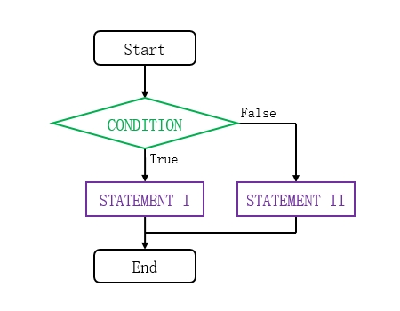
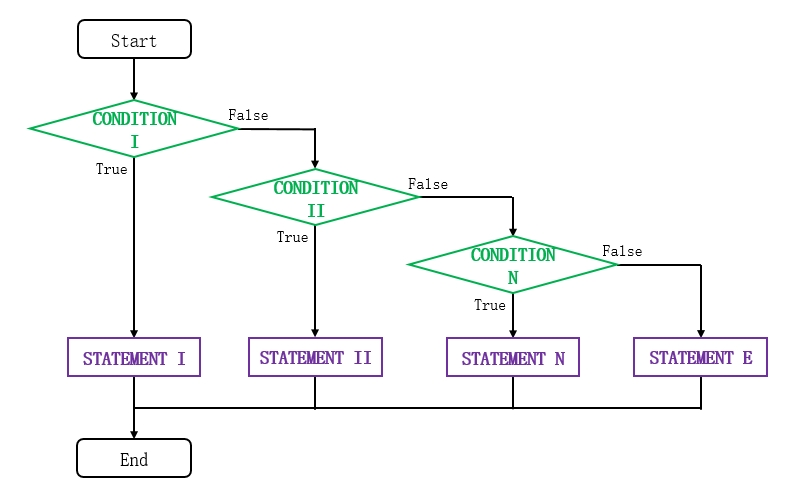
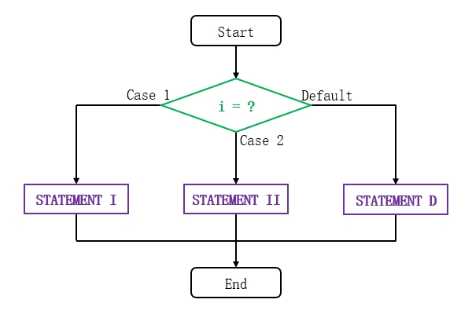
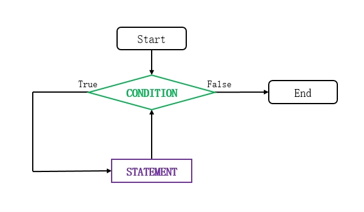
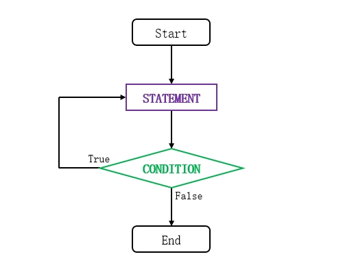
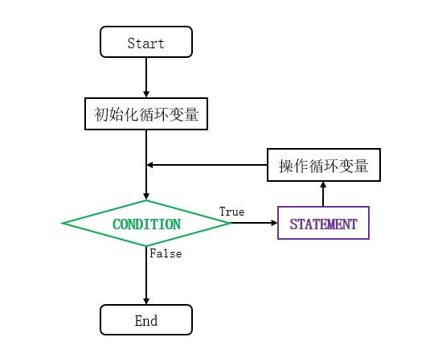

# 分支结构
## 简介
有时我们需要根据特定的条件，执行不同的动作，此时可以使用分支结构组织代码。

## "if"语句
"if"语句用于“仅当满足条件后才执行动作”的情况，该语句的结构如下文代码块所示：

```text
// 满足条件时执行多条语句
if (CONDITION) {
    STATEMENT
}
OTHER

// 满足条件时执行单条语句
if (CONDITION) STATEMENT;
OTHER
```

条件"CONDITION"可以是一个布尔型变量，也可以是结果为布尔值的表达式。当表达式的值为"true"时，程序将会首先执行"STATEMENT"所指代的语句，然后再执行后续语句"OTHER"；当表达式的值为"false"时，则跳过"STATEMENT"所指代的语句，直接执行后续语句"OTHER"。

如果条件成立时需要执行的语句只有一条，我们可以省略大括号单行书写；但若需要执行的语句有多条，则不可省略大括号。当代码的逻辑较为复杂时，我们不建议省略大括号，因为后续将单行语句修改为多行时，我们可能忘记添加大括号从而导致逻辑错误。

"if"语句的执行流程可参考下文流程图：

<div align="center">


</div>

下文示例展示了"if"语句的使用方法。

🔴 示例一："if"语句的基本应用。

在本示例中，我们给定两个整数，当 `a` 的值比 `b` 的值大时，在控制台上输出结果。

"TestBranch.java":

```java
int a = 2;
int b = 1;

// "if"的基本结构（简化写法）
if (a > b) System.out.println("a is bigger than b.");

// "if"的基本结构（完整写法）
if (a > b) {
    System.out.println("a is bigger than b.");
}
```

此时运行示例程序，并查看控制台输出信息：

```text
a is bigger than b.
a is bigger than b.
```

## "if-else"语句
"if-else"语句相比"if"语句多了一个分支，当条件成立时，执行"if"分支内部的代码；条件不成立时，则执行"else"分支内部的代码。

"if-else"语句的结构如下文代码块所示：

```text
if (CONDITION) {
    STATEMENT I
} else {
    STATEMENT II
}
```

当条件"CONDITION"为真时，执行语句"STATEMENT I"；条件为假时，则执行语句"STATEMENT II"。

"if-else"语句的逻辑可参考下文流程图：

<div align="center">



</div>

下文示例展示了"if-else"语句的使用方法。

🟠 示例二："if-else"语句的基本应用。

在本示例中，我们给定一个年龄，当年龄低于18岁时，在控制台上输出文本“未成年人”；否则输出“成年人”。

"TestBranch.java":

```java
int age = 17;
if (age >= 18) {
    System.out.println("成年人");
} else {
    System.out.println("未成年人");
}
```

此时运行示例程序，并查看控制台输出信息：

```text
未成年人
```

## 多重"if-else"语句
多重"if-else"语句通常用于判断数值的所属区间，它的语法如下文代码块所示：

```text
if (CONDITION I) {
    STATEMENT I
} else if (CONDITION II) {
    STATEMENT II
} else if (CONDITION III) {
    STATEMENT III
} else {
    STATEMENT E
}
OTHER
```

当条件"CONDITION I"不满足的情况下，才会进行条件"CONDITION II"的判断，以此类推；如果某个条件成立，则执行对应的"STATEMENT"语句，然后结束判断转至"OTHER"执行后续语句；如果所有条件均不成立，才会执行"else"块内的语句。

多重"if-else"语句的逻辑可参考下文流程图：

<div align="center">



</div>

下文示例展示了多重"if-else"语句的使用方法。

🟡 示例三：多重"if-else"语句的基本应用。

在本示例中，我们给定一个百分制的成绩，并在控制台上输出成绩所属的等第。

当成绩大于90分时等第为“优”；当成绩属于区间 `(90, 75]` 时等第为“良”；当成绩属于区间 `(75, 60]` 时等第为“中”，当成绩低于60分时等第为“差”。

"TestBranch.java":

```java
int score = 60;
System.out.print("等第为：");
if (score >= 90) {
    System.out.println("优");
} else if (score >= 75) {
    System.out.println("良");
} else if (score >= 60) {
    System.out.println("中");
} else {
    System.out.println("差");
}
```

此时运行示例程序，并查看控制台输出信息：

```text
等第为：中
```

## "switch"语句
当我们需要将输入值与多个已知常量匹配时，可以使用"switch"语句，相比使用多重"if-else"语句更加简洁，它的语法如下文代码块所示：

```text
switch (INPUT) {
    case VALUE I:
        STATEMENT I
        break;
    case VALUE II:
        STATEMENT II
        break;
    default:
        STATEMENT D
        break;
}
OTHER
```

下文列表对"switch"语句的逻辑与限制条件进行了详细地说明：

- 输入值"INPUT"必须是整型或字符型，不支持浮点数、字符串等类型。
- 每个"case"块的值"VALUE"可以是常量或常量表达式（例如："2+2"），但不能是变量或含有变量的表达式。
- 某个"case"块匹配成功后，执行对应的语句"STATEMENT"，然后跳转至"OTHER"执行后续语句，不再匹配其他的"case"块。
- "default"块将在所有"case"块均未被匹配时执行，可以出现在任意位置；如果我们不需要默认逻辑，也可以省略"default"块。

"switch"语句的逻辑可参考下文流程图：

<div align="center">



</div>

下文示例展示了"switch"语句的使用方法。

🟢 示例四："switch"语句的基本应用。

在本示例中，我们给定一个表示季度的整数，范围为： `[1, 4]` ，并通过"switch"语句将其转换为对应的季度编号。

"TestBranch.java":

```java
int x = 2;
switch (x) {
    case 1:
        System.out.print("Q1");
        break;
    case 2:
        System.out.print("Q2");
        break;
    case 3:
        System.out.print("Q3");
        break;
    case 4:
        System.out.print("Q4");
        break;
    default:
        System.out.print("输入值不合法");
        break;
}
```

此时运行示例程序，并查看控制台输出信息：

```text
Q2
```

如果某个"case"块中没有"break"语句，其中的语句被执行完毕后，系统将会接着执行后一条"case"块中的语句，直到遇到"break"为止。因此，我们必须留意每个"case"块末尾的"break"语句是否遗漏，避免出现逻辑错误。

有时我们也会利用上述特性，省略部分"case"块末尾的"break"语句，将多个操作完全相同的分支合并书写。

🔵 示例五：省略"break"语句以合并相同的分支。

在本示例中，我们给定一个表示季度的整数，范围为： `[1, 4]` ，并通过"switch"语句将其转换为“上半年”或“下半年”文本。

"TestBranch.java":

```java
int x = 1;
switch (x) {
    case 1:
    case 2:
        System.out.print("上半年");
        break;
    case 3:
    case 4:
        System.out.print("下半年");
        break;
    default:
        System.out.print("输入值不合法");
        break;
}
```

在上述代码中， `x` 的数值为"1"或"2"时，都需要输出“上半年”，因此我们将 `case 1:` 后的文本输出与"break"语句省略，当 `x = 1` 时执行 `case 2:` 中的语句。

此时运行示例程序，并查看控制台输出信息：

```text
上半年
```

## 分支结构的嵌套
条件语句内部可以放置任意其他语句，包括另一个条件语句，我们可以通过嵌套条件语句实现较为复杂的逻辑。

🟣 示例六：判断输入值与区间的关系。

在本示例中，我们给定一个数字，判断它与区间 `(4, 6)` 的关系。

"TestBranch.java":

```java
int x = 5;
if (x > 4) {
    if (x > 6) {
        System.out.println("x大于6");
    } else {
        System.out.println("x在4到6之间");
    }
} else {
    System.out.println("x小于等于4");
}
```

此时运行示例程序，并查看控制台输出信息：

```text
x在4到6之间
```

> 🚩 提示
>
> 本示例仅用于演示分支结构的嵌套用法，我们更推荐使用多重"if-else"语句实现区间判断，因为它的缩进层次更少，可读性更高。

# 循环结构
## 简介
为了完成某些任务，我们需要重复执行一系列动作，直到满足条件为止，此时可以使用循环结构组织代码。

## "while"语句
"while"语句是一种简单的循环结构，它的语法如下文代码块所示：

```text
while (CONDITION) {
    STATEMENT
}
OTHER
```

当条件"CONDITION"成立时，执行循环体"STATEMENT"，然后再次判断条件是否成立，若成立则继续执行循环体；如此往复，直到条件不成立为止，退出循环并执行OTHER所指代的后续语句。

"while"语句的逻辑可参考下文流程图：

<div align="center">



</div>

下文示例展示了"while"语句的使用方法。

🟤 示例七："while"语句的基本应用。

在本示例中，我们向控制台输出从"1"到"5"的所有整数。

"TestLoop.java":

```java
int i = 1;
// 当变量“小于等于5”时执行循环
while (i <= 5) {
    // 输出变量的值，并且使变量加1。
    System.out.println(i);
    i++;
}
```

在上述代码中，每执行一次循环体，变量 `i` 的值都会增加"1"；当输出"5"之后， `i` 自增为"6"，不再满足循环条件 `i <= 5` ，因此退出循环，程序终止。

此时运行示例程序，并查看控制台输出信息：

```text
1
2
3
4
5
```

## "do-while"语句
"do-while"语句与"while"语句类似，不同之处在于"while"语句先进行条件判断，再决定是否执行循环体；而"do-while"语句会无条件执行一次循环体，再进行条件判断，确定是否仍要执行循环体。

"do-while"语句的语法如下文代码块所示：

```text
do {
    STATEMENT
} while (CONDITION);
```

"do-while"语句的逻辑可参考下文流程图：

<div align="center">



</div>

下文示例展示了"do-while"语句的使用方法。

🔴 示例八："do-while"语句的基本应用。

在本示例中，我们计算"1"到"50"之间所有偶数之和，并将结果输出到控制台上。

"TestLoop.java":

```java
// 保存 1-50 之间偶数的和
int sum = 0;
// 循环变量，代表 1-50 之间的偶数，每轮循环数值都将被改变一次。
int num = 2;

do {
    // 实现累加求和
    sum = sum + num;
    // 每执行一次将数值加2，以便下一轮循环进行条件判断。
    num = num + 2;
} while (num <= 50);

System.out.println("50以内的偶数之和为：" + sum);
```

此时运行示例程序，并查看控制台输出信息：

```text
50以内的偶数之和为：650
```

## "for"语句
"for"语句相比"while"和"do-while"结构更加简洁易读，通常用于循环次数较为明确的场景。

"for"语句的语法如下文代码块所示：

```text
for (<初始化循环变量>; <循环条件>; <操作循环变量>) {
    <STATEMENT>
}
```

"for"语句的逻辑可参考下文流程图：

<div align="center">



</div>

程序运行至"for"语句时，首先初始化循环变量，设置初始数值，该部分只会执行一次。然后判断循环条件是否成立，若成立，则执行循环体，然后操作循环变量，进入下一轮操作；如果不成立，则退出循环。

"for"语句括号中的三个表达式必须用分号( `;` )隔开，它们都可以省略。循环变量可以在"for"语句之前进行初始化，此时“初始化循环变量”部分可省略；当退出条件不明确时，“循环条件”部分可省略，此时会无限循环，我们可以在循环体内部使用"if-break"语句结束循环；“操作循环变量”可以在循环体内部进行，此时该部分可省略。

我们可以初始化多个循环变量，用逗号( `,` )隔开即可，“操作循环变量”部分同理。

🟠 示例九："for"语句的基本应用。

在本示例中，我们计算"1"到"100"之间不能被"3"整除的数之和，并将结果输出到控制台上。

"TestLoop.java":

```java
// 保存不能被3整除的数之和
int sum = 0;

// 循环变量i初始值为1,每执行一次对变量加1,只要小于等于100就重复执行循环。
for (int i = 1; i <= 100; i++) {
    // 变量i与3进行取模，如果不等于0 ，则表示不能被3整除。
    if (i % 3 != 0) {
        // 累加求和
        sum = sum + i;
    }
}

System.out.print("1到100之间不能被3整除的数之和为：" + sum);
```

此时运行示例程序，并查看控制台输出信息：

```text
1到100之间不能被3整除的数之和为：3367
```

## 循环结构的嵌套
如果一个循环结构的循环体中包含另一个循环结构，则被称为“多重循环”，最常见的就是二重"for"循环结构。在二重循环中，外层循环每执行一次，内层循环都要完整地执行一遍。

🟡 示例十：在控制台上输出三角形。

在本示例中，我们使用"*"在控制台上输出直角三角形。

"TestLoop.java":

```java
// 外层循环控制行数
for (int i = 1; i <= 5; i++) {
    // 内层循环控制每行的*号数
    // 内层循环变量的最大值和外层循环变量的值相等
    for (int j = 1; j <= i; j++) {
        System.out.print("*");
    }
    // 每打印完一行后进行换行
    System.out.println();
}
```

此时运行示例程序，并查看控制台输出信息：

```text
*
**
***
****
*****
```

## 循环控制语句
### "break"语句
有时我们不知道循环体需要被执行的总轮次，但知道终止条件，此时可以将循环轮次设为无限，并在循环体内部判断是否满足终止条件，当条件满足时，使用"break"语句终止循环。

🟢 示例十一："break"语句的基本应用。

在本示例中，我们累加从"1"开始的正整数，并找出使和超过"20"的数字。

"TestLoop.java":

```java
// 保存累加数值
int sum = 0;
for (int i = 1; ; i++) {
    // 每次循环时累加求和
    sum += i;
    // 判断累加数值是否大于20，如果满足条件则直接退出循环
    if (sum > 20) {
        System.out.println("当前的整数为: " + i);
        System.out.println("当前的累加数值为: " + sum);
        // 退出循环
        break;
    }
}
```

在上述代码中，"for"循环的循环条件被省略了，因此循环体会无限次地执行。每轮循环执行时，都会经过一次"if"语句，一旦条件满足，就会执行"break"语句，随后整个循环被终止。

此时运行示例程序，并查看控制台输出信息：

```text
当前的整数为: 6
当前的累加数值为: 21
```

### "continue"语句
"continue"语句的作用是跳过当前轮次循环体中的剩余语句，直接进行下一轮循环。

🔵 示例十二："continue"语句的基本应用。

在本示例中，我们计算"1"到"10"之间所有偶数之和。

"TestLoop.java":

```java
// 保存累加值
int sum = 0;
for (int i = 1; i <= 10; i++) {
    // 如果i为奇数，不执行累加操作，直接结束本轮循环，进入下一轮循环操作。
    if (i % 2 != 0) {
        continue;
    }
    sum += i;
}

System.out.print("1到10之间的所有偶数的和为：" + sum);
```

此时运行示例程序，并查看控制台输出信息：

```text
1到10之间的所有偶数的和为：30
```

# 疑难解答
## 索引

<div align="center">

|       序号        |                      摘要                      |
| :---------------: | :--------------------------------------------: |
| [案例一](#案例一) | "switch"语句的不同"case"块中无法定义同名变量。 |

</div>

## 案例一
### 问题描述
"switch"语句的不同"case"块中无法定义同名变量，编译时提示为“重复定义变量”错误。

```java
switch (x) {
    case 1:
        int temp = x + 1;
        break;
    case 2:
        // 此处提示变量"temp"已经被定义过了
        int temp = x + 2;
        break;
    default:
        System.out.print("输入值不合法");
        break;
}
```

### 问题分析
我们在书写"switch"语句时通常只保留最外层的大括号，此时每个"case"块都属于同一作用域；如果我们在多个块中定义同名变量，就会出现重复定义错误导致编译失败。

### 解决方案
我们可以为部分"case"块添加大括号，使其拥有独立的作用域，解决变量冲突问题。

```java
switch (x) {
    case 1: {
        int temp = x + 1;
    }
    break;
    case 2: {
        int temp = x + 2;
    }
    break;
    default:
        System.out.print("输入值不合法");
        break;
}
```
