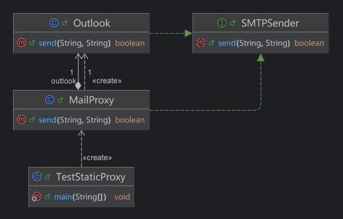

# 简介
Java语言支持反射(Reflection)机制，允许我们在运行时获取对象信息、读写属性、调用方法等，这种机制提高了程序的灵活性与可扩展性。

反射机制有以下使用场景：

第一种是调用SDK中的隐藏接口，例如：Android SDK中有一些不对应用程序开放的隐藏接口，在编码阶段我们无法直接引用它们；当我们需要调用这些接口实现某种功能时，可以通过反射机制，在运行阶段动态调用它们。

第二种是开发具有通用性的框架。框架开发者无法提前预知框架使用者的具体实现，因此可以通过反射机制扫描类的接口、方法与注解，调用接口的实现类或自动生成实现类。以JDBC框架为例：数据库驱动有多种实现，因此JDK内部只定义了JDBC接口，我们需要通过反射机制加载具体的实现类，以供JDK调用。

第三种是实现面向切面编程(AOP)。反射机制可以实现动态代理，在方法执行前后插入额外的逻辑控制语句，实现AOP。

虽然反射机制非常强大，但它破坏了封装且引入了额外的性能开销，因此我们应当谨慎地使用这种机制。

# 获取Class对象
`Class<T>` 是用于表示“类”与“接口”信息的类，每个类与接口都有一个对应的 `Class<T>` 对象，泛型参数 `T` 将被替换为该对象所关联的类或接口，例如：JDK内置的String类对应一个 `Class<String>` 对象、我们自定义的Animal类对应一个 `Class<Animal>` 对象。

`Class<T>` 对象包含获取 `T` 类属性、方法、注解等信息的接口，我们首先需要获取目标类的 `Class<T>` 对象，才能进一步使用反射机制。

🔴 示例一：获取Class对象。

在本示例中，我们通过不同的方式获取自定义类Animal的Class对象。

"TestReflection.java":

```java
// 方式一：通过"<类>.class"获取Class对象
Class<Animal> clazz1 = Animal.class;

// 方式二：通过"<对象>.getClass()"方法获取Class对象
Animal animal = new Animal();
Class<?> clazz2 = animal.getClass();

// 方式三：通过"Class.forName("<类的完全限定名称>")"获取Class对象
Class<?> clazz3 = Class.forName("net.bi4vmr.study.reflection.Animal");
```

`class` 是一个关键字，因此我们不能将其作为变量名，由于字母 `z` 和 `s` 字形相近，我们习惯将Class对象命名为 `clazz` 。

“方式一”和“方式二”需要在当前代码中直接引用目标类，耦合性较高，较少用于编写框架的场景；而“方式三”只需向 `Class.forName()` 方法传入目标类的完全限定名称，不需要直接引用目标类，我们可以通过配置文件等方式向程序中传值，具有更高的灵活性，因此较多用于编写框架的场景，例如：JDBC驱动加载就是通过这种方式完成的。

当我们调用 `Class.forName()` 方法时，如果JVM已经加载了对应的类，则直接返回Class对象；如果JVM还没有加载该类，则尝试即时加载；如果JVM运行环境中并没有该类，则会导致异常：`ClassNotFoundException: Didn't find class "<类名>"` 。我们可以利用这种方式实现插件化，即时加载程序的扩展模块。

“方式二”与“方式三”的返回值类型都是 `Class<?>` ，因此接收Class对象的变量数据类型也需要声明为 `Class<?>` 类型，泛型参数只能使用通配符 `?` 表示。

基本数据类型与引用数据类型有不同的Class对象，我们需要注意区分它们。

🟠 示例二：获取基本数据类型与包装类的Class对象。

在本示例中，我们分别获取 `int` 类型与Integer类型的Class对象。

"TestReflection.java":

```java
// 获取基本数据类型"int"的Class对象。
Class<?> clazz1 = int.class;
Class<Integer> clazz2 = Integer.TYPE;

// 获取包装类Integer的Class对象。
Class<?> clazz3 = Integer.class;

System.out.println(clazz1);
System.out.println(clazz2);
System.out.println(clazz3);
```

`<基本数据类型>.class` 将会返回基本数据类型对应的Class对象； `<包装类>.TYPE` 也会返回包装类所对应的基本数据类型Class对象； `<包装类>.class` 则会返回包装类自身的Class对象。

此时运行示例程序，并查看控制台输出信息：

```text
int
int
class java.lang.Integer
```

Class对象有一个 `isPrimitive()` 方法，用于判断当前Class对象是否为基本数据类型，例如：调用本示例中 `clazz1` 和 `clazz2` 的 `isPrimitive()` 方法时，将会返回"true"；调用 `clazz3` 的 `isPrimitive()` 方法时，将会返回"false"。

除了前文“示例二”中所涉及的数值类型之外，我们还可以获取数组等其他类型的Class对象。

🟡 示例三：获取数组等类型的Class对象。

在本示例中，我们获取"void"类型与数组类型的Class对象。

"TestReflection.java":

```java
// 获取基本数据类型"void"的Class对象。
Class<?> clazz1 = void.class;

// 获取"int"数组的Class对象。
Class<?> clazz2 = int[].class;

// 获取"String"多维数组的Class对象。
Class<?> clazz3 = String[][].class;

System.out.println(clazz1);
System.out.println(clazz2);
System.out.println(clazz3);
```

此时运行示例程序，并查看控制台输出信息：

```text
void
class [I
class [[Ljava.lang.String;
```

数组类型的Class对象在控制台上显示为JVM类型描述符，详见相关章节： [🧭 方法签名 - 描述符](../../02_基本语法/05_方法.md#描述符) 。

Class对象有一个 `isArray()` 方法，用于判断当前Class对象是否为数组类型，例如：调用本示例中 `clazz1` 的 `isArray()` 方法时，将会返回"false"；调用 `clazz2` 与 `clazz3` 的 `isArray()` 方法时，将会返回"true"。

# 获取类的信息
## 基本信息
我们可以通过Class对象获取类的全名、父类名称等基本信息：

🟡 示例四：获取类的基本信息。

在本示例中，我们获取类的Class对象，然后进一步获取类的基本信息。

"TestReflection.java":

```java
// 获取Class对象
Class<String> clazz = String.class;

// 获取完全限定名称
String canonicalName = clazz.getCanonicalName();
// 获取类名
String simpleName = clazz.getSimpleName();
// 获取包名
String packageName = clazz.getPackageName();
// 获取父类Class对象
Class<? super String> superClass = clazz.getSuperclass();

System.out.println("完全限定名称：" + canonicalName);
System.out.println("类名：" + simpleName);
System.out.println("包名：" + packageName);
System.out.println("父类：" + superClass);
```

此时运行示例程序，并查看控制台输出信息：

```text
完全限定名称：java.lang.String
类名：String
包名：java.lang
父类：class java.lang.Object
```

## 成员信息
除了基本信息之外，Class类还提供了一系列方法，以供我们获取类的变量、方法等成员信息。

下文列表展示了这些方法的概览信息：

- `Field[] getFields()` : 获取所有的公开成员变量。
- `Field[] getDeclaredFields()` : 获取所有的私有成员变量。
- `Method[] getMethods()` : 获取所有的公开成员方法。
- `Method[] getDeclaredMethods()` : 获取所有的私有成员方法。
- `Constructor[] getConstructors()` : 获取所有的公开构造方法。
- `Constructor[] getDeclaredConstructors()` : 获取所有的私有构造方法。
- `Class[] getClasses()` : 获取所有的公开内部类。
- `Class[] getDeclaredClasses()` : 获取所有的私有内部类。

在上述列表中，前缀为"get"的方法能够获取当前类定义的公开成员与通过继承关系获得的公开成员，前缀为"getDeclared"的方法能够获取当前类定义的任意修饰符成员。

## 成员变量


成员变量 Field

第一种成员类型是成员变量，定义为 java.lang.reflect.Field 类型
Field 方法

首先先来看看 Field 可以调用的方法接口
Method	Usage
String getName()	获取变量名
Class getType()、Type getGenericType()	获取变量类型
Class getDeclaringClass()	获取成员所属类型
int getModifiers()	获取变量访问修饰符
T getT(Object)	动态获取参数对象实际成员变量值


方法 Method

第二种是方法，定义为 java.lang.reflect.Method
Method 方法
Method	Usage
String getName()	获取方法名
Class getReturnType()、Type getGenericReturnType()	获取返回类型
Class[] getParameterTypes()、Type[] getGenericParameterTypes()	获取参数类型列表
Class[] getExceptionTypes()、Type[] getGenericExceptionTypes()	获取抛出异常类型列表
Class getDeclaringClass()	获取定义方法的类
Object getDefaultValue()	获取默认返回值
int getModifiers()	获取方法访问修饰符
void setAccessible(boolean)	设置调用时访问权限
Object invoke(Object, Object …args)	传入调用方法对象和参数列表，调用函数


构造函数 Constructor

第三种是构造函数，定义为 java.lang.reflect.Constructor
Constructor 方法
Method	Usage
String getName()	构造函数名（类名）
Class[] getParameterTypes()、Type[] getGenericParameterTypes()	获取参数列表
int getModifiers()	获取访问修饰符


# 代理模式
## 简介
代理模式是一种常用的软件设计模式，可以为

功能：增强功能、控制权限

客户类 -> 代理类 -> 目标类


代理是AOP的基础

此外，还有许多框架利用了Java代理的概念，比如Spring AOP（面向切面编程），它就是通过代理机制来实现横切关注点的分离。


根据代码的组织方式，代理模式可以分为以下两种方式：

- 静态代理：代理类直接引用目标类，类之间的关系在编码阶段就确定了，新增目标类时可能需要重新编写代理类，适合规模较小、代理关系相对固定的场合。
- 动态代理：代理类不直接引用目标类，而是通过接口等形式与目标类交互，新增目标类时可以复用现有的代理类，因此灵活程度较高，适用于代理关系经常变化的场合。

在Java语言中，动态代理有两种实现方式：

1. JVM反射：利用JVM提供的反射与代理功能，动态生成指定接口的代理对象。
2. CGLib库：CGLib是一个第三方库，通过创建目标类的子类并重写其方法实现代理。

有时需要代理的方法在目标类中没有对应的接口，此时我们无法使用JVM反射实现代理；而CGLib通过继承实现代理，只要求目标方法非"final"即可，适用范围更广。

## 静态代理
下文示例展示了静态代理的实现方法。

🔴 示例一：基于接口实现静态代理。

在本示例中，我们使用静态代理模式，调用邮箱SDK完成发送邮件的任务。

我们可以在测试类（业务代码）中直接调用邮箱类完成任务，但邮箱类通常由邮件厂商在SDK中提供，我们无法对它们进行修改并添加新的功能；并且如果SDK升级导致接口变动，我们必须同步修改业务代码中所有调用邮箱类的语句进行适配，可维护性较低。

为了解决上述问题，我们可以创建一个中间层，业务代码只与该中间层交互，不再直接调用邮箱类。由于中间层是我们自行编写的，它可以在调用邮箱类的实际功能前后插入一些其他逻辑代码，扩展邮箱类的功能；并且一旦邮箱类发生变化，我们只需要修改中间层即可完成适配，无需修改其他业务代码。

下文类图展示了本示例中所涉及的类及其关系：

<div align="center">



</div>

第一步，我们定义SMTPSender接口，该接口中只有一个 `send()` 方法，参数分别表示目标邮箱与邮件内容。

"SMTPSender.java":

```java
public interface SMTPSender {
    boolean send(String address, String content);
}
```

第二步，我们定义Outlook类，并实现SMTPSender接口。

"Outlook.java":

```java
public class Outlook implements SMTPSender {

    @Override
    public boolean send(String address, String content) {
        System.out.println("目标类 -> 使用Outlook发送邮件...");
        System.out.println("目标类 -> 邮箱：[" + address + "] 内容：[" + content + "]");
        return true;
    }
}
```

此类用于模拟邮件SDK，如果外部调用 `send()` 方法，我们就将邮箱地址与内容输出到控制台上。

第三步，我们创建代理类MailProxy，作为中间层负责转发业务代码的邮件发送请求。

"MailProxy.java":

```java
public class MailProxy implements SMTPSender {

    private final Outlook outlook = new Outlook();

    @Override
    public boolean send(String address, String content) {
        // 扩展能力一：日志记录。
        System.out.println("代理类 -> 记录操作日志...");
        // 扩展能力二：耗时统计。
        long startTS = System.currentTimeMillis();

        // 收到客户类的调用请求后，调用目标类的对应方法。
        boolean result = outlook.send(address, content);

        long time = System.currentTimeMillis() - startTS;
        System.out.println("代理类 -> 发送邮件耗时：" + time + "ms");

        return result;
    }
}
```

中间层需要对外提供邮件SDK的所有功能，因此也需要实现SMTPSender接口。如果业务代码调用MailProxy的 `send()` 接口，则此处需要调用邮件SDK的 `send()` 接口完成邮件发送动作，并将返回值返还给调用者。

除了基本的功能调用之外，我们还利用中间层扩展了邮件SDK的功能，包括日志记录和耗时统计。

第四步，我们编写测试代码，调用中间层的邮件发送接口完成任务。

"TestStaticProxy.java":

```java
public class TestStaticProxy {

    public static void main(String[] args) {
        // 创建代理类对象，调用代理类中的方法。
        MailProxy proxy = new MailProxy();
        boolean result = proxy.send("BI4VMR@outlook.com", "测试内容。");
        System.out.println("客户类 -> 邮件发送结果：" + result);
    }
}
```

此时运行示例程序，并查看控制台输出信息与界面外观：

```text
代理类 -> 记录操作日志...
目标类 -> 使用Outlook发送邮件...
目标类 -> 邮箱：[BI4VMR@outlook.com] 内容：[测试内容。]
代理类 -> 发送邮件耗时：7ms
客户类 -> 邮件发送结果：true
```

根据上述输出内容可知：

客户类（测试类）调用代理类的 `send()` 接口后，代理类调用目标类的 `send()` 接口完成了任务，并且实现了日志记录与耗时统计功能。

## 动态代理
在静态代理模式中，代理类直接持有目标类的引用，因此类之间的关系在编码阶段就固定了，只适用于代理关系简单的场合。在前文“示例一”中，如果我们需要接入多种邮件SDK，就要编写多个代理类，这使得维护难度成倍增加。

Java语言通过反射机制提供了动态代理能力，我们只需向JVM提供需要代理的接口，JVM就能自动创建代理对象。JDK中与动态代理有关的部分详见下文内容：

🔷 Proxy类

该类用于创建代理对象，最重要的静态方法是 `Object newProxyInstance(ClassLoader loader, Class<?>[] interfaces, InvocationHandler handler)` ，详情如下文列表所示：

- 第一参数 `loader` ：创建代理对象所使用的类加载器。我们一般使用应用类加载器，因此传入 `<代理类>.class.getClassLoader()` 、 `<目标类>.class.getClassLoader()` 等效果是相同的；但我们不能使用系统类加载器，例如：String与Object的类加载器。
- 第二参数 `interfaces` ：代理对象需要实现的接口列表。我们可以使用 `<目标类>.class.getInterfaces()` 获取目标类的接口列表；如果我们不希望直接引用目标类，也可以通过 `new Class[]{<接口Class列表>}` 指定单个或多个接口。
- 第三参数 `handler` ：调用处理器。当客户类调用代理对象中的方法时，JVM将会回调该对象中的 `invoke()` 方法，我们需要在此处编写代理逻辑代码。
- 返回值：代理对象。我们可以将其强制转换为 `interfaces` 参数所指明的任意一种接口类型，以便调用被代理接口的方法。

该类还有一个 `isProxyClass(Class<?> clazz)` 静态方法，我们可以传入一个Class对象，判断Class对象对应的原始对象是否为代理对象。

🔷 InvocationHandler接口

调用处理器，负责处理客户类的调用请求。

该接口只有一个 `Object invoke(Object proxy, Method method, Object[] args)` 方法，我们需要自定义类并实现此方法，在此处编写代理逻辑。当客户类调用代理对象中的方法时，JVM将会触发此回调方法，第一参数 `proxy` 即JVM生成的代理对象；第二参数 `method` 为客户类调用的方法信息；第三参数 `args` 为客户类传入的参数列表。

<br />

下文示例展示了基于反射的动态代理机制的实现方法。

🔴 示例一：基于反射机制实现动态代理。

在本示例中，我们使用基于反射的动态代理模式，调用邮箱SDK完成发送邮件的任务。

第一步，我们创建能力接口SMTPSender和目标类Outlook，它们与前文“示例一”是完全相同的，此处省略相关代码。

第二步，我们编写调用处理器MailHandler，实现代理逻辑。

"MailHandler.java":

```java
public class MailHandler implements InvocationHandler {

    // 全局变量，用于保存外部传入的目标类实例。
    private final SMTPSender sender;

    public MailHandler(SMTPSender sender) {
        this.sender = sender;
    }

    // 回调方法，代理方法被客户类调用时触发。
    @Override
    public Object invoke(Object proxy, Method method, Object[] args) {
        String methodName = method.getName();
        System.out.println("代理类 -> 收到客户类的调用请求，方法名称：[" + methodName + "]");
        switch (methodName) {
            /* 目标类的方法 */
            case "send":
                // 校验参数是否合法，然后调用目标类的对应方法。
                if (args != null && args.length == 2) {
                    String address = args[0].toString();
                    String content = args[1].toString();
                    return sender.send(address, content);
                } else {
                    return null;
                }

            /* Object类的方法 */
            case "toString":
                return sender.toString();
            case "hashCode":
                return sender.hashCode();
            case "equals":
                if (args != null && args.length >= 1 && args[0] != null) {
                    return sender.hashCode() == args[0].hashCode();
                } else {
                    return false;
                }
        }

        return null;
    }
}
```

在上文代码中，我们声明了SMTPSender类型的全局变量保存目标类实例，以供客户类自行选择所需的目标类。在动态代理模式中，代理类只引用了SMTPSender接口，而没有直接引用目标类，即使有许多邮件SDK，代理类也可以兼容它们，我们不必为每个SDK单独编写代理类。

在 `invoke()` 回调方法中，我们可以通过 `method.getName()` 获取客户类希望调用的目标类方法名称，并调用目标类实例的对应方法。

除了业务接口中的方法之外，JVM也会代理外部对目标类的 `toString()` 、 `hashCode()` 、 `equals()` 方法调用，因此不要忘记在InvocationHandler中编写对应的逻辑代码，防止代理对象在Map等工具中出现非预期的行为。

第三步，我们编写测试代码，创建代理对象，并调用它的邮件发送接口完成任务。

"TestDynamicProxy.java":

```java
// 创建目标类实例
Outlook outlook = new Outlook();
// 创建代理处理器实例
MailHandler mailHandler = new MailHandler(outlook);

// 创建代理类对象
SMTPSender proxySender = (SMTPSender) Proxy.newProxyInstance(Outlook.class.getClassLoader(), Outlook.class.getInterfaces(), mailHandler);

// 通过代理对象调用目标对象的方法
boolean result = proxySender.send("BI4VMR@outlook.com", "测试内容。");
System.out.println("客户类 -> 邮件发送结果：" + result);

boolean proxy = Proxy.isProxyClass(proxySender.getClass());
System.out.println("客户类 -> 'proxySender'是否为代理类对象：" + proxy);
```

在上文代码中，我们首先创建了Outlook对象并传入MailHandler的构造方法中，使调用处理器代理Outlook类中的方法。由于构造MailHandler时客户类可以选择任意SMTPSender接口的实现类，与前文“示例一”相比，控制权已经从代理类转移到客户类，我们只需编写一个MailHandler即可代理所有邮件SDK。

我们使用Proxy类的 `newProxyInstance()` 静态方法创建SMTPSender接口的代理类，并指定MailHandler实例作为调用处理器，最后通过代理对象调用 `send()` 方法。

此时运行示例程序，并查看控制台输出信息与界面外观：

```text
代理类 -> 收到客户类的调用请求，方法名称：[send]
目标类 -> 使用Outlook发送邮件...
目标类 -> 邮箱：[BI4VMR@outlook.com] 内容：[测试内容。]
客户类 -> 邮件发送结果：true
客户类 -> 'proxySender'是否为代理类对象：true
```

有些API只在运行时可用，编码阶段无法直接引用它们，例如Android SDK中的隐藏接口。对于同步方法与属性，我们可以通过反射访问它们；对于异步方法，我们无法引用并实现回调接口。

为了接收事件回调，我们可以通过反射获取回调接口的Class对象，再通过Proxy类创建实现了回调接口的代理对象，最后使用代理对象注册回调。在编码过程中我们只通过字符串的形式指明回调接口，并没有直接引用它，因此编译可以成功。

🔴 示例一：利用动态代理机制接收事件回调。

在本示例中，我们利用动态代理机制接收事件回调。

第一步，我们创建FileHelper类，其中的 `saveFile()` 方法用于模拟异步操作，Callback接口用于通知异步操作的结果。

"FileHelper.java":

```java
class FileHelper {

    public void saveFile(Callback cb) {
        TimerTask task = new TimerTask() {

            @Override
            public void run() {
                cb.onResult(true, "OK");
                // 清除Timer，终止当前程序。
                System.gc();
            }
        };
        // 延迟2秒再执行上述任务，模拟异步操作。
        new Timer().schedule(task, 2000L);
    }

    // 回调接口
    interface Callback {
        void onResult(boolean result, String message);
    }
}
```

第二步，我们编写调用处理器，重写 `invoke()` 方法并添加接收参数的逻辑。

"CallbackHandler.java":

```java
public class CallbackHandler implements InvocationHandler {

    @Override
    public Object invoke(Object proxy, Method method, Object[] args) {
        String methodName = method.getName();
        System.out.println("代理类 -> 收到客户类的调用请求，方法名称：[" + methodName + "]");
        switch (methodName) {
            /* 目标类的方法 */
            case "onResult":
                // 校验参数是否合法，然后调用目标类的对应方法。
                if (args != null && args.length == 2) {
                    boolean result = args[0] instanceof Boolean ? (Boolean) args[0] : false;
                    String message = args[1].toString();
                    System.out.println("代理类 -> 结果：[" + result + "] 消息：[" + message + "]");
                }
                return null;

            /* Object类的方法 */
            case "toString":
                return toString();
            case "hashCode":
                return hashCode();
            case "equals":
                if (args != null && args.length >= 1 && args[0] != null) {
                    return hashCode() == args[0].hashCode();
                } else {
                    return false;
                }
        }

        return null;
    }
}
```

第三步，我们编写测试代码，利用代理机制创建实现了Callback接口的代理对象，并注册回调监听。

"TestProxyCallback.java":

```java
// 创建目标类实例
FileHelper fileHelper = new FileHelper();

// 获取回调接口的Class文件
Class<?> clazz = Class.forName("net.bi4vmr.study.reflection.proxycallback.FileHelper$Callback");
// 通过代理机制创建回调接口实现类的对象
Object callback = Proxy.newProxyInstance(TestProxyCallback.class.getClassLoader(),
new Class[]{clazz},
new CallbackHandler());
// 获取注册回调的方法，传入回调接口实现类的对象。
Method method = FileHelper.class.getDeclaredMethod("saveFile", clazz);
method.invoke(fileHelper, callback);
```

此时运行示例程序，并查看控制台输出信息与界面外观：

```text
代理类 -> 收到客户类的调用请求，方法名称：[onResult]
代理类 -> 结果：[true] 消息：[OK]
```
