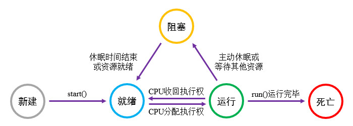

# 简介
现代计算机通常具有多任务调度的能力，例如我们可以一边观看视频一边下载文件，这种能力是通过“时分复用”思想实现的。

对于单个CPU核心，我们可以将它的运行周期划分为若干较小的时间片，当前任务执行一段时间后被调度器暂停，再切换至另一个任务执行，如此反复交替，人们从宏观上就会感觉到多个任务是同时执行的。

除了单个核心上的时分复用机制，现代CPU通常还具有多个核心，调度器可以将任务分配至不同的核心，这进一步提升了任务的并行程度。

# 理论基础
## 进程与线程
进程是指程序的一次执行过程，它直接持有操作系统分配的内存、网络地址、I/O设备等资源。

线程是进程内部的任务，它只占用CPU计算资源，而不持有内存等其他资源。

Java中的 `main()` 方法是程序的入口，其所在的进程与线程分别被称为“主进程”与“主线程”，其他由“主线程”创建出的线程都被称为“子线程”。主线程用于控制其他子线程的创建与销毁，因此我们习惯性地将之称为“主线程”，但它的默认优先级与子线程相同，被调度器执行的概率是均等的。

# 基本应用
## 继承Thread类
Thread是Java中用于描述线程的类，我们可以创建一个自定义类，并继承自Thread，然后重写它的 `run()` 方法，在此处放置需要执行的代码片段。

"MyThread.java":

```java
public class MyThread extends Thread {

    @Override
    public void run() {
        // 此处放置线程需要执行的操作，本示例将向控制台输出消息。
        for (int i = 0; i <= 10; i++) {
            System.out.println("Print some messages in thread:" + getName());
        }
    }
}
```

此处我们向控制台循环输出消息，并使用Thread实例的 `getName()` 方法显示当前线程名称。

我们在测试类中创建一个MyThread实例，并调用它的 `start()` 方法，使先前 `run()` 方法中定义的任务开始运行。除此之外，我们在主线程中也加入循环输出消息的代码片段，以便与子线程进行对比。

"TestThread.java":

```java
// 构造MyThread实例，每个MyThread实例都是一个独立的线程。
MyThread thread = new MyThread();
// 启动线程，执行"run()"方法中的任务。
thread.start();

// 使用主线程向控制台输出消息
for (int i = 0; i <= 10; i++) {
    System.out.println("Print some messages in thread:" + Thread.currentThread().getName());
}
```

在主线程的循环体中，我们调用了Thread类的静态方法 `currentThread()` ，该方法可以获取当前作用域对应的Thread实例，此处为主线程，因此返回值即为主线程的Thread实例。

此时运行示例程序，并查看控制台输出信息：

```text
Print some messages in thread:main
Print some messages in thread:Thread-0
Print some messages in thread:main
Print some messages in thread:Thread-0
Print some messages in thread:Thread-0
```

根据上述输出内容可知：

主线程"main"与子线程"Thread-0"正在交替执行，两个任务是并行推进的。

> 🚩 提示
>
> 现代计算机CPU性能较高且核心较多，可能会出现子线程循环执行完毕才执行主线程循环的情况，这种现象看起来像是顺序执行。
>
> 遇到这种现象时，我们可以增大循环次数、增多子线程数量再进行测试。

## 实现Runnable接口
Runnable接口中只有一个抽象方法 `run()` ，它表示可执行的“任务”，除了线程之外，我们还可以在定时器(Timer)、线程池(ExecutorService)等场合中使用它。

Thread类的构造方法 `Thread(Runnable target)` 接受一个Runnable接口实现为参数，我们可以通过这种方式初始化线程并传入任务。

"TestThread.java":

```java
// 构造Thread实例，并通过构造方法传入任务。
Thread thread = new Thread(
        // 创建匿名内部类，实现Runnable接口。
        new Runnable() {
            @Override
            public void run() {
                // 此处放置线程需要执行的操作，本示例将向控制台输出消息。
                for (int i = 0; i <= 10; i++) {
                    System.out.println("Print some messages in thread:" + Thread.currentThread().getName());
                }
            }
        }
);

// 启动线程，执行构造方法传入的任务。
thread.start();
```

我们使用匿名内部类现场构造了一个Runnable实现，并传递给Thread构造方法，这种方式通常用于不需要复用的任务。

Runnable是一个单方法接口，我们可以使用Lambda表达式对上述代码进行简写：

```java
new Thread(() -> {
    for (int i = 0; i <= 10; i++) {
        System.out.println("Print some messages in thread:" + Thread.currentThread().getName());
    }
}).start();
```

# Thread类的常用方法
Thread类有以下常用方法：

🔷 `Thread currentThread()`

获取当前作用域的线程实例。

静态方法，用于获取当前代码作用域所在的线程实例。

🔷 `String getName()`

获取线程的名称。

🔷 `void setName(String name)`

设置线程的名称。

每个线程都有一个默认的名称，例如前文示例中的"main"、"Thread-0"等，我们可以通过此方法设置自定义名称。

🔷 `int getId()`

获取线程的标识符。

每个线程实例都有全局唯一的ID，可以用来判断两个Thread变量是否相同。

# 线程的调度
## 线程的状态
线程的执行是一个动态过程，它有五种状态，状态间的变化与特性可参见下图。

<div align="center">



</div>

我们可以使用Thread类的 `Thread.State getState()` 方法获取线程状态，各个状态的详情可参考下文：

🔶 新建(NEW)

Thread实例被创建之后，该线程进入“新建”状态，此时任务并未开始运行，我们可以随时调用线程的 `start()` 方法开启任务。

🔶 就绪(RUNNABLE)

当我们调用“新建”状态线程的 `start()` 方法后，线程将会进入就绪队列，等待JVM线程调度器的调度。

🔶 运行

JVM的线程调度器策略与操作系统有关。

在我们常用的Windows和Linux中，系统会从就绪队列中随机选择一个线程进行执行；当CPU时间片耗尽时，该线程的相关环境与进度被保存，调度器再随机选择一个就绪状态的线程继续执行。

枚举Thread.State中并未定义该状态，此时 `getState()` 方法获取到的状态也为RUNNABLE，因为“运行”与“就绪”状态是由操作系统管理的，对于应用程序内部没有实际意义。

🔶 阻塞

当线程所需资源不足或我们主动调用某些方法后，线程将会进入阻塞状态，这种状态的线程进度暂停、不占用CPU资源且不可被调度。

🔺 同步等待(BLOCKED)

当某个线程持有同步锁时，其他执行至此的线程就会进入阻塞状态；等到锁被释放后，最先竞争到CPU资源的线程将持有锁，开始执行代码块。

🔺 通知等待(WAITING)

当我们调用同步实例的 `wait()` 方法后线程将进入该状态，并等待其他线程的唤醒信号；当收到唤醒信号后，再回到“就绪”状态。

🔺 计时等待(TIMED_WAITING)

当我们调用线程的 `sleep()` 方法使其休眠后，线程就会进入该状态；等到时间结束，再回到“就绪”状态。

<br />

🔶 死亡(TERMINATED)

当线程中的任务运行完毕或者被外部终止时，线程就会进入该状态，Thread实例将被JVM进行垃圾回收。

<br />

当一个Thread实例被创建后，我们只能调用一次 `start()` 方法，否则调用者会收到IllegalThreadStateException异常。

为了防止重复调用 `start()` ，Thread提供了一个方法以便我们检测任务状态：

🔷 `boolean isAlive()`

获取当前线程中的任务是否已经开始执行。

线程中的任务开始执行（包括就绪、运行与阻塞状态）后，该状态为"true"；直到任务终止时，该状态变为"false"。

## 线程的优先级
Java中线程优先级分为10个级别，使用数字1-10表示，默认优先级为5。

优先级具有以下特点：

- 我们必须在任务开始前设置优先级，若在 `start()` 方法被调用后再设置优先级，则不会生效。
- 系统在调度线程时，倾向于选择优先级较高的线程，但优先级较低的线程也有机会被调度，通常不会连续调度高优先级任务，使其执行完毕，再调度低优先级。

我们可以通过以下两个方法查询与修改线程的优先级：

🔶 `int getPriority()`

获取线程的优先级。

🔶 `void setPriority(int priority)`

修改线程的优先级。

## 休眠
Thread类拥有静态方法 `void sleep(long time)` ，我们可以在线程内部调用它，使得当前线程休眠，参数"time"即为需要休眠的时长，单位为毫秒。

线程休眠后即为计时等待状态，此时任务暂停并让出CPU资源；等到休眠时间结束后，再转为就绪状态，等待线程调度器的调度。

"TestThread.java":

```java
// 构造Thread实例，并通过构造方法传入任务。
Thread thread = new Thread(() -> {
    System.out.println("Thread start time:" + System.currentTimeMillis());
    try {
        // 休眠3秒后再继续执行
        Thread.sleep(3000L);
    } catch (Exception e) {
        e.printStackTrace();
    }
    System.out.println("Thread end time:" + System.currentTimeMillis());
});
// 启动线程，执行构造方法传入的任务。
thread.start();
```

此时运行示例程序，并查看控制台输出信息：

```text
Thread start time:1694319491464
Thread end time:1694319494474
```

## 礼让
我们可以使已经进入“运行”状态的线程暂停，回到“就绪”状态，让出CPU资源。

🔷 `void yeild()`

静态方法，使得当前线程让出CPU资源。

<br />

线程让出CPU资源后，将重新进入就绪队列等待调度，此时该线程也有可能立刻被调度，继续执行。

## 插队
我们可以在当前线程的作用域内，调用其他线程的 `join()` 方法，使当前线程阻塞，等待其他线程执行完毕后，当前线程再继续执行任务。

我们可以通过以下两个方法使线程插队：

🔶 `void join()`

暂停当前线程，使被调用 `join()` 的线程插队至当前线程之前执行。

🔶 `void join(long millis)`

该方法与无参的 `join()` 方法功能相同，但还设置了超时时间。如果到达超时时间后，插队线程仍未执行完毕，当前线程就会自动唤醒，不再等待。

<br />

我们在主线程与子线程中都循环打印消息，并且在主线程开始打印前，使子线程插队至主线程前执行。

"TestThread.java":

```java
MyThread subThread = new MyThread();
// 启动子线程
subThread.start();

try {
    // 使子线程插队至主线程前执行。
    subThread.join();
} catch (InterruptedException e) {
    throw new RuntimeException(e);
}

// 在主线程中输出消息
for (int i = 1; i <= 5; i++) {
    System.out.println("Print some messages in thread:Main, index:" + i);
}
```

子线程如果收到其他消息而中断，将会抛出异常：InterruptedException，我们可以在此处清理资源。

此时运行示例程序，并查看控制台输出信息：

```text
Print some messages in thread:Thread-0, index:1
Print some messages in thread:Thread-0, index:2
Print some messages in thread:Thread-0, index:3
Print some messages in thread:Thread-0, index:4
Print some messages in thread:Thread-0, index:5
Print some messages in thread:Main, index:1
Print some messages in thread:Main, index:2
Print some messages in thread:Main, index:3
Print some messages in thread:Main, index:4
Print some messages in thread:Main, index:5
```

根据上述输出内容可知：

主线程被插队后，阻塞至子线程执行完毕后才执行。

## 中断
### 中断机制
默认情况下，线程会在任务运行完毕后自行终止，或者遇到未捕获的异常而崩溃终止。当我们不再需要某个线程后，也可以主动发送中断信号请求终止任务。

在Java的早期版本中，我们可以调用Thread实例的 `stop()` 方法强制终止线程。由于外部调用者不一定能够感知线程内部的任务状态，这种方案可能会导致业务逻辑错误、资源未被释放等严重的问题。

当前Java采用的线程终止机制为“请求中断”，Thread类中有一个中断标志位，默认状态为"false"；当我们希望终止某个线程时，可以调用它的 `interrupt()` 方法，将中断向线程发送中断信号，请求中断任务；线程内部默认并不理会中断状态变更，将会继续运行，如果我们需要使线程支持中断，则需要在线程内部判断该状态，从而决定是否继续运行任务。

获取中断状态的方法如下文所示：

🔷 `boolean isInterrupted()`

获取线程的中断状态。

线程收到中断请求后，返回"true"；否则返回"false"。

🔷 `boolean interrupted()`

获取线程的中断状态。

该方法是Thread类的静态方法，如果当前线程的中断状态已被置位，我们调用该方法后中断状态将被取消置位。

此方法较 `boolean isInterrupted()` 有副作用，且使用频率不高，我们应当注意区分，避免误用。

<br />

我们首先定义一个子线程，不断地向控制台输出消息，模拟反复运行的耗时任务。

"TestThread.java":

```java
// 定义子线程
Thread subThread = new Thread(() -> {
    for (int i = 1; i <= 1000; i++) {
        // 每次循环前判断中断信号
        if (Thread.currentThread().isInterrupted()) {
            /* 已收到中断信号 */
            System.out.println("SubThread has been interrupted!");
            // 清理资源，此处未使用任何资源，故而省略。
            // 退出"run()"方法，结束当前任务。
            return;
        } else {
            /* 未收到中断信号 */
            // 继续执行任务
            System.out.println("Print some messages in subthread, index:" + i);
        }
    }
});
```

每次循环开始前，我们都判断了线程的中断属性是否为"true"，若条件成立，则退出循环；若条件不成立，则继续输出消息。

接着我们启动子线程，然后使主线程休眠片刻后，向子线程发出中断请求。

"TestThread.java":

```java
try {
    // 启动子线程
    subThread.start();

    // 主线程休眠1毫秒后发出中断信号
    Thread.sleep(1L);

    // 向子线程发出中断信号
    subThread.interrupt();
} catch (Exception e) {
    e.printStackTrace();
}
```

此时运行示例程序，并查看控制台输出信息：

```text
Print some messages in subthread, index:1
Print some messages in subthread, index:2
Print some messages in subthread, index:3
Print some messages in subthread, index:4
Print some messages in subthread, index:5
Print some messages in subthread, index:6
SubThread has been interrupted!
```

根据上述输出内容可知：

子线程执行了6次循环后，检测到中断信号，随后终止了任务。

### 中断异常
如果线程在阻塞状态收到了中断请求，则会抛出InterruptedException并终止任务，我们应当处理这种情况。

此处我们创建一个子线程，任务开始后立即进入阻塞状态；然后在主线程中开启子线程，并立刻发出中断请求。

"TestThread.java":

```java
Thread subThread = new Thread(() -> {
    try {
        // 子线程开始运行后立即进入休眠状态
        Thread.sleep(10000L);
    } catch (InterruptedException e) {
        /* 捕获中断异常 */
        System.out.println("SubThread is waiting and interrupted.");
    }
});

// 启动子线程
subThread.start();
// 向子线程发出中断信号
subThread.interrupt();
```

此时运行示例程序，并查看控制台输出信息：

```text
SubThread is waiting and interrupted.
SubThread clean.
```

对于需要清理资源且可能阻塞的线程，我们应当采用如下写法：

```java
Thread subThread = new Thread(() -> {
    try {
        /* 任务 */
    } catch (InterruptedException e) {
        /* 捕获中断异常 */
    } finally {
        /* 清理资源 */
    }
});
```

# 守护线程
守护线程是用来为其他线程提供服务的线程，例如定时发送消息、缓存清理等任务；当执行主要任务的线程全部结束运行后，守护线程就没有必要再继续运行了，JVM将会自动终止这些线程。

以下方法可以调整守护线程属性：

🔶 `void setDaemon(boolean on)`

设置当前线程是否为守护线程。

该属性需要在线程开始执行前设置，当线程开始执行后，再调用该方法则不会生效。

🔶 `boolean isDaemon()`

获取当前线程是否为守护线程。

<br />

我们将先前创建的MyThread类作为守护线程，并在主线程中启动它。

"TestThread.java":

```java
System.out.println("Main thread starded.");

MyThread subThread = new MyThread();
// 将子线程设置为守护线程
subThread.setDaemon(true);
// 启动子线程
subThread.start();

System.out.println("Main thread finished.");
```

此时运行示例程序，并查看控制台输出信息：

```text
Main thread starded.
Main thread finished.
Print some messages in thread:Thread-0 ,index:0
Print some messages in thread:Thread-0 ,index:1

# 此处省略部分输出内容...

Print some messages in thread:Thread-0 ,index:14
```

根据上述输出内容可知：

当主线程执行完毕后，子线程仍将运行一会儿，最终被JVM终止。
