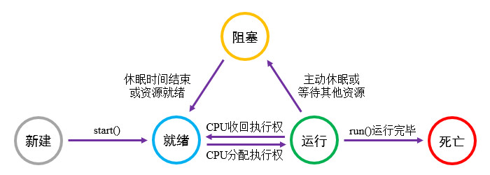

# 简介
现代计算机通常具有多任务并发的能力，例如：我们可以一边观看视频一边下载文件，这种能力是通过“时分复用”思想实现的。对于单核CPU，我们可以将它的运行周期划分为若干较小的时间片，当前任务执行一段时间后，控制器将该任务暂停，并切换至另一个任务继续执行；如此反复交替，人们从宏观上就会感觉到多个任务是同时执行的。

除了单个核心上的时分复用机制，现代CPU通常还具有多个核心，所有核心都可以同时执行不同的任务，实现真正意义上的并行处理，进一步提升系统的并行程度。

Java中的 `main()` 方法是程序的入口，其所在的进程与线程分别被称为“主进程”与“主线程”，其他由“主线程”创建的线程都被称为“子线程”。 `main()` 方法所属的线程用于控制其他线程的创建与销毁，因此我们习惯性地将其称为“主线程”，但它的优先级与子线程相同，被控制器调度的概率是均等的。

本章示例工程详见以下链接：

- [🔗 示例工程：线程](https://github.com/BI4VMR/Study-Java/tree/master/M03_Advance/C03_Parallelism/S01_Thread)

# 基本应用
JDK所提供的线程管理工具都在 `java.util.concurrent` 包中，该包也被简称为JUC。Thread类是Java中表示线程的类，我们可以通过该类创建与管理线程。

Thread类的 `run()` 方法即线程启动后将会执行的任务，我们可以继承Thread类并重写 `run()` 方法，实现自定义线程。

🔴 示例一

在本示例中，我们继承Thread类并重写 `run()` 方法，实现自定义线程。

第一步，我们定义MyThread类。

"MyThread.java":

```java
public class MyThread extends Thread {

    @Override
    public void run() {
        // 此处放置自定义语句，本示例为向控制台输出消息。
        for (int i = 1; i <= 10; i++) {
            System.out.println("Thread:[" + getName() + "] Index:[" + i + "]");
        }
    }
}
```

在上述代码中，我们向控制台循环输出消息，并使用Thread对象的 `getName()` 方法显示当前线程名称。

第二步，我们在测试代码中创建MyThread对象，并调用它的 `start()` 方法启动线程，使先前 `run()` 方法中定义的任务开始执行。

"TestThread.java":

```java
// 构造MyThread对象，每个MyThread对象都是一个独立的线程。
MyThread thread = new MyThread();
// 启动线程，开始执行任务。
thread.start();

// 使用主线程向控制台输出消息
for (int i = 1; i <= 10; i++) {
    String name = Thread.currentThread().getName();
    System.out.println("Thread:[" + name + "]");
}
```

当子线程启动后，我们在主线程也循环输出了一些消息，其中调用了Thread类的静态方法 `currentThread()` ，该方法可以获取当前作用域的Thread对象，此处为主线程，因此该方法的返回值为主线程的Thread对象。

此时运行示例程序，并查看控制台输出信息：

```text
Thread:[main]
Thread:[Thread-0], Index:[5]
Thread:[main]
Thread:[Thread-0], Index:[6]
Thread:[Thread-0], Index:[7]
```

根据上述输出内容可知：

主线程"main"与子线程"Thread-0"正在交替执行，两个任务是并行推进的。

> 🚩 提示
>
> 现代计算机CPU性能较高且核心数量较多，可能会出现主线程循环执行完毕才开始执行子线程循环的情况，此时两个线程看起来就像是顺序执行一样。
>
> 遇到这种现象时，我们可以增大循环次数、增多子线程数量再进行测试。

Thread类的构造方法 `Thread(Runnable target)` 接受一个Runnable接口实现作为参数，我们可以通过这种方式实现自定义线程。

Runnable接口用来表示“任务”，其中只有一个抽象方法 `run()` ；除了创建线程之外，我们还可以将任务提交到定时器(Timer)、线程池(ExecutorService)等工具中执行。

🟠 示例二

在本示例中，我们构造Thread对象并传入Runnable接口实现，实现自定义线程。

"TestThread.java":

```java
// 构造Thread对象，并通过构造方法传入任务。
Thread thread = new Thread(
        // 创建匿名内部类，实现Runnable接口。
        new Runnable() {
            @Override
            public void run() {
                // 此处放置自定义语句，本示例为向控制台输出消息。
                for (int i = 1; i <= 10; i++) {
                    String name = Thread.currentThread().getName();
                    System.out.println("Thread:[" + name + "] Index:[" + i + "]");
                }
            }
        }
);
// 启动线程，开始执行任务。
thread.start();
```

# 生命周期
线程的运行是一个动态过程，线程从创建到执行完毕，可能会经历下文图片所示的状态：

<div align="center">



</div>

我们可以使用Thread类的 `getState()` 方法获取线程状态，各个状态的详情可参考下文内容：

🔶 新建(NEW)

Thread对象刚被创建时，线程进入“新建”状态，此时任务并未开始运行，我们可以调用线程的 `start()` 方法开始任务。

🔶 就绪(RUNNABLE)

当我们调用Thread对象的 `start()` 方法之后，线程将会进入就绪队列，等待JVM线程控制器的调度。

🔶 运行

JVM的线程调度策略与操作系统有关，在我们常用的Windows和Linux中，系统会从就绪队列中随机选择一个线程；当CPU时间片耗尽时，系统将该线程的相关环境与执行进度保存，再随机选择一个就绪队列中的线程。

枚举 `Thread.State` 中并未定义运行状态，此时 `getState()` 方法获取到的状态也为RUNNABLE，因为“运行”与“就绪”状态是由操作系统管理的，对于应用程序内部没有实际意义。

🔶 阻塞

当资源不足或我们主动调用某些方法后，线程将会进入阻塞状态，这种状态的线程执行进度暂停，不占用CPU资源且不可被调度。

阻塞状态可以进一步分为以下几种情况：

🔺 同步等待(BLOCKED)

当某个线程持有同步锁时，其他执行至此的线程就会进入阻塞状态；等到锁被释放后，最先竞争到CPU资源的线程将持有锁，开始执行代码。

🔺 通知等待(WAITING)

当我们调用同步对象的 `wait()` 方法后线程将进入阻塞状态，并等待其他线程的唤醒信号；当线程收到唤醒信号之后，再重新回到“就绪”状态，等待系统调度。

🔺 计时等待(TIMED_WAITING)

当我们调用线程的 `sleep()` 方法使其休眠之后，线程就会进入阻塞状态；等到时间结束，线程重新回到“就绪”状态，等待系统调度。

<br />

🔶 死亡(TERMINATED)

当线程中的任务执行完毕或者被外部中断时，线程就会进入该状态，此时Thread对象可以被JVM垃圾回收。

<br />

当一个Thread对象被创建之后，我们只能调用一次 `start()` 方法，否则调用者会收到异常 `IllegalThreadStateException` 。

为了防止 `start()` 方法被重复调用，Thread类提供了 `boolean isAlive()` 方法以便我们检测任务状态，当线程中的任务开始执行后，该状态为"true"；任务终止时，该状态变为"false"。由于该方法只反映任务是否开始执行，线程处于就绪、运行与阻塞状态时 `isAlive()` 方法都会返回"true"。

# 优先级
Java将线程分为10个优先级级别，使用数字1-10表示，默认优先级为5，我们可以通过Thread对象提供的方法查询与修改线程优先级：

- 获取线程的优先级 : `int getPriority()`
- 修改线程的优先级 : `void setPriority(int priority)`

我们必须在任务开始前设置优先级，若在 `start()` 方法被调用后再设置优先级，则不会生效。

系统在调度线程时，倾向于选择优先级较高的线程，但优先级较低的线程也有机会得到调度，因此通常不会出现高优先级任务全部执行完毕再调度低优先级任务的情况。

# 守护线程
守护线程(Daemon Thread)是用来为业务线程提供服务的辅助线程，例如：定时发送消息、清理缓存等；当业务线程全部运行完毕之后，守护线程就没有必要再继续运行了，JVM将会自动终止这些线程。

我们可以通过Thread对象提供的方法查询与修改线程类型：

- 获取线程是否为守护线程 : `boolean isDaemon()`
- 设置线程是否为守护线程 : `void setDaemon(boolean on)`

我们必须在任务开始前设置线程类型，若在 `start()` 方法被调用后再设置线程类型，则不会生效。

🟡 示例三

在本示例中，我们创建前文“示例一”中的MyThread线程，并将其设置为守护线程。

"TestThread.java":

```java
System.out.println("Main thread starded.");

MyThread subThread = new MyThread();
// 将子线程设置为守护线程
subThread.setDaemon(true);
// 启动子线程
subThread.start();

System.out.println("Main thread finished.");
```

此时运行示例程序，并查看控制台输出信息：

```text
Main thread starded.
Main thread finished.
Thread:[Thread-0] Index:[1]
Thread:[Thread-0] Index:[2]
```

根据上述输出内容可知：

当主线程运行完毕后，子线程仍将运行片刻，最终被JVM终止。

# 线程休眠
Thread类拥有静态方法 `void sleep(long time)` ，我们可以在线程内部调用该方法，使得当前线程暂停指定时长后再恢复运行，唯一参数 `time` 即休眠时长，单位为毫秒。

线程休眠后进入计时等待状态，此时任务暂停并让出CPU资源；等到休眠时间结束后，线程重新进入就绪队列，等待控制器的调度。

🟢 示例四

在本示例中，我们创建一个线程，使线程休眠片刻后再恢复运行。

我们创建一个Thread对象，并使线程休眠3秒，休眠前后都向控制台输出当前时间。

"TestThread.java":

```java
// 构造Thread实例，并通过构造方法传入任务。
Thread thread = new Thread(() -> {
    System.out.println("Thread start. Time:[" + getTime() + "]");
    try {
        // 休眠3秒后再继续执行
        Thread.sleep(3000L);
    } catch (Exception e) {
        e.printStackTrace();
    }
    System.out.println("Thread end. Time:[" + getTime() + "]");
});
// 启动线程，执行构造方法传入的任务。
thread.start();
```

线程在阻塞状态可能会产生异常，因此 `sleep()` 方法需要放置在"try ... catch"语句中，详见相关章节： [🧭 中断任务](#中断任务) 。

此处线程任务中的 `getTime()` 方法用于获取语句执行的时刻，具体的实现已省略，详见本章示例工程。

此时运行示例程序，并查看控制台输出信息：

```text
Thread start. Time:[00:04:43.261]
Thread end. Time:[00:04:46.268]
```

# 中断任务
## 简介
现有一个用户详情窗口，当我们打开该窗口时，将会同时启动一个线程通过网络请求数据；由于网络延迟较高，我们在服务端响应之前就关闭了窗口；一段时间后该线程收到服务端发送的数据，继续执行原定的更新UI操作，因为此时窗口已被关闭，更新UI的操作可能会导致状态异常甚至程序崩溃。

在上述场景中，当窗口被关闭时，我们应该同步取消相关的任务，以便节约资源并避免发生错误。

在早期的Java版本中，我们可以调用Thread对象的 `stop()` 方法强制终止线程。由于线程外部无法感知线程任务的执行进度，这种方案可能会导致数据不一致、资源未被释放等严重的问题，目前已经被废弃了。

当前Java所采用的任务取消方案为“请求中断”机制，当我们希望终止某个线程时，可以调用它的 `interrupt()` 方法请求终止任务，线程将会根据当前是否处于阻塞状态作出不同的响应。

## 中断未阻塞的任务
Thread对象有一个中断标志位，默认状态为"false"，当我们调用线程的 `interrupt()` 方法时，中断标志位将会变为"true"。

默认情况下，线程任务不关心中断标志位，此时线程并不支持被中断，若收到中断请求仍会继续运行，直到任务运行完毕。若要使线程支持被中断，我们需要在任务中判断中断标志位的状态，从而决定是否继续运行任务。

在线程内部获取中断状态的常用方法是 `isInterrupted()` ，该方法只会返回中断状态，不会改变任何状态。Thread类还有一个静态方法 `interrupted()` ，该方法也能获取中断状态，但它会将中断状态改为"false"；由于该方法与 `isInterrupted()` 方法相比有副作用，故而使用频率较低，我们应当注意区分这两个方法，避免误用。

🔵 示例五

在本示例中，我们使线程支持中断请求。

第一步，我们定义一个线程，不断地向控制台输出消息，模拟需要反复执行的任务。

"TestThread.java":

```java
Thread subThread = new Thread(() -> {
    // 模拟需要反复执行的任务
    for (int i = 1; i <= 10000; i++) {
        // 每轮循环开始前，先判断当前任务是否已被取消。
        if (Thread.currentThread().isInterrupted()) {
            System.out.println("SubThread has been interrupted!");
            // 退出"run()"方法，结束当前任务。
            return;
        }

        // 继续执行任务
        System.out.println("Subthread is running. Index:[" + i + "]");
    }
});
```

在每轮循环开始之前，我们都要检查当前线程的中断标志位，一旦发现任务已被标记为取消，则终止循环。

第二步，我们在主线程中启动子线程，使主线程休眠片刻，等到主线程休眠完毕后向子线程发出中断请求。

"TestThread.java":

```java
// 启动子线程
subThread.start();

// 主线程休眠10毫秒，让子线程运行一会儿。
Thread.sleep(10L);
// 向子线程发出中断信号
subThread.interrupt();
System.out.println("Send interrupt signal in Main Thread.");
```

此时运行示例程序，并查看控制台输出信息：

```text
Subthread is running. Index:[1]
Subthread is running. Index:[2]

此处省略部分输出内容 ...

Subthread is running. Index:[2689]
Send interrupt signal in Main Thread.
SubThread has been interrupted!
```

根据上述输出内容可知：

子线程执行了2689次循环后，检测到中断信号，终止了任务。

## 中断已阻塞的任务
当线程已经处于阻塞状态时，无法主动调用 `isInterrupted()` 方法检查中断状态，此时需要通过异常机制处理中断请求。如果处于阻塞状态的线程收到中断请求，就会抛出InterruptedException并立刻终止任务，我们可以在线程任务中添加"try ... catch"语句捕获中断异常并进行释放资源等善后操作。

🟣 示例六

在本示例中，我们使线程支持处理中断异常。

第一步，我们创建一个线程，任务开始后立即进入阻塞状态。

"TestThread.java":

```java
Thread subThread = new Thread(() -> {
    try {
        System.out.println("SubThread start.");
        // 进入休眠状态
        Thread.sleep(1000L);
        System.out.println("SubThread end.");
    } catch (InterruptedException e) {
        /* 捕获中断异常 */
        System.out.println("SubThread is waiting and interrupted.");
    } finally {
        /* 清理资源 */
        System.out.println("SubThread clean.");
    }
});
```

第二步，我们开启该线程，并发出中断请求。

"TestThread.java":

```java
// 启动子线程
subThread.start();
// 向子线程发出中断信号
subThread.interrupt();
```

此时运行示例程序，并查看控制台输出信息：

```text
SubThread start.
SubThread is waiting and be interrupted.
SubThread clean.
```

根据上述输出内容可知：

子线程在阻塞状态收到了主线程发出的中断信号，随即抛出异常： `InterruptedException` ，该异常被"try ... catch"语句捕获。

若线程的 `run()` 方法中没有"try ... catch"语句，发生异常后该线程将会立刻终止，并向控制台输出异常信息，不会影响其他线程。由此可知，当线程并未关联任何资源，也不需要向外部组件汇报“取消”或其他异常时，我们可以省略"try ... catch"语句。

虽然有时可以省略"try ... catch"语句，但是我们仍然建议为所有线程添加该语句，这是因为在生产环境中将异常信息输出到控制台上是无意义的，甚至可能会暴露程序内部结构。

<!-- TODO

# Thread类的常用方法
Thread类有以下常用方法：

🔷 `Thread currentThread()`

获取当前作用域的线程实例。

静态方法，用于获取当前代码作用域所在的线程实例。

🔷 `String getName()`

获取线程的名称。

🔷 `void setName(String name)`

设置线程的名称。

每个线程都有一个默认的名称，例如前文示例中的"main"、"Thread-0"等，我们可以通过此方法设置自定义名称。

🔷 `int getId()`

获取线程的标识符。

每个线程实例都有全局唯一的ID，可以用来判断两个Thread变量是否相同。

-->