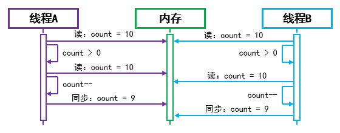
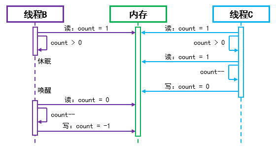

# 线程安全

<!--
校对说明：
1. 修正了原文中部分过长句、口语化表达和不完整草稿。
2. 将“同步对象”“volatile”“CAS”等章节重写为适合初学者阅读的完整表述。
3. 对草稿区保留了“原文核对”和“修改建议”注释，便于后续比对。
-->

## 竞态条件

多个线程的执行顺序具有随机性。当它们同时读写同一个共享变量时，程序可能出现逻辑错误，这种情况称为**竞态条件**（Race Condition）。

其中，访问共享变量的那段代码称为**临界区**（Critical Section）。在多线程程序中，竞态条件是导致数据不安全的主要原因之一。

操作系统和编译器无法主动判断哪些线程存在共享数据关系，因此只能保证单线程环境下的正确性。编写多线程程序时，我们需要主动识别可能出错的地方，并使用语言提供的工具来协调线程，从而保证线程安全。

🔴 示例一：竞态条件。

下面以“多人购买同一款商品”为例，演示竞态条件可能导致的问题。

第一步，编写购买任务，模拟购买商品的过程。

"TestThreadSync.java":

```java
public class TestThreadSync {

    // 全局变量，表示商品库存数量。
    static int count = 10;

    static void example01() {
        // 定义任务：循环购买商品。
        Runnable task = () -> {
            while (true) {
                // 如果仍有存货，则进行购买。（动作一）
                if (count > 0) {
                    // 更新库存数量。（动作二）
                    count--;
                    // 输出日志。（动作三）
                    System.out.println(Thread.currentThread().getName() + " -> Buy one good, remain count is: " + count);
                } else {
                    break;
                }
            }
        };
    }
}
```

测试类中的全局变量 `count` 表示库存数量，所有线程都可以读写它。

购买任务会不断检查库存：如果还有商品，就购买 1 件、将库存减 1，并输出日志；如果库存已经为 0，则结束循环。

第二步，在测试代码中创建三个线程，模拟三个客户同时购买商品。

"TestThreadSync.java":

```java
// 定义三个线程，模拟三个客户。
Thread thread1 = new Thread(task);
thread1.setName("客户A");
Thread thread2 = new Thread(task);
thread2.setName("客户B");
Thread thread3 = new Thread(task);
thread3.setName("客户C");

// 所有客户开始购买商品。
thread1.start();
thread2.start();
thread3.start();
```

运行后，控制台可能输出如下内容：

```text
客户A -> Buy one good, remain count is: 9
客户B -> Buy one good, remain count is: 9

# 此处省略部分输出内容...

客户C -> Buy one good, remain count is: 0
客户B -> Buy one good, remain count is: -1
```

从结果可以看出，程序出现了两个典型问题。

### 重复购买

程序开始运行后，“线程A”和“线程B”可能都读取到了旧的库存值 `10`，随后各自执行 `count--`，并都输出库存为 `9`。这说明线程之间没有及时看到彼此的修改结果，于是同一件商品被“重复购买”了。

<div align="center">



</div>

### 超出范围

当库存只剩 `1` 时，“线程B”可能先通过 `count > 0` 的判断，但在执行 `count--` 之前被挂起。此时“线程C”也读取到库存为 `1`，同样通过判断，并继续执行减库存操作，把库存改成 `0`。

之后“线程B”恢复运行，继续执行 `count--`，最终把库存改成 `-1`。这显然不符合业务逻辑。

<div align="center">



</div>

<br />

> 🚩 提示
>
> 现代 CPU 性能较高，线程切换时机不固定，因此上述现象未必每次都能稳定复现。
>
> 如果实验时没有观察到问题，可以在关键步骤之间加入短暂休眠，以提高线程切换的概率。

## 原子性

有些操作虽然写成了一条语句，但在底层会拆成多个步骤执行。如果这些步骤必须作为一个整体连续完成，执行过程中不能被其他线程打断，那么这种特性就称为**原子性**。

在前文示例中，“判断库存是否大于 0”“库存减 1”“输出日志”这几个动作在业务上应当视为一个整体。如果线程在中途被切换，其他线程就可能插入执行，最终导致库存变成 `-1`。

如果我们能保证某一时刻只有一个线程执行这组操作，那么就满足了原子性，也就可以避免“库存超出范围”的问题。

下面是几种常见的非原子操作：

- `a = 1; b = 2;`：多条语句之间可能发生线程切换，因此整体不是原子操作。
- `y = 2 * x;`：需要先读取 `x`，再计算，最后写回 `y`，不是一步完成。
- `i++`：本质上包含“读取旧值 → 加 1 → 写回新值”三个步骤。
- `state = !state`：本质上也包含“读取 → 取反 → 写回”三个步骤。
- `Object o = new Object();`：大致包含“分配内存 → 调用构造方法 → 赋值引用”等多个步骤。

## 可见性

在多核 CPU 中，各个核心通常都有自己的高速缓存。线程在某个核心上运行时，读取和修改变量往往先发生在缓存中，然后再同步到主内存。

这会带来一个问题：某个线程虽然已经修改了变量，但其他线程未必能立刻看到这个新值。如果其他线程此时仍然读取到旧值，就可能出现逻辑错误。

在前文示例中，一个线程完成购买后，虽然已经修改了库存数量，但这个变化不一定立即对其他线程可见。于是其他线程仍可能看到旧库存，从而发生重复购买。

如果我们能保证一个线程对共享变量的修改能够及时被其他线程看到，那么就满足了**可见性**。

下面是几个典型的可见性问题场景：

- **共享标志位**：一个线程修改停止标志，另一个线程轮询该标志决定是否退出。
- **单例模式**：某个线程创建了实例，但其他线程没有及时看到这个新实例。

## 有序性

为了提高执行效率，编译器和处理器有时会调整指令的执行顺序，这种现象称为**指令重排序**（Instruction Reorder）。

重排序会遵守 `as-if-serial` 语义，也就是说：在单线程环境下，只要最终结果不变，部分语句的执行顺序就可以调整。

例如：

```java
int a = 114 + 514;  // 语句1
int b = -1 * 810;   // 语句2
int c = a * b;      // 语句3
```

这里“语句1”和“语句2”互不依赖，因此执行顺序可能是 `1 -> 2 -> 3`，也可能是 `2 -> 1 -> 3`。但“语句3”依赖前两条语句的结果，因此不能跑到前面执行。

在多线程环境中，重排序有时会破坏程序员原本的假设，因此我们还需要关注**有序性**。

下面是两个典型场景：

- **物理控制类程序**：例如先开灯再关灯，如果顺序被打乱，程序行为就会出错。
- **单例模式**：对象引用先对外可见，而构造过程还未完成，其他线程就可能拿到“未初始化完成”的对象。

# 同步机制

## 简介

`synchronized` 是 Java 提供的一种同步机制。它可以限制同一时刻只有一个线程进入临界区，其余线程必须等待当前线程执行完毕后才能继续。

对于同一把锁而言，同步机制通常可以同时解决三个问题：

- **原子性**：临界区内的代码不会被其他线程打断。
- **可见性**：一个线程释放锁前对共享变量的修改，对随后获得同一把锁的线程可见。
- **有序性**：同步块前后的指令不会被随意重排到破坏同步语义的程度。

同步会带来一定性能开销，但它能保证多线程逻辑正确，因此在需要时应当优先保证正确性。

## 同步代码块

同步代码块的语法如下：

```text
synchronized (Object lock) {
    // 需要同步的代码
}
```

我们应当把需要保护的临界区代码放入同步代码块，并指定一个所有相关线程都能访问到的同步对象。

假设“线程A”“线程B”“线程C”都要进入同一个同步代码块，执行流程大致如下：

1. “线程A”先拿到锁并进入同步代码块。
2. “线程B”和“线程C”到达后，因为拿不到同一把锁，只能阻塞等待。
3. “线程A”执行完毕后释放锁。
4. “线程B”和“线程C”再次竞争这把锁，谁先抢到谁先执行。
5. 当前线程执行结束后再释放锁，另一个等待线程继续执行。

🟠 示例二：同步代码块。

下面使用同步代码块改造前文中的购买任务。

"TestThreadSync.java":

```java
Runnable task = () -> {
    while (true) {
        // 加锁，确保以下三个操作连续执行。
        synchronized (TestThreadSync.class) {
            if (count > 0) {
                count--;
                System.out.println(Thread.currentThread().getName() + " -> Buy one good, remain count is: " + count);
            } else {
                break;
            }
        }
    }
};
```

这里把“判断库存”“扣减库存”“输出日志”三步放进了同一个同步代码块，并使用当前类的 Class 对象作为锁。这样多个线程执行该任务时，就必须串行进入临界区。

运行后，输出可能类似如下：

```text
客户A -> Buy one good, remain count is: 9
客户B -> Buy one good, remain count is: 8

# 此处省略部分输出内容...

客户C -> Buy one good, remain count is: 1
客户A -> Buy one good, remain count is: 0
```

此时就不会再出现“重复购买”和“库存变成负数”的问题了。

## 同步方法

如果一个方法中的所有语句都属于临界区，那么可以直接在方法签名前加上 `synchronized`，这样写通常更简洁。

🟡 示例三：同步方法。

第一步，把购买逻辑提取为一个同步方法。

"TestThreadSync.java":

```java
// 同步方法，整个方法体都需要同步。
static synchronized boolean buy() {
    if (count <= 0) {
        // 库存售空，返回 false。
        return false;
    } else {
        // 库存非空，购买一件商品并返回 true。
        count--;
        System.out.println(Thread.currentThread().getName() + " -> Buy one good, remain count is: " + count);
        return true;
    }
}
```

第二步，在线程任务中循环调用 `buy()` 方法。

"TestThreadSync.java":

```java
// 定义任务：循环购买商品。
Runnable task = () -> {
    while (buy()) {
        // 循环购买，直到库存售空。
    }
};
```

同步方法不能手动指定锁对象：

- 对于**静态同步方法**，锁对象是当前类的 Class 对象。
- 对于**实例同步方法**，锁对象是当前实例，即 `this`。

## 同步对象

<!--
原文核对：
1. “同一同步对象的同步区域串行执行，非同一对象的同步区域之间、同步区域与非同步区域之间互不干扰”
2. “如果对象的所有业务都在一个临界区可以用this与同步方法,否则不推荐这样使用”
3. 后续代码示例为草稿，存在语法错误、命名冲突和逻辑重复。

修改建议：
1. 拆分为“锁的作用范围”“不要随意使用 this 作为大锁”“按业务拆分锁对象”三点说明。
2. 用可编译的示例展示不同业务使用不同锁对象，避免无关业务互相阻塞。
-->

Java 中的每个对象都可以作为锁使用。多个线程如果使用的是**同一个锁对象**，那么它们进入对应同步区域时就必须排队执行；如果使用的是**不同的锁对象**，通常就可以互不干扰。

因此，选择同步对象时要注意**锁的粒度**：

- 锁加得太大，虽然安全，但会让很多本来无关的操作也互相等待。
- 锁加得太小，又可能保护不完整，导致线程安全问题。

如果一个对象中的所有核心业务都必须整体串行执行，那么使用 `this` 或同步方法通常没有问题。但如果对象中包含多个彼此独立的业务，就不建议所有方法都共用同一把锁，否则会造成不必要的阻塞。

例如，下面这个类中有两个互不相关的业务：更新状态和写审计日志。

```java
class Service {

    private int state = 0;

    public synchronized void updateState(int newValue) {
        if (newValue % 5 == 0) {
            state = newValue;
        }
    }

    public synchronized void writeAuditLog(String message) {
        System.out.println("Audit: " + message);
    }
}
```

虽然这两个方法处理的是不同业务，但它们都是实例同步方法，默认锁对象都是 `this`。因此：

- 当线程正在执行 `updateState()` 时，
- 另一个线程即使只想执行 `writeAuditLog()`，也必须等待。

这显然会降低并发能力。

更合理的做法是：为不同业务准备不同的锁对象。

```java
class Service {

    private int state = 0;

    private final Object stateLock = new Object();
    private final Object logLock = new Object();

    public void updateState(int newValue) {
        synchronized (stateLock) {
            if (newValue % 5 == 0) {
                state = newValue;
            }
        }
    }

    public void writeAuditLog(String message) {
        synchronized (logLock) {
            System.out.println("Audit: " + message);
        }
    }
}
```

这样一来：

- 所有调用 `updateState()` 的线程仍然会排队，保证状态更新安全。
- 所有调用 `writeAuditLog()` 的线程也会排队，避免日志输出混乱。
- 但这两类业务之间不会互相阻塞，从而提高整体并发效率。

> 🚩 提示
>
> 一般不建议把字符串常量、包装类型常量或对外暴露的对象直接作为锁，因为它们可能被其他代码意外复用，导致难以排查的锁竞争问题。

# `volatile` 关键字

<!--
原文核对：
1. “volatile修饰的共享变量在修改后会立即被更新到内存中，其他线程使用共享变量会去内存中读取”
2. “用 volatile 的时机：变量的写操作不依赖于当前值（直接赋值）”
3. “new instane / Memory Allocate / Init / Assignment”为草稿式提纲。

修改建议：
1. 保留“可见性 + 禁止相关重排序”的核心结论。
2. 补充“volatile 不能保证复合操作原子性”。
3. 将单例相关草稿整理为完整说明。
-->

`volatile` 用来修饰共享变量。被它修饰的变量在一个线程中修改后，其他线程能够更快看到最新值。

对于初学者，可以先记住 `volatile` 的两个主要作用：

1. **保证可见性**：一个线程修改变量后，其他线程能够及时看到这个新值。
2. **限制指令重排序**：与该变量相关的部分操作顺序不会被随意打乱。

因此，当问题主要出在“一个线程改了值，另一个线程看不见”时，`volatile` 往往比加锁更轻量。

不过要注意：`volatile` **不能保证原子性**。像 `i++` 这样的“读取 → 修改 → 写回”复合操作，即使变量被 `volatile` 修饰，也仍然可能出错。

## 适用场景

`volatile` 适合以下场景：

- 变量的写入**不依赖当前值**，例如直接赋值 `stop = true`。
- 该变量**不需要与其他变量一起维护整体一致性**。

常见示例：

- **停止标志位**：一个线程修改 `stop`，另一个线程读取 `stop` 后决定是否结束循环。
- **双重检查锁中的单例引用**：用于避免对象引用提前暴露给其他线程。

## 为什么单例模式常与 `volatile` 一起使用

以下语句：

```java
instance = new Singleton();
```

从概念上可以理解为三个步骤：

1. 分配对象内存。
2. 初始化对象。
3. 将引用赋值给 `instance`。

如果发生重排序，步骤 2 和步骤 3 可能被交换。这样一来，其他线程看到 `instance != null` 时，对象实际上可能还没有初始化完成。

给 `instance` 加上 `volatile` 后，可以避免这种问题。

## 什么时候应当使用 `synchronized`

如果代码存在下面这些情况，就不能只依赖 `volatile`，而应考虑 `synchronized` 或其他更强的同步手段：

- 存在“读取 → 修改 → 写回”的复合逻辑。
- 需要把多个变量的变化视为一个整体。
- 需要让一段代码在同一时刻只能由一个线程执行。

# CAS

<!--
原文核对：
1. 原文对 CAS 的核心思想描述较完整，但句子过长，且夹杂口语化表达。
2. “CAS的应用场景”“CAS的问题”部分结构松散。

修改建议：
1. 调整为“概念 -> 执行过程 -> 与 synchronized 的区别 -> 常见问题”四段结构。
2. 保留 ABA、自旋开销、多变量原子性限制等关键点。
-->

CAS 是 `Compare And Swap` 的缩写，通常翻译为“比较并交换”。它是一种常见的**无锁并发**思路。

使用 `synchronized` 时，线程通常会先抢锁，抢不到就阻塞等待。这种做法偏向**悲观锁**：先假设冲突会发生，再通过互斥来避免问题。

CAS 的思路则更偏向**乐观锁**：先假设冲突不常发生，线程直接尝试更新数据；如果更新失败，再重试。

## 基本过程

CAS 常用三个值来描述：

- `V`：内存中的当前值。
- `O`：预期旧值。
- `N`：准备写入的新值。

执行逻辑如下：

1. 先比较 `V` 和 `O` 是否相等。
2. 如果相等，说明这个值在此期间没有被其他线程改过，于是把 `N` 写入。
3. 如果不相等，说明已经有其他线程抢先修改了该值，本次更新失败，调用方可以选择重试。

可以把它理解为一句话：**“如果数据还是我刚才看到的样子，就把它改成新值；否则说明已经有人抢先修改，我这次先不改。”**

在 Java 中，`AtomicInteger`、`AtomicLong`、`AtomicReference` 等原子类底层都大量使用了 CAS。

例如：

```java
AtomicInteger count = new AtomicInteger(0);

boolean success = count.compareAndSet(0, 1);
```

这段代码的含义是：只有当 `count` 当前仍然为 `0` 时，才把它改成 `1`。

## CAS 与 `synchronized` 的区别

两者都能解决并发问题，但侧重点不同：

- `synchronized`：通过加锁让线程排队，适合保护一整段临界区。
- CAS：通过比较并交换直接更新单个共享值，适合轻量级、冲突较少的场景。

一般来说：

- 冲突较少时，CAS 的性能往往更好。
- 临界区复杂、需要保护多步逻辑时，`synchronized` 更直观也更可靠。

## CAS 的常见问题

### 1. ABA 问题

CAS 只检查“当前值是否还是旧值”，并不关心这个值中间是否变化过。

例如某个变量先从 `A` 变成 `B`，随后又变回 `A`。这时另一个线程执行 CAS，会发现当前值仍然是 `A`，于是误以为“值没有变过”。这就是 **ABA 问题**。

常见解决办法是为数据增加版本号。Java 中可以使用 `AtomicStampedReference` 处理这类问题。

### 2. 自旋开销

CAS 更新失败后，通常会不断重试，这种行为称为**自旋**。如果竞争非常激烈，线程可能长时间反复重试，导致 CPU 开销上升。

因此，CAS 更适合冲突较少、单次操作较短的场景。

### 3. 只能天然保证单个共享变量的原子更新

CAS 最擅长处理“一个共享值”的原子更新。如果业务逻辑涉及多个变量的整体一致性，单独对每个变量做 CAS 往往不够。

常见做法有两种：

- 把多个字段封装进一个对象，再对对象引用做原子更新。
- 直接改用锁机制，保护整个复合操作。

## 小结

在 Java 并发编程中，可以先按下面的思路选择工具：

- 只需要解决**可见性**问题：优先考虑 `volatile`。
- 需要保护**一段临界区**：优先考虑 `synchronized`。
- 只想对**单个共享值**做轻量级原子更新：可以考虑 CAS 与原子类。

对初学者来说，先理解“原子性、可见性、有序性”这三个概念，再学习 `synchronized`、`volatile` 和 CAS，就能建立比较完整的线程安全知识框架。
