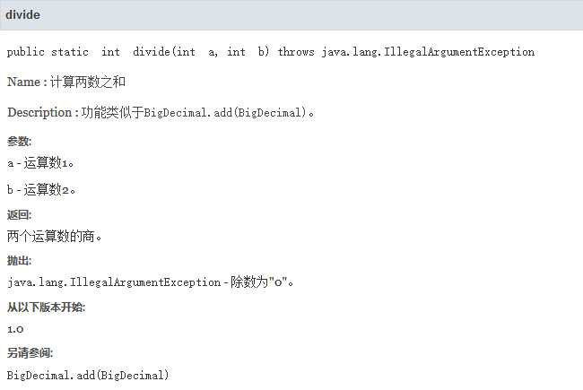

# 基本元素
## 最小代码片段
下文示例展示了一个最基本的Kotlin程序。

🔴 示例一：基本的Kotlin程序。

在本示例中，我们创建一个名称为 `TestFirst.kt` 的文本文件，并写入下文代码块中的内容：

"TestFirst.kt":

```kotlin
// "main"方法，是程序的入口。
fun main(args: Array<String>) {
    // 在控制台上显示文字
    println("Hello World!")
}
```

上述代码是Kotlin应用程序的基本结构，Kotlin支持定义文件级元素，因此我们可以直接在文件中书写方法，不必书写类的结构； `main()` 方法必须作为文件级元素，不能作为类的成员方法。

`main()` 方法是程序的入口，当程序开始运行时，将会从此处开始执行代码语句；当该方法中的语句都被执行完毕时，整个程序也会终止。

为了减少篇幅与缩进，后文的示例代码若无特殊说明，均省略 `main()` 方法，只展示其中的关键内容。

## 关键字
编程语言中具有特殊含义的单词被称为关键字，编译器会识别关键字并将语句翻译为对应的机器指令。

Kotlin语言中常用的关键字如下文表格所示：

<div align="center">

|   关键字   | 关键字  |  关键字  | 关键字  | 关键字  |
| :--------: | :-----: | :------: | :-----: | :-----: |
| `abstract` |  `as`   | `break`  | `catch` | `class` |
| `continue` |  `do`   | `double` | `else`  | `false` |
| `finally`  | `float` | `float`  |  `for`  |  `fun`  |
|    `if`    |  `is`   | `import` | `when`  |  `try`  |

</div>

Kotlin语言是区分大小写的，关键字通常使用小写字母表示，例如："Void"不是关键字，因为它与关键字"void"并不相同。

## 标识符
标识符是我们为变量与方法等元素所定义的名称，我们在起名时需要遵循以下规则，以提高代码的可读性：

- 标识符可以由字母、数字、下划线( `_` )和美元符( `$` )组成，不能包含 `@` 、 `%` 以及空格( ` ` )等特殊字符，并且不能以数字开头。
- 标识符严格区分大小写，例如"abc"和"ABC"是两个不同的标识符。
- 标识符不能是关键字，但允许包含关键字的字符。
- 标识符应当直观地反映出变量或方法的作用，最好做到见名知意。
- 标识符应当仅包含ASCII字符，不推荐使用中文、日文、韩文等字符；非ASCII字符在跨平台环境中可能导致乱码等问题。

下文表格展示了一些标识符示例：

<div align="center">

|    标识符     | 可用性 |                原因                |
| :-----------: | :----: | :--------------------------------: |
|   `123name`   |   ❌    |          不能以数字开头。          |
| `abc@163.com` |   ❌    |         不能包含"@"字符。          |
|    `void`     |   ❌    |      不能与关键字"void"冲突。      |
|    `Void`     |   ✅    |   首字母为大写，未与关键字冲突。   |
|   `myvoid`    |   ✅    | 包含关键字"void"，未与关键字冲突。 |

</div>

## 语句
代码中的每条语句都是一个指令，程序运行时将会执行指令对应的操作。例如 `println("Hello World!")` 表示在控制台上输出"Hello World!"文本。

在Kotlin语言中，不需要使用分号作为语句结束的标志，编译器将会尝试自动解析每条语句。

# 变量
## 简介
变量(Variable)是存储在内存中的数据块，用于描述事物的属性，例如：学生的姓名、年龄、性别等；我们通过以下三个元素描述一个变量：数据类型、变量名称以及变量的值。

变量名称用于唯一标识某个变量，我们在给变量命名时，需要遵循标识符规则、尽量简短且能见名知意，例如：变量"studentName"用于表示“学生姓名”。

Kotlin中的变量名由多个单词组成时，首个单词的首字母应当小写、后续单词的首字母应当大写，这种方式称为驼峰命名法，如"myAge"、"studentName"等。

声明与访问变量的语法详见下文代码块：

```text
// 声明变量并赋值
var <变量名称>: <数据类型> = <变量的值>

// 声明变量但暂不进行赋值
var <变量名称>: <数据类型>

// 访问变量
<变量名称>
```

下文示例展示了变量的使用方法：

🟠 示例二：变量的基本应用。

在本示例中，我们定义一些变量，并访问它们。

"TestVariable.kt":

```kotlin
// 声明变量“姓名”
val name: String = "张三"
// 声明变量“年龄”
val age: Int = 20

// 访问变量：将变量的值输出到控制台
println("姓名：$name")
println("年龄：$age")
```

此时运行示例程序，并查看控制台输出信息：

```text
姓名：张三
年龄：20
```

## 数据类型
Kotlin中的数据类型分为基本数据类型和引用数据类型，基本数据类型变量直接存储数据的值，而引用数据类型变量存储的是保存数据值的内存地址。虽然Kotlin中也存在基本与引用两种数据类型，但基本数据类型在代码中以包装类的形式存在，便于用户表示空值与调用方法。

Kotlin是一种强类型语言，每个变量都有明确的类型，因此我们声明变量的同时还要指明它的类型。Kotlin编译器支持类型推断，我们在声明变量时可以省略数据类型部分。

```text
// 声明变量并省略数据类型
var <变量名称> = <变量的值>;


// 示例
var age = 20;
var name = "张三";
```

常用的数据类型如下文表格所示：

<div align="center">

|   类型    |     说明     |      应用      |              示例              |
| :-------: | :----------: | :------------: | :----------------------------: |
|  `Byte`   |    字节型    |    存储整数    |     `var state: Byte = 1`      |
|  `Short`  |    短整型    |    存储整数    |     `var age: Short = 21`      |
|   `Int`   |     整型     |    存储整数    |     `var index: Int = 100`     |
|  `Long`   |    长整型    |    存储整数    | `var sec: Long = 1555560167L`  |
|  `UByte`  | 无符号字节型 |    存储整数    |    `var data: UByte = 255`     |
| `UShort`  | 无符号短整型 |    存储整数    |     `var age: UShort = 21`     |
|  `UInt`   |  无符号整型  |    存储整数    |    `var index: UInt = 100`     |
|  `ULong`  | 无符号长整型 |    存储整数    | `var sec: ULong = 1555560167L` |
|  `Float`  | 单精度浮点型 |    存储小数    |  `var height: Float = 175.2F`  |
| `Double`  | 双精度浮点型 |    存储小数    |  `var price: Double  = 15.5`   |
| `Boolean` |    布尔型    | 表示“真”或“假” |   `var flag: Boolean = true`   |
|  `Char`   |    字符型    |  存储单个字符  |     `var sex: Char = '男'`     |
| `String`  |    字符串    |  存储多个字符  |  `var name: String = "User"`   |

</div>

下文内容将对每种数据类型作出详细说明：

🔷 `Byte` 类型

字节型，内存分配为1字节。

取值范围： `[-128, 127]` 。

🔷 `Short` 类型

短整型，内存分配为2字节。

取值范围： `[-32768, 32767]` 。

🔷 `Int` 类型

整型，内存分配为4字节。

这是整数的默认类型，取值范围： `[-2147483648, 2147483647]` 。

🔷 `Long` 类型

长整型，内存分配为8字节。

取值范围： `[-9223372036854775808, 9223372036854775807]` 。

声明长整型时，数值后需要添加一个标记"L"，以此与 `int` 类型作区分。

🔷 `UByte` 类型

无符号字节型。

取值范围： `[0, 255]` 。

声明无符号字节型时，数值后需要添加一个标记"U"，以此与有符号数值作区分。

🔷 `UShort` 类型

无符号短整型。

取值范围： `[0, 65535]` 。

🔷 `UInt` 类型

无符号整型。

这是整数的默认类型，取值范围： `[0, 4294967295]` 。

🔷 `ULong` 类型

无符号长整型。

取值范围： `[0, 18446744073709551615]` 。

声明无符号长整型时，数值后需要添加一个标记"UL"，以此与有符号数值作区分。

🔷 `Float` 类型

单精度浮点数，内存分配为4字节。

最大有效小数位为7位。

声明单精度浮点数时，数值后需要添加一个标记"F"，以此与 `double` 类型作区分。

🔷 `Double` 类型

双精度浮点数，内存分配为8字节。

这是小数的默认类型，最大有效小数位为16位。

🔷 `Boolean` 类型

布尔值，内存分配视系统环境而定，值只能为"true"或"false"。

Kotlin中的布尔值与数字不能相互自动转换，例如语句 `val state: Boolean = 1` 将会导致编译错误。

🔷 `Char` 类型

字符型，只能存储单个字符，定义时值需要使用单引号包围，例如 `val x: Char = 'A'` 。

Kotlin中的 `Char` 变量与数字不能相互自动转换，例如语句 `val x: Char = 65` 将会导致编译错误。

🔷 `String` 类型

`String` 是一种常见的引用数据类型，可以存储多个字符组成的序列，定义时值需要使用双引号包围，如 `var name: String = "tom"` 。

在程序开发中，许多操作都要借助字符串来完成，例如处理系统中的用户名、密码、电子邮箱等。

<br />

当我们使用类型推断声明变量时，数字的默认类型为 `Int` ，如果数值超出整型的范围则类型为 `Long` ；如果我们期望的类型与默认类型不一致，则应当指明类型。

> 🚩 提示
>
> Kotlin为了实现跨平台特性，预先规定了每种数值类型的范围，因此我们不必担心同一种类型在不同的硬件架构上超出最大取值范围。

> ⚠️ 警告
>
> 由于二进制存在量化失真，部分浮点数不能无损地转为二进制，因此计算过程中可能产生误差。
>
> 当我们给 `Double` 类型变量赋值"0.1234"，再使用该变量与"0.0234"相减，将会得到结果"0.09999999999999999"。
>
> 为了解决金融与数学等领域的计算精度问题，我们可以使用Java提供的BigDecimal等工具，不能使用 `Double` 类型。

下文示例展示了不同类型变量之间的转换方法：

🟡 示例三：扩展转换和窄化转换。

在本示例中，我们定义一些数值型变量，并将它们转换为其他类型。

"TestVariable.kt":

```kotlin
// 定义整型变量
val x: Int = 128

// 扩展转换：将范围较小的值转换为范围较大的值
val a: Long = x.toLong()

// 窄化转换：将范围较大的值转换为范围较小的值
val b: Byte = x.toByte()

println("原始Int值：$x, 转换为Long类型：$a, 转换为Byte类型：$b")
```

当我们将一个取值范围较小的变量赋值给取值范围较大的变量时，可以安全地进行扩展转换，因为目标类型的取值范围能够覆盖原始类型，不会导致数据丢失。

当我们将一个取值范围较大的变量赋值给取值范围较小的变量时，因为目标类型的取值范围无法覆盖原始类型，可能导致数据丢失。

Kotlin的数据类型都是对象，不能进行自动类型转换，我们需要调用对象的方法进行类型转换。

此时运行示例程序，并查看控制台输出信息：

```text
原始Int值：128, 转换为Long类型：128, 转换为Byte类型：-128
```

窄化转换丢弃超出范围数据的方式视各编程语言实现而定。在本示例中，Int类型变量 `x` 的值128使用二进制表示为 `00000000 00000000 00000000 10000000` ，我们将其转换为Byte类型后，超出1字节的部分将被丢弃，只保留 `10000000` ，由于Byte类型的最高位是符号位，该补码对应的十进制数值即为"-128"。

## 常量
常量是一种特殊的变量，它的值必须在声明时即确定，并且后续不允许再更改，适当地使用常量可以提高代码的可维护性。

声明常量的语法与声明变量类似，只需将"var"关键字替换为"val"即可。

```text
// 声明常量并赋值
val <标识符>: <数据类型> = <变量的值>;

// 访问常量
<常量名称>


// 示例：常量"PI"
val PI: Double = 3.141592653
```

下文示例展示了常量的使用方法：

🟢 示例四：常量的基本应用。

在本示例中，我们定义一些常量，并访问它们。

"TestVariable.kt":

```kotlin
// 示例：常量"PI"
val PI: Double = 3.141592653

// 访问常量：将常量的值输出到控制台
println("圆周率：${PI}")
```

此时运行示例程序，并查看控制台输出信息：

```text
圆周率：3.141592653
```

常量名称一般全部字符都为大写，多个单词之间使用下划线("_")分隔。

对于部分常见的数值，我们可以通过常量名称得知其含义。例如前文的圆周率 `PI` ，如果算式中多次出现"3.1415"，可能导致阅读困难，并且在书写时也更容易出错。这种直接使用数值而不引用常量的行为被称为“魔法数字”，我们应当避免在编码中出现这种情况。

除了数字常量，我们也经常使用字符型常量，例如：为了表示用户的性别，我们可以定义一个常量 `SEX_MALE` 并赋值为“男”；在需要指定性别的地方调用该常量，这样就避免了输入不规范而导致程序出错的情况。

## 字面量
### 简介
字面量(Literal)是指编程语言对固定值的表示方法，例如： `1.5F` 表示单精度浮点数"1.5"， `"Programming"` 表示字符串“Programming”，下文将会介绍一些实用的字面量。

### 非十进制整数
我们有时习惯以二进制等形式书写一个整数，Kotlin语言提供了相应的表示方法： `0b<二进制>` 表示二进制数值； `0x<十六进制>` 表示十六进制数值。

下文代码块展示了一些案例：

```kotlin
// 二进制：10 -> 1010
val num1: Int = 0b1010

// 十六进制：255 -> FF
val num2: Int = 0xFF
```

> 🚩 提示
>
> Kotlin不支持以八进制格式表示数值。

### 科学计数法
对于浮点数，我们可以使用科学计数法进行表示，格式为： `<有效数字>E<指数>` 。

下文代码块展示了一些案例：

```kotlin
// 光速：3 * 10^8
val num1: Float = 3E8F

// 精细结构常数：7.2973525698 * 10^-3
val num2：Double = 7.2973525698E-3
```

### 数值分隔符
在书写位数较多的数字时，我们习惯以千位或万位为界，插入逗号作为分隔符，以提高可读性，例如"100,000"。

我们可以在整数或浮点数中添加下划线("_")作为分隔符：

```kotlin
// 文件大小：4GB（未添加下划线）
val fileSize1: Long = 4 * 1000000000L

// 文件大小：4GB（已添加下划线）
val fileSize2: Long = 4 * 1_000_000_000L
```

### 文本块
我们可以使用被三个双引号包围的块表示多行字符串，文本块中的字符都将被视为普通字符，双引号和换行符会被保留，无需使用转义符号。

```kotlin
val text: String = """
    What is GNU?

    "GNU" is an operating system that is free software—that is, it respects user's freedom.
    The GNU operating system consists of GNU packages as well as free software released by third parties.
    """
```

文本块中的缩进空格将被视作内容的一部分，如果我们不希望保留行首的空格，可以对文本调用 `trimMargin()` 方法：

```kotlin
val text: String = """
    |What is GNU?

    |"GNU" is an operating system that is free software—that is, it respects user's freedom.
    |The GNU operating system consists of GNU packages as well as free software released by third parties.
    |""".trimMargin()
```

`trimMargin()` 方法的默认分界符为竖线( `|` )，在上述代码中，每行内容开头的空格与竖线都将被删除。如果我们希望使用其他字符作为分界符，可以调用 `trimMargin(marginPrefix: String)` 方法，并将参数 `marginPrefix` 设为自定义分界符。

## 作用域
变量的有效范围被称为“作用域(Scope)”，在Kotlin语言中，代码块(Block)限定了变量的作用域。

代码块以一组大括号 `{}` 为界限，我们在某个代码块中声明变量后，该变量的作用域即为当前代码块，代码块内部可以访问该变量，代码块外部则不能访问该变量。

🔵 示例五：变量的作用域。

在本示例中，我们定义一些变量，并在不同的作用域中访问它们。

"TestVariable.kt":

```kotlin
fun main(args: Array<String>) {
    val i: Int = 1

    // 定义一个“块”
    run {
        val x: Int = 5
        // 块的内部可以访问自己的变量与父级块的变量
        println("i:$i; x:$x")
    }
    // 块的外部不能访问块内部的变量
    println("i:$i; x:can not be accessed!")
}
```

代码块可以相互嵌套，子级代码块可以访问自身拥有的变量与父级代码块拥有的变量。代码块可以是类或方法，但Kotlin不能像Java一样定义无名代码块 `{}` ；在上述示例中， `run(block: () -> R): R` 是内置函数，参数 `block` 是一个表达式，该方法将会执行表达式中的语句，我们可以通过这种方式定义独立的块。

此处的 `main() {}` 方法中拥有变量 `i` ，并且嵌套了一个代码块 `run()` 。我们在代码块 `run()` 的内部可以访问变量 `x` 与父级代码块中的变量 `i` ，而在 `main() {}` 方法中只能访问变量 `i` ，无法访问变量 `x` 。

Kotlin允许代码块中的变量名与父级块中的变量同名，但这容易导致开发者混淆不同的变量，我们不建议这样做。在上述示例中，我们可以在代码块 `run()` 内声明一个名称为"i"的变量，此时遵循局部优于全局的原则。

# 注释
## 简介
注释(Comment)是对代码的解释和说明，其目的是让人们能够更加轻松地理解代码。在代码编译过程中，注释语句将被编译器忽略并移除，最终生成的程序中不会包含任何注释语句。

Kotlin中的注释有三种类型：

- 单行注释以 `//` 开头，行末自然结束，正如前文“示例一”中的描述文本。
- 多行注释以 `/*` 开头，以 `*/` 结尾，中间的行都被视为注释文本。
- 文档注释以 `/**` 开头，以 `*/` 结尾，允许多行，通常用于描述类与方法的详细信息。

我们可以在文档注释中使用一些KDoc标记，以便通过Dokka等工具生成详细的程序说明文档。

🔷 `@version <版本号>`

声明类的版本。

🔷 `@author <作者>`

声明类或方法的作者。

🔷 `@see <类或方法名称>`

表示另请参见类或方法。

🔷 `@param <参数名称> <参数含义>`

说明方法的参数及其含义。

为了更明显的标记参数，我们也可以使用以下语法书写参数说明： `@param[<参数名称>] <参数含义>` 。

🔷 `@return <返回值含义>`

说明方法的返回值含义。

🔷 `@exception <异常名称> <异常说明>`

说明方法可能抛出的异常信息。

🔷 `@since <版本号>`

说明方法首次创建时程序的版本号。

<br/>

文档注释中所有非"@"标记开头的行、"@"标记中的说明文本都属于描述信息，我们可以在其中添加以下特殊符号：

🔶 `[显示名称] [<类或方法>]`

指向类或方法的链接。

该标记在文档中显示为可以点击跳转的链接，下文列表提供了一些示例：

- `[BigDecimal]` : 链接到BigDecimal类。
- `[BigDecimal.ZERO]` : 链接到BigDecimal类的属性 `ZERO` 。
- `[BigDecimal.add]` : 链接到BigDecimal类的方法 `add(BigDecimal augend)` 。

如果类已经在当前文件首部通过 `import` 语句导入，则链接中可以直接书写类名；否则需要书写为完全限定名称。

KDoc与JavaDoc不同，指向方法时也需要使用点(".")进行连接，而不是 `#<方法名称>` ；并且KDoc不支持通过参数列表指向某个重载方法。

若我们需要指向某个URL，则应当使用Markdown语法书写：

```md
[外部网站](https://www.example.com)
```

🔶 `<空行>`

换行标记。

在Dokka工具生成的文档中，换行符将会显示为空格；为了实现换行显示，我们需要在两行文本之间添加一个空行。

"@"标记开头的行将会自动换行，我们无需手动添加换行标记。

🟣 示例六：Dokka的基本应用。

在本示例中，我们使用Dokka工具生成程序的说明文档。

第一步，我们按照Dokka官方文档： [🔗 GitHub - Dokka](https://github.com/Kotlin/dokka) 在工程中集成该工具。

第二步，我们创建TestComment类，并添加一些文档注释。

"TestComment.kt":

```kotlin
/**
 * 测试代码 - Kotlin文档注释。
 *
 * @author bi4vmr@outlook.com
 * @version 1.0
 */
class TestComment {

    /**
     * 计算两数之和。
     *
     * 功能类似于[BigDecimal.add]。
     *
     * @param[a] 运算数1。
     * @param[b] 运算数2。
     * @return 两个运算数的和。
     * @since 1.0
     * @throws[IllegalArgumentException] 除数为"0"。
     * @see BigDecimal.add
     */
    fun divide(a: Int, b: Int): Int {
        if (b == 0) {
            throw IllegalArgumentException("除数不能为0！")
        }

        // 返回两个参数之商
        return a / b
    }
}
```

第三步，我们使用Dokka工具生成程序说明文档。

Dokka生成的文档格式是HTML，我们使用浏览器打开 `index.html` 即可进行阅读，其中对 `divide()` 方法的描述如下文图片所示：

<div align="center">



</div>
