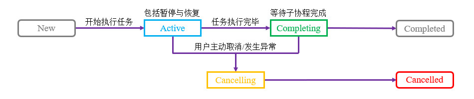

# 简介
协程(Coroutine)是一种异步任务调度工具，具有语法简洁、使用方便的特点，在很多编程语言中都有实现。Kotlin协程定义了“挂起”的概念，任务可以暂停并根据条件自动恢复，代码从语法上看是线性的，相比线程与接口回调更为直观。

CPU与OS领域只有“线程”这一概念，“协程”是编程语言领域所定义的概念，CPU与OS无法理解“协程”。在JVM平台中，Kotlin协程基于线程实现，协程代码编译后生成的字节码实际上就是在调度线程。由于Kotlin语言是跨平台的，不同目标平台上的协程实现可能有所差异，本文内容主要以JVM平台为基础。

本章内容的前置知识可以参考以下链接：

- [🧭 线程 - 概述](../01_线程/01_概述.md)

本章示例工程详见以下链接：

- [🔗 示例工程：协程](https://github.com/BI4VMR/Study-Kotlin/tree/master/M03_Advance/C03_Parallelism/S02_Coroutine)

# 基本应用
下文示例展示了协程的基本用法，我们创建协程环境并提交任务，延时片刻模拟耗时操作，并输出一些日志信息。

"TestCoroutine.kt":

```kotlin
fun main() {
    // 使用Default调度器，提交任务并启动协程。
    CoroutineScope(Dispatchers.Default).launch {
        println("Task start. Name:[${getThread()}] Time:[${getTime()}]")
        // 延时2秒，模拟耗时操作。
        delay(2000)
        println("Task end. Name:[${getThread()}] Time:[${getTime()}]")
    }

    // 阻塞主线程5秒，避免协程提前终止。
    Thread.sleep(5000L)
}
```

`CoroutineScope()` 方法用于创建协程环境，其中 `Dispatchers.Default` 是框架内置的调度器，指定了任务将在子线程中运行， `launch()` 方法也被称为“协程构建器”，用于提交任务， `launch {}` 内部的语句即协程任务，也被称为“协程体”。

协程体中的 `getThread()` 方法用于获取工作线程名称， `getTime()` 方法则用于获取当前时间，此处省略具体实现，详见本章示例工程。

此处的实验环境为Java SE平台，我们需要在启动协程后使用 `Thread.sleep()` 方法阻塞主线程等待协程任务完成，这是因为JVM平台中的协程基于线程实现，主线程执行完毕则整个进程结束，所有非守护线程（包括协程的工作线程）都会立刻终止。如果我们使用Web Server、Android等主线程无限循环的环境进行实验，则无需调用 `Thread.sleep()` 方法。为了减少篇幅，后续示例代码均省略 `Thread.sleep()` 方法调用。

此时运行示例程序，并查看控制台输出信息：

```text
Task start. Name:[DefaultDispatcher-worker-1] Time:[15:22:06.914]
Task end. Name:[DefaultDispatcher-worker-1] Time:[15:22:08.936]
```

根据上述输出内容可知：

协程任务在 `Dispatchers.Default` 调度器所分配的工作线程"worker-1"中运行，遇到 `delay(2000)` 方法时暂停运行；2秒后计时结束，协程任务再次恢复运行。

# 挂起机制
## 简介
挂起(Suspend)是Kotlin协程的一种特性，当协程任务由于某些原因（开发者主动请求延时、等待服务器响应等）被“挂起”时，该任务进入暂停状态，并与工作线程脱离；此时协程任务不会阻塞工作线程，工作线程可以继续执行其他任务。一段时间后，延时结束或终端收到服务器的响应，当前协程任务解除“挂起”，从暂停状态中恢复，调度器将会重新为它分配工作线程，继续执行剩余的语句。

## 挂起函数
对于可复用的代码片段，我们通常会将其定义为方法。在下文示例中，我们将前文示例的延时与日志输出逻辑定义为 `task()` 方法。

```kotlin
fun task() {
    println("Task start. Name:[${getThread()}] Time:[${getTime()}]")
    delay(2000)
    println("Task end. Name:[${getThread()}] Time:[${getTime()}]")
}
```

上述定义方法的语句将会导致编译错误，这是因为“挂起”特性是Kotlin协程专有的，非协程环境无法使用该特性，此处的延时方法 `delay()` 就是一个会导致“挂起”的语句，只能出现在协程任务中。

如果一个方法中包含可能导致“挂起”的语句，我们必须在方法声明语句中添加"suspend"关键字，标记本方法只能在协程任务中使用。

"TestCoroutine.kt":

```kotlin
// 定义挂起函数
suspend fun task(): Int {
    println("Task start. Name:[${getThread()}] Time:[${getTime()}]")
    delay(2000)
    println("Task end. Name:[${getThread()}] Time:[${getTime()}]")
    return 0
}

CoroutineScope(Dispatchers.Default).launch {
    // 在协程任务中调用挂起函数，并获取返回值。
    val value = task()
    println("Task return value is $value")
}
```

被"suspend"关键字修饰的方法叫作“挂起函数”，挂起函数不仅可以被协程任务直接调用，还可以被嵌套在其他挂起函数中。协程库的内置方法 `delay()` 就是一个挂起函数，因此它即可以出现在 `CoroutineScope.launch()` 方法所声明的协程任务中，又可以出现在挂起函数 `task()` 中。

挂起函数可以拥有返回值，当程序运行至"return"语句时，挂起函数执行完毕并返回，调用者可以声明一个变量来接收返回值。

此时运行示例程序，并查看控制台输出信息：

```text
Task start. Name:[DefaultDispatcher-worker-1] Time:[20:49:56.009]
Task end. Name:[DefaultDispatcher-worker-1] Time:[20:49:58.035]
Task return value is 0
```

## 挂起的原理
在JVM平台中，“挂起”特性实际上是由接口回调机制实现的。以前文示例代码中的 `val value = task()` 语句为例，当挂起函数 `task()` 开始执行时，调用者注册了结果回调；当 `task()` 执行至"return"语句时，结果回调被触发，调用者通过回调来接收挂起函数的返回值，并赋值给变量 `value` 。Kotlin编译时会将协程代码转换为JVM的接口回调逻辑，这就是协程代码语法是同步，执行效果却为异步的原理。

在下文示例中，我们同时开启多个协程任务，以便测试协程任务与工作线程之间的关系。

"TestCoroutine.kt":

```kotlin
suspend fun task(name: String, time: Long) {
    println("Task $name start. Name:[${getThread()}] Time:[${getTime()}]")
    delay(time)
    println("Task $name end. Name:[${getThread()}] Time:[${getTime()}]")
}

val scope = CoroutineScope(Dispatchers.Default)
// 开启第一个任务
scope.launch {
    task("1", 2000)
}
// 开启第二个任务
scope.launch {
    task("2", 3000)
}
```

此时运行示例程序，并查看控制台输出信息：

```text
Task 1 start. Name:[DefaultDispatcher-worker-1] Time:[21:07:19.332]
Task 2 start. Name:[DefaultDispatcher-worker-2] Time:[21:07:19.332]
Task 1 end. Name:[DefaultDispatcher-worker-2] Time:[21:07:21.368]
Task 2 end. Name:[DefaultDispatcher-worker-2] Time:[21:07:22.376]
```

根据上述输出内容可知：

Task1和Task2依次启动， `Dispatchers.Default` 调度器分别为它们分配了工作线程"worker-1"和"worker-2"；Task1执行至挂起函数 `delay()` 后进入暂停状态，与工作线程分离，Task2亦然。

2秒之后延时结束，Task1首先从暂停状态中恢复，调度器将先前分配给Task2的工作线程"worker-2"分配给Task1，使其继续执行日志输出语句。该现象说明Task2在挂起刻时已经与工作线程"worker-2"分离，没有阻塞工作线程，在此期间工作线程仍然可以处理其他任务。

# 生命周期
一个协程任务从创建到执行完毕，可能会经历下文图片所示的状态：

<div align="center">



</div>

协程库并未直接提供获取任务状态的接口，但Job类提供了三个公开的属性，我们可以通过 `isActive` 的值判断任务是否正在运行；通过 `isCompleted` 和 `isCancelled` 的值判断任务最终状态是“已完成”还是“已取消”。

下文表格列出了协程任务状态与三个公开属性的对应关系：

<div align="center">

| State      | `isActive` | `isCompleted` | `isCancelled` |
| ---------- | ---------- | ------------- | ------------- |
| New        | `false`    | `false`       | `false`       |
| Active     | `true`     | `false`       | `false`       |
| Completing | `true`     | `false`       | `false`       |
| Cancelling | `false`    | `false`       | `true`        |
| Cancelled  | `false`    | `true`        | `true`        |
| Completed  | `false`    | `true`        | `false`       |

</div>

在下文示例中，我们开启一个协程，并且尝试访问任务的三个公开属性。

"TestCoroutine.kt":

```kotlin
// 启动协程任务，并声明变量保存任务实例。
val job: Job = CoroutineScope(Dispatchers.Default).launch {
    println("Task start. Time:[${getTime()}]")
    delay(2000L)
    println("Task end. Time:[${getTime()}]")
}

// 主线程等待100毫秒，然后访问属性获取协程任务的状态。
Thread.sleep(100L)
// 判断当前任务是否为Active状态
val active: Boolean = job.isActive
// 判断当前任务是否为Completed状态
val completed: Boolean = job.isCompleted
// 判断当前任务是否为Cancelled状态
val cancelled: Boolean = job.isCancelled
println("正在运行:[$active] 任务完成:[$completed] 任务取消:[$cancelled]")
```

`launch()` 方法的返回值是一个Job实例，表示协程任务；若要获取任务的状态，我们可以声明变量保存Job实例，然后访问它的 `isActive` 等属性。

此时运行示例程序，并查看控制台输出信息：

```text
Task start. Time:[14:12:51.610]
正在运行:[true] 任务完成:[false] 任务取消:[false]
Task end. Time:[14:12:53.635]
```

根据上述输出内容可知：

协程任务开始运行后，立刻进入暂停状态；此时主线程从休眠状态中恢复，协程任务的 `isActive` 属性值为"true"。该现象说明任务的状态只与其是否正在运行有关，与是否挂起无关。

# 取消协程任务
## 简介
假设现有一个通过网络请求数据并更新UI的协程任务，当我们打开页面时协程同步启动，由于网络延迟较高，我们在服务端响应之前就关闭了页面；一段时间后协程收到服务端的数据，继续执行更新UI的操作，因为此时页面已被关闭，更新UI可能导致状态异常甚至程序崩溃。在上述场景中，当页面被关闭时，我们应该取消相关的协程任务，以便节约资源并避免发生错误。

协程的中断处理方式与线程是类似的，在未挂起状态收到中断请求需要由协程任务自行处理，在已挂起状态收到中断请求则会抛出异常并终止任务。

## 取消未挂起的任务
在下文示例中，我们启动一个协程，并在主线程发起中断请求。

"TestCoroutine.kt":

```kotlin
// 启动一个协程，循环输出日志信息。
val job: Job = CoroutineScope(Dispatchers.Default).launch {
    for (i in 1..10_000) {
        // 每轮循环开始前，先判断当前任务是否已被取消。
        if (!isActive) {
            // 任务被取消时，终止后续任务。
            println("Task was canceled!")
            return@launch
        }

        println("Task start. Index:[$i]")
    }
}

// 主线程等待25毫秒，然后取消协程任务。
Thread.sleep(25L)
println("Try to cancel task.")
job.cancel()
```

该任务将会循环输出日志，以模拟需要反复执行的计划任务；在每轮循环开始之前，我们都要检查当前任务的 `isActive` 属性，一旦发现任务已被标记为取消，则终止循环。

当任务开始运行约25毫秒后，我们在主线程调用 `job.cancel()` 请求中断协程任务。

此时运行示例程序，并查看控制台输出信息：

```text
Task start. Index:[1]
Task start. Index:[2]

此处省略部分输出内容 ...

Try to cancel task.
Task start. Index:[2689]
Task was canceled!
```

根据上述输出内容可知：

当我们调用 `job.cancel()` 方法请求中断任务后，协程任务的 `isActive` 属性值从"true"变为"false"，此时我们可以忽略后续的任务。

## 取消已挂起的任务
在下文示例中，我们启动一个协程，并在任务进入挂起状态时发起中断请求。

"TestCoroutine.kt":

```kotlin
// 启动一个协程，循环输出日志信息。
val job: Job = CoroutineScope(Dispatchers.Default).launch {
    try {
        println("Task start. Time:[${getTime()}]")
        delay(2000L)
        println("Task end.")
    } catch (e: CancellationException) {
        println("Catch cancellation exception! Time:[${getTime()}]")
    } finally {
        println("Do some clean work...")
    }
}

// 主线程等待25毫秒，然后取消协程任务。
Thread.sleep(25L)
println("Try to cancel task.")
job.cancel()
```

该任务开始运行后立刻进入挂起状态，约25毫秒后，我们在主线程调用 `job.cancel()` 请求中断协程任务。

此时运行示例程序，并查看控制台输出信息：

```text
Task start. Time:[20:21:17.774]
Try to cancel task.
Catch cancellation exception! Time:[20:21:17.793]
Do some clean work...
```

根据上述输出内容可知：

当协程进入挂起状态时，一旦收到中断请求，就会立刻终止任务并抛出异常： `CancellationException` ，我们可以在顶层协程体中使用"try ... catch"语句捕获该异常，并添加"finally"语句释放本协程所关联的资源。

若顶层协程体中没有"try ... catch"语句，发生异常后当前任务将会静默结束，不会影响其他协程或线程。因此，如果协程任务并未关联任何资源，也不需要向外部组件汇报“取消”或其他异常状态，我们可以省略"try ... catch"语句。
