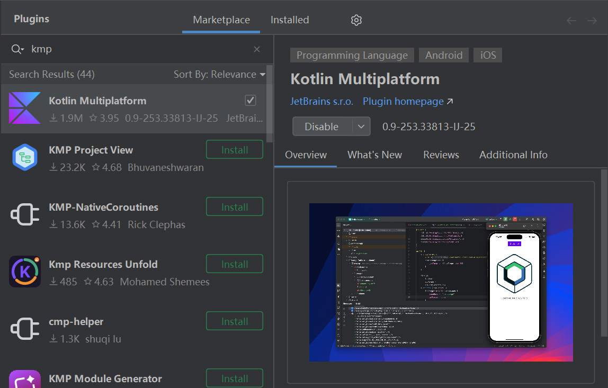

# 简介
Compose Multiplatform (CMP) 是 JetBrains 维护的开源 UI 框架，旨在将 Android 平台上的 Jetpack Compose 移植到 Desktop、iOS、Web 等多种平台，实现风格统一的用户界面，并降低维护成本。

Compose Multiplatform 可与其他框架自由组合，以适配多种业务场景：


```text
<工程根目录>
├── shared  # Compose 界面代码
├── androidApp  # Compose 界面代码
├── iosApp  # Compose 界面代码
├── desktopApp  # Compose 界面代码
└── webApp  # Compose 界面代码
```

- `shared` : ComposeUI实现代码，被各平台所引用。
- `androidApp` : android平台支持，基于Android构建工具，具体内容详见 【】 ,本文不在详细介绍。
- `iosApp` : ios平台支持，需要使用。
- `desktopApp` : 仅提供 Desktop 平台支持。
- `webApp` : web平台支持，可以生成js或wasm浏览器应用。

compose界面实现代码均放在shared中，各模块仅提供对应平台的构建设施，不包含复杂逻辑，仅引用shared模块显示界面即可。
若确实仅需单平台支持，也可以简化结构，将compose代码和平台打包放在同一模块中。


我们可以通过该地址
https://kmp.jetbrains.com/


Compose Multiplatform 可与其他框架自由组合，以适配多种业务场景：

- `Kotlin Multiplatform` : 一种在服务端与客户端共享逻辑代码的框架，若与 Compose Multiplatform 相结合，即可完全基于 Kotlin 技术栈实现服务端与多平台客户端，达到最大程度的代码复用。


Kotlin多平台框架，可以在服务端、客户端共享逻辑代码，如果我们希望逻辑和界面都进行复用，可以选择Kotlin Multiplatform + Compose Multiplatform组合，如果我们只希望多平台共享逻辑，各平台使用独立的界面，也可以仅使用Kotlin Multiplatform
配合KMP使用，不仅包括Desktop，还支持同一套Compose代码编译为Web和Andori ios应用，实现全平台复用


JetBrains 推荐的开发工具是 IntelliJ IDEA 或 Android Studio ，我们可以安装 Kotlin Multiplatform 插件，实现界面组件预览等功能，提高开发体验。

<div align="center">



</div>

本章的前置知识详见以下链接：

- [🧭 Jetpack Compose](../../../../07_平台开发/01_Android/03_用户界面/10_Compose/01_概述.md)

本章的相关知识详见以下链接：

- [🔗 Kotlin Multiplatform 官方文档](https://kotlinlang.org/docs/multiplatform/get-started.html)


