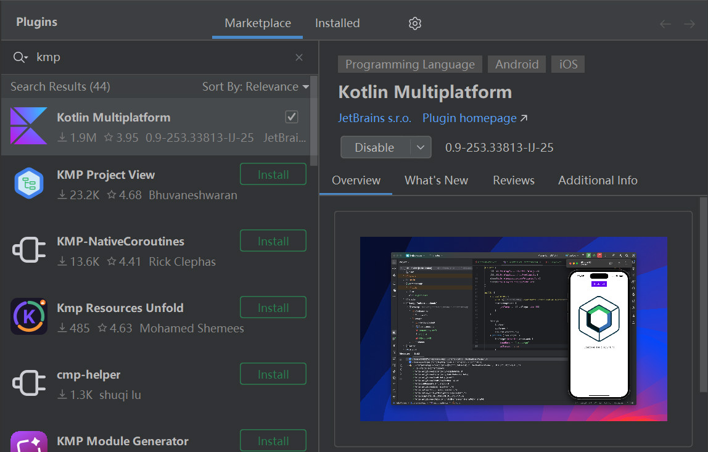

# 简介
Compose Multiplatform (CMP) 是 JetBrains 维护的开源 UI 框架，旨在将 Android 平台上的 Jetpack Compose 移植到 Desktop、iOS、Web 等多种平台，实现风格统一的用户界面，并尽可能复用代码以降低开发成本。

CMP 工程常见的组织结构如下文代码块所示：

```text
<工程根目录>
├── shared_ui    # Compose UI 代码
├── app_android  # Android 应用程序
├── app_ios      # iOS 应用程序
├── app_desktop  # Desktop 应用程序
└── app_web      # Web 应用程序
```

下文列表对上述工程结构作出了详细的说明：

- `shared_ui` : Compose UI 实现代码，被各平台模块所引用。
- `app_android` : Android 平台应用，基于 Android 构建工具，具体用法详见 [🧭 Jetpack Compose](../../../../07_平台开发/01_Android/03_用户界面/10_Compose/01_概述.md) 。
- `app_ios` : iOS 平台应用，需要在 MacOS 环境使用 XCode 及相关工具链编译。
- `app_desktop` : 提供 Windows 、 Linux 、 MacOS 等桌面平台支持，具体用法详见 [🧭 Compose Desktop](./02_Desktop.md) 。
- `app_web` : Web 应用程序，可生成 JavaScript 或 WebAssembly 浏览器应用。

在上述工程结构中， Compose UI 代码均放置在 `shared_ui` 模块中， `app_android` 、 `app_desktop` 等模块仅提供对应平台的构建与打包能力，它们不包含复杂的业务逻辑，而是引用并显示 `shared_ui` 模块中的界面。

我们可以使用 JetBrains 官方提供的 [🔗 KMP 模板生成工具](https://kmp.jetbrains.com/) 快速生成工程模板，不必手动创建上述目录结构与配置文件。

Compose Multiplatform 可与 [🧭 Kotlin Multiplatform](../../08_框架集成/01_Kotlin-Multiplatform/01_概述.md) 框架组合使用，此时我们可以通过 KMP 显示平台原生界面或调用平台专属接口，适配更多的场景。

JetBrains 推荐的开发工具是 IntelliJ IDEA 或 Android Studio ，我们可以安装 Kotlin Multiplatform 插件，实现界面组件预览等功能，提高开发体验。

<div align="center">



</div>

---

本章的前置知识详见以下链接：

- [🧭 Jetpack Compose](../../../../07_平台开发/01_Android/03_用户界面/10_Compose/01_概述.md)

本章的相关知识详见以下链接：

- [🔗 Kotlin Multiplatform 官方文档](https://kotlinlang.org/docs/multiplatform/get-started.html)
