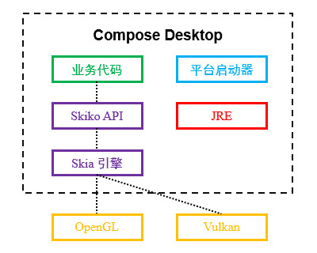
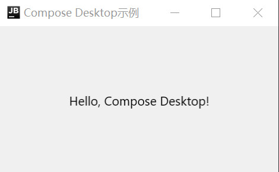

# Compose Desktop
## 简介
Compose Desktop 利用 JVM 的跨平台能力，可在 Windows、Linux、MacOS 平台展示通过 Compose 代码编写的用户界面。

如果我们只想开发 Desktop 平台的软件，无需实现浏览器页面和移动端应用，可以仅引入 Compose Desktop 相关组件，不必引入完整的 Compose Multiplatform 组件。

下文图片展示了 Compose Desktop 程序包含的组件：

<div align="center">



</div>

下文列表将对 Compose Desktop 的各个组件作出说明：

- `Skia` : Skia 是 Google 开发的跨平台 2D 图形引擎，能够根据平台类型调用 OpenGL、Vulkan、Metal、Direct3D 等 API 实现硬件加速， Android、Chrome、Firefox、LibreOffice 等项目都通过该引擎渲染用户界面。 Jetpack Compose 在 Android 平台上就是基于 Skia 引擎的，因此该框架得以被移植到其他平台。
- `Skiko` : Skiko (Skia for Kotlin) 是 JetBrains 开发的 Skia-Kotlin 桥接库，开发者可以通过该库提供的 Kotlin API 直接调用 SKia ，无需自行实现 JNI 接口。
- `JRE` : Compose Desktop 生成的软件安装包将会内置 JRE ，确保未全局安装 JRE 的用户能够正常使用软件，不必自行配置环境。
- `平台启动器` : Compose Desktop 根据目标平台生成的启动器，用于启动内置 JRE 并装载业务代码。

## 基本应用
Compose Desktop 的模块结构与普通 Gradle 模块完全一致，因此在现有项目的基础上进行扩展非常容易。

🔴 示例一：配置 Compose Desktop 开发环境。

在本示例中，我们创建基本的 Compose Desktop 模块，了解工程结构。

本示例的完整代码详见： [🔗 示例工程：Compose Desktop](https://github.com/BI4VMR/Study-Kotlin/tree/master/M07_GUI/C01_CMP/S01_Desktop) 。

第一步，总览模块结构。

```text
<Gradle模块>
├── src
│   └── main
│       └── kotlin            # Compose 代码
│           └── net.bi4vmr.study
│               └── Main.kt
└── build.gradle.kts          # Gradle 配置文件
```

第二步，创建 Gradle 配置文件。

`build.gradle.kts` :

```kotlin
/* 插件版本声明需要放置在根项目的 `build.gradle.kts` 文件
plugins {
    // Kotlin JVM 平台插件
    id("org.jetbrains.kotlin.jvm").version("2.2.20").apply(false)
    // Compose Multiplatform 插件
    id("org.jetbrains.compose").version("1.11.1").apply(false)
    // Compose Multiplatform 编译器插件
    id("org.jetbrains.kotlin.plugin.compose").version("2.2.20").apply(false)
}
*/


plugins {
    // Kotlin JVM 平台插件
    id("org.jetbrains.kotlin.jvm")
    // Compose Multiplatform 插件
    id("org.jetbrains.compose")
    // Compose Multiplatform 编译器插件
    id("org.jetbrains.kotlin.plugin.compose")
}

// Compose Desktop 配置项
compose.desktop {
    // 声明应用程序
    application {
        // 注册该应用程序的入口
        mainClass = "net.bi4vmr.study.MainKt"
    }
}

dependencies {
    // 声明 Compose Desktop 的依赖组件
    implementation(compose.desktop.currentOs)
}
```

`org.jetbrains.compose` 是 CMP 的核心插件，用于配置当前模块所使用的 CMP 版本，并生成 `compose.desktop.currentOs` 依赖项，它指向当前平台对应的组件，例如： Linux 环境下为 `org.jetbrains.compose.desktop:desktop-jvm-linux-x64:1.11.1` 。

`org.jetbrains.kotlin.plugin.compose` 是 CMP 编译器插件，在 CMP 1.6.10 及更高版本中必须声明，该插件的版本号不跟随 CMP 插件，而是跟随当前模块所使用的 Kotlin 版本。

Kotlin 与 CMP 插件的版本兼容信息可在 [🔗 CMP兼容性 ](https://kotlinlang.org/docs/multiplatform/compose-compatibility-and-versioning.html) 页面查询。

`compose.desktop {}` 小节用于配置 Compose Desktop ；每个 `application {}` 小节对应一个桌面应用，其中的 `mainClass` 属性应指向应用入口类，例如：本示例中的 `Main.kt` 编译为 JVM 字节码后的类名是 `MainKt` 。

第三步，创建 Compose 窗口，用于显示文本信息。

`Main.kt` :

```kotlin
fun main() = application {
    Window(
        onCloseRequest = ::exitApplication,
        title = "Compose Desktop示例"
    ) {
        Box(
            modifier = Modifier.fillMaxSize(),
            contentAlignment = Alignment.Center
        ) {
            Text("Hello, Compose Desktop!")
        }
    }
}
```

第四步，运行示例程序。

我们可以使用以下命令使示例程序运行：

```bash
[bi4vmr@Windows ~]% ./gradlew :M07_GUI:C01_CMP:S01_Desktop:run
```

此时运行示例程序，并查看界面外观：

<div align="center">



</div>

Compose Desktop 支持热重载，运行程序后修改代码可以实时预览，不需要重新启动程序。

```bash
[bi4vmr@Windows ~]% ./gradlew :M07_GUI:C01_CMP:S01_Desktop:hotRun --auto
```

该功能依赖 JetBrains Runtime ，在其他 JVM 中无法使用，如果不希望在系统全局使用 JetBrains Runtime ，我们也可以临时将当前终端的环境变量指向JBR进行解决。


# 应用资源目录
资源是指直接带入安装目录的文件，例如应用需要调用的ffmpeg等可执行文件，不包括应用内部使用的图片素材等资源。

在nativeDistributions小节配置：
appResourcesRootDir.set(rootProject.layout.projectDirectory.dir("resources"))

目录结构
 resources/
 ├── common/        ← 所有平台共用
 ├── linux/         ← Linux 专用
 ├── linux-x64/     ← Linux x64 专用
 ├── windows/       ← Windows 专用
 └── macos/         ← macOS 专用


程序中获取：


System.getProperty("compose.application.resources.dir")

安装后应当是这个目录：<软件根目录>/lib/app/resources

gradle:run执行的目录是：<模块根目录>/build/compose/tmp/prepareAppResources


# 打包

./gradlew packageDistributionForCurrentOS
./gradlew packageReleaseDistributionForCurrentOS 打当前系统环境的包：不支持交叉编译，因此如果当前是linux，且配置了`targetFormats(TargetFormat.Exe, TargetFormat.Msi, TargetFormat.Deb)` ，也只会打出 exe和msi包。
./gradlew packageExe 打指定类型的包 `main/exe`

./gradlew createDistributable 生成完整的应用目录（含 JVM runtime + app），可直接运行  `main/app`
./gradlew packageUberJarForCurrentOS 打包为单个可执行 JAR


默认是debug，带有release的命令可以打出release包，产物目录为 main-release ，可以进行资源压缩与代码混淆，体积更小。


# 改变产物目录


默认目录
<模块>/build/compose/binaries/main/

outputBaseDir.set(rootProject.layout.projectDirectory.dir("distribution"))


## IDEA执行出错

IDEA的运行环境不支持compose multiplatform，需要创建gradle配置运行，或直接使用gradlew :<模块>:run 命令运行。


## 打包后执行出错

gradle run可以执行，但打包后执行出现缺失模块。

Exception in thread "main" java.lang.NoClassDefFoundError: java/sql/DriverManager                                    
        at app.cash.sqldelight.driver.jdbc.sqlite.ThreadedConnectionManager.getConnection(JdbcSqliteDriver.kt:128)   
        at app.cash.sqldelight.driver.jdbc.sqlite.JdbcSqliteDriver.getConnection(JdbcSqliteDriver.kt)                
        at app.cash.sqldelight.driver.jdbc.JdbcDriver.newTransaction(JdbcDriver.kt:169)                                                                   
        ... 13 more

默认打包工具使用精简版jdk，不包含sql等扩展模块。

我们可以指定添加这些模块：

modules("java.sql")

或添加所有模块，这会导致打包体积变大

includeAllModules = true

如果不想使用gradle提供的jre,可以自行指定
javaHome = "/path/to/your/jdk"


查看建议的模块

jdeps --print-module-deps --ignore-missing-deps your-app.jar

./gradlew suggestRuntimeModules

