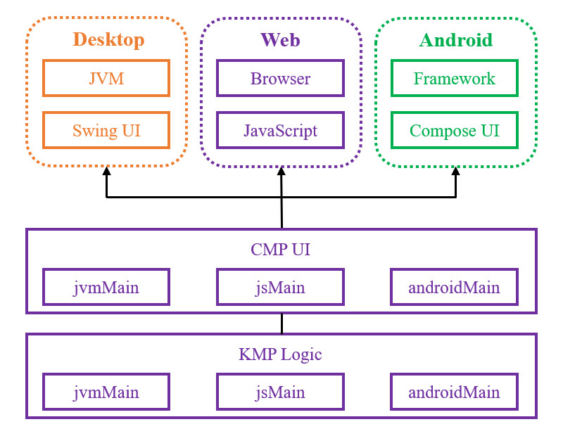
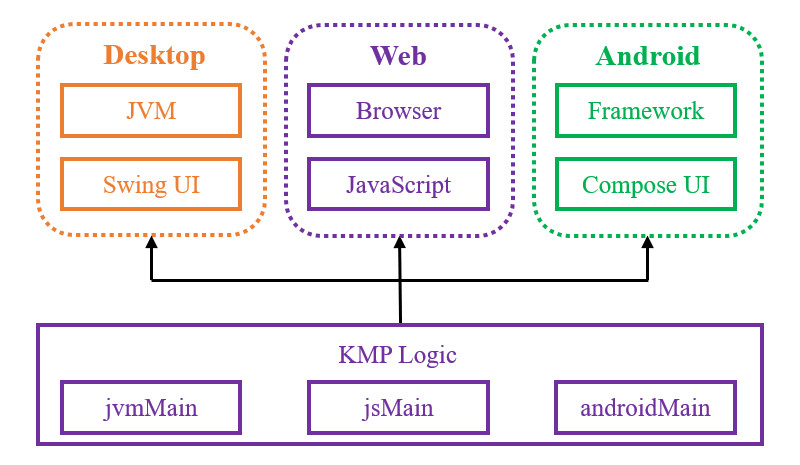

# 简介
Kotlin Multiplatform (KMP) 是 JetBrains 维护的跨平台框架，允许我们通过 Kotlin 语言编写通用代码，并调用 Desktop、iOS、Web 等平台的专有接口，实现代码复用与跨平台支持。

KMP 框架通常与 [🧭 Compose Multiplatform](../../07_用户界面/01_Compose-Multiplatform/01_概述.md) 框架联合使用：

<div align="center">



</div>

此时 KMP 模块用于放置业务逻辑代码； CMP 模块用于放置通用界面代码。我们可以利用 CMP 编写一套 Compose 界面，并生成各个平台的应用程序。

若我们已经通过各个平台的原生代码实现了界面，也可以仅使用 KMP 框架共享业务逻辑，不通过 CMP 框架实现跨平台界面：

<div align="center">



</div>

此时 KMP 模块以库的形式存在，仅用于封装业务逻辑代码，可以生成 AAR 、 JAR 、 NPM 模块等产物，供界面层调用。

---

本章的相关知识详见以下链接：

- [🧭 Compose Multiplatform](../../07_用户界面/01_Compose-Multiplatform/01_概述.md)
- [🔗 Kotlin Multiplatform 官方文档](https://kotlinlang.org/docs/multiplatform/get-started.html)


# 基本应用
下文示例展示了 KMP 工程的目录结构。

🔴 示例一：了解 KMP 工程的目录结构。

在本示例中，我们通过查阅 [🔗 KMP 模板生成工具](https://kmp.jetbrains.com/) 所创建的文件了解 KMP 工程组成部分。

第一步，查看 KMP 模块的目录结构。

```text
<模块根目录>
├── build.gradle.kts
└── src
    ├── commonMain
    ├── jvmMain
    ├── jsMain
    ├── wasmJsMain
    ├── androidMain
    ├── iosMain
    ├── commonTest
    ├── jvmTest
    ├── webTest
    ├── androidHostTest
    └── iosTest
```

`commonMain` 目录用于放置公共业务代码与跨平台接口定义，此处不应当引用 `java.io.File` 等平台专有组件，只应引用 Kotlin 标准库或已适配 KMP 的第三方库。

`jvmMain` 、 `androidMain` 等目录用于放置平台接口实现，这些目录可以引用 Kotlin 库和各平台的专有组件。

`commonTest` 目录用于放置 Kotlin 测试代码； `jvmTest` 、 `androidHostTest` 等目录用于放置平台专有的测试代码，这些目录可以使用 JUnit 等平台专有的测试工具。

第二步，查看 KMP 模块的构建脚本。

`build.gradle.kts` :

```kotlin
import org.jetbrains.kotlin.gradle.dsl.JvmTarget

plugins {
    // KMP 插件
    id("org.jetbrains.kotlin.multiplatform").version("2.4.20")
    // KMP 插件 （Android 支持）
    id("com.android.kotlin.multiplatform.library").version("9.3.0")
}

kotlin {
    /* 桌面平台配置 */
    jvm()

    /* Web 平台配置 (JS) */
    js {
        browser()
    }

    /* Web 平台配置 (WebAssembly) */
    @OptIn(ExperimentalWasmDsl::class)
    wasmJs {
        browser()
    }

    /* Android 平台配置 */
    android {
        namespace = "net.bi4vmr.example"
        compileSdk = 36
        minSdk = 26

        compilerOptions {
            jvmTarget = JvmTarget.JVM_17
        }

        androidResources {
            enable = true
        }

        withHostTest {
            isIncludeAndroidResources = true
        }
    }

    /* iOS 平台配置 */
    listOf(
        iosArm64(),
        iosSimulatorArm64()
    ).forEach { iosTarget ->
        iosTarget.binaries.framework {
            baseName = "KMP"
            isStatic = true
        }
    }

    /* 各平台依赖配置 */
    sourceSets {
        commonMain.dependencies {
            implementation("org.jetbrains.compose.material3:material3:1.12.0")
            implementation("org.jetbrains.compose.components:components-resources:1.12.1")
            implementation("org.jetbrains.compose.ui:ui-tooling-preview:1.12.1")
        }
        commonTest.dependencies {
            implementation("org.jetbrains.kotlin:kotlin-test:2.4.20")
        }
        jsMain.dependencies {
            implementation("org.jetbrains.kotlin-wrappers:kotlin-browser:2026.9.2")
        }
        androidMain.dependencies {
            implementation("org.jetbrains.compose.ui:ui-tooling-preview:1.12.1")
        }
    }
}
```

在上述配置文件中，我们根据实际需要编写各平台的配置；若无需支持某个平台，可以移除对应的源码目录与配置内容。

`org.jetbrains.kotlin.multiplatform` 是 KMP 的核心插件，其版本号与 Kotlin 版本号保持一致， KMP 模块不应再声明 Kotlin 插件，否则会产生冲突。

若要支持 Android 平台，我们需要额外声明 `com.android.kotlin.multiplatform.library` 插件，该插件的版本号与 AGP 版本号保持同步。

第三步，查看接口定义与实现。

首先查看跨平台接口定义：

`commonMain/<包名>/Platform.kt` :

```kotlin
/* 平台信息 */
interface Platform {
    // 平台名称
    val name: String,
    // 平台版本
    val version: String
}


// KMP 通用接口
expect fun getPlatform(): Platform
```

在上述代码中，我们通过 `expect` 关键字定义了 `getPlatform` 接口，各平台应当实现该接口。

接下来，我们查看 `jvmMain` 目录下的 `getPlatform` 接口实现：

`jvmMain/<包名>/Platform.jvm.kt` :

```kotlin
/* 平台信息 */
interface JVMPlatform : Platform {

    override val name: String = System.getProperty("os.name")

    override val version: String = System.getProperty("os.version")
}


// JVM 接口实现
actual fun getPlatform(): Platform = JVMPlatform()
```

为了防止同名文件冲突，我们通常将平台名称插入到接口定义文件的名称与后缀之间，例如：接口定义文件名为 `Platform.kt` ，则 JVM 实现文件名为 `Platform.jvm.kt` 。

`actual` 关键字表示接口在当前平台的具体实现。在 JVM 平台上，我们通过系统属性读取系统名称与版本信息。

最后，我们查看 `androidMain` 目录下的 `getPlatform` 接口实现：

`androidMain/<包名>/Platform.android.kt` :

```kotlin
/* 平台信息 */
interface AndroidPlatform : Platform {

    override val name: String = Build.VERSION.ID

    override val version: String = Build.VERSION.SDK_INT
}


// Android 接口实现
actual fun getPlatform(): Platform = AndroidPlatform()
```

在 Android 平台上，我们通过 Build 中的常量读取系统名称与版本信息。
