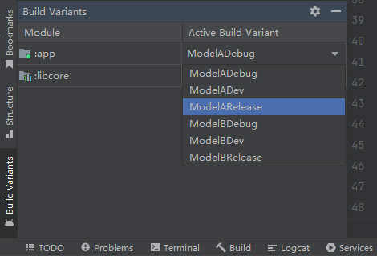
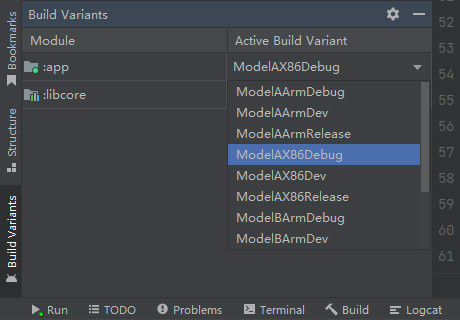

# Product Flavors
## 简介
Product Flavors用于区分不同型号的产品，每个Flavor在构建后都将生成一个新的APK。

Flavor可以指定独立的依赖并改写 `defaultConfig {}` 小节中的属性，我们可以利用Flavor配置不同的发布渠道（例如：“软件商城A”、“软件商城B”等）或不同的平台架构（例如："x86"、"arm"等）。

## 基本应用
Product Flavors需要在当前模块 `build.gradle` 文件的 `android {}` 小节中声明：

"build.gradle":

```groovy
android {
    defaultConfig {
        // 指定Flavor的组合顺序
        flavorDimensions = ["default"]
    }

    // 声明Product Flavors
    productFlavors {
        // 声明第一个Flavor
        ModelA {
            // 定义"ModelA"所属的维度为"default"
            dimension "default"
            // 指定包名
            applicationId "net.bi4vmr.study.modela"
            // 指定版本号
            versionCode 1
            // 指定版本名称
            versionName "1.0"
        }

        // 声明第二个Flavor
        ModelB {
            dimension "default"
            applicationId "net.bi4vmr.study.modelb"
            versionCode 2
            versionName "2.0"
        }
    }
}
```

上述内容也可以使用Kotlin语言书写：

"build.gradle.kts":

```kotlin
android {
    defaultConfig {
        // 指定Flavor的组合顺序
        flavorDimensions.add("default")
    }

    // 声明Product Flavors
    productFlavors {
        // 声明第一个Flavor
        create("ModelA") {
            // 定义"ModelA"所属的维度为"default"
            dimension = "default"
            // 指定包名
            applicationId = "net.bi4vmr.study.modela"
            // 指定版本号
            versionCode = 1
            // 指定版本名称
            versionName = "1.0"
        }

        // 声明第二个Flavor
        create("ModelB") {
            dimension = "default"
            applicationId = "net.bi4vmr.study.modelb"
            versionCode = 2
            versionName = "2.0"
        }
    }
}
```

此处我们创建了"ModelA"和"ModelB"两个Flavor，并且配置了不同的包名与版本属性。当我们选择某个Flavor进行编译时，这些属性就会覆盖 `defaultConfig {}` 小节中的同名属性。

Flavor的名称不能与其他标识符冲突，包括BuildTypes、SourceSets等。

配置文件编写完毕后，我们在Android Studio中执行一次Gradle Sync动作，即可在Build Variant面板中查看自定义Flavor。

<div align="center">



</div>

前文示例中，我们配置了3个编译类型，它们分别是"release"、"debug"和"dev"，与上述Flavor排列组合之后将会生成6个Build Variant：

- ModelA + debug = ModelADebug
- ModelA + dev = ModelADev
- ModelA + release = ModelARelease
- ModelB + debug = ModelBDebug
- ModelB + dev = ModelBDev
- ModelB + release = ModelBRelease

当存在自定义Flavor时，编译输出目录结构将变更为 `build/outputs/apk/<Flavor名称>/<BuildType名称>` ，如下文代码块所示：

```text
[root@Fedora RootProject]# tree ./app/build/outputs/apk/
./app/build/outputs/apk/
├── ModelA
│   ├── debug
│   │   ├── app-ModelA-debug.apk
│   │   └── output-metadata.json
│   ├── dev
│   │   ├── app-ModelA-dev-unsigned.apk
│   │   └── output-metadata.json
│   └── release
│       ├── app-ModelA-release-unsigned.apk
│       └── output-metadata.json
└── ModelB
    └── ...
```

此时构建模块的Task名称也会变更为 `assemble<Flavor名称><BuildType名称>` 格式：

```text
# 编译"app"模块，指定Flavor为ModelA、构建类型为"release"。
[root@Fedora RootProject]# ./gradlew app:assembleModelARelease

# 编译"app"模块，指定Flavor为ModelB、构建类型为"debug"。
[root@Fedora RootProject]# ./gradlew app:assembleModelBDebug
```

当我们没有配置Flavor时，每个模块都有一个名称为空字符串的默认Flavor，因此Build Variant面板中的选项看起来与Build Types一致。

<!-- TODO
## 属性

-->

## 依赖配置
每个Flavor可以拥有专属的依赖配置，这种配置通过 `<Flavor名称>Implementation '<组件名称>'` 方法进行声明。当某个Flavor被编译时，若存在名称匹配的依赖配置，这些配置就会覆盖默认的 `implementation '<组件名称>'` 配置。

"build.gradle":

```groovy
dependencies {
    // 默认依赖
    implementation 'com.example:sdk:1.0'

    // ModelA专属依赖
    ModelAImplementation 'com.example:sdk-typea:1.0'
}
```

上述内容也可以使用Kotlin语言书写：

"build.gradle.kts":

```kotlin
dependencies {
    // 默认依赖
    implementation("com.example:sdk:1.0")

    // ModelA专属依赖
    add("ModelAImplementation", "com.example:sdk-typea:1.0")
}
```

以上述配置文件为例，当我们执行"app:assembleModelARelease"任务时，将会使用"sdk-typea"依赖项；当我们执行"app:assembleModelBRelease"任务时，将会使用默认的"sdk"依赖项。

## 多维度Flavor
在前文示例中，我们利用Flavor定义了"ModelA"和"ModelB"两个产品型号。若在此基础之上，还需要区分"x86"和"arm"两种硬件架构，我们可以按照前文示例中的方式，手动定义以下4个Flavor：

- ModelA + x86 = ModelAX86
- ModelA + arm = ModelAArm
- ModelB + x86 = ModelBX86
- ModelB + arm = ModelBArm

这种方式的缺点是存在重复配置，并且后续新增其他区分维度时，需要修改所有现有的Flavor配置，不便于维护。

为了解决上述问题，我们可以定义多个Flavor维度，使它们自动组合。

"build.gradle":

```groovy
android {
    defaultConfig {
        // 指定Flavor的组合顺序
        flavorDimensions = ["model", "arch"]
    }

    productFlavors {
        ModelA {
            // 定义"ModelA"所属的维度为"model"
            dimension "model"
        }

        ModelB {
            // 定义"ModelB"所属的维度为"model"
            dimension "model"
        }

        x86 {
            // 定义"x86"所属的维度为"arch"
            dimension "arch"
        }

        arm {
            // 定义"arm"所属的维度为"arch"
            dimension "arch"
        }
    }
}
```

上述内容也可以使用Kotlin语言书写：

"build.gradle.kts":

```kotlin
android {
    defaultConfig {
        // 指定Flavor的组合顺序
        flavorDimensions.add("model")
        flavorDimensions.add("arch")
    }

    // 声明Product Flavors
    productFlavors {
        create("ModelA") {
            // 定义"ModelA"所属的维度为"model"
            dimension = "model"
        }

        create("ModelB") {
            // 定义"ModelB"所属的维度为"model"
            dimension = "model"
        }

        create("x86") {
            // 定义"x86"所属的维度为"arch"
            dimension = "arch"
        }

        create("arm") {
            // 定义"arm"所属的维度为"arch"
            dimension = "arch"
        }
    }
}
```

在上述配置文件中，我们首先通过"dimension"配置项将所有Flavor分为两个维度，其中"model"表示产品型号维度；"arch"表示硬件架构维度。然后我们在 `defaultConfig {}` 小节中，通过"flavorDimensions"属性指定各维度的组合顺序。

此时两种Flavor即可按照产品型号、硬件架构的顺序自动组合，生成前文所述的四种Flavor。Flavor再与BuildType组合后，将生成完整的编译任务名称。

我们在Android Studio中执行一次Gradle Sync动作，即可在Build Variant面板中查看Flavor组合。

<div align="center">



</div>

多个Flavor名称拼接时，首个Flavor的大小写保持原状，后续Flavor的首字母将自动变为大写。
