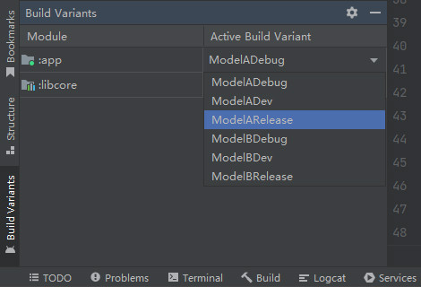
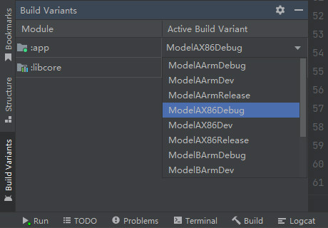

# BuildConfig
## 简介
BuildConfig是Gradle在构建过程中自动生成的一个Java类，其中包括一系列的静态常量，用于描述模块的构建环境，例如：构建变体、版本号等。

BuildConfig文件与R文件类似，它的生成位置由当前模块的命名空间属性决定，我们可以查看其中所包含的默认常量：

"BuildConfig.java":

```java
package net.bi4vmr.study;

public final class BuildConfig {
    // 公共属性：是否允许调试
    public static final boolean DEBUG = false;
    // 公共属性：构建变体名称
    public static final String BUILD_TYPE = "release";

    // LIB模块专有属性：命名空间名称
    public static final String LIBRARY_PACKAGE_NAME = "net.bi4vmr.study";

    // APP模块专有属性：应用程序包名
    public static final String APPLICATION_ID = "net.bi4vmr.study";
    // APP模块专有属性：版本号
    public static final int VERSION_CODE = 1;
    // APP模块专有属性：版本名称
    public static final String VERSION_NAME = "1.0.0";
}
```

我们可以在应用程序的逻辑代码中访问这些常量，以便了解编译阶段的相关配置，动态地改变程序的行为。

🔴 示例一：通过BuildConfig控制日志输出。

在本示例中，我们读取BuildConfig类中的 `DEBUG` 常量，当该属性为"false"时，关闭日志输出；当该属性为"true"时，开启日志输出。

"App.java":

```java
if (BuildConfig.DEBUG) {
    LogUtil.printOn();
} else {
    LogUtil.printOff();
}
```

上述内容也可以使用Kotlin语言编写：

"App.kt":

```kotlin
if (BuildConfig.DEBUG) {
    LogUtil.printOn()
} else {
    LogUtil.printOff()
}
```

> 🚩 提示
>
> BuildConfig文件在模块首次被构建成功时才会生成，因此我们在编写上述代码之前应当先执行一次构建。

## 功能开关
在默认情况下，BuildConfig文件将会自动生成，但有时我们希望禁止生成该文件，例如：两个LIB模块都使用了相同的命名空间，当某个APP模块同时依赖这两个LIB模块时，LIB模块的BuildConfig文件就会产生冲突。

我们可以在LIB模块Gradle配置文件的 `android {}` 小节中添加以下语句，控制是否生成BuildConfig文件：

"build.gradle":

```groovy
android {
    buildFeatures {
        // 控制是否生成BuildConfig文件
        buildConfig = false
    }
}
```

上述内容也可以使用Kotlin语言编写：

"build.gradle.kts":

```kotlin
android {
    buildFeatures {
        // 控制是否生成BuildConfig文件
        buildConfig = false
    }
}
```

## 添加自定义常量
我们可以修改模块的Gradle配置文件，向BuildConfig类中添加新的常量，并在构建过程中赋值，提高程序的灵活程度。

🟠 示例二：通过BuildConfig控制程序需要使用的服务器。

在本示例中，我们向BuildConfig类添加 `SERVER_NAME` 常量，表示服务器的域名，当构建类型为"debug"时使用测试服务器；当构建类型为"release"时则使用生产服务器。

第一步，我们需要修改当前模块的Gradle配置文件，在每种构建类型中添加常量并设置对应的值。

"build.gradle":

```groovy
android {
    buildTypes {
        debug {
            buildConfigField 'String', 'SERVER_NAME', '\"http://test.example.net/\"'
        }

        release {
            buildConfigField 'String', 'SERVER_NAME', '\"http://prod.example.net/\"'
        }
    }
}
```

`buildConfigField(String type, String name, String value)` 方法用于添加BuildConfig常量，第一参数 `type` 表示常量类型，此处应当填写为字符形式的Java或Kotlin数据类型；第二参数 `name` 表示常量名称；第三参数 `value` 表示常量的值，当常量类型为字符串时，我们需要通过转义符号表示字面量首尾的双引号。

上述内容也可以使用Kotlin语言编写：

"build.gradle.kts":

```kotlin
android {
    buildTypes {
        getByName("debug") {
            buildConfigField("String", "SERVER_NAME", "\"http://test.example.net/\"")
        }
        getByName("release") {
            buildConfigField("String", "SERVER_NAME", "\"http://prod.example.net/\"")
        }
    }
}
```

第二步，我们执行一次构建任务，BuildConfig文件中就会生成 `SERVER_NAME` 常量。

"BuildConfig.java":

```java
public final class BuildConfig {
    public static final String SERVER_NAME = "http://prod.example.net/";
}
```

此时我们便可以在逻辑代码中读取 `SERVER_NAME` 常量，并将常量值作为服务器URL。


# Product Flavors
## 简介
Product Flavors用于区分不同型号的产品，每个Flavor在构建后都将生成一个新的APK。

Product Flavors可以指定独立的依赖组件并改写 `defaultConfig {}` 小节中的属性，我们可以利用Flavor配置不同的发布渠道（例如：“软件商城A”、“软件商城B”等）或不同的平台架构（例如："x86"、"arm"等）。

## 基本应用
下文示例展示了Product Flavors的基本使用方法。

🟠 示例二：Product Flavors的基本应用。

在本示例中，我们声明“型号A”与“型号B”两个Flavor，并分别设置不同的包名与版本属性。

第一步，我们在当前模块 `build.gradle` 文件的 `android {}` 小节中添加配置语句，声明自定义Flavor。

"build.gradle":

```groovy
android {
    defaultConfig {
        // 指定Flavor的组合顺序
        flavorDimensions = ["default"]
    }

    // 声明Product Flavors
    productFlavors {
        // 声明第一个Flavor
        ModelA {
            // 定义"ModelA"所属的维度为"default"
            dimension "default"
            // 指定包名
            applicationId "net.bi4vmr.study.modela"
            // 指定版本号
            versionCode 1
            // 指定版本名称
            versionName "1.0"
        }

        // 声明第二个Flavor
        ModelB {
            dimension "default"
            applicationId "net.bi4vmr.study.modelb"
            versionCode 2
            versionName "2.0"
        }
    }
}
```

上述内容也可以使用Kotlin语言编写：

"build.gradle.kts":

```kotlin
android {
    defaultConfig {
        // 指定Flavor的组合顺序
        flavorDimensions.add("default")
    }

    // 声明Product Flavors
    productFlavors {
        // 声明第一个Flavor
        create("ModelA") {
            // 定义"ModelA"所属的维度为"default"
            dimension = "default"
            // 指定包名
            applicationId = "net.bi4vmr.study.modela"
            // 指定版本号
            versionCode = 1
            // 指定版本名称
            versionName = "1.0"
        }

        // 声明第二个Flavor
        create("ModelB") {
            dimension = "default"
            applicationId = "net.bi4vmr.study.modelb"
            versionCode = 2
            versionName = "2.0"
        }
    }
}
```

Flavor的名称不能与其他标识符冲突，包括BuildTypes、SourceSets等。

当我们选择某个Flavor进行编译时，其中的属性就会覆盖 `defaultConfig {}` 小节中的同名属性。

第二步，我们在Android Studio中执行一次Gradle Sync，即可在Build Variant面板中查看并选择Flavor，相关界面的样式如下文图片所示：

<div align="center">



</div>

在前文章节 [🧭 BuildTypes](./01_基础用法.md#build-types) 的“示例一”中，我们配置了三个构建类型，它们分别是"release"、"debug"和"dev"，与上述Flavor排列组合之后将会生成6个Build Variant：

- "ModelA" + "debug" = ModelADebug
- "ModelA" + "dev" = ModelADev
- "ModelA" + "release" = ModelARelease
- "ModelB" + "debug" = ModelBDebug
- "ModelB" + "dev" = ModelBDev
- "ModelB" + "release" = ModelBRelease

当存在自定义Flavor时，编译输出目录结构将变更为 `build/outputs/apk/<Flavor名称>/<BuildType名称>` ，如下文代码块所示：

```text
[root@Fedora RootProject]# tree ./app/build/outputs/apk/
./app/build/outputs/apk/
├── ModelA
│   ├── debug
│   │   ├── app-ModelA-debug.apk
│   │   └── output-metadata.json
│   ├── dev
│   │   ├── app-ModelA-dev-unsigned.apk
│   │   └── output-metadata.json
│   └── release
│       ├── app-ModelA-release-unsigned.apk
│       └── output-metadata.json
└── ModelB
    └── 此处省略部分输出内容...
```

此时构建模块的Task名称也会变更为 `assemble<Flavor名称><BuildType名称>` 格式：

```text
# 编译"app"模块，指定Flavor为ModelA、构建类型为"release"。
[root@Fedora RootProject]# ./gradlew app:assembleModelARelease

# 编译"app"模块，指定Flavor为ModelB、构建类型为"debug"。
[root@Fedora RootProject]# ./gradlew app:assembleModelBDebug
```

当我们没有配置Flavor时，每个模块都有一个名称为空字符串的默认Flavor，因此Build Variant面板中的选项看起来与Build Types一致。

## 配置依赖组件
每个Flavor可以拥有专属的依赖配置，这种配置通过 `<Flavor名称>Implementation '<组件名称>'` 方法进行声明。当某个Flavor被编译时，若存在名称与之匹配的"implementation"方法，就会取代默认的 `implementation '<组件名称>'` 配置。

"build.gradle":

```groovy
dependencies {
    // 默认依赖
    implementation 'com.example:sdk:1.0'

    // ModelA专属依赖
    ModelAImplementation 'com.example:sdk-typea:1.0'
}
```

上述内容也可以使用Kotlin语言编写：

"build.gradle.kts":

```kotlin
dependencies {
    // 默认依赖
    implementation("com.example:sdk:1.0")

    // ModelA专属依赖
    add("ModelAImplementation", "com.example:sdk-typea:1.0")
}
```

以上述配置文件为例，当我们执行"app:assembleModelARelease"任务时，将会使用"sdk-typea"依赖项；当我们执行"app:assembleModelBRelease"任务时，将会使用默认的"sdk"依赖项。

## 多维度Flavor
在前文“示例二”中，我们利用Flavor定义了"ModelA"和"ModelB"两个产品型号。若在此基础之上，还需要区分"x86"和"arm"两种硬件架构，我们可以按照前文示例中的方式，手动定义以下4个Flavor：

- "ModelA" + "x86" = ModelAX86
- "ModelA" + "arm" = ModelAArm
- "ModelB" + "x86" = ModelBX86
- "ModelB" + "arm" = ModelBArm

这种方式的缺点是存在重复配置，并且后续新增其他维度时，需要修改所有的Flavor配置，不利于维护。

为了解决上述问题，我们可以定义多个Flavor维度，使它们自动组合。

🟡 示例三：多维度Flavor的使用方法。

在本示例中，我们定义“产品型号”与“硬件架构”两个维度，实现自动组合。

第一步，我们在当前模块 `build.gradle` 文件的 `android {}` 小节中添加配置语句，声明自定义Flavor。

"build.gradle":

```groovy
android {
    defaultConfig {
        // 指定Flavor的组合顺序
        flavorDimensions = ["model", "arch"]
    }

    productFlavors {
        ModelA {
            // 定义"ModelA"所属的维度为"model"
            dimension "model"
        }

        ModelB {
            // 定义"ModelB"所属的维度为"model"
            dimension "model"
        }

        x86 {
            // 定义"x86"所属的维度为"arch"
            dimension "arch"
        }

        arm {
            // 定义"arm"所属的维度为"arch"
            dimension "arch"
        }
    }
}
```

上述内容也可以使用Kotlin语言编写：

"build.gradle.kts":

```kotlin
android {
    defaultConfig {
        // 指定Flavor的组合顺序
        flavorDimensions.add("model")
        flavorDimensions.add("arch")
    }

    // 声明Product Flavors
    productFlavors {
        create("ModelA") {
            // 定义"ModelA"所属的维度为"model"
            dimension = "model"
        }

        create("ModelB") {
            // 定义"ModelB"所属的维度为"model"
            dimension = "model"
        }

        create("x86") {
            // 定义"x86"所属的维度为"arch"
            dimension = "arch"
        }

        create("arm") {
            // 定义"arm"所属的维度为"arch"
            dimension = "arch"
        }
    }
}
```

在上述配置文件中，我们首先通过"dimension"配置项将所有Flavor分为两个维度，其中"model"表示产品型号维度；"arch"表示硬件架构维度。然后我们在 `defaultConfig {}` 小节中，通过"flavorDimensions"属性指定各维度的组合顺序。

此时两种Flavor即可按照产品型号、硬件架构的顺序自动组合，生成前文所述的四种Flavor。Flavor再与BuildType组合后，将生成完整的编译任务名称。

第二步，我们在Android Studio中执行一次Gradle Sync，即可在Build Variant面板中查看Flavor的组合情况，相关界面的样式如下文图片所示：

<div align="center">



</div>

多个Flavor名称拼接时，首个Flavor的大小写保持原状，后续Flavor的首字母将自动变为大写。


# Maven Publish
## 简介
Android Library的Maven仓库发布配置与Java Library类似，详见相关章节： [🧭 Gradle - Maven Publish](../../../../04_软件技巧/04_软件开发/02_编译构建/02_Gradle/04_插件管理.md#maven-publish) ，本文仅对二者有差异的部分作出说明。

## 基本应用
下文示例展示了Maven Publish插件在Android Library中的基本使用方法。

🟢 示例四：Maven Publish插件的使用方法。

在本示例中，我们为一个Android Library模块配置Maven Publish插件，使其能够将编译产生的AAR包发布至Maven仓库。

"build.gradle":

```groovy
publishing {
    publications {
        maven(MavenPublication) {
            // 在编译完成后，将"release"类型的产物作为程序包发布。
            afterEvaluate {
                from components.release
            }

            pom {
                // 指明组件的格式
                packaging = "aar"
            }
        }
    }
}
```

上述内容也可以使用Kotlin语言编写：

"build.gradle.kts":

```kotlin
publishing {
    publications {
        create<MavenPublication>("maven") {
            // 在编译完成后，将"release"类型的产物作为程序包发布。
            afterEvaluate {
                from(components.getByName("release"))
            }

            pom {
                // 指明组件的格式
                packaging = "aar"
            }
        }
    }
}
```

下文列表展示了将Java Library发布脚本改为Android Library发布脚本的关键步骤：

- 在Android Library中，我们不能直接使用 `from components.release` 语句发布程序包，需要将其放置在 `afterEvaluate {}` 小节中，等待"release"编译任务执行完毕，并将产物AAR作为组件发布。
- 发布产物的类型从JAR变更为AAR后，我们需要同步更改 `pom {}` 小节中的 `packaging` 属性。

## 发布源码与文档包
我们可以在Android Library的Gradle配置文件中添加以下配置项，以实现源码与文档包的发布。

"build.gradle":

```groovy
android {
    publishing {
        // 为名为"release"的Build Variant添加配置
        singleVariant('release') {
            withSourcesJar()
            withJavadocJar()
        }
    }
}
```

上述内容也可以使用Kotlin语言编写：

"build.gradle.kts":

```kotlin
android {
    publishing {
        // 为名为"release"的Build Variant添加配置
        singleVariant("release") {
            withSourcesJar()
            withJavadocJar()
        }
    }
}
```

在上述示例代码中，我们为名为"release"的Build Variant添加了源码与文档包发布任务，如果还需要为其他Build Variant配置发布任务，可以添加新的 `singleVariant() {}` 小节；如果要为所有Build Variant配置发布任务，则可以使用以下简化写法：

"build.gradle":

```groovy
android {
    publishing {
        multipleVariants {
             // 指定以下配置对所有Build Variant生效
             allVariants()
             withSourcesJar()
             withJavadocJar()
        }
    }
}
```

上述内容也可以使用Kotlin语言编写：

"build.gradle.kts":

```kotlin
android {
    publishing {
        multipleVariants {
             // 指定以下配置对所有Build Variant生效
             allVariants()
             withSourcesJar()
             withJavadocJar()
        }
    }
}
```

与Java Library类似，我们也可以创建自定义任务更改默认的发布产物：

"build.gradle":

```groovy
// 打包源码的任务
def sourcesJar = tasks.register('sourcesJar', Jar) {
    // 将"src/main"目录下的源码文件打包
    from android.sourceSets.main.allJava
    // 为源码包添加后缀与程序包作区分
    archiveClassifier = 'sources'
}
```

上述内容也可以使用Kotlin语言编写：

"build.gradle.kts":

```kotlin
// 发布源码包的任务
val sourcesJar by tasks.creating(Jar::class) {
    // 将"src/main"目录下的源码文件打包
    from(android.sourceSets.getByName("main").allJava.srcDirs)
    // 为源码包添加后缀与程序包作区分
    archiveClassifier.set("sources")
}
```

在Android Library中，我们需要调用 `android.sourceSets` 打包源码，如果调用Java Library的 `sourceSets` 则会导致错误： `SourceSet with name 'main' not found.` 。
