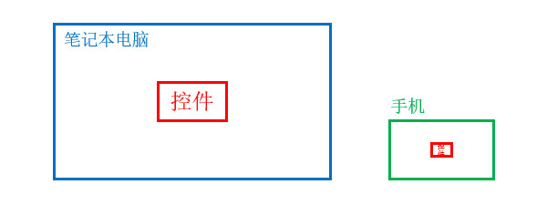
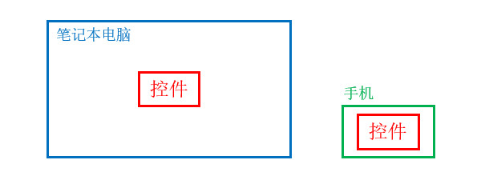

<!-- TODO
# 简介


资源类型：


```text
res
├── anim
├── layout
├── drawable
├── drawable-hdpi
├── drawable-xdpi
├── drawable-xxdpi
└── values
    ├── colors.xml
    ├── strings.xml
    └── styles.xml
```


anim
- `layout` : 存放布局文件。
- `mipmap` : 存放矢量图片文件。
- `drawable` : 存放矢量图片文件。
- `drawable-hdpi` : 存放图片文件。
- `values` : 字符串、颜色、样式等。该目录中的文件最终都会整合为一个XML，其中的资源

mipmap


- [🔗 Android官方文档 - 应用程序资源](https://developer.android.com/guide/topics/resources/providing-resources)
- [🔗 Android官方文档 - 资源类型概览](https://developer.android.com/guide/topics/resources/available-resources)


本章示例代码详见以下链接：

- [🔗 示例工程：概述](https://github.com/BI4VMR/Study-Android/tree/master/M03_UI/C02_Resource/S01_Base)

-->

# 尺寸计量单位
## DP
密度无关像素(Density Independent Pixel, DIP)也被称为DP，是Android中特有的尺寸单位，它能够根据屏幕的像素密度(PPI)自动进行缩放，使控件在不同屏幕上的尺寸尽可能地保持一致，以便适配多种设备。

Android根据PPI范围定义了几个缩放倍率，详见下文表格：

<div align="center">

|   PPI范围    | PPI等级  | 缩放倍率 |
| :----------: | :------: | :------: |
|  `(0, 120]`  |  `ldpi`  |   0.75   |
| `(120, 160]` |  `mdpi`  |    1     |
| `(160, 240]` |  `hdpi`  |   1.5    |
| `(240, 320]` |  `xdpi`  |    2     |
| `(320, 480]` | `xxdpi`  |    3     |
| `(480, 640]` | `xxxdpi` |    4     |

</div>

PPI是屏幕的物理属性，系统会根据PPI值选择对应的缩放倍率，计算DP对应的PX值。 `mdpi` 是一个基准倍率，如果屏幕的PPI在此范围内，"1dp"恰好等于"1px"，此时系统不必进行缩放；如果屏幕的PPI在 `(240, 320]` 范围内，"1dp"将被转换为"2px"。

🔴 示例一：比较DP与PX在不同屏幕上的显示效果。

在本示例中，我们在两款常见的设备上显示矩形，分别比较使用DP与PX作计量单位时的显示效果。

下文表格列出了测试设备的屏幕参数：

<div align="center">

|  设备名称  |  分辨率   | 屏幕尺寸 |  PPI   | DP缩放倍率 |
| :--------: | :-------: | :------: | :----: | :--------: |
| 笔记本电脑 | 1920*1080 |  16英寸  | 137.68 |    1倍     |
|    手机    | 1920*1080 |  6英寸   | 367.15 |    3倍     |

</div>

第一步，我们在界面上放置一个宽高为 `480px * 270px` 的矩形，显示效果如下文图片所示：

<div align="center">



</div>

笔记本电脑的屏幕分辨率与手机相同，且物理尺寸大约相差3倍，因此该控件在电脑上能够被用户看清，但在手机上显得较小，其中的文本难以辨认。

第二步，我们在界面上放置一个宽高为 `480dp * 270dp` 的矩形，显示效果如下文图片所示：

<div align="center">



</div>

根据PPI与缩放倍率的映射规则，控件在手机上将被放大3倍，实际尺寸为 `1440px * 810px` ，与笔记本电脑屏幕上的控件尺寸接近，因此其中的文本不会变得难以辨认。

## SP
受缩放影响的密度无关像素(Scaled Density, SP)主要用于设置文本的尺寸，默认情况下"1sp"等同于"1dp"。用户可以在系统设置中调整文本的缩放倍率，此时最终的倍率为：

$$
SP缩放倍率 = DP缩放倍率 * 文本缩放倍率
$$

## 单位转换 TODO
我们经常需要在不同的尺寸计量单位之间进行转换，此时可以通过 `Resources.getSystem().getDisplayMetrics()` 获取当前屏幕的DisplayMetrics对象，再通过该对象获取屏幕尺寸与缩放倍率等参数，并进行计算。


🔴 示例二：获取设备屏幕的相关参数。

在本示例中，我们在两款常见的设备上显示矩形，分别比较使用DP与PX作计量单位时的显示效果。


        DisplayMetrics dm = Resources.getSystem().getDisplayMetrics();
        Log.i(TAG, "屏幕宽度：" + dm.widthPixels);
        Log.i(TAG, "屏幕高度：" + dm.heightPixels);
        Log.i(TAG, "像素密度：" + dm.densityDpi);
        Log.i(TAG, "缩放倍率(DP)：" + dm.density);
        Log.i(TAG, "缩放倍率(SP)：" + dm.scaledDensity);


多显示器环境
        // 创建一个空的DisplayMetrics对象
        // DisplayMetrics dm = new DisplayMetrics();
        // 以当前Context所关联的显示器设置DisplayMetrics参数
        // context.getDisplay().getRealMetrics(dm);


🔴 示例三：比较DP与PX在不同屏幕上的显示效果。

在本示例中，我们在两款常见的设备上显示矩形，分别比较使用DP与PX作计量单位时的显示效果。
    {
        Log.i(TAG, "100dp -> ?px: " + dpToPX(100));
        Log.i(TAG, "100dp -> ?sx: " + spToPX(100));
        Log.i(TAG, "300px -> ?dp: " + pxToDP(300));
        Log.i(TAG, "300px -> ?sp: " + pxToSP(300));
    }

    // 将DP转换为PX
    public static int dpToPX(float dpValue) {
        // "applyDimension()"方法用于将指定的非标准单位转换为像素
        float rawValue = TypedValue.applyDimension(TypedValue.COMPLEX_UNIT_DIP, dpValue, Resources.getSystem().getDisplayMetrics());
        // 物理像素不可能为小数，因此保留整数部分即可。
        return Math.round(rawValue);
    }

    // 将SP转换为PX
    public static int spToPX(float spValue) {
        float rawValue = TypedValue.applyDimension(TypedValue.COMPLEX_UNIT_SP, spValue, Resources.getSystem().getDisplayMetrics());
        return Math.round(rawValue);
    }

    // 将PX转换为DP
    public static int pxToDP(int pxValue) {
        // 获取缩放倍率
        float density = Resources.getSystem().getDisplayMetrics().density;
        return Math.round(pxValue / density);
    }

    // 将PX转换为SP
    public static int pxToSP(int pxValue) {
        // 获取字体缩放倍率
        float density = Resources.getSystem().getDisplayMetrics().scaledDensity;
        return Math.round(pxValue / density);
    }

    注意上述方法均使用设备的主显示器参数进行转换，如果需要支持多显示器，需要使用目标显示器的Context获取DM后进行计算。
    