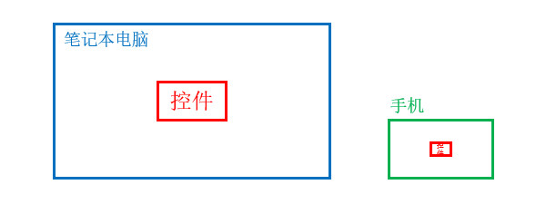

# 简介
Android工程中的资源(Resource)泛指一切非逻辑代码的静态内容，例如：字符串、布局描述文件、位图、矢量图等。

资源文件都被统一放置在模块的 `res` 目录中，由于资源的类型非常丰富，为了便于管理，我们还需要进一步划分子目录。

下文代码块展示了常见的资源目录与文件：

```text
Module
├── src
│   └── 源代码...
└── res
    ├── drawable
    ├── drawable-mdpi
    ├── drawable-hdpi
    ├── drawable-xdpi
    ├── layout
    └── values
        ├── colors.xml
        ├── strings.xml
        └── styles.xml
```

下文内容将对上述目录与文件进行说明：

🔷 `drawable`

该目录用于放置矢量图描述文件，包括Shape、Selector、".9.png"格式的图片等。

🔷 `drawable-mdpi` 等

这些目录用于放置位图，目录名称中的后缀指明了像素密度，系统将会选择与屏幕最匹配的图片并加载；因此我们需要根据目标设备尺寸制作对应的素材，避免图片尺寸过大导致内存占用较高，或图片尺寸过小导致被缩放后变得模糊。

🔷 `layout` 

该目录用于放置布局描述文件。

🔷 `values`

该目录用于放置字符串、颜色、样式等资源。

该目录较为特殊，其中的资源在编译生成APK后都会被整合到同一个XML文件中，因此我们可以创建任意名称的XML文件用于区分不同用途的资源。

下文列表展示了一些约定俗称的资源文件名称：

- `arrays.xml` : 常量数组。
- `colors.xml` : 颜色。
- `dimens.xml` : 尺寸。
- `strings.xml` : 字符串。
- `styles.xml` : 样式。

<br />

本章的相关知识可以参考以下链接：

- [🔗 Android官方文档 - 应用程序资源](https://developer.android.com/guide/topics/resources/providing-resources)
- [🔗 Android官方文档 - 资源类型概览](https://developer.android.com/guide/topics/resources/available-resources)

本章的示例工程详见以下链接：

- [🔗 示例工程：概述](https://github.com/BI4VMR/Study-Android/tree/master/M03_UI/C02_Resource/S01_Base)

# 尺寸计量单位
## DP
密度无关像素(Density Independent Pixel, DIP)也被称为DP，是Android中特有的尺寸单位，它能够根据屏幕的像素密度(PPI)自动进行缩放，使控件在不同屏幕上的尺寸尽可能地保持一致，以便适配多种设备。

Android根据PPI范围定义了几个缩放倍率，详见下文表格：

<div align="center">

|   PPI范围    | PPI等级  | 缩放倍率 |
| :----------: | :------: | :------: |
|  `(0, 120]`  |  `ldpi`  |   0.75   |
| `(120, 160]` |  `mdpi`  |    1     |
| `(160, 240]` |  `hdpi`  |   1.5    |
| `(240, 320]` |  `xdpi`  |    2     |
| `(320, 480]` | `xxdpi`  |    3     |
| `(480, 640]` | `xxxdpi` |    4     |

</div>

PPI是屏幕的物理属性，系统会根据PPI值选择对应的缩放倍率，计算DP对应的PX值。 `mdpi` 是一个基准倍率，如果屏幕的PPI在此范围内，"1dp"恰好等于"1px"，此时系统不必进行缩放；如果屏幕的PPI在 `(240, 320]` 范围内，"1dp"将被转换为"2px"。

🔴 示例一：比较DP与PX在不同屏幕上的显示效果。

在本示例中，我们在两款常见的设备上显示矩形，分别以DP与PX作为计量单位，并比较它们的显示效果。

下文表格列出了测试设备的屏幕参数：

<div align="center">

|  设备名称  |  分辨率   | 屏幕尺寸 |  PPI   | DP缩放倍率 |
| :--------: | :-------: | :------: | :----: | :--------: |
| 笔记本电脑 | 1920*1080 |  16英寸  | 137.68 |    1倍     |
|    手机    | 1920*1080 |  6英寸   | 367.15 |    3倍     |

</div>

第一步，我们在界面上放置一个宽高为 `480px * 270px` 的矩形，显示效果如下文图片所示：

<div align="center">



</div>

笔记本电脑的屏幕分辨率与手机相同，且物理尺寸大约相差3倍，因此该控件在电脑上能够被用户看清，但在手机上显得较小，其中的文本难以辨认。

第二步，我们在界面上放置一个宽高为 `480dp * 270dp` 的矩形，显示效果如下文图片所示：

<div align="center">


</div>

根据PPI与缩放倍率的映射规则，控件在手机上将被放大3倍，实际尺寸为 `1440px * 810px` ，与笔记本电脑屏幕上的控件尺寸接近，因此其中的文本不会变得难以辨认。

## SP
受缩放影响的密度无关像素(Scaled Density, SP)主要用于设置文本的尺寸，默认情况下"1sp"等同于"1dp"。用户可以在系统设置中调整文本的缩放倍率，此时最终的倍率为：

$$
SP缩放倍率 = DP缩放倍率 * 文本缩放倍率
$$

## 单位转换
当需要在不同的尺寸单位之间相互转换时，我们可以使用DisplayMetrics对象获取屏幕尺寸与缩放倍率等参数，再进行计算。

我们可以通过以下方式获取DisplayMetrics对象：

🔷 单显示器环境

这种方式可以获取主显示器的DisplayMetrics对象，并不依赖Context，适用于只有单个屏幕的工程。

```java
DisplayMetrics dm = Resources.getSystem().getDisplayMetrics()
```

🔷 多显示器环境

这种方式依赖当前界面组件的Context对象，因此能够支持多个屏幕。

```java
// 创建一个空的DisplayMetrics对象
DisplayMetrics dm = new DisplayMetrics();
// 使用当前Context所关联的显示器设置DisplayMetrics参数
context.getDisplay().getRealMetrics(dm);
```

<br />

下文示例展示了DisplayMetrics对象包含的信息：

🟠 示例二：获取设备屏幕的相关参数。

在本示例中，我们获取设备主显示器的DisplayMetrics对象，并查看相关参数。

"TestUIBase.java":

```java
DisplayMetrics dm = Resources.getSystem().getDisplayMetrics();
Log.i(TAG, "屏幕宽度：" + dm.widthPixels);
Log.i(TAG, "屏幕高度：" + dm.heightPixels);
Log.i(TAG, "像素密度：" + dm.densityDpi);
Log.i(TAG, "缩放倍率(DP)：" + dm.density);
Log.i(TAG, "缩放倍率(SP)：" + dm.scaledDensity);
```

上述内容也可以使用Kotlin语言编写：

"TestUIBase.kt":

```kotlin
val dm = Resources.getSystem().displayMetrics
Log.i(TAG, "屏幕宽度：${dm.widthPixels}")
Log.i(TAG, "屏幕高度：${dm.heightPixels}")
Log.i(TAG, "像素密度：${dm.densityDpi}")
Log.i(TAG, "缩放倍率(DP)：${dm.density}")
Log.i(TAG, "缩放倍率(SP)：${dm.scaledDensity}")
```

此时运行示例程序，并查看控制台输出信息：

```text
08-24 22:45:35.485 27731 27731 I TestApp: 屏幕宽度：1080
08-24 22:45:35.485 27731 27731 I TestApp: 屏幕高度：2160
08-24 22:45:35.485 27731 27731 I TestApp: 像素密度：480
08-24 22:45:35.485 27731 27731 I TestApp: 缩放倍率(DP)：3.0
08-24 22:45:35.485 27731 27731 I TestApp: 缩放倍率(SP)：3.0
```

在上述示例中，我们已经知悉设备屏幕的像素密度与缩放倍率参数，此时便可进行单位转换了。

🟡 示例三：DP、SP与PX之间的相互转换。

在本示例中，我们实现DP、SP与PX之间的转换方法。

"TestUIBase.java":

```java
// 将DP转换为PX
public static int dpToPX(float dpValue) {
    // "applyDimension()"方法用于将指定的非标准单位转换为像素
    float rawValue = TypedValue.applyDimension(TypedValue.COMPLEX_UNIT_DIP, dpValue, Resources.getSystem().getDisplayMetrics());
    // 物理像素不可能为小数，因此保留整数部分即可。
    return Math.round(rawValue);
}

// 将SP转换为PX
public static int spToPX(float spValue) {
    float rawValue = TypedValue.applyDimension(TypedValue.COMPLEX_UNIT_SP, spValue, Resources.getSystem().getDisplayMetrics());
    return Math.round(rawValue);
}

// 将PX转换为DP
public static int pxToDP(int pxValue) {
    // 获取缩放倍率
    float density = Resources.getSystem().getDisplayMetrics().density;
    return Math.round(pxValue / density);
}

// 将PX转换为SP
public static int pxToSP(int pxValue) {
    // 获取字体缩放倍率
    float density = Resources.getSystem().getDisplayMetrics().scaledDensity;
    return Math.round(pxValue / density);
}
```

上述内容也可以使用Kotlin语言编写：

"TestUIBase.kt":

```kotlin
// 将DP转换为PX
private fun dpToPX(dpValue: Float): Int {
    val dm: DisplayMetrics = Resources.getSystem().displayMetrics
    // "applyDimension()"方法用于将指定的单位转换为像素
    val rawValue: Float = TypedValue.applyDimension(TypedValue.COMPLEX_UNIT_DIP, dpValue, dm)
    // 物理像素不可能为小数，因此保留整数部分即可。
    return rawValue.roundToInt()
}

// 将SP转换为PX
private fun spToPX(spValue: Float): Int {
    val dm = Resources.getSystem().displayMetrics
    val rawValue = TypedValue.applyDimension(TypedValue.COMPLEX_UNIT_SP, spValue, dm)
    return rawValue.roundToInt()
}

// 将PX转换为DP
private fun pxToDP(pxValue: Int): Int {
    // 获取DP缩放倍率
    val density = Resources.getSystem().displayMetrics.density
    return (pxValue / density).roundToInt()
}

// 将PX转换为SP
private fun pxToSP(pxValue: Int): Int {
    // 获取SP缩放倍率
    val density = Resources.getSystem().displayMetrics.scaledDensity
    return (pxValue / density).roundToInt()
}
```

此时运行示例程序，并查看控制台输出信息：

```text
08-24 22:46:58.015 27731 27731 I TestApp: 100dp -> ?px: 300
08-24 22:46:58.015 27731 27731 I TestApp: 100dp -> ?sx: 300
08-24 22:46:58.015 27731 27731 I TestApp: 300px -> ?dp: 100
08-24 22:46:58.015 27731 27731 I TestApp: 300px -> ?sp: 100
```

> 🚩 提示
>
> 上述代码中的DisplayMetrics对象均为主显示器的参数，如果还需要支持多显示器，我们可以新增Context参数并获取DisplayMetrics对象。

<!-- TODO
# 引用资源
-->
