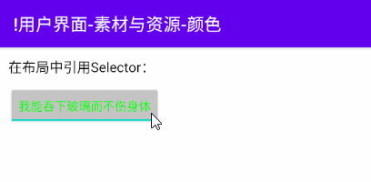

# 简介
本章介绍了颜色与颜色选择器资源的管理与使用方法。

本章的示例工程详见以下链接：

- [🔗 示例工程：颜色资源](https://github.com/BI4VMR/Study-Android/tree/master/M03_UI/C02_Resource/S03_Color)

# 基本应用
下文示例展示了颜色资源的基本用法：

🔴 示例一：定义并使用颜色资源。

在本示例中，我们定义一些颜色资源，并将其通过XML属性设置到TextView中。

第一步，我们在 `<模块根目录>/src/main/res/values/` 目录中创建一个颜色资源XML文件 `colors.xml` ，然后在其中添加一条名为"color_sample"的颜色资源。

"colors.xml":

```xml
<?xml version="1.0" encoding="utf-8"?>
<resources>
    <!-- 定义颜色资源 -->
    <color name="color_sample">#00FFFF</color>

    <!-- 定义颜色资源（引用另一个颜色资源） -->
    <color name="color_default">@android:color/black</color>
</resources>
```

该文件中定义的颜色值可以使用16进制ARGB格式表示，例如 `#FFFF0000` 分别对应 `#AARRGGBB` ，表示不透明的红色；当透明度值为"FF"（不透明）时，我们可以将其省略，因此 `#FFFF0000` 可以简写为 `#FF0000` ；当每个色值的两个字符均相同时，我们可以将其缩写为一个字符，因此 `#FFFF0000` 也可以简写为 `#F00` 。

在定义颜色资源时，除了直接书写色值，我们还可以引用另一个颜色资源，正如前文示例代码中的"color_default"项所示。

第二步，我们在布局文件中引用该资源，将其设置到TextView的文本属性上。

"testui_base.xml":

```xml
<TextView
    android:layout_width="wrap_content"
    android:layout_height="wrap_content"
    android:text="我能吞下玻璃而不伤身体。"
    android:textColor="@color/color_sample" />
```

在ID引用语句 `@color/<资源名称>` 中， `@color` 表示这是一个字符串资源，其后跟随资源的名称。

当程序运行时，TextView的文本颜色将会变为颜色资源"color_sample"对应的颜色。

🟠 示例二：在代码中使用颜色资源。

在本示例中，我们通过逻辑代码获取前文“示例一”定义的颜色资源"color_sample"，并将其设置到TextView中。

"TestUIBase.java":

```java
// 通过Resources实例获取颜色资源
int colorValue = ContextCompat.getColor(getApplicationContext(), R.color.color_sample);
// 将颜色设置到控件上
tvRefColorInCode.setTextColor(colorValue);
```

上述内容也可以使用Kotlin语言编写：

"TestUIBase.kt":

```kotlin
// 通过Resources实例获取字符串
val colorValue: Int = ContextCompat.getColor(applicationContext, R.color.color_sample)
// 将字符串设置到控件上
tvRefColorInCode.setTextColor(colorValue)
```

Resources类的 `getColor()` 方法已经被废弃，我们应该通过ContextCompat类的静态方法 `int getColor(Context context, int resID)` 获取颜色资源。

控件所接受的色值通常为整型格式（例如上述示例中TextView的 `setTextColor()` 方法），我们可以使用Color类将其他格式的色值转换为整型格式。除此之外，Color类还预置了一些颜色常量可供调用。

🟡 示例三：使用Color类转换色值。

在本示例中，我们通过不同的形式表示颜色，并将它们设置到TextView中。

"TestUIBase.java":

```java
// 使用16进制表示色值
textview1.setTextColor(0xFFFF0000);
// 使用Color类预定义的色值
textview2.setTextColor(Color.GREEN);
// 使用Color类转换10进制格式的色值
textview3.setTextColor(Color.argb(255, 255, 255, 0));
// 使用Color类转换字符串格式的色值
textview4.setTextColor(Color.parseColor("#0000FF"));
```

Color类的静态方法 `parseColor()` 唯一参数为字符串，能够将16进制ARGB或RGB格式的色值转为整型色值。

Color类的静态方法 `argb()` 参数依次为ARGB通道的10进制数值，能够将10进制ARGB格式的色值转为色值。

上述内容也可以使用Kotlin语言编写：

"TestUIBase.kt":

```kotlin
// 使用16进制表示色值（Kotlin不支持这种方式）
// textview1.setTextColor(0xFFFF0000)
// 使用Color类预定义的色值
textview2.setTextColor(Color.GREEN)
// 使用Color类转换10进制格式的色值
textview3.setTextColor(Color.argb(255, 255, 255, 0))
// 使用Color类转换字符串格式的色值
textview4.setTextColor(Color.parseColor("#0000FF"))
```

# ColorStateList
## 简介
有时我们需要根据控件的状态设置颜色资源，例如：在CheckBox选中与未选中时分别设置不同的文本颜色。我们可以监听控件状态并通过逻辑代码切换色值，但这种方式较为繁琐，我们应当使用ColorStateList实现此类功能。

ColorStateList也被称为Selector，其中预先配置了控件在各种状态下的颜色资源，当控件状态改变时，将会自动应用对应的色值。

## 基本应用
下文示例展示了ColorStateList的基本用法：

🟢 示例四：定义并使用ColorStateList。

在本示例中，我们通过ColorStateList定义不同状态下的色值，并将它设置到ToggleButton中。

第一步，我们在 `<模块根目录>/src/res/color/` 目录中创建一个ColorStateList描述文件 `selector_sample.xml` ，然后在其中设置默认状态与选中状态的颜色。

"selector_sample.xml":

```xml
<?xml version="1.0" encoding="utf-8"?>
<selector xmlns:android="http://schemas.android.com/apk/res/android">
    <item android:color="#00FF00" android:state_checked="true" />
    <item android:color="#FF4400" />
</selector>
```

ColorStateList与控件相关联后，每当状态发生变化，将会按照从上到下的顺序进行匹配，若匹配到某条语句则应用色值且不再继续向下匹配，因此我们需要将无状态的默认值放置在列表末尾。

第二步，ColorStateList将在R文件中生成对应的ID，我们可以在布局文件中通过ID引用它。

"testui_selector.xml":

```xml
<ToggleButton
    android:layout_width="wrap_content"
    android:layout_height="wrap_content"
    android:layout_marginStart="10dp"
    android:textColor="@color/selector_sample"
    android:textOff="我能吞下玻璃而不伤身体"
    android:textOn="我能吞下玻璃而不伤身体" />
```

此处我们将ColorStateList设置给ToggleButton控件的文本颜色属性。

此时运行示例程序，并查看界面外观：

<div align="center">



</div>

🔵 示例五：定义组合状态。

在前文“示例四”中，我们只定义了“选中”与“非选中”两种状态的色值；如果我们还需要定义更多的状态，可以使用组合状态。

在本示例中，我们编写一个ColorStateList，并为“是否选中”、“是否启用”两个状态分别设置不同的色值。

"selector_sample2.xml":

```xml
<?xml version="1.0" encoding="utf-8"?>
<selector xmlns:android="http://schemas.android.com/apk/res/android">
    <!-- 禁用且选中 -->
    <item android:color="#00FFFF" android:state_checked="true" android:state_enabled="false" />
    <!-- 禁用且未选中 -->
    <item android:color="#FF00FF" android:state_checked="false" android:state_enabled="false" />
    <!-- 启用且选中 -->
    <item android:color="#00FF00" android:state_checked="true" />
    <!-- 启用且未选中 -->
    <item android:color="#FF4400" />
</selector>
```

🟣 示例六：在代码中使用ColorStateList。

在本示例中，我们通过逻辑代码获取前文“示例四”定义的ColorStateList，并将其设置到ToggleButton中。

"TestUISelector.java":

```java
// 通过Resources实例获取Selector资源
ColorStateList colorStateList = ContextCompat.getColorStateList(getApplicationContext(), R.color.selector_sample);
// 将Selector设置到控件上
button.setTextColor(colorStateList);
```

上述内容也可以使用Kotlin语言编写：

"TestUISelector.kt":

```kotlin
// 通过Resources实例获取Selector资源
val colorStateList: ColorStateList? =
    ContextCompat.getColorStateList(applicationContext, R.color.selector_sample)
colorStateList?.let {
    // 将Selector设置到控件上
    button.setTextColor(it)
}
```

# 附录
## 透明度与16进制值对照表
下文表格包含透明度与对应的16进制值对应关系：

<div align="center">

| 透明度 | 16进制值 |
| :----: | :------: |
|  100%  |    00    |
|  99%   |    03    |
|  98%   |    05    |
|  97%   |    07    |
|  96%   |    0A    |
|  95%   |    0D    |
|  94%   |    0F    |
|  93%   |    12    |
|  92%   |    14    |
|  91%   |    17    |
|  90%   |    1A    |
|  89%   |    1C    |
|  88%   |    1E    |
|  87%   |    21    |
|  86%   |    24    |
|  85%   |    26    |
|  84%   |    29    |
|  83%   |    2B    |
|  82%   |    2E    |
|  81%   |    30    |
|  80%   |    33    |
|  79%   |    36    |
|  78%   |    38    |
|  77%   |    3B    |
|  76%   |    3D    |
|  75%   |    40    |
|  74%   |    42    |
|  73%   |    45    |
|  72%   |    47    |
|  71%   |    4A    |
|  70%   |    4D    |
|  69%   |    4F    |
|  68%   |    52    |
|  67%   |    54    |
|  66%   |    57    |
|  65%   |    59    |
|  64%   |    5C    |
|  63%   |    5E    |
|  62%   |    61    |
|  61%   |    63    |
|  60%   |    66    |
|  59%   |    69    |
|  58%   |    6B    |
|  57%   |    6E    |
|  56%   |    70    |
|  55%   |    73    |
|  54%   |    75    |
|  53%   |    78    |
|  52%   |    7A    |
|  51%   |    7D    |
|  50%   |    80    |
|  49%   |    82    |
|  48%   |    85    |
|  47%   |    87    |
|  46%   |    8A    |
|  45%   |    8C    |
|  44%   |    8F    |
|  43%   |    91    |
|  42%   |    94    |
|  41%   |    96    |
|  40%   |    99    |
|  39%   |    9C    |
|  38%   |    9E    |
|  37%   |    A1    |
|  36%   |    A3    |
|  35%   |    A6    |
|  34%   |    A8    |
|  33%   |    AB    |
|  32%   |    AD    |
|  31%   |    B0    |
|  30%   |    B3    |
|  29%   |    B5    |
|  28%   |    B8    |
|  27%   |    BA    |
|  26%   |    BD    |
|  25%   |    BF    |
|  24%   |    C2    |
|  23%   |    C4    |
|  22%   |    C7    |
|  21%   |    C9    |
|  20%   |    CC    |
|  19%   |    CF    |
|  18%   |    D1    |
|  17%   |    D4    |
|  16%   |    D6    |
|  15%   |    D9    |
|  14%   |    DB    |
|  13%   |    DE    |
|  12%   |    E0    |
|  11%   |    E3    |
|  10%   |    E6    |
|   9%   |    E8    |
|   8%   |    EB    |
|   7%   |    ED    |
|   6%   |    F0    |
|   5%   |    F2    |
|   4%   |    F5    |
|   3%   |    F7    |
|   2%   |    FA    |
|   1%   |    FC    |
|   0%   |    FF    |

</div>
