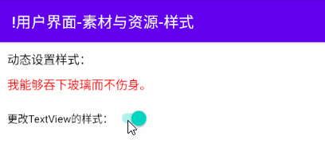

# 简介
样式(Style)是一组预先定义的属性，例如：文本字体、文本颜色、控件背景素材等，我们可以将样式应用到多个控件上，以减少重复代码。

SDK内置的样式定义在 `<Android SDK路径>\platforms\<API版本>\data\res\values\styles.xml` 文件中，我们可以直接调用它们。

主题(Theme)与样式的定义语法相同，但作用范围不同。样式通常用于描述界面元素（例如：View）的外观；而主题则用于描述界面整体（例如：Activity、Dialog、View）的外观。控件的样式遵循“局部优于全局”的原则，当我们没有为控件定义样式时，默认采用主题中的样式；当我们为控件定义了样式后，该样式将会取代主题中的样式。

SDK内置的主题定义在 `<Android SDK路径>\platforms\<API版本>\data\res\values\themes.xml` 文件中，我们可以直接调用它们。

# 基本应用
下文内容展示了样式的基本使用方法。

🔴 示例一：样式的基本应用。

在本示例中，我们定义一些自定义样式，并在布局文件中使用它们。

第一步，我们在当前模块的 `res` 目录下创建 `values/styles.xml` 文件，并填入以下代码块中的内容：

"styles.xml":

```xml
<resources>
    <!-- 定义样式：自定义文本 -->
    <style name="MyText" />

    <!-- 定义样式：普通文本 -->
    <style name="MyText.Normal">
        <item name="android:textColor">@color/black</item>
        <item name="android:textSize">16sp</item>
    </style>

    <!-- 定义样式：强调文本 -->
    <style name="MyText.Emphasize" parent="MyText.Normal">
        <!-- 定义颜色属性，覆盖普通文本中的值。 -->
        <item name="android:textColor">#FF0000</item>
    </style>
</resources>
```

在上述代码中，我们定义了普通文本(MyText.Normal)和强调文本(MyText.Emphasize)两个样式，其中普通文本颜色为黑色、字号为"16sp"；强调文本继承自普通文本，因此它的字号也是"16sp"，我们为强调文本指定了文本颜色为红色，该属性将会取代父样式中定义的黑色，因此最终强调文本颜色为红色、字号为"16sp"。

样式名称中的点( `.` )具有特殊含义，它表明了默认继承关系，在上述代码中， `MyText.Normal` 样式没有通过 `parent="<样式>"` 属性声明父样式，因此继承自 `MyText` 样式。当我们声明此类具有继承关系的样式时，即使父样式没有任何属性，也不能省略定义语句，否则子样式就会因为无法识别父样式导致编译失败。

第二步，我们创建一个测试Activity，并在其布局XML文件中放置两个TextView，分别应用第一步中声明的两个样式。

"testui_base.xml":

```xml
<!-- 此处省略部分代码... -->
<LinearLayout ...>
    <TextView
        style="@style/MyText.Normal"
        android:layout_width="wrap_content"
        android:layout_height="wrap_content"
        android:text="我能够吞下玻璃而不伤身。" />

    <TextView
        style="@style/MyText.Emphasize"
        android:layout_width="wrap_content"
        android:layout_height="wrap_content"
        android:text="我能够吞下玻璃而不伤身。" />
</LinearLayout>
```

我们可以通过 `style="@style/<样式名称>"` 属性为布局中的控件应用自定义样式。

此时运行示例程序，并查看界面外观：

<div align="center">


</div>

文本类控件提供了 `setTextAppearance()` 方法，我们可以调用该方法动态设置控件的样式。对于其他控件，Android没有提供设置样式的方法。

🟠 示例二：在代码中使用样式资源。

在本示例中，我们在代码中为TextView控件设置样式。

我们在测试Activity中放置TextView与Switch控件，当Switch控件的状态为开启时，将TextView设置为强调文本样式；当Switch控件的状态为关闭时，将TextView设置为普通文本样式。

"TestUIBase.java":

```java
// 动态设置样式
switch.setOnCheckedChangeListener((buttonView, isChecked) -> {
    if (isChecked) {
        textview.setTextAppearance(R.style.MyText_Emphasize);
    } else {
        textview.setTextAppearance(R.style.MyText_Normal);
    }
});
```

在上述代码中，我们通过 `R.style.MyText_Normal` 访问资源文件中的样式资源，样式名称中的点( `.` )需要替换为下划线( `_` )。

此时运行示例程序，并查看界面外观：

<div align="center">



</div>
