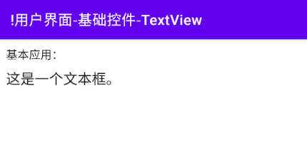

# 简介
TextView是最常见的控件，它是一种文本框，用于向用户展示文本类信息。

# 基本应用
TextView在布局文件中的典型配置如下文代码块所示：

"testui_base.xml":

```xml
<TextView
    android:layout_width="wrap_content"
    android:layout_height="wrap_content"
    android:text="这是一个文本框。" />
```

此时运行示例程序，并查看界面外观：

<div align="center">



</div>

# 外观定制
## 基本样式
### 文本内容
以下属性与方法用于获取与设置文本框中的文字内容。

- XML属性 : `android:text="<文本内容 | 字符串资源ID>"`
- Java方法 : `void setText(CharSequence text)`
- Java方法 : `CharSequence getText()`

设置文本时，我们可以直接填入文本内容，但系统并不推荐这样做，将会产生硬编码(HardcodedText)警告。我们应当将内容写入到 `res/values/strings.xml` 等文件中，然后在此处引用其资源ID，系统将根据语言环境自动选择合适的文本，以实现多语言适配。
<!-- TODO -->
### 文本字号
以下属性与方法用于获取与设置文本框中的文本字号。

- XML属性 : `android:textSize="<尺寸>"`
- Java方法 : `void setTextSize(float size)`
- Java方法 : `void setTextSize(int unit, float size)`
- Java方法 : `float getTextSize()`
- Java方法 : `int getTextSizeUnit()`


### 文本颜色


🔷 `android:textSize="<字号>"`

该属性用于控制文本的字号，推荐使用单位"sp"。

🔷 `android:textColor="<颜色>"`

该属性用于控制文本的颜色，可以引用 `res/values/colors.xml` 中定义的值，也可以使用十六进制RGB格式表示，例如"#XXX"中的X分别表示8位精度的RGB颜色，"#XYXYXY"中的每组XY分别表示16位精度的RGB颜色。

🔷 `android:gravity="< left | right | start | end | top | bottom | center >"`

设置文本框内部文本的对齐方式，默认执行左对齐与顶部对齐。

🔷 `android:textStyle="< normal | bold | italic >"`

设置文本的字体样式。

取值为"normal"时显示为普通样式，是默认值；取值为"bold"时显示为粗体，取值为"italic"时显示为斜体。

🔷 `android:textScaleX="<倍数>"`

设置文本的水平拉伸倍数。

## 行数控制
🔶 `android:lines="<行数>"`

设置文本框的固定行数。

文本行数不足时，将使用空行填充直至填满文本框的高度，文本行数过多时，则截断超出的内容。

🔶 `android:maxLines="<行数>"`

限制文本框最大行数，文本行数超出该值的内容被截断。

🔶 `android:minLines="<行数>"`

限制文本框最小行数，文本行数小于该值时，使用空行填充。

🔶 `android:ellipsize="< start | end | middle | marquee >"`

设置内容长度超出控件宽高时的显示方式。

取值为"start|end|middle"时分别在相应位置显示"..."；取值为"marquee"时为滚动显示效果，此时还需设置属性 `android:singleLine="true"` ，并且要在逻辑代码中进行相应的设置，详见后文小节  [🧭 滚动显示](#滚动显示) 。

## 超链接
🔷 `android:autoLink="[none|web|email|phone|all]"`

指定文本链接类型。

标记文本为指定类型的链接，用户单击该文本后系统将调用对应的软件打开链接。

🔷 `android:textColorLink="[颜色]"`

设置文本在链接状态时的颜色。

## 常用方法
🔶 `void setText(CharSequence text)`

设置文本内容。

本方法可以接受空值，效果等同于传入空字符串。

🔶 `CharSequence getText()`

获取文本内容。

本方法返回值永不为空值，如果 `setText()` 传入空值，将会得到空字符串。

🔶 `int length()`

获取文本长度。

🔶 `void setTextSize(float size)`

设置文本显示字号。

🔶 `void setTextColor(Color color)`

设置文本显示颜色。

# 滚动显示
当文本框只有单行时，屏幕宽度不足以容纳全部的内容，我们可以将文本框设为滚动模式，以便于用户浏览完整的内容。

首先我们在TextView的XML配置中添加 `android:ellipsize="marquee"` 和 `android:singleLine="true"` 属性：

"testui_scroll_display.xml":

```xml
<TextView
    android:id="@+id/tvMarquee"
    android:layout_width="match_parent"
    android:layout_height="wrap_content"
    android:ellipsize="marquee"
    android:singleLine="true" />
```

然后在逻辑代码中调用TextView的 `setSelected()` 方法，将其选中状态置为"true"，滚动效果即可生效。

"TestUIScrollDisplay.java":

```java
// 设置选中状态为"true"，使滚动生效。
tvMarquee.setSelected(true);
```

上述内容也可以使用Kotlin语言进行书写：

"TestUIScrollDisplay.kt":

```kotlin
// 设置选中状态为"true"，使滚动生效。
tvMarquee.isSelected = true
```

此时运行示例程序，并查看界面外观：

<div align="center">


</div>

默认情况下滚动效果将在几个周期后停止，如果我们希望滚动效果无限循环，可以在XML配置中添加属性 `android:marqueeRepeatLimit="marquee_forever"` ，或者在逻辑代码中调用TextView的 `setMarqueeRepeatLimit(-1)` 方法。
