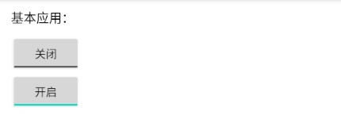

# 简介
ToggleButton是一种自锁按钮，它拥有两种状态：“开启”和“关闭”，用户点击后按钮不会立即弹起，而是保持新的状态，直到再次被点击才会再次切换状态。

本章示例代码详见以下链接：

- [🔗 示例工程：ToggleButton](https://github.com/BI4VMR/Study-Android/tree/master/M03_UI/C03_CtrlBase/S05_ToggleButton)

# 基本应用
ToggleButton在布局文件中的典型配置如下文代码块所示：

"testui_base.xml":

```xml
<ToggleButton
    android:layout_width="wrap_content"
    android:layout_height="wrap_content" />
```

此时运行示例程序，并查看界面外观：

<div align="center">



</div>

# 外观定制
## 基本样式
### 开关状态
以下属性与方法用于获取与设置ToggleButton的开关状态：

- XML - 设置开关状态 : `android:checked="<true | false>"`
- Java - 获取开关状态 : `boolean isChecked()`
- Java - 设置开关状态 : `void setChecked(boolean state)`
- Java - 反转开关状态 : `void toggle()`

### 按钮文本
以下属性与方法用于获取与设置ToggleButton中的文字内容：

- XML - 设置开启时的文本 : `android:textOn="<文本内容 | 字符串资源ID>"`
- XML - 设置关闭时的文本 : `android:textOff="<文本内容 | 字符串资源ID>"`
- Java - 获取开启时的文本 : `CharSequence getTextOn()`
- Java - 设置开启时的文本 : `void setTextOn(CharSequence textOn)`
- Java - 获取关闭时的文本 : `CharSequence getTextOff()`
- Java - 设置关闭时的文本 : `void setTextOff(CharSequence textOff)`

ToggleButton的默认文本内容为"On/Off"或“开启/关闭”等，将会根据系统语言改变。

如果我们不需要显示文本，可以将布局属性设置为"@null"，或者在代码中设置空字符串。

### 按钮图像
有时我们需要移除文本，并且使用自定义的图像素材；此时可以将文本属性设为空，并通过 `android:background="<图像素材>"` 属性改变按钮外观。

此处省略具体实现方法，详见本章示例代码。

# 事件监听器
## OnCheckedChangeListener
当ToggleButton的开关状态发生改变时，将会触发OnCheckedChangeListener监听器。

该监听器仅有一个 `void onCheckedChanged(CompoundButton buttonView, boolean isChecked)` 回调方法，第一参数 `buttonView` 是ToggleButton实例；第二参数 `isChecked` 是新的开关状态。

"TestUIEvent.java":

```java
toggleButton.setOnCheckedChangeListener(new CompoundButton.OnCheckedChangeListener() {

    @Override
    public void onCheckedChanged(CompoundButton buttonView, boolean isChecked) {
        boolean userInput = buttonView.isPressed();
        Log.i(TAG, "OnCheckedChanged. State:[" + isChecked + "] UserInput:[" + userInput + "]");
    }
});
```

当我们调用ToggleButton的 `setChecked(boolean state)` 或 `toggle()` 方法设置开关状态时，回调方法 `onCheckedChanged()` 也会触发，这在某些场景下可能导致逻辑错误。我们可以在回调方法中使用控件的 `isPressed()` 方法判断当前事件是否为用户输入。
