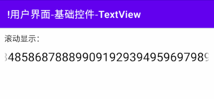
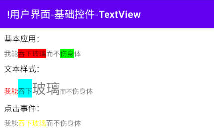

# 简介
TextView是最常见的控件，它是一种文本框，用于向用户展示文本类信息。

# 基本应用
TextView在布局文件中的典型配置如下文代码块所示：

"testui_base.xml":

```xml
<TextView
    android:layout_width="wrap_content"
    android:layout_height="wrap_content"
    android:text="这是一个文本框。" />
```

此时运行示例程序，并查看界面外观：

<div align="center">


</div>

# 外观定制
## 基本样式
### 文本内容
以下属性与方法用于获取与设置TextView中的文字内容：

- XML - 设置文本内容 : `android:text="<文本内容 | 字符串资源ID>"`
- Java - 设置文本内容 : `void setText(CharSequence text)`
- Java - 获取文本内容 : `CharSequence getText()`
- Java - 获取文本长度 : `int length()`

设置文本时，我们可以直接填入文本内容，但系统并不推荐这样做，将会产生硬编码(HardcodedText)警告。我们应当将内容写入到 `res/values/strings.xml` 等文件中，然后在此处引用其资源ID，系统将根据语言环境自动选择合适的文本，以实现多语言适配。

### 文本字号
以下属性与方法用于获取与设置TextView中的文本字号：

- XML - 设置文本尺寸 : `android:textSize="<尺寸>"`
- Java - 设置文本尺寸（单位为"sp"） : `void setTextSize(float size)`
- Java - 设置文本尺寸（指定单位） : `void setTextSize(int unit, float size)`
- Java - 获取文本尺寸 : `float getTextSize()`
- Java - 获取文本尺寸单位 : `int getTextSizeUnit()`

### 文本颜色
以下属性与方法用于获取与设置TextView中的文本字号：

- XML - 设置文本颜色 : `android:textColor="<颜色>"`
- Java - 设置文本颜色 : `void setTextColor(int color)`


### 文本样式


🔷 `android:textStyle="< normal | bold | italic >"`

设置文本的字体样式。

取值为"normal"时显示为普通样式，是默认值；取值为"bold"时显示为粗体，取值为"italic"时显示为斜体。


### 对齐方式


该属性用于控制文本的颜色，可以引用 `res/values/colors.xml` 中定义的值，也可以使用十六进制RGB格式表示，例如"#XXX"中的X分别表示8位精度的RGB颜色，"#XYXYXY"中的每组XY分别表示16位精度的RGB颜色。

🔷 `android:gravity="< left | right | start | end | top | bottom | center >"`

设置文本框内部文本的对齐方式，默认执行左对齐与顶部对齐。

🔷 `android:textScaleX="<倍数>"`

设置文本的水平拉伸倍数。

## 行数控制
🔶 `android:lines="<行数>"`

设置文本框的固定行数。

文本行数不足时，将使用空行填充直至填满文本框的高度，文本行数过多时，则截断超出的内容。

🔶 `android:maxLines="<行数>"`

限制文本框最大行数，文本行数超出该值的内容被截断。

🔶 `android:minLines="<行数>"`

限制文本框最小行数，文本行数小于该值时，使用空行填充。

🔶 `android:ellipsize="< start | end | middle | marquee >"`

设置内容长度超出控件宽高时的显示方式。

取值为"start|end|middle"时分别在相应位置显示"..."；取值为"marquee"时为滚动显示效果，此时还需设置属性 `android:singleLine="true"` ，并且要在逻辑代码中进行相应的设置，详见后文小节  [🧭 滚动显示](#滚动显示) 。

## 超链接


🔷 `android:autoLink="[none|web|email|phone|all]"`

指定文本链接类型。

标记文本为指定类型的链接，用户单击该文本后系统将调用对应的软件打开链接。

🔷 `android:textColorLink="[颜色]"`

设置文本在链接状态时的颜色。


# 滚动显示
当文本框只有单行时，屏幕宽度不足以容纳全部的内容，我们可以将文本框设为滚动模式，以便于用户浏览完整的内容。

首先我们在TextView的XML配置中添加 `android:ellipsize="marquee"` 和 `android:singleLine="true"` 属性：

"testui_scroll_display.xml":

```xml
<TextView
    android:id="@+id/tvMarquee"
    android:layout_width="match_parent"
    android:layout_height="wrap_content"
    android:ellipsize="marquee"
    android:singleLine="true" />
```

然后在逻辑代码中调用TextView的 `setSelected()` 方法，将其选中状态置为"true"，滚动效果即可生效。

"TestUIScrollDisplay.java":

```java
// 设置选中状态为"true"，使滚动生效。
tvMarquee.setSelected(true);
```

上述内容也可以使用Kotlin语言编写：

"TestUIScrollDisplay.kt":

```kotlin
// 设置选中状态为"true"，使滚动生效。
tvMarquee.isSelected = true
```

此时运行示例程序，并查看界面外观：

<div align="center">



</div>

默认情况下滚动效果将在几个周期后停止，如果我们希望滚动效果无限循环，可以在XML配置中添加属性 `android:marqueeRepeatLimit="marquee_forever"` ，或者在逻辑代码中调用TextView的 `setMarqueeRepeatLimit(-1)` 方法。

# 自动文本尺寸
自从Android 8.0开始，系统提供了自动调整文本尺寸的能力，以便用户浏览较长的文本内容。

[text](https://developer.android.google.cn/develop/ui/views/text-and-emoji/autosizing-textview?hl=zh-cn#setting-textview-autosize)

以下属性与方法用于获取与设置TextView中的文本字号：

- XML - 功能开关 : `android:autoSizeTextType="< none | uniform >"`
- XML - 设置最大文本尺寸 : `android:autoSizeMaxTextSize="<尺寸>"`
- XML - 设置文本尺寸 : `android:autoSizeMinTextSize="<尺寸>"`
- XML - 设置文本尺寸 : `android:autoSizeStepGranularity="<尺寸>"`
- Java - 功能开关 : `void setAutoSizeTextTypeWithDefaults(int type)`
- Java - 功能开关 : `void setAutoSizeTextTypeUniformWithConfiguration(int minSize, int maxSize, int stepGranularity, int unit)`


setAutoSizeTextTypeWithDefaults(int autoSizeTextType) 方法。提供AUTO_SIZE_TEXT_TYPE_NONE即可关闭 自动调整大小功能，或 AUTO_SIZE_TEXT_TYPE_UNIFORM 以 均匀缩放水平轴和垂直轴。

注意：均匀缩放的默认尺寸为 minTextSize = 12sp、maxTextSize = 112sp 和 granularity = 1px. 


不能有android:singleLine="true"，如需要限制一行，可以使用android:maxLines="1"

# SpannableString
## 简介
有时我们需要为整段文本中的部分字符设置样式，此时可以通过多个TextView实现，但是这种方式不够灵活，无法适应动态内容的文本，我们推荐使用SpannableString实现该功能。

SpannableString是CharSequence接口的实现类，我们不仅可以在TextView中使用它，也可以在EditText等控件中使用。

## 基本应用
我们首先需要使用SpannableString类的构造方法 `SpannableString(String text)` 创建实例，唯一参数 `text` 为初始文本内容；然后调用 `setSpan()` 方法为文本设置样式，该方法的详情如下文内容所示：

🔶 `void setSpan(Object what, int start, int end, int flags)`

功能简述：

为文本设置样式。

参数列表：

🔺 `what`

样式类型，内置样式名称通常以"Span"结尾。

Span实例不可复用，如果重复使用同一个Span实例，则会导致先前设置的样式被清除。因此即使两处文本的样式完全相同，我们也应当创建两个不同的Span实例。

🔺 `start`

起始位置索引，包括该位置。

🔺 `end`

终止位置索引，不包括该位置。

🔺 `flags`

标志位，用于控制在Span区域前后插入新文本时，是否为它们也应用当前样式。

- `Spanned.SPAN_INCLUSIVE_INCLUSIVE` : 包括起始与结束位置。
- `Spanned.SPAN_INCLUSIVE_EXCLUSIVE` : 包括起始位置，不包括结束位置。
- `Spanned.SPAN_EXCLUSIVE_INCLUSIVE` : 不包括起始位置，包括结束位置。
- `Spanned.SPAN_EXCLUSIVE_EXCLUSIVE` : 不包括起始与结束位置。

该配置项仅对EditText等文本可变的控件生效，在TextView等控件中我们可以传入"0"。

异常情况：

🔺 `RuntimeException`

包括索引越界等异常情况。

<br />

此处我们使用一条示例文本创建SpannableString实例，并为部分字符设置系统内置的“背景颜色样式(BackgroundColorSpan)”。

"TestUISpan.java":

```java
// 示例文本
String text = "我能吞下玻璃而不伤身体";
// 创建SpannableString实例，并设置初始内容。
SpannableString ss1 = new SpannableString(text);

// 设置样式
ss1.setSpan(new BackgroundColorSpan(Color.RED), 2, 6, 0);
ss1.setSpan(new BackgroundColorSpan(Color.GREEN), 8, 10, 0);

// 将SpannableString设置到TextView中
textview.setText(ss1);
```

上述内容也可以使用Kotlin语言编写：

"TestUISpan.kt":

```kotlin
// 示例文本
val text = "我能吞下玻璃而不伤身体"
// 创建SpannableString实例，并设置初始内容。
val ss1 = SpannableString(text)

// 设置样式
ss1.setSpan(BackgroundColorSpan(Color.RED), 2, 6, 0)
ss1.setSpan(BackgroundColorSpan(Color.GREEN), 8, 10, 0)

// 将SpannableString设置到TextView中
textview.text = ss1
```

此时运行示例程序，并查看界面外观：

<div align="center">


</div>

## 文本外观
以下内置样式可以改变文本的外观：

- ForegroundColorSpan : 设置文本的背景颜色。
- BackgroundColorSpan : 设置文本的前景颜色（即文本自身的颜色）。
- RelativeSizeSpan : 设置文本的相对尺寸（相对于原始字号的倍数）。
- AbsoluteSizeSpan : 设置文本的绝对尺寸（单位为像素）。

此处我们使用上述几种样式，设置示例文本中不同字符的外观。

"TestUISpan.java":

```java
// 设置前景色（即文本的颜色）
ForegroundColorSpan foregroundSpan = new ForegroundColorSpan(Color.RED);
// 设置背景色
BackgroundColorSpan backgroundSpan = new BackgroundColorSpan(Color.CYAN);
// 设置尺寸（相对大小：相对原始字号增大2倍）
RelativeSizeSpan relativeSizeSpan = new RelativeSizeSpan(2.0F);
// 设置尺寸（绝对大小：像素）
AbsoluteSizeSpan absoluteSizeSpan = new AbsoluteSizeSpan(30);

SpannableString ss2 = new SpannableString(text);
ss2.setSpan(foregroundSpan, 0, 2, 0);
ss2.setSpan(backgroundSpan, 2, 4, 0);
ss2.setSpan(relativeSizeSpan, 4, 6, 0);
ss2.setSpan(absoluteSizeSpan, 6, 8, 0);

textview2.setText(ss2);
```

上述内容也可以使用Kotlin语言编写：

"TestUISpan.kt":

```kotlin
// 设置前景色（即文本的颜色）
val foregroundSpan = ForegroundColorSpan(Color.RED)
// 设置背景色
val backgroundSpan = BackgroundColorSpan(Color.CYAN)
// 设置尺寸（相对大小：相对原始字号增大2倍）
val relativeSizeSpan = RelativeSizeSpan(2.0F)
// 设置尺寸（绝对大小：像素）
val absoluteSizeSpan = AbsoluteSizeSpan(30)

val ss2 = SpannableString(text)
ss2.setSpan(foregroundSpan, 0, 2, 0)
ss2.setSpan(backgroundSpan, 2, 4, 0)
ss2.setSpan(relativeSizeSpan, 4, 6, 0)
ss2.setSpan(absoluteSizeSpan, 6, 8, 0)

textview2.text = ss2
```

此时运行示例程序，并查看界面外观：

<div align="center">


</div>

## 点击事件
我们可以使用ClickableSpan为文本中的字符添加点击事件，该类中的抽象方法 `onClick()` 即为点击事件回调，我们需要在此处添加自定义逻辑。

"TestUISpan.java":

```java
ClickableSpan clickableSpan = new ClickableSpan() {

    @Override
    public void onClick(@NonNull View widget) {
        /* 设置点击效果 */
        Log.i(TAG, "ClickableSpan-OnClick.");
        Toast.makeText(getApplicationContext(), "已点击文字", Toast.LENGTH_SHORT)
                .show();
    }

    @Override
    public void updateDrawState(@NonNull TextPaint ds) {
        // 设置文本颜色，覆盖默认样式。
        ds.setColor(Color.YELLOW);
        // 设置下划线为不显示，覆盖默认样式。
        ds.setUnderlineText(false);
    }
};
```

上述内容也可以使用Kotlin语言编写：

"TestUISpan.kt":

```kotlin
val clickableSpan: ClickableSpan = object : ClickableSpan() {

    override fun onClick(widget: View) {
        /* 设置点击效果 */
        Log.i(TAG, "ClickableSpan-OnClick.")
        Toast.makeText(applicationContext, "已点击文字", Toast.LENGTH_SHORT)
            .show()
    }

    override fun updateDrawState(ds: TextPaint) {
        // 设置文本颜色，覆盖默认样式。
        ds.color = Color.YELLOW
        // 设置下划线为不显示，覆盖默认样式。
        ds.isUnderlineText = false
    }
}
```

回调方法 `updateDrawState()` 用于改变文本的外观，我们可以在此处修改字符的颜色与下划线等属性。

ClickableSpan实例创建完毕后，我们就可以将其应用在SpannableString中。对于TextView，我们还需要调用 `setMovementMethod()` 方法，使其可以接收链接点击事件。

"TestUISpan.java":

```java
SpannableString ss3 = new SpannableString(text);
ss3.setSpan(clickableSpan, 2, 6, 0);
// TextView需要添加以下方法，才能使点击事件生效。
textview3.setMovementMethod(LinkMovementMethod.getInstance());
textview3.setText(ss3);
```

上述内容也可以使用Kotlin语言编写：

"TestUISpan.kt":

```kotlin
val ss3 = SpannableString(text)
ss3.setSpan(clickableSpan, 2, 6, 0)
// TextView需要添加以下方法，才能使点击事件生效。
textview3.movementMethod = LinkMovementMethod.getInstance()
textview3.text = ss3
```

此时运行示例程序，并查看界面外观：

<div align="center">



</div>
